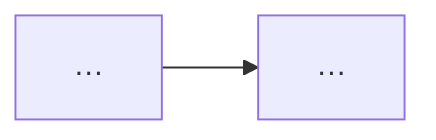

# Title

What the tutorial is and what the reader can do by the end. Two paragraphs at
most.

The governing model: the one idea every page hangs off.

*One-line caption.*

> Verified against **product X.Y** on runtime Z. State what ran; mark anything
> illustrative.

## Contents

One page per part, and one per numbered subtask. Read them in order, or jump
to the one you need. Start with **Setup**.

**[0. Setup](tutorial/00-setup.md)**: do this once.

| Part | What it covers |
|---|---|
| [1. Title](tutorial/part-1/index.md) | One line (1.1–1.N). |
| [2. Title](tutorial/part-2/index.md) | One line. |
| [Reference](tutorial/reference.md) | Decision table, best practices, verification status, links. |

Ready? **[Start with Setup →](tutorial/00-setup.md)**
