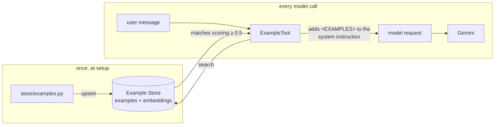

# Few-shot examples for ADK agents with Vertex AI Example Store

You build an order-support agent, watch it get some requests wrong, then teach
it the right replies with stored examples instead of a longer instruction. By
the end you will know what an example is, how the store picks the ones that
match a question, and what ADK does with them on every model call.

The central idea: **the agent never calls the store.** `ExampleTool` searches
the store with the user's message before each model call, and pastes the
matches into the system instruction as an `<EXAMPLES>` block. Gemini reads
them as part of its instructions. Keep that picture in mind and the rest
follows.

*Examples go in once; every model call searches for the ones that match.*

> Verified against **google-adk 2.11.0** and **google-cloud-aiplatform 2.3.0**
> on Python 3.13, serving Gemini 3.7 Flash through Vertex AI. Output blocks are
> captured from real runs unless labeled illustrative. See
> [Reference](tutorial/reference.md#verification-status) for what ran and when.

## Contents

Read them in order (each page has a **Next →** link).

| Part | What it covers |
|---|---|
| [0. Setup](tutorial/00-setup.md) | Environment, project, API, and starting the store, which takes about 9 minutes to create. |
| [1. The agent without examples](tutorial/part-1/index.md) | The four requests, and which replies need fixing. |
| [2. Fill and search the store](tutorial/part-2/index.md) | What an example is, loading eight of them, and how similarity scores pick matches (2.1–2.2). |
| [3. Attach the store to the agent](tutorial/part-3/index.md) | `ExampleTool`, the same four requests again, and when retrieval runs (3.1–3.2). |
| [Reference](tutorial/reference.md) | Gotchas, decisions, and verification status. |

Ready? **[Start with Setup →](tutorial/00-setup.md)**
