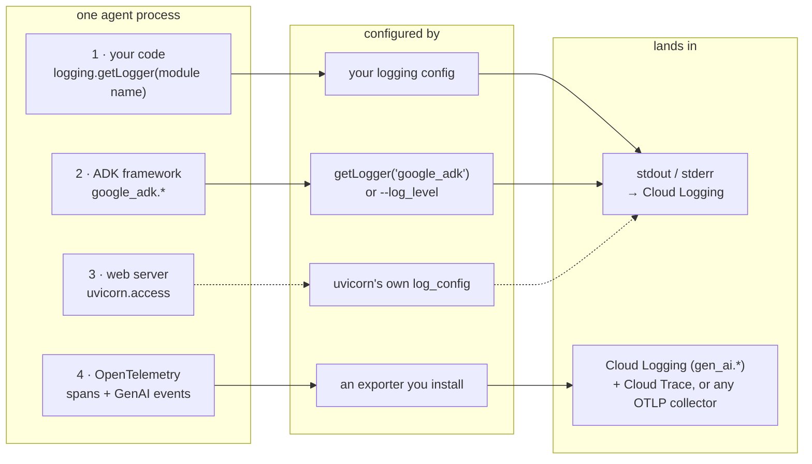

# Logging for ADK agents on Cloud Run and Agent Runtime

This is a hands-on tutorial. You run a small agent over and over, each time
changing one thing about how it logs, and read the output to see what changed.
By the end you will know which logging mechanism to use for local debugging,
for a production service on Cloud Run, and for Vertex AI Agent Engine.

Logging an ADK agent is confusing because there is no single "the log." One
agent process produces **four streams**, configured in different places:

1. **Your code**: ordinary `logging` records from your tools and business logic.
2. **The ADK framework**: everything under the `google_adk` logger tree, such as
   model requests and responses, session lifecycle, and tool calls.
3. **The web server**: uvicorn's own startup and access logs, on a config
   independent of ADK's.
4. **OpenTelemetry telemetry**: spans and GenAI events that do not print at all.
   They leave through an exporter you configure.

Almost every "why don't my logs look right" problem is "I configured one stream
and expected it to cover another." Keep the four streams in mind as you read.

*The four log streams, what configures each, and where they land.*

> Verified against **google-adk 2.8.0** on Python 3.13, serving Gemini 3.7 Flash
> through Vertex AI. Every command and output block is from a real run.
> Version-sensitive details are called out inline.

## Contents

One short page per part, and one per numbered subtask. Read them in order (each
page has a **Next →** link), or jump to the one you need. Start with **Setup**.

**[0. Setup](tutorial/00-setup.md)**: do this once. Environment, model, shell
variables, and the shared demo agent.

| Part | What it covers |
|---|---|
| [1. Log levels](tutorial/part-1/index.md) | The `DEBUG`/`INFO`/`WARNING`/`ERROR` dial on a script, `adk web`, `adk api_server`, Cloud Run, a real HTTP server, and Agent Runtime (1.1–1.6). |
| [2. Access logs](tutorial/part-2/index.md) | Why `--log_level` never silences uvicorn's access log, and how to filter it. |
| [3. Plugins](tutorial/part-3/index.md) | `LoggingPlugin` and `DebugLoggingPlugin` for readable step narration, local and on Cloud Run (3.1–3.5). |
| [4. Structured logging](tutorial/part-4/index.md) | A JSON `BasePlugin`, a custom server that owns all four streams, and that server on Cloud Run with explicit `severity` and a trace field (4.1–4.4). |
| [5. OpenTelemetry](tutorial/part-5/index.md) | Stream 4: `gen_ai.*` events read back from Cloud Logging (locally, `adk api_server`, Cloud Run, your own server, other OTLP backends), and the content-capture knob (5.0–5.8). |
| [6. Agent Runtime](tutorial/part-6/index.md) | The telemetry layer on Vertex AI Agent Engine, and what plugin code carries over (6.1–6.4). |
| [How to choose & reference](tutorial/how-to-choose.md) | The decision table, best-practice summary, verification status, and references. |

Ready? **[Start with Setup →](tutorial/00-setup.md)**
