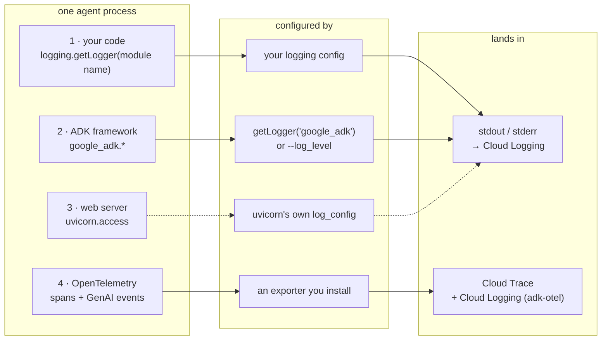
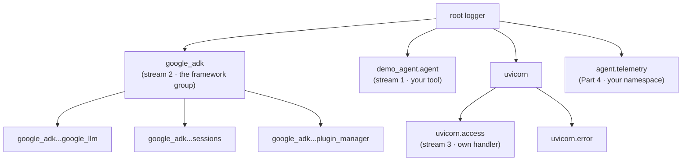

# Logging for ADK agents on Cloud Run and Agent Runtime

This is a hands-on tutorial. You will run a small agent over and over, each time
changing one thing about how it logs, and read the actual output so you can see
what changed and why it matters. By the end you will know which logging
mechanism to use for local debugging, for a production service on Cloud Run, and
for a deployment on Vertex AI Agent Engine.

The reason logging an ADK agent is confusing is that there is no single "the
log." One agent process produces **four different streams**, configured in
different places:

1. **Your code** — ordinary `logging` records from your tools and business logic.
2. **The ADK framework** — everything ADK logs under the `google_adk` logger
   tree: model requests and responses, session lifecycle, tool calls.
3. **The web server** — when served over HTTP, uvicorn's own startup and access
   logs, on a config independent of ADK's.
4. **OpenTelemetry telemetry** — spans and GenAI events that do not print at all;
   they leave through an exporter you configure.

Almost every "why don't my logs look right" problem is really "I configured one
stream and expected it to cover another." Keep the four streams in mind as you
read.



*The four log streams, what configures each, and where they land.*

> Verified against **google-adk 2.8.0** on Python 3.13, serving Gemini 3.7 Flash
> through Vertex AI. Every command and every output block below is from a real
> run. Version-sensitive details are called out inline.

## Contents

The tutorial is split into short parts. Read them in order, or jump to the
one you need.

| Part | What it covers |
|---|---|
| [1. Log levels — local](tutorial/01a-log-levels-local.md) | The `DEBUG`/`INFO`/`WARNING`/`ERROR` dial on a script, `adk web`, and `adk api_server`. |
| [1. Log levels — cloud & Agent Runtime](tutorial/01b-log-levels-cloud.md) | The same run on a Cloud Run Job and service, and on Agent Runtime (native and BYOC). |
| [2. Access logs](tutorial/02-access-logs.md) | Why `--log_level` never silences uvicorn's access log, and how to filter it. |
| [3. Plugins](tutorial/03-plugins.md) | `LoggingPlugin` and `DebugLoggingPlugin` for readable step narration, local and on Cloud Run. |
| [4. Structured logging](tutorial/04-production.md) | A JSON `BasePlugin`, a custom server that owns all four streams, and that server on Cloud Run with explicit `severity` and a trace field that groups a request. |
| [5. OpenTelemetry](tutorial/05-otel.md) | Stream 4: GenAI spans to Cloud Trace, and the content-capture privacy knob. |
| [6. Agent Runtime](tutorial/06-agent-runtime.md) | The telemetry layer on Vertex AI Agent Engine, and what plugin code carries over. |
| [How to choose & reference](tutorial/07-how-to-choose.md) | The decision table, best-practice summary, verification status, and references. |

## Setup

All commands run from this folder. Do this once.

### Create the environment

```bash
cd ai/adk/logging
python3.13 -m venv .venv
.venv/bin/pip install -r requirements.txt
```

### Point the agent at a model

Copy `.env.example` to `.env`. On GCP the simplest path is Vertex AI with your
existing `gcloud` credentials:

```bash
cp .env.example .env
# edit .env to contain:
#   GOOGLE_GENAI_USE_VERTEXAI=TRUE
#   GOOGLE_CLOUD_PROJECT=your_project_id
#   GOOGLE_CLOUD_LOCATION=global
gcloud auth application-default login   # if you have not already
```

### Set your shell variables

The cloud parts (1.4 onward) run `gcloud` and the deploy scripts, which read a
few shell variables — your project, region, and a couple derived from them. Set
them once in a file you `source`, instead of re-typing `export PROJECT_ID=...`
in every step.

```bash
cp env.sh.example env.sh
# edit env.sh: set PROJECT_ID to your real project
source env.sh
```

`env.sh` is gitignored. **`source env.sh` again in each new terminal** — the
tutorial opens a second one for the Agent Runtime BYOC deploy, and variables do
not cross terminals.

### Meet the agent

Every example shares one tiny agent, [demo_agent/agent.py](demo_agent/agent.py):
a weather assistant with a single `get_weather` tool that knows four cities. The
tool logs a line of its own through a normal module logger. That means in every
example you can watch **your** log (stream 1) sit next to the **framework's** logs
(stream 2), and tell them apart by their logger name.

```python
logger = logging.getLogger(__name__)   # -> "demo_agent.agent", NOT under google_adk

def get_weather(city: str) -> dict:
    logger.info("tool get_weather called for city=%r", city)
    ...
```

One fact carries much of this tutorial: **all ADK framework loggers are children
of `google_adk`.** You configure them as a group with
`logging.getLogger("google_adk")`, and you can tell any framework line by its
name, for example `google_adk.google.adk.models.google_llm`.



*The Python logger tree. Setting a level on `google_adk` controls every child under it; `uvicorn.access` is a separate subtree.*
