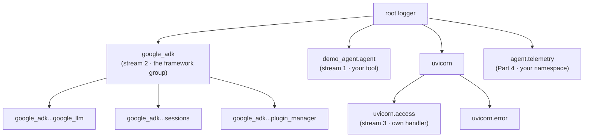

[→ Part 1 · The log level](part-1/index.md)<br>
[Tutorial index](../TUTORIAL.md)

---

# Setup

All commands run from this folder. Do this once.

## Create the environment

```bash
cd ai/adk/logging
python3.13 -m venv .venv
.venv/bin/pip install -r requirements.txt
```

## Point the agent at a model

Copy `.env.example` to `.env`. On GCP the simplest path is Vertex AI with your
existing `gcloud` credentials:

```bash
cp .env.example .env
# edit .env to contain:
#   GOOGLE_GENAI_USE_VERTEXAI=TRUE
#   GOOGLE_CLOUD_PROJECT=your_project_id
#   GOOGLE_CLOUD_LOCATION=global
gcloud auth application-default login   # if you have not already
```

## Set your shell variables

The cloud parts (1.4 onward) run `gcloud` and the deploy scripts, which read a
few shell variables — your project, region, and a couple derived from them. Set
them once in a file you `source`, instead of re-typing `export PROJECT_ID=...`
in every step.

```bash
cp env.sh.example env.sh
# edit env.sh: set PROJECT_ID to your real project
source env.sh
```

`env.sh` is gitignored. **`source env.sh` again in each new terminal** — the
tutorial opens a second one for the Agent Runtime BYOC deploy, and variables do
not cross terminals.

## Meet the agent

Every example shares one tiny agent, [demo_agent/agent.py](../demo_agent/agent.py):
a weather assistant with a single `get_weather` tool that knows four cities. The
tool logs a line of its own through a normal module logger. That means in every
example you can watch **your** log (stream 1) sit next to the **framework's** logs
(stream 2), and tell them apart by their logger name.

```python
logger = logging.getLogger(__name__)   # -> "demo_agent.agent", NOT under google_adk

def get_weather(city: str) -> dict:
    logger.info("tool get_weather called for city=%r", city)
    ...
```

One fact carries much of this tutorial: **all ADK framework loggers are children
of `google_adk`.** You configure them as a group with
`logging.getLogger("google_adk")`, and you can tell any framework line by its
name, for example `google_adk.google.adk.models.google_llm`.



*The Python logger tree. Setting a level on `google_adk` controls every child under it; `uvicorn.access` is a separate subtree.*

---

[→ Part 1 · The log level](part-1/index.md)<br>
[Tutorial index](../TUTORIAL.md)
