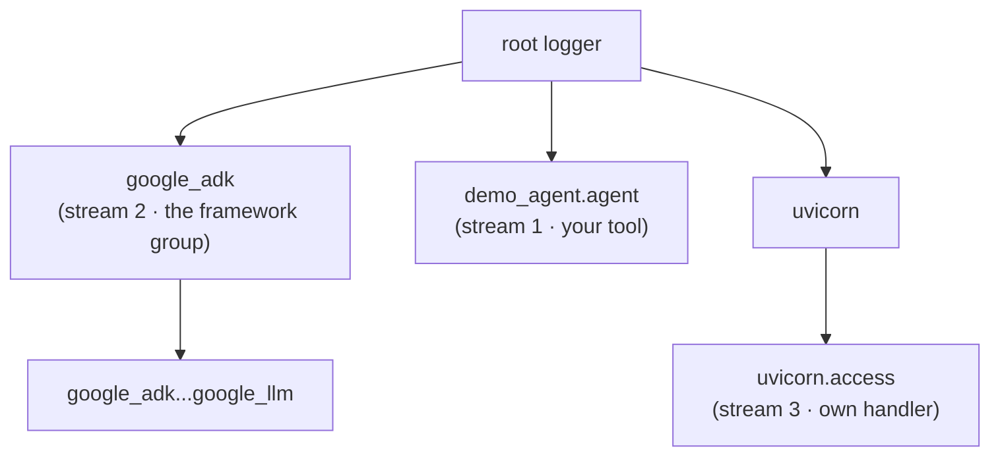

[→ Part 1 · The log level](part-1/index.md)<br>
[Tutorial index](../TUTORIAL.md)

---

# Setup

All commands run from `ai/adk/logging/`. Do this once.

## Create the environment

**Command:**

```bash
cd ai/adk/logging
python3.13 -m venv .venv
.venv/bin/pip install -r requirements.txt
source .venv/bin/activate
```

Activating the venv puts its `adk` on your `PATH`, so the pages that run plain
`adk web` or `adk api_server` get the pinned 2.8.0, not another install.

Check that the pinned ADK version installed.

**Command:**

```bash
.venv/bin/python -c "import google.adk; print(google.adk.__version__)"
```

**Expected output:**

```console
2.8.0
```

## Point the agent at a model

Copy `.env.example` to `.env`. On GCP the simplest path is Vertex AI with your
existing `gcloud` credentials, which is what `.env.example` already selects.

**Command:**

```bash
cp .env.example .env
```

Open `.env` and replace `your-project-id` with your project. `global` in
`GOOGLE_CLOUD_LOCATION` is where the model runs; your Cloud Run services use
`REGION` (`us-central1`) from the next section. If you have not set up
Application Default Credentials yet, run:

```bash
gcloud auth application-default login
```

ADK's servers (`adk web`, `adk api_server`) load the first `.env` they find
walking up from the agent folder, so with no `demo_agent/.env` they use this
root `.env`. Do not create `demo_agent/.env`; the Agent Runtime deploy scripts
write one temporarily and remove it afterward.

## Set your shell variables

The cloud parts (1.4 onward) read your project, region, and a few derived
values from shell variables. Set them once in a file you `source`.

**Command:**

```bash
cp env.sh.example env.sh
```

Open `env.sh`, set `PROJECT_ID` to your project, then load it.

**Command:**

```bash
source env.sh
```

`env.sh` is gitignored. In each new terminal, run `source env.sh` and
`source .venv/bin/activate` again. The tutorial opens a second terminal in 1.3,
and neither variables nor the venv cross terminals.

## Meet the agent

Every example shares one agent, [demo_agent/agent.py](../demo_agent/agent.py): a
weather assistant with a single `get_weather` tool that knows four cities. The
tool logs one line through a normal module logger, so in every example you can
watch **your** log (stream 1) next to the **framework's** logs (stream 2) and
tell them apart by logger name.

```python
logger = logging.getLogger(__name__)   # -> "demo_agent.agent", NOT under google_adk

def get_weather(city: str) -> dict:
    logger.info("tool get_weather called for city=%r", city)
    ...
```

One fact carries much of this tutorial: **all ADK framework loggers are children
of `google_adk`.** You configure them as a group with
`logging.getLogger("google_adk")`, and you can tell any framework line by its
name, for example `google_adk.google.adk.models.google_llm`.


```mermaid
flowchart TD
  root["root logger"]
  root --> ga["google_adk<br/>(stream 2 · the framework group)"]
  root --> da["demo_agent.agent<br/>(stream 1 · your tool)"]
  root --> uv["uvicorn"]
  ga --> gllm["google_adk...google_llm"]
  uv --> ua["uvicorn.access<br/>(stream 3 · own handler)"]
```

*The Python logger tree. Setting a level on `google_adk` controls every child under it; `uvicorn.access` is a separate subtree.*

---

[→ Part 1 · The log level](part-1/index.md)<br>
[Tutorial index](../TUTORIAL.md)
