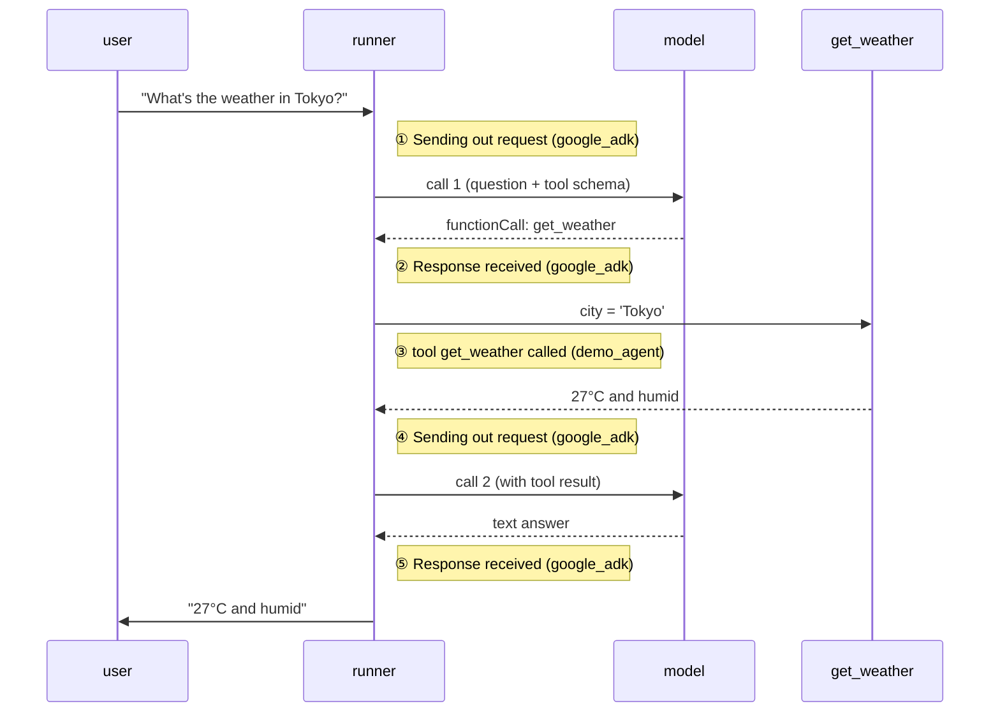

# Part 1 · The log level

*What `DEBUG`, `INFO`, `WARNING`, and `ERROR` each reveal — on a script,
`adk web`, and `adk api_server`.*

> [!NOTE]
> **Why you are here.** The log level is the first and bluntest dial. Before adding
> any plugin or custom formatter, you need to know exactly what `DEBUG`, `INFO`,
> `WARNING`, and `ERROR` each reveal, so you can pick the right one instead of
> drowning in output or flying blind. This part is a guided tour of that dial.


Part 1 runs the same one question, *"What's the weather in Tokyo?"*, three ways:
first through a plain script where you control the level directly (1.1), then
through each of the two servers ADK ships (1.2, 1.3).

---

### 1.1 The basic test harness

[examples/01_log_levels.py](../examples/01_log_levels.py) runs that one question at
whichever level you name, using nothing but Python's standard `logging`: it sets
the root logger and the `google_adk` group to that level. No server, no HTTP, so
what you see is only streams 1 and 2.

---

#### 1.1.1 Start at INFO (the default)

**Command:**

```bash
.venv/bin/python examples/01_log_levels.py info
```

**Expected output:**

```console
INFO - google_adk.google.adk.models.google_llm - Sending out request, model: gemini-3.7-flash, backend: GoogleLLMVariant.VERTEX_AI, stream: False
INFO - google_adk.google.adk.models.google_llm - Response received from the model.
INFO - demo_agent.agent - tool get_weather called for city='Tokyo'
INFO - google_adk.google.adk.models.google_llm - Sending out request, model: gemini-3.7-flash, backend: GoogleLLMVariant.VERTEX_AI, stream: False
INFO - google_adk.google.adk.models.google_llm - Response received from the model.

>>> ANSWER: The weather in Tokyo is currently 27°C and humid.
```

> [!IMPORTANT]
> **What it means.** Those five lines are the agent loop, in order:
>
> | Line | Logger | What happened |
> |---|---|---|
> | 1 | `google_adk...google_llm` | Framework sends your question to the model |
> | 2 | `google_adk...google_llm` | Model answers: *call `get_weather`* |
> | 3 | `demo_agent.agent` | **Your tool** runs (stream 1, not `google_adk`) |
> | 4 | `google_adk...google_llm` | Framework sends the tool's result back |
> | 5 | `google_adk...google_llm` | Model answers again, this time with prose |



*The agent loop with the five INFO lines. A tool call costs two model round trips; your log (③) sits between the framework's.*

Two things to take away. **One round trip per model call**: a tool call always
costs two, because the model must be re-asked once it has the tool's result.
**Your log sits in the middle of the framework's**, distinguishable only by
logger name, which is why the name prefix matters.

INFO gives you the **shape** of the run without the contents: which steps ran, in
what order, how many model calls. It does not show you the prompt or the answer.
That is the right trade for day-to-day "is it doing roughly the right thing."

---

#### 1.1.2 Turn it up to DEBUG

**Command:**

```bash
.venv/bin/python examples/01_log_levels.py debug
```

**Expected output** — the same run now dumps the full model conversation. The
important new block is `LLM Request`:

```console
LLM Request:
System Instruction:
You are a concise weather assistant. When the user asks about weather, call the
get_weather tool and report its result in one sentence...
Contents:
{"parts":[{"text":"What's the weather in Tokyo?"}],"role":"user"}
Functions:
get_weather: {'properties': {'city': {'title': 'City', 'type': 'string'}}, 'required': ['city'], ...}
LLM Response:
Function calls:
name: get_weather, args: {'city': 'Tokyo'}
```

> [!IMPORTANT]
> **What it means.** DEBUG keeps every INFO line and adds the *contents* of each
> model call. The new block breaks down as:
>
> | Block | What it is | Where it came from |
> |---|---|---|
> | `System Instruction` | The agent's standing orders | your `instruction=` in `agent.py` |
> | `Contents` | Full message history sent this call | the user turn, plus prior turns |
> | `Functions` | Tool schema the model can choose from | generated from your Python signature and docstring |
> | `LLM Response` | What came back, here a `functionCall` | the model |

The single most useful thing here is `Functions`. ADK builds that JSON schema
from your Python function's signature and docstring, and DEBUG is the only place
you can read what it actually generated. When a model refuses to call your tool,
or calls it with nonsense arguments, this block usually explains why.

So: INFO answers *what did the agent do*, DEBUG answers *what did the model
actually see*. Use DEBUG when the run is baffling and you need to stop guessing.
It is verbose and includes full response bodies, so it is a debugging level, not
something to leave on. (ADK omits auth headers from these dumps, so a DEBUG log
will not leak your bearer token.)

---

#### 1.1.3 Turn it down to WARNING, then ERROR

**Command:**

```bash
.venv/bin/python examples/01_log_levels.py warning
```

**Expected output:**

```console
>>> ANSWER: The weather in Tokyo is currently 27°C and humid.
```

> [!IMPORTANT]
> **What it means.** Nothing from the framework at all, just your answer. At
> WARNING and ERROR, a healthy run is silent; you only hear from the log when
> something is wrong. Try asking about a city the tool does not know and you would
> see the one `WARNING` line the tool itself emits (`no weather data for ...`).
> This is why the guidance is **INFO or WARNING in production**: WARNING keeps the
> log quiet until there is a problem, INFO gives you a lifecycle trail if you can
> afford the volume. Reserve DEBUG for when you are actively debugging.

---

### 1.2 The same dial on `adk web`

In 1.1 you set the level in Python, with `logging`, the way any Python program
does. That is the real mechanism, and it is the only one that always applies.

The `adk` CLI adds a convenience on top of it: `adk web` and `adk api_server`
each take a **`--log_level`** flag (plus `-v`, shorthand for `--log_level
DEBUG`). The flag is not part of your agent and not part of the ADK library. It
belongs to those two commands, and all it does is make the same `logging` calls
on your behalf before starting the server. Launch the agent any other way and the
flag does not exist: in Part 4 you write your own server and configure logging
yourself, because there is no CLI in the picture to do it for you.

So: same dial as 1.1, reachable from the command line only because the ADK CLI is
the thing launching the process. Run it at `INFO` so the output lines up with
1.1.1.

Start the dev UI, open the URL it prints, pick **demo_agent** from the app
dropdown, and send the same question as before:

**Command:**

```bash
adk web --log_level INFO ./
```

```
What's the weather in Tokyo?
```

Watch the terminal, not the browser. You get the same five-line lifecycle trail
as the script: two `google_llm` round trips with your `tool get_weather called
for city='Tokyo'` line in the middle. Same agent, same level, same logs, only the
thing driving it has changed.

---

### 1.3 The same dial on `adk api_server`

`adk api_server` has no UI, so you drive it with HTTP.

**Step 1 — Start the server (terminal 1):**

```bash
adk api_server --log_level INFO ./
```

**Step 2 — Create a session and send the question (terminal 2):**

```bash
curl -s -X POST localhost:8000/apps/demo_agent/users/u1/sessions/s1 \
     -H 'content-type: application/json' -d '{}'

curl -s -X POST localhost:8000/run \
     -H 'content-type: application/json' \
     -d '{"app_name":"demo_agent","user_id":"u1","session_id":"s1",
          "new_message":{"role":"user","parts":[{"text":"What'\''s the weather in Tokyo?"}]}}'
```

The response is the full JSON event list, one entry per step of the loop (the
model's `functionCall`, the tool's `functionResponse`, then the final text). To
pull out just the answer, pipe it through:

```bash
... | python3 -c "import sys,json; print([p['text'] for e in json.load(sys.stdin) for p in (e.get('content') or {}).get('parts',[]) if p.get('text')][-1])"
```

If the session-create call returns `409 Conflict`, that session id already
exists: sessions are persisted to `demo_agent/.adk/session.db` and survive
restarts. Use a new id.

**Step 3 — Check the server terminal.** The framework lines are the ones you
expect, but note the format, and note what is sitting between them:

```console
INFO:     127.0.0.1:57453 - "POST /apps/demo_agent/users/u1/sessions/s1 HTTP/1.1" 200 OK
2026-09-03 12:51:22,846 - INFO - google_llm.py:255 - Sending out request, model: gemini-3.7-flash, backend: GoogleLLMVariant.VERTEX_AI, stream: False
2026-09-03 12:51:24,418 - INFO - google_llm.py:327 - Response received from the model.
2026-09-03 12:51:24,435 - INFO - agent.py:40 - tool get_weather called for city='Tokyo'
2026-09-03 12:51:24,443 - INFO - google_llm.py:255 - Sending out request, model: gemini-3.7-flash, backend: GoogleLLMVariant.VERTEX_AI, stream: False
2026-09-03 12:51:25,170 - INFO - google_llm.py:327 - Response received from the model.
2026-09-03 12:51:25,174 - INFO - api_server.py:1854 - Generated 3 events in agent run
INFO:     127.0.0.1:57455 - "POST /run HTTP/1.1" 200 OK
```

Two different formats in one stream. The timestamped lines are the framework and
your tool, formatted by the ADK CLI. The bare `INFO:` lines are uvicorn's access
log, one per HTTP request.

Now turn the dial down and watch what does *not* happen. Restart with
`--log_level WARNING` and send the same two requests.

**Expected output:**

```console
INFO:     Started server process [12706]
INFO:     Uvicorn running on http://127.0.0.1:8000 (Press CTRL+C to quit)
INFO:     127.0.0.1:58393 - "POST /apps/demo_agent/users/u1/sessions/w1 HTTP/1.1" 200 OK
INFO:     127.0.0.1:58395 - "POST /run HTTP/1.1" 200 OK
```

Every timestamped line is gone, exactly as 1.1.3 taught you to expect. But the
`INFO:` lines are still there, at INFO, after you asked for WARNING. The flag did
not fail: those lines are stream 3, and `--log_level` never reaches it. That is
what Part 2 is about.

> [!TIP]
> One trap worth knowing now: `adk run` (the terminal REPL) does **not** print
> framework logs to your screen. It redirects them to a temp file and clears the
> console handlers. If you use it and wonder where the logs went:
>
> ```bash
> tail -F "${TMPDIR:-/tmp}/agents_log/agent.latest.log"
> ```

---

[Tutorial index](../TUTORIAL.md) · Next: [1. Log levels — cloud & Agent Runtime](01b-log-levels-cloud.md) →

