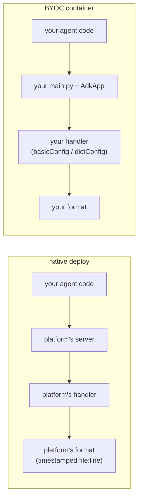

# Part 1 · The log level, in the cloud

*The same run on a Cloud Run Job and service, and on Agent Runtime — native and
BYOC. Sections 1.1–1.3 (on your laptop) are in the [previous file](01a-log-levels-local.md).*

---

### 1.4 The same script on Cloud Run, and what Cloud Logging does to it

> [!NOTE]
> **Why you are here.** So far every run was on your laptop, where a log line is
> just text on your terminal. The moment you deploy, a second system gets an
> opinion about your logs: Cloud Logging reads each line, assigns it a
> **severity**, and files it under a stream. Before you write a single line of
> cloud-specific logging (Part 4 does that), you should see what Cloud Logging
> makes of the *unmodified* Part 1 script, because the answer is not what the
> common advice says.

The script from 1.1 runs once and exits; it serves no HTTP. The right way to
run it on Cloud Run is a **Job**, not a service (a service would fail
its readiness check with no port to probe). A Job runs the container to
completion, and Cloud Run ingests its stdout and stderr into Cloud Logging
automatically. [deploy/deploy_job.sh](../deploy/deploy_job.sh) builds the image,
deploys the Job, and runs it once; the level is a Job argument, so you can
re-run at a different level without rebuilding.

**👉 Do this.** Deploy and run at INFO, then run again at WARNING.

**Command:**

```bash
export PROJECT_ID=your_project
export REGION=us-central1
./deploy/deploy_job.sh
gcloud run jobs execute adk-logging-job \
  --project="$PROJECT_ID" \
  --region="$REGION" \
  --args=warning \
  --wait
```

Then read the two runs back, asking for the severity of each line.

**Command:**

```bash
gcloud logging read \
  'resource.type="cloud_run_job" resource.labels.job_name="adk-logging-job"' \
  --project="$PROJECT_ID" \
  --limit=40 \
  --format='table(severity,textPayload)' \
  --freshness=15m
```

**Expected output** — the INFO execution carry the full lifecycle and the WARNING
execution carry almost nothing (trimmed, most recent first):

```console
SEVERITY  TEXT_PAYLOAD
          ===== running at WARNING =====
          >>> ANSWER: The weather in Tokyo is currently 27°C and humid.
INFO      Container called exit(0).
          ===== running at INFO =====
          INFO - google_adk.google.adk.models.google_llm - Sending out request, model: gemini-3.7-flash, backend: GoogleLLMVariant.VERTEX_AI, stream: False
          INFO - demo_agent.agent - tool get_weather called for city='Tokyo'
          INFO - google_adk.google.adk.models.google_llm - Response received from the model.
          >>> ANSWER: The weather in Tokyo is currently 27°C and humid.
INFO      Container called exit(0).
```

> [!IMPORTANT]
> **What it means, finding one: the level dial works in the cloud, unchanged.**
> The WARNING execution shows the banner and the answer and *no* `google_adk` or
> tool lines; the INFO execution shows the whole five-line lifecycle you know from
> 1.1.1. Nothing about deploying changed what the level controls. This is the
> reassuring half.

> [!IMPORTANT]
> **What it means, finding two: severity is not what you were told.** There is a
> rule repeated all over the Cloud Run docs and even in ADK's own source comments:
> *a line written to stderr is recorded as ERROR severity regardless of content.*
> `logging.basicConfig` writes to stderr, so by that rule every `INFO -
> google_adk...` line above should read as ERROR. Look at the severity column: it
> does not. Those lines came through with **blank (Default) severity, not ERROR**.
> You can confirm they really are on stderr.

**Command:**

```bash
gcloud logging read \
  'resource.type="cloud_run_job" resource.labels.job_name="adk-logging-job"
   textPayload:"get_weather"' \
  --project="$PROJECT_ID" \
  --limit=1 \
  --format='value(logName,textPayload)' \
  --freshness=15m
```

The line is on stderr (`.../logs/run.googleapis.com%2Fstderr`), and its severity
is still Default, not ERROR. The often-repeated "stderr means ERROR" rule did not
fire here. (It is real in some contexts, but it is not the blanket law it is
usually stated as; 1.5 finds the same Default-not-ERROR result on a Cloud Run
*service*.) So **do not assume the severity of a plain line, check it**: Cloud
Run's guess is not reliably what you want.

So the zero-effort deploy gets you two-thirds of the way. Your logs reach Cloud
Logging, and the level still filters them. What you do *not* get is **correct,
queryable severity**: every one of these `INFO -` lines is filed as Default, so a
severity-based query or alert cannot tell an error from a routine step. Making
severity a field you set, not a guess Cloud Run makes from the stream, is the job
of Part 4.

> [!NOTE]
> One display note: Cloud Run batches burst console output, so several of the
> script's lines can arrive grouped under one Cloud Logging entry (you will see
> the `===== running =====` banner and the lifecycle lines share an entry
> above). That is a grouping artifact of the read, not a change to your logs.

---

### 1.5 The same logging behind a real HTTP server

> [!NOTE]
> **Why you are here.** A Job runs once and exits. A real service stays up and
> takes requests, which adds the one stream a script never has: the web server's
> own access log (stream 3 from the introduction). This section deploys the
> smallest possible ADK HTTP server, one that does *nothing* special about
> logging, so you can see all of Part 1's streams land in Cloud Logging together,
> and confirm on a long-running service what 1.4 found on a Job.

[examples/09_min_api.py](../examples/09_min_api.py) is that server. It is
deliberately naive: it configures logging with the exact `configure(level)` from
1.1 (a level plus `logging.basicConfig`), reads the level from a `LOG_LEVEL`
environment variable, and starts uvicorn **without** a log config, so uvicorn's
own default access logging is left untouched. It exposes one real route,
`POST /chat`, and a `GET /healthz`. That is the whole server. (Contrast it with
the servers in Parts 5 and 6, which take control of every stream; this one takes
control of none, on purpose.)

**👉 Do this.** Deploy two copies, one at each level, then send the same question
to each.

**Command:**

```bash
export PROJECT_ID=your_project
export REGION=us-central1
./deploy/deploy_api.sh
SERVICE=adk-logging-api-warn LOG_LEVEL=warning ./deploy/deploy_api.sh
```

```bash
API_URL=$(gcloud run services describe adk-logging-api \
  --project="$PROJECT_ID" \
  --region="$REGION" \
  --format='value(status.url)')
API_URL_W=$(gcloud run services describe adk-logging-api-warn \
  --project="$PROJECT_ID" \
  --region="$REGION" \
  --format='value(status.url)')

curl -s -X POST "$API_URL/chat" -H 'content-type: application/json' \
     -d '{"message":"What'\''s the weather in Tokyo?"}'
curl -s -X POST "$API_URL_W/chat" -H 'content-type: application/json' \
     -d '{"message":"What'\''s the weather in Tokyo?"}'
```

Read the INFO service's logs.

**Command:**

```bash
gcloud logging read \
  'resource.type="cloud_run_revision" resource.labels.service_name="adk-logging-api"' \
  --project="$PROJECT_ID" \
  --limit=40 \
  --format='table(severity,textPayload)' \
  --freshness=10m
```

**Expected output** — all of Part 1's streams in one place (trimmed):

```console
SEVERITY  TEXT_PAYLOAD
          INFO - agent.server - runner ready
          INFO:     Started server process [1]
          INFO:     Application startup complete.
          INFO - google_adk.google.adk.models.google_llm - Sending out request, model: gemini-3.7-flash, backend: GoogleLLMVariant.VERTEX_AI, stream: False
          INFO - demo_agent.agent - tool get_weather called for city='Tokyo'
          INFO - google_adk.google.adk.models.google_llm - Response received from the model.
          INFO:     169.254.169.126:2186 - "POST /chat HTTP/1.1" 200 OK
```

Now read the WARNING service.

**Command:**

```bash
gcloud logging read \
  'resource.type="cloud_run_revision" resource.labels.service_name="adk-logging-api-warn"' \
  --project="$PROJECT_ID" \
  --limit=40 \
  --format='table(severity,textPayload)' \
  --freshness=10m
```

**Expected output** — the framework and tool lines gone, the access line still
there:

```console
SEVERITY  TEXT_PAYLOAD
          INFO:     169.254.169.126:37574 - "POST /chat HTTP/1.1" 200 OK
WARNING
          INFO:     169.254.169.126:37562 - "GET /favicon.ico HTTP/1.1" 404 Not Found
```

> [!IMPORTANT]
> **What it means.** Four sources interleave in the INFO service, exactly as they
> were on your laptop: your server's `agent.server` line, the `google_adk`
> framework lines, your tool's `demo_agent.agent` line, and uvicorn's
> `INFO: ... "POST /chat" 200 OK` access line. The severity column repeats 1.4's
> finding: every `INFO -` line is filed as **Default, not ERROR**, even though
> `basicConfig` writes them to stderr.
>
> The WARNING service confirms the split: `LOG_LEVEL=warning` reached streams 1
> and 2 (your code and `google_adk`), so the lifecycle lines vanished. It did
> **not** reach uvicorn's access log: the `"POST /chat" 200 OK` line prints
> regardless, because that stream is configured by uvicorn, not by your level.
> On a busy service this is one access line per request forever, health checks
> included, no matter how far down you turn your level. Part 2 fixes the access
> log; Part 4 makes the rest of these lines into structured entries with severity
> you can query.

---

### 1.6 The same agent on Agent Runtime, two ways

> [!NOTE]
> **Why you are here.** Cloud Run (1.4, 1.5) gave you a container and got out of
> the way: whatever you wrote to stdout/stderr is what you got. Agent Runtime
> (Vertex AI Agent Engine) is the other place you deploy, and it offers two modes:
> you deploy the **agent object** and the platform serves it (*native*), or you
> deploy your **own container** and the platform hosts it (*BYOC*). The key
> question for logging is who owns the format. This section deploys both and
> compares.

**Native deploy.** `adk deploy agent_engine` packages the agent directory and
hands it to the platform. There is no server of yours in the picture, so there is
no `uvicorn.run` and no `configure()` call at a `__main__`. The one hook you have
for the log level is an environment variable: `demo_agent/agent.py` reads
`LOG_LEVEL` at import and applies it (this tutorial added that). `adk deploy
agent_engine` has no env flag, but it carries the agent directory's `.env` into
the deployment, so [deploy/deploy_agent_engine.sh](../deploy/deploy_agent_engine.sh)
temporarily writes `LOG_LEVEL` into `.env` for the deploy and restores the
original afterward. (Without the restore, a `LOG_LEVEL=warning` left behind by a
deploy would override `--log_level INFO` on a later `adk web` run, because ADK
loads the agent's `.env` at startup.)

**BYOC deploy.** A custom container on Agent Runtime must listen on **port 8080**
and implement two routes: `POST /api/reasoning_engine` (unary) and
`POST /api/stream_reasoning_engine` (streaming), each taking a
`{"class_method", "input"}` body.
[agent_runtime_byoc/main.py](../agent_runtime_byoc/main.py) is the smallest
server that satisfies the contract, in about ninety lines. Its logging is the
same naive Part 1 config as 1.5.

**👉 Do this.** Deploy both. Each deploy takes several minutes, and the two are
independent (different resources, no shared files), so run them side by side in
two terminals: start the native deploy in this terminal, then open a second
terminal and start the BYOC deploy while the first is still running. Each deploy
script prints its reasoning engine id on a final `ENGINE_ID=` line, so we capture
it straight into a variable instead of reading the resource name off and pasting
it back — and because each engine id lives in the terminal that deployed it, the
testing below is naturally split the same way: native in terminal 1, BYOC in
terminal 2.

**Terminal 1 — native.** Set the project and region.

**Command:**

```bash
export PROJECT_ID=your_project
export REGION=us-central1
```

Deploy the agent object natively (the platform serves it) and capture its id. The
deploy progress streams to stderr; the `ENGINE_ID=` marker is the one line we pull
off stdout. This runs for several minutes — leave it, and set up terminal 2 while
it works.

**Command:**

```bash
export ENGINE_NATIVE=$(./deploy/deploy_agent_engine.sh | sed -n 's/^ENGINE_ID=//p')
```

**Terminal 2 — BYOC.** Open a new terminal, change into the tutorial directory,
and activate the virtualenv (the BYOC test query below needs it).

**Command:**

```bash
cd ai/adk/logging
source .venv/bin/activate
export PROJECT_ID=your_project
export REGION=us-central1
export LOCATION=$REGION
```

Then deploy your own container (BYOC — the platform hosts it) and capture its id,
while the native deploy in terminal 1 is still running.

**Command:**

```bash
export ENGINE_BYOC=$(./agent_runtime_byoc/deploy_byoc.sh | sed -n 's/^ENGINE_ID=//p')
```

> [!WARNING]
> **Setup traps the BYOC deploy surfaces.** Both are handled by the script but
> worth knowing:
>
> - **The platform's service agent must be able to pull your image.** Registration
>   fails with `FAILED_PRECONDITION` until the Reasoning Engine service agent has
>   `roles/artifactregistry.reader`. The script grants it.
> - **Some env var names are reserved, which breaks the model region.** Setting
>   `GOOGLE_CLOUD_PROJECT` or `GOOGLE_CLOUD_LOCATION` in the deployment env is
>   rejected. The platform injects those itself, but it sets
>   `GOOGLE_CLOUD_LOCATION` to the deploy region (`us-central1`), while
>   `gemini-3.7-flash` is served from `global`. The fix: pass the model's location
>   in your own var (`MODEL_LOCATION`) and copy it over `GOOGLE_CLOUD_LOCATION`
>   before the agent imports.

**Test the native deploy (terminal 1).** Once the native deploy finishes, query
through the SDK (the platform's query path is
not a plain REST URL you can curl), then read the logs by resource type
(the agent and framework lines land on `reasoning_engine_stderr`, the access
lines on `reasoning_engine_stdout`; filtering on `resource.type` catches both):

```bash
.venv/bin/python - <<PY
import vertexai
c = vertexai.Client(project="$PROJECT_ID", location="$REGION")
agent = c.agent_engines.get(
    name="projects/$PROJECT_ID/locations/$REGION/reasoningEngines/$ENGINE_NATIVE")
for ev in agent.stream_query(user_id="u1", message="What's the weather in Tokyo?"):
    for part in ((ev or {}).get("content") or {}).get("parts", []):
        if part.get("text"):
            print(part["text"])
PY
```

```bash
gcloud logging read \
  'resource.type="aiplatform.googleapis.com/ReasoningEngine"
   resource.labels.reasoning_engine_id="'"$ENGINE_NATIVE"'"' \
  --project="$PROJECT_ID" \
  --limit=30 \
  --format='table(severity,textPayload)' \
  --freshness=15m
```

**Expected output** — the familiar lifecycle, but not in your format:

```console
SEVERITY  TEXT_PAYLOAD
          2026-09-03 21:51:43,236 - INFO - google_llm.py:255 - Sending out request, model: gemini-3.7-flash, backend: GoogleLLMVariant.VERTEX_AI, stream: False
          2026-09-03 21:51:45,037 - INFO - agent.py:53 - tool get_weather called for city='Tokyo'
          2026-09-03 21:51:46,995 - INFO - google_llm.py:327 - Response received from the model.
          INFO:     169.254.169.126:54632 - "POST /api/stream_reasoning_engine HTTP/1.1" 200 OK
```

Compare that tool line to 1.5. On Cloud Run it read
`INFO - demo_agent.agent - tool get_weather...`, your `basicConfig` format. Here
it reads `2026-09-03 ... - INFO - agent.py:53 - tool get_weather...`, the ADK
CLI's timestamped `file:line` format, the same one you saw from `adk api_server`
back in 1.3. Your `basicConfig(format=...)` did not take: the platform installs
its own logging handler before your module runs, so it decides the format and the
destination (stderr), and your handler config is ignored.

**Test the BYOC deploy (terminal 2).** Once the BYOC deploy finishes, query with
the same SDK call from terminal 2 (where `ENGINE_BYOC` is set — it is a reasoning
engine too), then read its logs:

```bash
.venv/bin/python - <<PY
import vertexai
c = vertexai.Client(project="$PROJECT_ID", location="$REGION")
agent = c.agent_engines.get(
    name="projects/$PROJECT_ID/locations/$REGION/reasoningEngines/$ENGINE_BYOC")
for ev in agent.stream_query(user_id="u1", message="What's the weather in Tokyo?"):
    for part in ((ev or {}).get("content") or {}).get("parts", []):
        if part.get("text"):
            print(part["text"])
PY
```

```bash
gcloud logging read \
  'resource.type="aiplatform.googleapis.com/ReasoningEngine"
   resource.labels.reasoning_engine_id="'"$ENGINE_BYOC"'"' \
  --project="$PROJECT_ID" \
  --limit=30 \
  --format='table(severity,textPayload)' \
  --freshness=15m
```

**Expected output** — your logs in **your** format, unlike the native deploy:

```console
SEVERITY  TEXT_PAYLOAD
          INFO - google_adk.google.adk.models.google_llm - Sending out request, model: gemini-3.7-flash, backend: GoogleLLMVariant.VERTEX_AI, stream: False
          INFO - demo_agent.agent - tool get_weather called for city='Tokyo'
          INFO - google_adk.google.adk.models.google_llm - Response received from the model.
          INFO:     169.254.169.126:1392 - "POST /api/stream_reasoning_engine HTTP/1.1" 200 OK
```

> [!IMPORTANT]
> **What it means: who installs the handler decides the format.**
>
> | | Native | BYOC |
> |---|---|---|
> | **Level** | yours (via `LOG_LEVEL`) | yours (via `LOG_LEVEL`) |
> | **Format** | platform's (timestamped `file:line`) | yours (`basicConfig` / `dictConfig`) |
> | **Stream / destination** | platform's (stderr) | yours |
> | **Severity in Cloud Logging** | Default (same as Cloud Run) | Default (same as Cloud Run) |
>
> The native deploy is simpler (no server to write), but the platform takes your
> format. The BYOC deploy gives you back control of the format, at the cost of
> implementing the two-endpoint contract and the `MODEL_LOCATION` workaround. In
> both cases you keep the level, and in both cases severity is still
> blank/Default. That is Part 4's problem regardless of which you pick.



This decides what carries over from Part 4. The structured plugin you build
there still works in both deploys: its records go through whatever handler is
installed, and its `extra=` fields survive. Any formatting you try to impose from
your own `dictConfig` works in BYOC and is ignored in native.

> [!WARNING]
> `adk deploy agent_engine` **creates a new reasoning engine on every deploy**; it
> does not update in place. Delete the old ones when you are done (both deploy
> scripts print teardown commands). And `adk deploy` exits 0 even when the deploy
> failed, so the query is the real success check, not the exit code.

---

← Prev: [1. Log levels — local](01a-log-levels-local.md) · [Tutorial index](../TUTORIAL.md) · Next: [2. Access logs](02-access-logs.md) →

