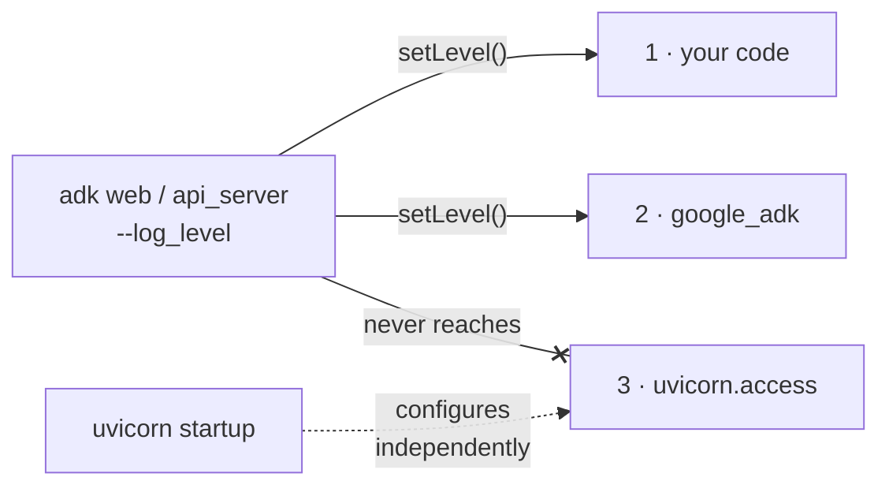

# Part 2 · Access logs

*Why `--log_level` never silences uvicorn's access log — and how to filter it.*

> [!NOTE]
> **Why you are here.** You saw it at the end of 1.3: `--log_level WARNING`
> silenced the whole framework and your tool, and the `INFO:` access lines kept
> right on printing. That is a small annoyance on your laptop and a real problem in
> production, where it means one log line per request forever, including a flood
> from your load balancer's health checks, no matter how far down you turn the
> flag.



*What `--log_level` reaches. Streams 1 and 2 obey the flag; stream 3 is configured by uvicorn itself.*

**The flag worked. It just does not reach this stream.** Recall the four
streams. `--log_level` configures streams 1 and 2 (your code and `google_adk`).
The request/access lines come from stream 3, uvicorn's `uvicorn.access` logger,
and **uvicorn configures that logger itself**, with its own level and its own
handler, the moment it starts. ADK launches uvicorn without overriding that, so
the access logger stays at its own INFO regardless of what you passed to
`--log_level`. This is not an ADK quirk; it is how every uvicorn/FastAPI app
behaves. The access log is simply a different stream than the one the flag
controls.

Once you see it that way, the fix is obvious: when you run your own server, hand
uvicorn a logging config and put a filter on `uvicorn.access`. The key piece from
[examples/02_tame_uvicorn.py](../examples/02_tame_uvicorn.py) drops health-check
paths entirely:

```python
class DropHealthChecks(logging.Filter):
    NOISY_PATHS = ("/healthz", "/health", "/readyz", "/livez")

    def filter(self, record):
        # uvicorn.access record.args = (client, method, path, http_version, status)
        if record.args and len(record.args) >= 3:
            path = str(record.args[2])
            if any(path.startswith(p) for p in self.NOISY_PATHS):
                return False   # drop this record
        return True
```

**👉 Do this.** Start the demo server, then hit the health endpoint three times and
the root once.

**Command:**

```bash
.venv/bin/python examples/02_tame_uvicorn.py
```

In another terminal, hit the health endpoint three times and the root once.

**Command:**

```bash
curl -s localhost:8081/healthz
curl -s localhost:8081/healthz
curl -s localhost:8081/healthz
curl -s localhost:8081/
```

**Expected output** — in the server terminal:

```console
2026-08-31 20:08:06 - ACCESS - 127.0.0.1:51868 "GET / HTTP/1.1" 200 OK
```

> [!IMPORTANT]
> **What it means.** Three health checks produced **zero** log lines; the one real
> request produced exactly one. You did not lower a level, you filtered a specific
> stream. On a busy service, that removes one log line per health check for the
> life of the deployment. It also sets up the rest of this tutorial: to control
> agent logging well, you stop relying on a global level and start configuring each
> stream deliberately.

---

← Prev: [1. Log levels — cloud & Agent Runtime](01b-log-levels-cloud.md) · [Tutorial index](../TUTORIAL.md) · Next: [3. Plugins](03-plugins.md) →

