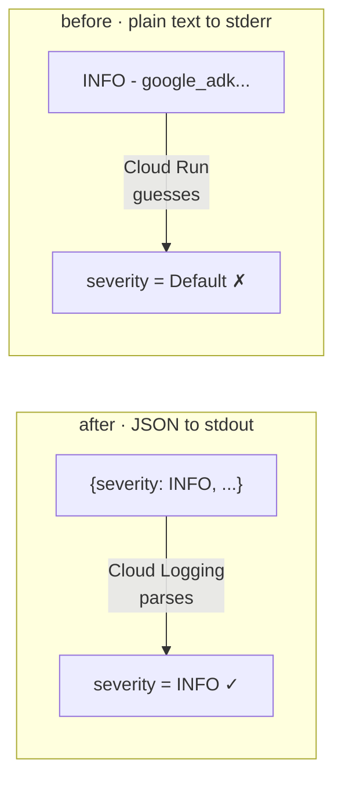
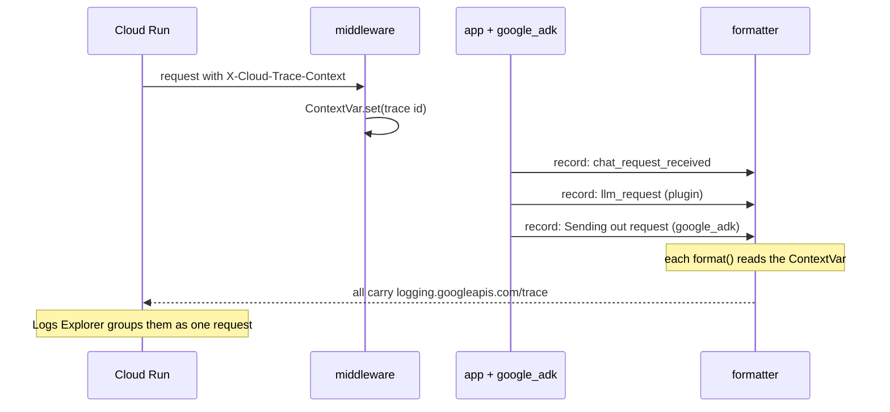

# Part 4 · Structured logging

*A JSON plugin, a custom server that owns all four streams, and the same server
shipped to Cloud Run with first-class severity and per-request trace grouping.*

> [!NOTE]
> **Why you are here.** You want the visibility of Part 3, but for a running
> service you can query, alert on, and correlate. That rules out `LoggingPlugin`
> (it prints) and DEBUG (it is unstructured text). This part builds the answer in
> three moves: a plugin that emits structured `logging` records (4.1), a
> hand-written server where one config owns every stream (4.2), and that exact
> server deployed to Cloud Run, where the JSON you saw on your laptop becomes
> queryable Cloud Logging entries with correct severity and a shared trace (4.3).

---

### 4.1 The structured plugin

A plugin's callbacks are the hook points. From
[examples/05_structured_plugin.py](../examples/05_structured_plugin.py), the
"after model" hook records latency and token usage:

```python
class StructuredTelemetryPlugin(BasePlugin):
    async def after_model_callback(self, *, callback_context, llm_response):
        usage = getattr(llm_response, "usage_metadata", None)
        telemetry_log.info("llm_response", extra={
            "event": "llm_response",
            "agent": callback_context.agent_name,
            "latency_ms": ...,                       # measured in the plugin
            "input_tokens": getattr(usage, "prompt_token_count", None),
            "output_tokens": getattr(usage, "candidates_token_count", None),
        })
        return None   # returning None means "proceed normally"
```

**👉 Do this.** The example attaches a JSON formatter to the telemetry logger and
asks *"What's the weather in New York?"*:

```bash
.venv/bin/python examples/05_structured_plugin.py
```

**Expected output** — one structured line per event:

```console
{"severity": "INFO", "message": "llm_response", "agent": "weather_agent", "latency_ms": 1617.0, "input_tokens": 141, "output_tokens": 6}
{"severity": "INFO", "message": "tool_start", "tool": "get_weather", "tool_args": {"city": "New York"}}
{"severity": "INFO", "message": "tool_end", "tool": "get_weather", "latency_ms": 0.2, "status": "ok"}
```

> [!IMPORTANT]
> **What it means.** Every line is now a machine-readable event, not prose. That is
> the prerequisite for querying: the fields you see here (`latency_ms`, `status`,
> `input_tokens`) become keys you can filter, aggregate, and alert on the moment
> these lines reach a log store. Nothing here is terminal-specific either, so the
> same records prove the point in the cloud once a server emits them.

One detail this example teaches by doing:

- **Reserved field names.** Keys in `extra=` must not collide with built-in
  `LogRecord` attributes (`args`, `name`, `message`, `module`). The example uses
  `tool_args`, not `args`, precisely because `args` collides and raises a
  `KeyError` inside the log call. (This one bites everyone once.)

---

### 4.2 A custom server that owns all four streams

> [!NOTE]
> **Why you are here.** You are not using `adk web`, `adk api_server`, or ADK's
> `get_fast_api_app` helper. You have a hand-written FastAPI service (a common
> situation once you need custom routes, auth, or streaming), and you want to
> configure all four streams in one place. `get_fast_api_app` has no `log_level`
> parameter either, so owning the logging config is the norm for any custom
> server, not an edge case. Because you own it, the same config that reads well on
> your laptop is the one that produces Cloud Run-ready JSON, so 4.3 ships this
> server unchanged.

[examples/06_custom_server.py](../examples/06_custom_server.py) is a complete,
minimal server built on current ADK 2.x idioms. The shape to copy:

```python
# Build an App with your plugins, hand it to a Runner, close it on shutdown.
adk_app = App(name="custom_server", root_agent=root_agent,
              plugins=[StructuredTelemetryPlugin()])   # the 4.1 plugin

@asynccontextmanager
async def lifespan(app):
    app.state.runner = Runner(app=adk_app, session_service=InMemorySessionService())
    yield
    await app.state.runner.close()      # releases plugin/toolset resources
```

Passing `app=` to the `Runner` is the recommended ADK 2.x form; passing
`plugins=` to the `Runner` still works but is deprecated. For logging, a single
`dictConfig` at startup is the clean way to set up every stream at once: your
telemetry logger, the `google_adk` group's level, the root handler, and the
`uvicorn.access` filter from Part 2. It is also where you tame framework noise
with a truncating filter, so one runaway DEBUG line cannot blow out your log:

```python
class TruncateFilter(logging.Filter):
    def __init__(self, max_length=200):
        super().__init__(); self.max_length = max_length
    def filter(self, record):
        msg = record.getMessage()
        if len(msg) > self.max_length:
            record.msg = msg[: self.max_length] + " ...[truncated]"
            record.args = ()
        return True
```

**Two Cloud Run facts the formatter encodes.** Because this server writes to
stdout and Cloud Run ingests stdout into Cloud Logging for free, the only job left
is to make each line a good JSON object. Two special fields do it:

- **`severity` lives in the JSON, not in the stream.** You saw in 1.4 and 1.5 that
  Cloud Run does *not* reliably map a stream to a severity: the plain `INFO -`
  lines landed as **Default**. The fix is to write the level as a field, not leave
  it to inference. `CloudRunJsonFormatter` sets `severity` from the record's own
  level.
- **`logging.googleapis.com/trace` groups a request.** Cloud Run sets an
  `X-Cloud-Trace-Context` header on each request. Put it into that special field,
  formatted as `projects/PROJECT_ID/traces/TRACE_ID`, and the Logs Explorer groups
  every line of one request together, across all four streams.



*Plain text vs. JSON: the severity you get depends on whether you set it yourself or let Cloud Run guess.*

The clever part is a `contextvars.ContextVar`: the server parses the trace once at
the start of each request, and the formatter reads it for **every** record emitted
while that request is handled, including the deep `google_adk` framework logs you
never touch:

```python
current_trace: ContextVar[str | None] = ContextVar("current_trace", default=None)

class CloudRunJsonFormatter(logging.Formatter):
    def format(self, record):
        entry = {"severity": record.levelname, "message": record.getMessage()}
        trace_id = current_trace.get()
        if trace_id and PROJECT_ID:
            entry["logging.googleapis.com/trace"] = f"projects/{PROJECT_ID}/traces/{trace_id}"
        # ... plus any extra= fields from your plugin ...
        return json.dumps(entry, default=str)
```



*How the `ContextVar` threads the trace through every record, including framework logs you never touch.*

**👉 Do this**, passing the trace header the way Cloud Run would:

```bash
GOOGLE_CLOUD_PROJECT=your-project .venv/bin/python examples/06_custom_server.py
# in another terminal:
curl -s -X POST localhost:8080/chat \
  -H 'content-type: application/json' \
  -H 'X-Cloud-Trace-Context: 105445aa7843bc8bf206b12000100000/1;o=1' \
  -d '{"message":"weather in Tokyo?"}'
```

**Expected output** — your app log, your plugin telemetry, **and** ADK's own
framework log all carry the same trace value (trimmed):

```console
{"severity": "INFO", "message": "chat_request_received", "logging.googleapis.com/trace": "projects/jwd-gcp-demos/traces/105445aa...", "user_id": "web-user"}
{"severity": "INFO", "message": "llm_request", "logging.googleapis.com/trace": "projects/jwd-gcp-demos/traces/105445aa...", "event": "llm_request", "agent": "weather_agent"}
{"severity": "INFO", "message": "Sending out request, model: gemini-3.7-flash, ...", "logging.googleapis.com/trace": "projects/jwd-gcp-demos/traces/105445aa..."}
{"severity": "INFO", "message": "tool_start", "logging.googleapis.com/trace": "projects/jwd-gcp-demos/traces/105445aa...", "event": "tool_start", "tool": "get_weather", "tool_args": {"city": "Tokyo"}}
{"severity": "INFO", "message": "tool get_weather called for city='Tokyo'", "logging.googleapis.com/trace": "projects/jwd-gcp-demos/traces/105445aa..."}
{"severity": "INFO", "message": "tool_end", "logging.googleapis.com/trace": "projects/jwd-gcp-demos/traces/105445aa...", "event": "tool_end", "tool": "get_weather", "latency_ms": 0.3, "status": "ok"}
```

> [!IMPORTANT]
> **What it means.** One process, all four streams under your control in one config
> block, and the same structured events you designed in 4.1 now flowing out of a
> real HTTP server. That third-from-last group is worth a second look: the
> `tool get_weather called` line and the `Sending out request` line are logs you
> did **not** write, and they still carry the trace, because the `ContextVar`
> threads it through everything that runs during the request. This is the server
> 4.3 containerizes and ships, unchanged.

---

### 4.3 The same server on Cloud Run

> [!NOTE]
> **Why you are here.** On your laptop the JSON is just text on your terminal. The
> payoff is what Cloud Logging does with it: `severity` becomes a queryable level
> and the trace field groups a request. This is the fix for the blank-severity
> problem you diagnosed in 1.4 and 1.5, now applied to the server you actually run.

[deploy/deploy_cloudrun.sh](../deploy/deploy_cloudrun.sh) containerizes
`06_custom_server.py` with `gcloud run deploy --source`, then runs one real turn
against the result and fails loudly if it does not return 200.

```bash
export PROJECT_ID=your-project REGION=us-central1
./deploy/deploy_cloudrun.sh
```

Send a turn and read back the severity of your lines, the problem this part exists
to fix:

```bash
URL=$(gcloud run services describe adk-logging-demo \
        --project="$PROJECT_ID" --region="$REGION" --format='value(status.url)')

curl -s -X POST "$URL/chat" -H 'content-type: application/json' \
     -d '{"message":"What'\''s the weather in Tokyo?"}'

gcloud logging read \
  'resource.type="cloud_run_revision" resource.labels.service_name="adk-logging-demo" severity>=INFO' \
  --project="$PROJECT_ID" --limit=20 \
  --format='table(severity, jsonPayload.message)' --freshness=10m
```

**Expected output** — a real `INFO` in the severity column, not the blank you got
from plain text in 1.5:

```console
SEVERITY  MESSAGE
INFO      chat_request_received
INFO      llm_request
INFO      Sending out request, model: gemini-3.7-flash, ...
INFO      tool get_weather called for city='Tokyo'
INFO      tool_end
```

Because each line is JSON, Cloud Logging parsed it into a `jsonPayload` object,
so your plugin's fields are columns you can query, not text to grep:

```bash
gcloud logging read \
  'resource.type="cloud_run_revision" jsonPayload.event="tool_end"' \
  --project="$PROJECT_ID" --limit=5 \
  --format='table(jsonPayload.tool, jsonPayload.latency_ms, jsonPayload.status)' --freshness=10m
```

**Expected output** — the structured fields returned as query columns:

```console
TOOL         LATENCY_MS  STATUS
get_weather  0.3         ok
```

> [!IMPORTANT]
> **What it means.** No formatter change between laptop and cloud: the JSON you saw
> in 4.2 is the JSON Cloud Logging indexed. `jsonPayload.status="error"` is now an
> alerting condition and `jsonPayload.latency_ms` is a metric you can chart, both
> because the plugin emitted structured fields, and `severity` rode along so Cloud
> Logging shows these at their real level rather than guessing. And because Cloud
> Run supplies a real `X-Cloud-Trace-Context` per request, clicking one line's
> trace in the Logs Explorer shows the whole request's lifecycle grouped, framework
> and access lines included, without hunting for the lines that belong to it.

> [!WARNING]
> **Your model's region is not your service's region.** This agent's model lives in
> `global` while the service runs in `us-central1`. If the container resolves the
> wrong one the deploy *succeeds* and then every `/chat` returns 500 wrapping a 404
> for the model. The script sets `GOOGLE_CLOUD_LOCATION` as a real Cloud Run env
> var (via `--set-env-vars`) so it beats any default, which is why the smoke test,
> not the deploy's exit code, is the real success check.

Tear down when you are done:

```bash
gcloud run services delete adk-logging-demo --project="$PROJECT_ID" --region="$REGION" --quiet
```

---

### 4.4 Callback or plugin?

> [!NOTE]
> **Why you are here.** The plugin above is one of two ways to emit your own
> records; the other is a per-agent callback, and you have probably seen that style
> elsewhere. Before choosing between them, be clear on what this logging is for. It
> does not replace ADK's built-in logging. It sits alongside it, because the two
> answer different questions.

To operate the agent you have to be able to answer questions like:

1. Is the model call failing or being retried?
2. Which tool ran, with which arguments, and did it succeed?
3. How many tokens did this turn cost, and what is a session costing?

Set a level on `google_adk` and the framework answers the first on its own:
requests sent, responses received, retries, and errors, for free. It does not
answer the second or third in any form you can query. At DEBUG it will dump the
tool call inside a wall of JSON you cannot filter or aggregate. Questions 2 and 3
are yours to collect as structured fields, and collecting them is the
callback-or-plugin job. So the rule is **in addition to the framework logger, not
instead of it.**

**The per-agent callback.** The same hook points exist on a single agent. Instead
of a plugin class, you attach a function:

```python
import logging

telemetry = logging.getLogger("agent.telemetry")   # your namespace, not google_adk

def log_tool(tool, args, tool_context):
    telemetry.info("tool_call", extra={
        "event": "tool_call",
        "tool": tool.name,
        "tool_args": args,
        "agent": tool_context.agent_name,
    })
    return None   # return a value instead to block or replace the call

root_agent = Agent(..., before_tool_callback=log_tool)
```

`getLogger("agent.telemetry")` returns a logger under a name you choose; the name
is arbitrary and unrelated to ADK. It matters for two reasons: you can set its
level and attach handlers by that same name in your logging config, and the name
rides on every record, so in Cloud Logging you can filter to `agent.telemetry`
and see your events without the framework's. Keeping it out of the `google_adk`
tree is what lets you control the two independently.

**Which to use.** The callback and the plugin run the same hooks; they differ in
scope.

| Use a plugin when... | Use a per-agent callback when... |
|---|---|
| you want uniform telemetry across every agent and tool | the logic belongs to one agent only |
| the logging carries state (a timer for latency) or config | you are prototyping and want the fewest lines |
| you want one field schema for downstream BigQuery or Looker analysis | you need to block or rewrite a step for that one agent |

A plugin registers once on the `App` and fires everywhere, which is why it is the
right default for production telemetry: one place, one schema, every agent. A
per-agent callback is siloed by design; with several agents the same logging
drifts across them and you cannot see the whole app at once. Reach for it when
the logic is genuinely local, or when you want a hook to **short-circuit**:
returning a value from a `before_*` callback stops or replaces the step, which
turns the same hook into a guardrail. Note that both callbacks and plugins run in
the request thread, so keep the work cheap and let the logging handler do the
shipping.

**The takeaway.** Set a level on ADK's logger to answer framework questions, add
a plugin (or, for one agent, a callback) to answer the tool and cost questions
ADK cannot, and route both through one logging config so every agent produces the
same queryable record.

---

← Prev: [3. Plugins](03-plugins.md) · [Tutorial index](../TUTORIAL.md) · Next: [5. OpenTelemetry](05-otel.md) →
