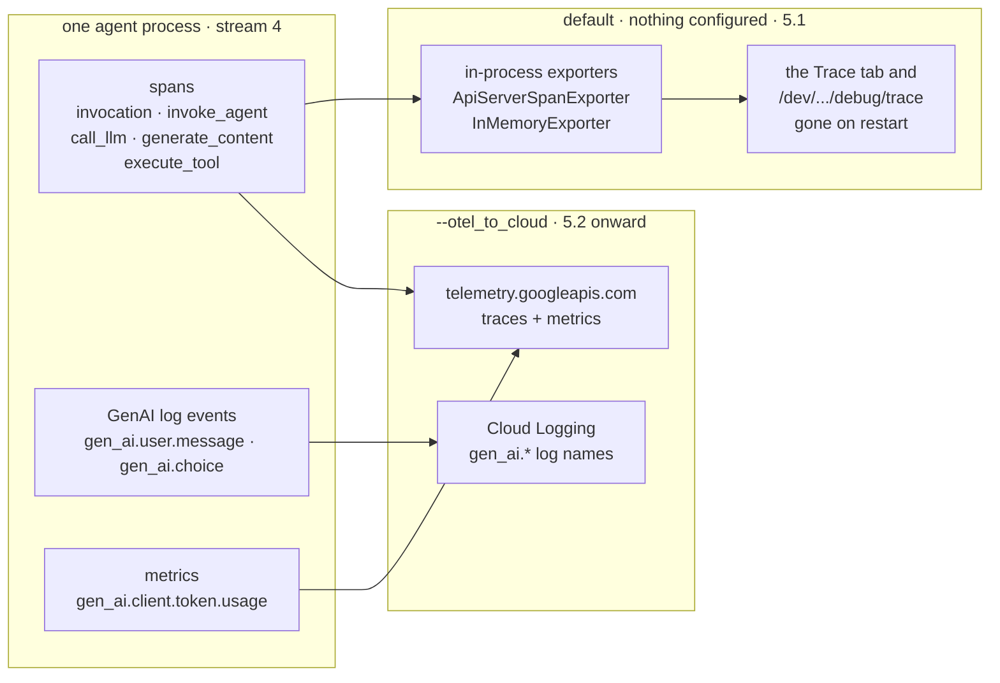

# Part 5 · OpenTelemetry

*Stream 4 — the spans ADK already emits with nothing configured, and where they
go once you point them at Google Cloud.*

> [!NOTE]
> **Why you are here.** Parts 1-4 were all the `logging` module: streams 1, 2 and 3,
> text you read a line at a time or query a field at a time. Stream 4 is different
> machinery. ADK emits **OpenTelemetry** spans, GenAI log events, and metrics, and
> none of them print. They leave through an exporter. You want them because a span
> tree answers *where did the time go* and *what did each step actually receive*,
> which no flat log line can. The surprise this part opens with is that you do not
> configure anything to get them: `adk web` traces every turn already. What the
> flag in 5.2 adds is not tracing, it is **export**.

Part 5 starts from what is already running (5.0, 5.1), adds one flag to send it to
Google Cloud (5.2 onward), and only writes code in the one situation that needs it.

---

### 5.0 What stream 4 is

Streams 1-3 are Python `logging`: a record, a level, a handler, a line of text.
Stream 4 shares none of that. It is a separate SDK with its own three signals, all
produced by ADK itself with no extra packages and no instrumentation on your part:

| Signal | What ADK produces | Shape |
|---|---|---|
| **Traces** | one span per invocation, agent, model call and tool call | a nested tree with durations and attributes |
| **Log events** | `gen_ai.system.message`, `gen_ai.user.message`, `gen_ai.choice` | structured events, stamped with the current trace and span id |
| **Metrics** | `gen_ai.client.token.usage`, `gen_ai.execute_tool.duration`, and friends | counters and histograms |

The whole part turns on one question: **where does that go?** There are two
answers, and 5.1 and 5.2 are exactly those two.



*Stream 4's two destinations. The spans are produced either way; the flag only decides whether anything leaves the process.*

**The five span names.** Learn these once and every trace in this part reads
itself. Each one is created by ADK itself, at a line you can go read: source
paths below are relative to the installed `google/adk/` package, so
`telemetry/_instrumentation.py` is
`.venv/lib/python3.13/site-packages/google/adk/telemetry/_instrumentation.py`.

| Span name | Opened once per | Source |
|---|---|---|
| `invocation` | turn (the root span) | `telemetry/_instrumentation.py:133` |
| `invoke_agent {name}` | agent that runs | `telemetry/_instrumentation.py:470-476` |
| `call_llm` | model round trip | `flows/llm_flows/base_llm_flow.py:1732` |
| `generate_content {model}` | GenAI SDK call, inside `call_llm` | `telemetry/tracing.py:1068`, `:1122` |
| `execute_tool {tool}` | tool call | `telemetry/_instrumentation.py:507-509` |

Two more names show up in situations this tutorial does not exercise:
`send_data` on a live/streaming connection (`flows/llm_flows/base_llm_flow.py:717`)
and `execute_tool (merged)` when the model requests several tools in parallel
(`flows/llm_flows/functions.py:526`, `:774`).

---

### 5.1 With nothing configured, `adk web` is already tracing

> [!NOTE]
> **Why you are here.** The usual first move with OpenTelemetry is to go find an
> exporter to install. Do not. Run the agent the way Part 1 ran it, with no flags,
> no `OTEL_*` variables and no code, then open the dev UI and read the spans back
> by eye. Knowing what you get for free is what makes the rest of this part a
> short list of deltas rather than a pile of configuration.

**Step 1 — Start the dev UI.** No flags of any kind.

**Command:**

```bash
adk web ./
```

**Step 2 — Open the browser UI and send one turn.** Go to `localhost:8000`,
pick **demo_agent** from the app dropdown, and either start a new session or
reuse an existing one. Type the same prompt Part 1 used:

```
What's the weather in London?
```

The reply streams back in the chat pane ending in
`The weather in London is currently 15°C and drizzling.` Nothing in the chat UI
announces that anything was traced — it wasn't printed, it was captured.

**Step 3 — Click the Trace tab.** Same session, same turn: switch from the chat
view to the **Trace** tab. It renders the identical span tree you'd get from the
dev server's own debug endpoint (`/dev/apps/{app}/debug/trace/session/{id}`),
because that endpoint is what the tab calls — same spans, same nesting, same
durations. The tree for this turn:

```console
invocation  (4281 ms)
  invoke_agent weather_agent  (4270 ms)
    call_llm  (2649 ms)
      generate_content gemini-3.7-flash  (2641 ms)
      execute_tool get_weather  (1 ms)
    call_llm  (1583 ms)
      generate_content gemini-3.7-flash  (1580 ms)
```

> [!IMPORTANT]
> **What it means.** This is the run you have watched all tutorial, in the one shape
> a log cannot give you. Three things to read off it:
>
> | Reading | Why it matters |
> |---|---|
> | Five of the 5.0 span names, all present | ADK instrumented the turn itself; you added nothing |
> | 2649 ms + 1583 ms of model time against a **1 ms** tool | the latency question is answered by the tree, not by a stopwatch you wrote |
> | `execute_tool get_weather` is a **child of the first `call_llm`**, not its sibling | the tool span opens inside the model call that requested it, so a slow tool shows up as time inside the round trip that asked for it |
>
> Part 1 showed this same turn as five flat INFO lines in which the two round trips
> were distinguishable only by reading top to bottom. Here the nesting and the
> durations are the data — and the Trace tab is where you'd click into any node to
> see this same shape on your own run.

**Step 4 — Click the `execute_tool get_weather` span.** The tree is the shape;
one span is the detail. Selecting the node opens a panel of that span's fields:

| Field | Value here | What it is |
|---|---|---|
| Name | `execute_tool get_weather` | the span title, the standard GenAI verb plus your function's name |
| Span ID / Parent ID | `6237947…` / `9487881…` | the Parent ID is the first `call_llm`: the tool span opens inside the model call that requested it |
| Trace ID | `1.2672905…` | shared by every span in this turn, the join key across them |
| Start / End Time | `12:12:36` → `12:12:36` | the 1 ms you read off the tree, to the wall clock |
| Events → Event ID | `061fbc54…` | ADK's own event id, the join key back to the `/run` response's event list |

The panel is the durations and identity of one span. It does not show the tool's
arguments or return value: that is **content**, and where it lives, on which
span, and the knob that turns it off, is 5.2's subject.

**The endpoint behind the tab, for scripting.** The Trace tab is a UI over
`/dev/apps/{app}/debug/trace/session/{id}`, and that endpoint is still there if
you want the tree as raw JSON instead of clicking through it — `otel/check_local.sh`
uses exactly this endpoint to assert the five span names and their counts without
a browser. There is also a narrower view at `/dev/apps/{app}/debug/trace/{event_id}`,
keyed by that `gcp.vertex.agent.event_id`. It returns one span's attributes rather
than a tree, and it only ever sees three kinds of span: the exporter behind it
keeps `call_llm`, `send_data`, and anything starting with `execute_tool`, and
drops the rest (`cli/api_server.py:467-471`). Use the session view — or the Trace
tab, which reads the session view — when you want the whole picture.

**Where those spans have been living.** Three facts explain the entire output
above, and each is one place in the installed source:

1. **A real tracer provider is always installed.** The CLI's `_setup_telemetry`
   has three branches: `--otel_to_cloud`, then any `OTEL_EXPORTER_OTLP_*_ENDPOINT`
   variable, and then a plain `TracerProvider` when neither applies
   (`cli/api_server.py:649-666`). You took the third branch, and it is a
   working provider, not a no-op stub. That is why spans exist at all.
2. **Its exporters write to process memory.** Whichever branch runs, the server
   hands it the same two: `ApiServerSpanExporter`, which stashes attributes in a
   dict keyed by event id (`cli/api_server.py:458`), and `InMemoryExporter`,
   which keeps whole spans keyed by session (`:483`). Both are passed in at the
   call site (`:1170-1178`).
3. **Nothing leaves the process.** No network exporter is registered on that third
   branch. The spans live in the server's RAM, they are visible only through the
   Trace tab and the two `/dev` endpoints behind it, and they are gone when you
   press Ctrl-C. Restart `adk web` and reopen the same session's Trace tab: the
   session still exists in `demo_agent/.adk/session.db`, and the spans do not.

That last point is the whole reason 5.2 exists. You are not switching tracing on;
it is on. You are giving the spans somewhere durable to go.

Everything in this section is checked by
[otel/check_local.sh](../otel/check_local.sh), which starts a plain `adk web`,
runs one turn over HTTP against the debug endpoint behind the Trace tab, asserts
the five span names and their counts, and exits non-zero if any is missing. It
needs the model, and nothing else: no flag, no `OTEL_*` variable, no cloud
project.

---

### 5.2 One flag: `adk web --otel_to_cloud`, read the events back from Cloud Logging

> [!NOTE]
> **Why you are here.** 5.1 ended with the spans in the server's RAM and nowhere
> else. This section adds one flag and no code, then reads one turn back from
> **Cloud Logging** — the `gen_ai.*` events. The same flag also sends spans to
> Cloud Trace and metrics to Cloud Monitoring, but this section looks at logs
> only. It also answers the question that decides whether the flag is safe in
> production: the events carry no message text by default, and one knob turns
> text on.

**Before you start, once.** Everything from here to 5.4 authenticates and routes
the same way, so this list is not repeated. Do all of it on the machine that
runs `adk web`.

| Need | Do | Why |
|---|---|---|
| Application Default Credentials | `gcloud auth application-default login` | The flag's branch starts with `google.auth.default()`, which returns both the credentials and the project (`cli/api_server.py:680-718`, the call at `:700`). No key file and no `GOOGLE_API_KEY` are involved. |
| The project | `source env.sh` in the shell that starts the server | `google.auth.default()` takes the project from `GOOGLE_CLOUD_PROJECT` in the shell when it is set, and from your gcloud configuration otherwise (`google/auth/_default.py:698-720`, same site-packages). It does **not** come from `demo_agent/.env`: that file has not been loaded yet when this runs (the `.env` callout later in this section shows why). |
| The Telemetry API | `gcloud services enable telemetry.googleapis.com` on the project | Spans and metrics leave through `https://telemetry.googleapis.com/v1/traces` and `/v1/metrics` (`telemetry/google_cloud.py:57-69`). The GenAI events take a different road, the Cloud Logging API (`:264-281`). |
| Roles on the identity ADC resolves to | the table below | Three permissions, one per signal. |

The [Telemetry API overview](https://docs.cloud.google.com/stackdriver/docs/reference/telemetry/overview)
names two roles: `roles/telemetry.writer` on the project, and
`roles/serviceusage.serviceUsageConsumer` on the quota project (the metrics
request captured in this session carried an `x-goog-user-project` header, so
the quota project matters even when it is the same project). `gcloud iam roles
describe` shows what the candidate roles actually carry:

| Role | Permissions it carries | Covers |
|---|---|---|
| `roles/telemetry.writer` | `telemetry.traces.write`, `monitoring.timeSeries.create`, `logging.logEntries.create` | all three signals |
| `roles/telemetry.tracesWriter` | `telemetry.traces.write` | spans only |
| `roles/telemetry.metricsWriter` | `monitoring.timeSeries.create` | metrics only |
| `roles/cloudtrace.agent` | `cloudtrace.traces.patch`, `telemetry.traces.write` | spans, via the older Cloud Trace role |
| `roles/logging.logWriter` | `logging.logEntries.create`, `logging.logEntries.route` | the `gen_ai.*` events |

This section was run as a project owner, so the minimal set was not exercised.
`roles/telemetry.writer` plus the quota-project role is the documented answer;
the table tells you which permission a `403` is complaining about.

Packages: `requirements.txt` already installs them. `google-adk[otel-gcp]`
(explained after the read-back), `opentelemetry-exporter-otlp-proto-http` for
spans and metrics, and `opentelemetry-exporter-gcp-logging` for the events. That
last import is unguarded (`telemetry/google_cloud.py:272`), so it is not optional
once the flag is on.

**Step 1 — Export one shell variable, then start the dev UI with the flag
(terminal 1).** Stop the 5.1 server if it is still running. This `export` must be
in the shell **before** `adk web` starts. It cannot go in `demo_agent/.env`: the
exporters that read it are built when the server object is constructed, before
`.env` is ever loaded.

**Command:**

```bash
source env.sh
export OTEL_RESOURCE_ATTRIBUTES="service.instance.id=laptop-1,cloud.region=us-central1"
adk web --otel_to_cloud ./
```

Startup looks exactly like 5.1. Nothing prints to say that three exporters were
installed, and the flag's own help text says only `Whether to write OTel data to
Google Cloud Observability services - Cloud Trace and Cloud Logging`. (If you
installed ADK without the `[otel-gcp]` extra, one WARNING line appears before
`Started server process`; it is covered at the end of this section.)

Set `OTEL_RESOURCE_ATTRIBUTES` because without it every metrics export fails. This
section does not read metrics, but the failed batches print an error to terminal 1
every five seconds, so set it now. `cloud.region` must be a real region, not the
model's region and not `global`. Spans and log events need none of this; only
metrics do. The variable is a laptop-only workaround: on Cloud Run and Agent
Runtime the resource detector supplies a region and instance from the metadata
server. Nothing here opts into the experimental semantic convention yet. Steps 1
and 2 run under the stable `gen_ai.*` events, and Step 3 introduces the opt-in.

> [!WARNING]
> **Without `OTEL_RESOURCE_ATTRIBUTES`, every metrics export fails, and the error
> does not say why.** This section was first run without that line. Spans and
> events exported fine, and the terminal filled with one of these every 5 seconds
> for as long as the server ran:
>
> ```console
> 2026-09-04 17:21:03,454 - ERROR - __init__.py:294 - Failed to export metrics batch code: 400, reason: Bad Request
> 2026-09-04 17:21:08,556 - ERROR - __init__.py:294 - Failed to export metrics batch code: 400, reason: Bad Request
> ```
>
> The OTLP exporter logs the status and the reason and throws the body away
> (`opentelemetry/exporter/otlp/proto/http/metric_exporter/__init__.py:294`).
> Captured with a wrapped session, the body says:
>
> ```console
> {"errors":[{"code":"INVALID_ARGUMENT","error_message":"prometheus_target resource type must have an instance specified","num_data_points":1,"example_resource_attributes":{"gcp.project_id":"jwd-gcp-demos"}}]}
> ```
>
> The Telemetry API stores OTLP metrics as `prometheus_target` time series. That
> monitored resource requires an `instance` and a real `location`, which the API
> derives from `service.instance.id` and `cloud.region`. Off Agent Engine,
> `get_gcp_resource` starts from `{gcp.project_id}` and merges two detectors
> (`telemetry/google_cloud.py:335-352`): the OTel one reads
> `OTEL_RESOURCE_ATTRIBUTES` and `OTEL_SERVICE_NAME`, the Google Cloud one reads
> the metadata server, which a laptop does not have. So the resource is the
> project id alone, exactly as the error's `example_resource_attributes` shows,
> and every batch is rejected. Narrowing it down one attribute at a time:
> `service.instance.id` alone gets `write for resource failed: Unrecognized region
> or location.`; adding `cloud.region=global` gets `location / region / zone label
> cannot be set to "global"`; `cloud.region=us-central1` gets `200`.

Send one turn in the UI. Open `http://localhost:8000`, pick `demo_agent`, and in
the chat box ask the London question the rest of the tutorial uses:

```
What's the weather in London?
```

The dev UI creates the session for you and shows the reply, ending in something
like `The weather in London is currently 15°C and drizzling.` (the wording varies
run to run). Terminal 1 shows the same five INFO lines as always. Nothing
announces the export; the exporters batch in the background and print nothing on
success. Leave the server running.

Now read the turn back in the console. Open **Logs Explorer**
(`console.cloud.google.com/logs`), turn on **Show query** (top right) to reveal
the **Query editor**, and enter this query there:

**Command:**

```
logName=~"gen_ai\."
```

> [!IMPORTANT]
> Put this in the **Query editor**, not the "Search all fields" box at the top.
> Search-all-fields does a free-text token search and ignores query operators
> like `=~`, so it returns nothing; the Query editor (revealed by **Show query**)
> is the one that parses the Logging Query Language.

You will
find eight entries for the one turn: under the stable semantic convention this
section is still running, each message is its own log — `gen_ai.system.message`,
`gen_ai.user.message` (one per item the model saw), and `gen_ai.choice` for each
reply — spread across the two `call_llm` spans of the turn (five under one span
id, three under the other). Expand a `gen_ai.choice` entry:

**Expected output** — content elided, with the event's own fields in `jsonPayload`:

```console
{
  "jsonPayload": {
    "index": 0,
    "finish_reason": "STOP",
    "content": "<elided>"
  },
  "resource": {
    "type": "generic_node",
    "labels": { "location": "us-central1", "project_id": "jwd-gcp-demos", "namespace": "", "node_id": "" }
  },
  "labels": {
    "gen_ai.system": "vertex_ai",
    "event.name": "gen_ai.choice"
  },
  "logName": "projects/jwd-gcp-demos/logs/gen_ai.choice",
  "trace": "projects/jwd-gcp-demos/traces/c5fdba983e103412f76dbdf0175a5eb7",
  "spanId": "55f834ee252474c1"
}
```

> [!IMPORTANT]
> **What you are looking at.** Under the stable convention the message payload lands
> in `jsonPayload`, and the event name is a `labels` field:
>
> | Field | Value here | What it is |
> |---|---|---|
> | `jsonPayload.content` | `<elided>` | `OTEL_INSTRUMENTATION_GENAI_CAPTURE_MESSAGE_CONTENT` defaults to `NO_CONTENT` (`telemetry/context.py:93-104`), so the entry records that a reply happened and nothing it said. Step 2 turns this on |
> | `labels.event.name` | `gen_ai.choice` | which of the split events this is; every entry of the turn is one of `system.message` / `user.message` / `choice` |
> | `trace` / `spanId` | `…c5fdba98…` / `55f834ee…` | the OTel API stamps the current span's trace and span id on every log record it emits. Part 4 built this join by hand from `X-Cloud-Trace-Context`; here it is free. The `trace` is shared by all eight entries; the `spanId` is one of the two `call_llm` spans |
> | `resource.type` | `generic_node` | the monitored resource, derived from the `OTEL_RESOURCE_ATTRIBUTES` in Step 1 |

**Step 2 — Turn content on, and see where it lands.** The events above proved the
turn happened but not what was said. One environment variable changes that. Stop
the server in terminal 1 with Ctrl-C, export the knob in the same shell (the Step
1 export is still set), and restart.

**Command:**

```bash
export OTEL_INSTRUMENTATION_GENAI_CAPTURE_MESSAGE_CONTENT=true
adk web --otel_to_cloud ./
```

Back in the UI, create a **new** session and ask the same London question:

```
What's the weather in London?
```

Then in the Logs Explorer **Query editor**, run `logName=~"gen_ai\."` again and expand the newest
entries. The same eight events, but `jsonPayload.content` now holds the real
messages. The `gen_ai.system.message` carries the prompt verbatim:

**Expected output** — `gen_ai.system.message`, content now present:

```console
{
  "jsonPayload": {
    "content": "You are a concise weather assistant. When the user asks about weather, call the get_weather tool and report its result in one sentence. If the tool returns an error, say you do not have data for that city.\n\nYou are an agent. Your internal name is \"weather_agent\". The description about you is \"Answers questions about the weather in a few known cities.\"."
  },
  "labels": { "gen_ai.system": "vertex_ai", "event.name": "gen_ai.system.message" },
  "logName": "projects/jwd-gcp-demos/logs/gen_ai.system.message",
  "trace": "projects/jwd-gcp-demos/traces/9d24673b9690da24f0e5c44ad263e2fe",
  "spanId": "feed5573604bf3a9"
}
```

The final `gen_ai.choice` carries the reply and the model's structured turn — the
`function_call` to `get_weather`, the tool's `function_response`, and the answer:

**Expected output** — `gen_ai.choice`, the model's reply:

```console
{
  "jsonPayload": {
    "content": {
      "role": "model",
      "parts": [{ "text": "The weather in London is currently 15°C and drizzling." }]
    },
    "finish_reason": "STOP",
    "index": 0
  },
  "labels": { "gen_ai.system": "vertex_ai", "event.name": "gen_ai.choice" },
  "logName": "projects/jwd-gcp-demos/logs/gen_ai.choice",
  "trace": "projects/jwd-gcp-demos/traces/9d24673b9690da24f0e5c44ad263e2fe",
  "spanId": "89d9503ddd1fe465"
}
```

> [!IMPORTANT]
> **What to note.** Every message the model saw and produced is now in
> `jsonPayload.content`, where Step 1 showed `<elided>`: the system prompt, the
> user's `What's the weather in London?`, the `get_weather` call and its response,
> and the final sentence. Keep content **off** in production unless you have a
> reviewed reason to log prompts and replies — all of it lands in Cloud Logging
> under your project's retention and access rules.

Now check whether the content also landed on the **trace**, not only the logs.
Open **Trace Explorer** (`console.cloud.google.com/traces`), find this turn, and
click a `call_llm` span. Look at its attributes for `gcp.vertex.agent.llm_request`
and `gcp.vertex.agent.llm_response`.

> [!IMPORTANT]
> **What to note.** If those two span attributes hold the prompt and the reply text,
> then `=true` turned content on in **both** streams, logs and spans — and Step 3
> shows the knob that governs the spans alone. If instead the attributes are already
> empty here, `=true` only ever reached the logs, and Step 3 has nothing to turn off.

**Step 3 — Turn content off on the spans alone.** `=true` in Step 2 put content in
the logs, and (as the trace check showed) on the spans too. A second knob governs
the spans independently of the log events. Stop the server, add the span knob to
the same shell (the event knob is still `true`), and restart.

**Command:**

```bash
export ADK_CAPTURE_MESSAGE_CONTENT_IN_SPANS=false
adk web --otel_to_cloud ./
```

Ask the London question in a new session once more:

```
What's the weather in London?
```

In Logs Explorer the `gen_ai.*` events still carry content (the event knob is still
`true`), but in Trace Explorer the `call_llm` span's `gcp.vertex.agent.llm_request`
/ `llm_response` attributes are now `{}` — content is off on the spans and on in the
logs, independently.

> [!IMPORTANT]
> **What to note.** The two content streams have separate knobs.
> `OTEL_INSTRUMENTATION_GENAI_CAPTURE_MESSAGE_CONTENT` (Step 2) governs the
> **log events**; `ADK_CAPTURE_MESSAGE_CONTENT_IN_SPANS` governs the **span
> attributes**. Turning one off does not touch the other, so a production setup can
> keep spans clean while still logging content, or the reverse.

**Step 4 — Switch to the experimental semantic convention.** Everything so far ran
under the stable convention, which emits one log per message. The Agent Runtime
docs page, and the rest of this tutorial, run under the **experimental** one, which
is shaped differently. Stop the server, add the opt-in, put the content knob back
to `NO_CONTENT` (this step isolates the convention change from the content change),
and restart.

**Command:**

```bash
export OTEL_SEMCONV_STABILITY_OPT_IN=gen_ai_latest_experimental
export OTEL_INSTRUMENTATION_GENAI_CAPTURE_MESSAGE_CONTENT=NO_CONTENT
adk web --otel_to_cloud ./
```

Ask the London question in a new session:

```
What's the weather in London?
```

Then run `logName=~"gen_ai\."` in the Logs Explorer **Query editor** once more. The entry set changes
shape: instead of the split `system.message` / `user.message` / `choice` logs, you
get **one** `gen_ai.client.inference.operation.details` entry per `call_llm` span,
two for the turn. Expand one and it looks like this:

**Expected output** — one consolidated event, content off, metadata in `labels`:

```console
{
  "resource": {
    "type": "generic_node",
    "labels": { "project_id": "jwd-gcp-demos", "location": "us-central1", "namespace": "", "node_id": "" }
  },
  "labels": {
    "event.name": "gen_ai.client.inference.operation.details",
    "gen_ai.agent.name": "weather_agent",
    "gen_ai.conversation.id": "dc14be27-393e-4126-a304-16860701713e",
    "gcp.vertex.agent.invocation_id": "e-c290004b-ae01-4baf-9561-26e51abf80fe",
    "gcp.vertex.agent.event_id": "e2a2cd65-b110-4092-a9d7-a8ce9a101927",
    "gen_ai.usage.input_tokens": "229",
    "gen_ai.usage.output_tokens": "15",
    "gen_ai.response.finish_reasons": "[\"stop\"]",
    "gen_ai.tool.definitions": "[{\"name\":\"get_weather\",\"description\":\"Return the current weather for a city.\\n\\nArgs:\\n  city: The city to look up, for example \\\"San Francisco\\\".\\n\\nReturns:\\n  A dict with a ``status`` and either a ``report`` or an ``error_message``.\",\"parameters\":null,\"type\":\"function\"}]"
  },
  "logName": "projects/jwd-gcp-demos/logs/gen_ai.client.inference.operation.details",
  "trace": "projects/jwd-gcp-demos/traces/3b80ad2b7b2b996092831043a1611f4d",
  "spanId": "849de272916dd81f"
}
```

The entry has **no `jsonPayload`** at all — everything is in `labels`, and none of
it is message content.

> [!IMPORTANT]
> **What you are looking at.** The experimental convention folds a whole model call
> into one entry, and puts the metadata in `labels` rather than `jsonPayload`:
>
> | Field | Value here | What it is |
> |---|---|---|
> | `event.name` | `gen_ai.client.inference.operation.details` | one consolidated inference event, not the per-message split of Steps 1-3 |
> | `gen_ai.usage.input_tokens` / `output_tokens` | `229` / `15` | token counts for this call, right in the entry |
> | `gen_ai.response.finish_reasons` | `["stop"]` | how the model stopped |
> | `gen_ai.tool.definitions` | the `get_weather` schema | the tools the model was offered — definitions, not calls |
> | `trace` / `spanId` | `…3b80ad2b…` / `849de272…` | the join key to the `call_llm` span, as before |
> | *(message content)* | **absent** | `NO_CONTENT` again: usage and shape, nothing said. No `jsonPayload.content`, no message text in `labels` |

**Step 5 — Turn content on under the experimental convention.** Same event knob as
Step 2, on the new event shape. Stop the server, flip content to `EVENT_ONLY`,
restart.

**Command:**

```bash
export OTEL_INSTRUMENTATION_GENAI_CAPTURE_MESSAGE_CONTENT=EVENT_ONLY
adk web --otel_to_cloud ./
```

Ask the London question in a new session:

```
What's the weather in London?
```

Then expand the newest `gen_ai.client.inference.operation.details` entry in Logs
Explorer. The same consolidated shape as Step 4, but three content labels are now
filled in — and they are still `labels`, not `jsonPayload`:

**Expected output** — the final model call, content now in `labels`:

```console
{
  "labels": {
    "event.name": "gen_ai.client.inference.operation.details",
    "gen_ai.agent.name": "weather_agent",
    "gen_ai.usage.input_tokens": "229",
    "gen_ai.usage.output_tokens": "15",
    "gen_ai.response.finish_reasons": "[\"stop\"]",
    "gen_ai.system_instructions": "[{\"content\":\"You are a concise weather assistant. ...\",\"type\":\"text\"}]",
    "gen_ai.input.messages": "[{\"role\":\"user\",\"parts\":[{\"content\":\"What's the weather in London?\\n\",\"type\":\"text\"}]},{\"role\":\"assistant\",\"parts\":[{\"arguments\":{\"city\":\"London\"},\"name\":\"get_weather\",\"id\":\"call_397575\",\"type\":\"tool_call\"}]},{\"role\":\"user\",\"parts\":[{\"response\":{\"status\":\"ok\",\"report\":\"The weather in London is 15C and drizzling.\"},\"id\":\"call_397575\",\"type\":\"tool_call_response\"}]}]",
    "gen_ai.output.messages": "[{\"role\":\"assistant\",\"parts\":[{\"content\":\"The weather in London is currently 15\\u00b0C and drizzling.\",\"type\":\"text\"}],\"finish_reason\":\"stop\"}]"
  },
  "logName": "projects/jwd-gcp-demos/logs/gen_ai.client.inference.operation.details",
  "trace": "projects/jwd-gcp-demos/traces/acacdad756293b70e0b9b8eef517d0ad",
  "spanId": "526c426af55360ea"
}
```

> [!IMPORTANT]
> **What to note.** `EVENT_ONLY` adds three content labels that Step 4's `NO_CONTENT`
> left off, and folds the whole conversation into them:
>
> | Label | Holds |
> |---|---|
> | `gen_ai.system_instructions` | the system prompt |
> | `gen_ai.input.messages` | everything the model saw this call — the question, the `get_weather` tool call, and the tool's response — as one JSON array |
> | `gen_ai.output.messages` | the model's reply, with its `finish_reason` |
>
> Two things carry forward. First, the content is in **`labels`**, as JSON strings —
> the experimental convention has no `jsonPayload` even with content on, unlike the
> stable per-message logs of Step 2. Second, the same production caution: leave
> content off unless you have a reviewed reason to log it. Both knobs are shell
> exports for this run only; they do not persist to later sections.

> [!WARNING]
> **Can `.env` turn any of this on?** No. Not the flag, and not the `OTEL_*`
> variables you exported across the steps above. The agent's `.env` is loaded when the
> agent itself is first loaded (`cli/utils/agent_loader.py:331-332`), which
> happens on the first request that needs it. The exporters were chosen, and the
> knobs read, when the server object was built, in `_setup_telemetry`
> (`cli/api_server.py:1173-1179`), before any request existed. The only branch
> that reads `.env` at startup belongs to the older `--trace_to_cloud` flag
> (`cli/fast_api.py:312-328`), which the source marks for removal. The server log
> shows the order; this excerpt is trimmed to the lines that matter:
>
> ```console
> INFO:     Application startup complete.
> INFO:     Uvicorn running on http://127.0.0.1:8000 (Press CTRL+C to quit)
> INFO:     127.0.0.1:49686 - "GET /list-apps HTTP/1.1" 200 OK
> 2026-09-04 18:48:07,909 - INFO - api_server.py:1092 - New session created: s5-knob
> INFO:     127.0.0.1:49693 - "POST /apps/demo_agent/users/u1/sessions/s5-knob HTTP/1.1" 200 OK
> 2026-09-04 18:48:07,931 - INFO - envs.py:83 - Loaded .env file for demo_agent at /Users/jeff/Desktop/Dev/gcp-demos/ai/adk/logging/demo_agent/.env
> 2026-09-04 18:48:07,933 - INFO - agent_loader.py:188 - Found root_agent in demo_agent.agent
> ```
>
> Startup completed, requests were served, a session was created, and only then,
> on the first `/run`, was `.env` read. Anything that has to be decided before
> that point comes from the command line or the shell: the flag here, and the
> `OTEL_*` exports in the steps above. The exporter endpoint variables in 5.7 are
> the same story.

**The startup WARNING, and what `[otel-gcp]` adds.** With the flag on, ADK tries
to import Google's GenAI SDK instrumentor and activate it
(`cli/api_server.py:738-750`). Installed without the extra, startup logs one line
and carries on.

**Expected output** — at startup, only when the extra is missing:

```console
2026-09-04 17:20:58,660 - WARNING - api_server.py:747 - Unable to import GoogleGenAiSdkInstrumentor - some telemetry will be disabled. Make sure to install google-adk[otel-gcp]
```

`requirements.txt` installs `google-adk[otel-gcp]` (the instrumentor plus its
supporting packages), so you will not see this line; if you do,
`pip install "google-adk[otel-gcp]"` is the fix. The extra also supplies the
`opentelemetry-instrumentation-google-genai` instrumentor, which creates the
`generate_content` spans and the client token metrics you would see on the trace
tree and in Cloud Monitoring. On a laptop its `httpx` and gRPC companions stay
off; ADK activates them only under `GOOGLE_CLOUD_AGENT_ENGINE_ID`
(`cli/api_server.py:751-767`).

Everything you have read back so far came from the dev UI's server, through Cloud
Logging alone. 5.3 keeps the same flag on `adk api_server`, and reads the same
`gen_ai.*` events back with `curl` in and Cloud Logging out.

---

### 5.3 The same flag on `adk api_server`

> [!NOTE]
> **Why you are here.** 5.2 ran `adk web --otel_to_cloud` and read the turn back
> from Cloud Logging. `adk api_server` is the headless twin: no Trace tab, no
> `/dev` debug routes (5.1's WARNING already showed those 404), but the exact same
> telemetry. Both commands share one option group
> (`fast_api_common_options`) and build the server through the same
> `ApiServer.get_fast_api_app`, where `_setup_telemetry` runs
> (`cli/api_server.py:1173`). Put the flag on `api_server` and you take the
> identical branch 5.2 took. This section is curl in, Cloud Logging out.

**Step 1 — Export the three variables (terminal 1), before starting the server.**

**Command:**

```bash
source env.sh
export OTEL_RESOURCE_ATTRIBUTES="service.instance.id=laptop-1,cloud.region=us-central1"
export OTEL_SEMCONV_STABILITY_OPT_IN=gen_ai_latest_experimental
export OTEL_INSTRUMENTATION_GENAI_CAPTURE_MESSAGE_CONTENT=NO_CONTENT
```

| Variable | Value | Why |
|---|---|---|
| `OTEL_RESOURCE_ATTRIBUTES` | `service.instance.id=laptop-1,cloud.region=us-central1` | Same reason as 5.2's WARNING: without a `service.instance.id` and a real `cloud.region`, every metrics batch to `telemetry.googleapis.com` gets rejected with a 400 the terminal never explains. |
| `OTEL_SEMCONV_STABILITY_OPT_IN` | `gen_ai_latest_experimental` | Matches 5.2 and the Agent Runtime docs page. |
| `OTEL_INSTRUMENTATION_GENAI_CAPTURE_MESSAGE_CONTENT` | `NO_CONTENT` | This is already the default (5.2, Step 4), set here explicitly since 5.2 turned it on and this section keeps it off — the production value. |

**Step 2 — Start the API server (terminal 1).**

**Command:**

```bash
adk api_server --otel_to_cloud ./
```

**Step 3 — Send one turn (terminal 2).** The same session-create-then-`/run` pair as 1.3 and 5.1, on a fresh session.

**Command:**

```bash
source env.sh
START=$(date -u +%Y-%m-%dT%H:%M:%SZ)

curl -s -X POST localhost:8000/apps/demo_agent/users/u1/sessions/s5-api \
     -H 'content-type: application/json' -d '{}'

curl -s -X POST localhost:8000/run \
     -H 'content-type: application/json' \
     -d '{"app_name":"demo_agent","user_id":"u1","session_id":"s5-api",
          "new_message":{"role":"user","parts":[{"text":"What'\''s the weather in London?"}]}}'
```

The `/run` call returns the event list over curl and prints the same five INFO
lines in terminal 1 as 5.1. Now open **Logs Explorer**
(`console.cloud.google.com/logs`) and run `logName=~"gen_ai\."` in the **Query
editor** (Show query). The entries that
appear are the same ones 5.2 produced under these three env variables: one
`gen_ai.client.inference.operation.details` per `call_llm` span, content off
(`NO_CONTENT`), the metadata in `labels`. The headless `api_server` and the dev
UI export identical telemetry.

Same flag, same code path, headless: `adk api_server --otel_to_cloud` puts the
turn in Cloud Logging with nothing but curl and three exports. 5.4 takes this
one step further and ships the same flag to Cloud Run with
`adk deploy cloud_run --otel_to_cloud`, where the process runs under a service
account instead of your ADC login.

---

### 5.4 The same flag on Cloud Run: `adk deploy cloud_run --otel_to_cloud`

> [!NOTE]
> **Why you are here.** 5.2 and 5.3 ran the flag on your laptop under your ADC
> login. 5.4 ships the exact same flag to Cloud Run and reads the same
> `gen_ai.*` events back from Logs Explorer — this time produced by a process
> running under a service account, in the cloud. `adk deploy cloud_run
> --otel_to_cloud` bakes the flag into the container's start command
> (`cli/cli_deploy.py:216`), so the server inside Cloud Run installs the same
> exporters `_setup_telemetry` installed on your laptop. No agent code, no
> `OTEL_*` variables in the deploy.

**Step 1 — Deploy.**

**Command:**

```bash
export PROJECT_ID="$(gcloud config get-value project)"
export REGION=us-central1

.venv/bin/adk deploy cloud_run \
  --project="$PROJECT_ID" \
  --region="$REGION" \
  --service_name=adk-logging-otel \
  --otel_to_cloud \
  ./demo_agent \
  -- \
  --allow-unauthenticated \
  --set-env-vars="GOOGLE_GENAI_USE_VERTEXAI=TRUE,GOOGLE_CLOUD_PROJECT=$PROJECT_ID,GOOGLE_CLOUD_LOCATION=global"
```

Everything after `--` is passed straight through to `gcloud run deploy`. Watch
the build finish and note the service URL it prints.

> [!NOTE]
> **Where `.env` goes, and why `GOOGLE_CLOUD_LOCATION` is repeated.** `adk deploy
> cloud_run` copies the whole agent folder — including `demo_agent/.env` — into
> the container image, so the settings you run with locally ship to the cloud
> automatically. But `.env` is just a file ADK loads; a real environment variable
> beats it. ADK's own generated Dockerfile sets one: `ENV GOOGLE_CLOUD_LOCATION`
> = the *service's* region, `us-central1` (`cli/cli_deploy.py:193`). That is
> wrong for the **model**, which runs in `global`, and it overrides the `global`
> in your `.env`. Passing `GOOGLE_CLOUD_LOCATION=global` in `--set-env-vars` is
> also a real env var, applied last, so it wins — which is why the same value
> appears twice.

**Step 2 — Send one turn.** Grab the service URL, then curl it.

**Command:**

```bash
export URL=$(gcloud run services describe adk-logging-otel \
  --project="$PROJECT_ID" --region="$REGION" --format='value(status.url)')

curl -s -X POST "$URL/apps/demo_agent/users/u1/sessions/s5-run" \
     -H 'content-type: application/json' -d '{}'

curl -s -X POST "$URL/run" \
     -H 'content-type: application/json' \
     -d '{"app_name":"demo_agent","user_id":"u1","session_id":"s5-run",
          "new_message":{"role":"user","parts":[{"text":"What'\''s the weather in London?"}]}}'
```

**Step 3 — Read the `gen_ai.*` events back in the console.** Open **Logs
Explorer** (`console.cloud.google.com/logs`), turn on **Show query**, and run
the same query as 5.2 and 5.3 in the **Query editor** (not "Search all fields"):

**Command:**

```
logName=~"gen_ai\."
```

The same events appear — one `gen_ai.client.inference.operation.details` per
`call_llm` — now emitted from Cloud Run rather than your laptop. Content is off
(`<elided>`): `demo_agent/.env`'s `ADK_CAPTURE_MESSAGE_CONTENT_IN_SPANS=false`
shipped inside the image and took effect, so the `.env` you never edited for
this deploy is doing its job. On Cloud Run the OTel exporter labels these entries
with a `generic_task` resource whose job is the service name, so the log name is
what you filter on — the same query that worked locally.

**Step 4 — Tear down.**

**Command:**

```bash
gcloud run services delete adk-logging-otel --project="$PROJECT_ID" --region="$REGION" --quiet
```

The flag that logged a turn on your laptop in 5.2 logged the same turn from Cloud
Run with no code and no telemetry variables — the CLI installed the exporters
inside the container exactly as it did locally.

> [!NOTE]
> **Two things that bite here.** `adk deploy` exits `0` even when the deploy
> failed (`cli/cli_tools_click.py:2456`), so if Step 2's curl errors, read the
> build output above rather than trusting that the deploy succeeded. And the
> container needs `google-adk[otel-gcp]` or it boot-crashes on the unconditional
> Cloud Logging import (`telemetry/google_cloud.py:272`) — `demo_agent/requirements.txt`
> already pins it, which is why this deploy boots.

5.5 is the one place in this part where the CLI is **not** starting the process,
so you install the exporters yourself.

---

### 5.5 Your own server: install the exporters yourself

> [!NOTE]
> **Why you are here.** In 5.1-5.4 the ADK CLI started the process, so it
> installed the Cloud exporters for you. In Part 4 you wrote your own server
> (`06_custom_server.py`) with your own `uvicorn.run` — nothing installs the
> exporters on that path, so the `gen_ai.*` events are produced but never leave
> the process. This section adds the two lines that send them to Cloud Logging,
> in a minimal version of that server: [examples/08_otel_server.py](../examples/08_otel_server.py).

**The two calls.** Build the Cloud Logging exporter, then register it — the same
shape the [ADK logging docs](https://adk.dev/observability/logging/#gcp-export-setup_1)
show. In `08_otel_server.py` they run in the `lifespan`, before the `Runner` is
built:

```python
from google.adk.telemetry.google_cloud import get_gcp_exporters
from google.adk.telemetry.setup import maybe_set_otel_providers

os.environ.setdefault("OTEL_SERVICE_NAME", "weather-agent")
hooks = get_gcp_exporters(enable_cloud_logging=True)
maybe_set_otel_providers([hooks])
```

`get_gcp_exporters` reads the project and credentials from ADC, so there is
nothing to pass it. `OTEL_SERVICE_NAME` becomes the entry's resource `job` label
in Cloud Logging — set it to something you will recognize.

> [!NOTE]
> **`.env` works here — all of it.** In 5.2 the `OTEL_*` variables had to be
> shell exports because the CLI builds its exporters *before* it loads the
> agent's `.env`. Your own server controls that order: `08_otel_server.py` calls
> `bootstrap()` (which loads `.env`, `examples/_common.py:49-55`) at the top,
> *then* builds the exporters in `lifespan`. So on your own server every `OTEL_*`
> variable, including the content knob, can live in `.env`.

**Step 1 — Run the server and send one turn.** Start it in one terminal, curl it
in another.

**Command:**

```bash
.venv/bin/python examples/08_otel_server.py
```

**Command** (second terminal):

```bash
curl -s -X POST localhost:8080/chat \
     -H 'content-type: application/json' \
     -d '{"message": "What is the weather in London?"}'
```

**Expected output:**

```console
{"response":"The weather in London is currently 15°C with drizzle."}
```

**Step 2 — Read the events back in Logs Explorer.** Open Logs Explorer, turn on
**Show query**, and run `logName=~"gen_ai\."` in the **Query editor**. The same
`gen_ai.*` events from 5.2-5.4 are there — this time from a server you wrote,
with the two calls you added. They land on a `generic_task` resource whose `job`
is your `OTEL_SERVICE_NAME` (`weather-agent`), so you can filter to just this
server with `resource.labels.job="weather-agent"`.

**Step 3 — The content knob, set through `.env`.** The tutorial's `.env` carries
`OTEL_INSTRUMENTATION_GENAI_CAPTURE_MESSAGE_CONTENT=true`, so the entries from
Step 1 already show the prompt and reply text (`text: 'What is the weather in
London?'`). Turn content **off** and see the difference: set the knob to
`NO_CONTENT` in `.env`, restart the server, send the turn again.

**Command** (in `.env`):

```bash
OTEL_INSTRUMENTATION_GENAI_CAPTURE_MESSAGE_CONTENT=NO_CONTENT
```

Query Logs Explorer once more: every `gen_ai.*` entry now reads `<elided>` in the
content field. The knob was read from `.env` on the next turn, with no code
change and no shell export — the point of Step 1's callout. `NO_CONTENT` is the
production default; leave it there unless you have a reviewed reason (5.6).

**Step 4 — Deploy the same server to Cloud Run.** The server that logged locally
logs from Cloud Run with no change to its code — the container just runs
`python examples/08_otel_server.py`. Build an image and deploy it. Note the
difference from local: the content knob is set here with `--set-env-vars`, not
`.env` (this image bakes no `.env`, matching the Part 4 custom-server deploy).

**Command:**

```bash
export PROJECT_ID="$(gcloud config get-value project)"
export REGION=us-central1

cp deploy/Dockerfile.otel_server ./Dockerfile

gcloud run deploy adk-otel-server \
  --source . \
  --project="$PROJECT_ID" \
  --region="$REGION" \
  --allow-unauthenticated \
  --set-env-vars="GOOGLE_GENAI_USE_VERTEXAI=TRUE,GOOGLE_CLOUD_PROJECT=$PROJECT_ID,GOOGLE_CLOUD_LOCATION=global,OTEL_INSTRUMENTATION_GENAI_CAPTURE_MESSAGE_CONTENT=NO_CONTENT"

rm -f ./Dockerfile
```

`gcloud run deploy --source .` builds from `./Dockerfile`, so
[deploy/Dockerfile.otel_server](../deploy/Dockerfile.otel_server) is copied there
for the build (the same pattern `deploy/deploy_cloudrun.sh` uses for Part 4).
Curl the service URL the deploy prints, then read `gen_ai.*` back in Logs
Explorer exactly as in Step 2 — this time the resource `job` is the Cloud Run
service, content `<elided>` because `--set-env-vars` carried the knob.

**Command** (curl the deployed service, then tear it down):

```bash
export URL=$(gcloud run services describe adk-otel-server \
  --project="$PROJECT_ID" --region="$REGION" --format='value(status.url)')

curl -s -X POST "$URL/chat" \
     -H 'content-type: application/json' \
     -d '{"message": "What is the weather in London?"}'

gcloud run services delete adk-otel-server --project="$PROJECT_ID" --region="$REGION" --quiet
```

**A second backend, same shape (not run here).** Point at any OTLP collector
instead of Google Cloud and only the exporter changes. Set the endpoint and any
auth headers in the environment, then make the **same**
`maybe_set_otel_providers()` call with no arguments — it appends the generic OTLP
exporters from those variables (`telemetry/setup.py:45-74`, `:124-147`):

```python
# OTEL_EXPORTER_OTLP_ENDPOINT=https://collector.example.com
# OTEL_EXPORTER_OTLP_HEADERS=authorization=Bearer%20...
from google.adk.telemetry.setup import maybe_set_otel_providers
maybe_set_otel_providers()          # reads the OTEL_* vars from the environment
```

Same provider, different exporter, HTTP/protobuf only (ADK imports no gRPC
exporter). 5.7 has the full env-var table for the CLI-launched form of this.

---

### 5.6 The content knobs, as reference

> [!NOTE]
> **Why you are here.** 5.2 demonstrated the content knobs live, one step at a
> time. This section is the reference to point back to: which knob governs which
> stream, the safe value, and how to turn content on deliberately when you have a
> reviewed reason. Nothing new runs here.

**Two independent knobs.** Prompt and reply text can ride on the **spans** and on
the **log events**, and each has its own switch. They do not affect each other
(5.2, Step 3 proved it), so a production setup can keep spans clean while still
logging content, or the reverse.

| Stream | Knob | Default | Turn content ON with | Read by |
|---|---|---|---|---|
| **Log events** (`gen_ai.*`) | `OTEL_INSTRUMENTATION_GENAI_CAPTURE_MESSAGE_CONTENT` | `NO_CONTENT` | `EVENT_ONLY` (or `SPAN_ONLY` / `SPAN_AND_EVENT`) | `telemetry/context.py:93-105` |
| **Span attributes** (`gcp.vertex.agent.llm_request` / `_response`) | `ADK_CAPTURE_MESSAGE_CONTENT_IN_SPANS` | **`true`** (content ON) | it is on by default; set `false` to turn it OFF | `telemetry/context.py:107-113` |

Two things to notice in that table. The event knob defaults to **off** and you
opt in; the span knob defaults to **on** and you opt out. And a truthy value like
`=true` on the event knob is read as `EVENT_ONLY` for back-compat
(`telemetry/context.py:94-101`), which is why 5.2 Step 2's `=true` worked.

**Both knobs are read per turn, not at import.** Each invocation builds a
`TelemetryConfig` that reads them (`telemetry/tracing.py:865-873`,
`telemetry/context.py:179-180`), so a value set before the next turn takes effect
for that turn — including one placed in `demo_agent/.env`. This is why 5.4's
Cloud Run deploy could carry the span knob in `.env` while the endpoint variables
(5.2) could not: the endpoint is chosen once at server construction, the content
knobs on every turn.

**Per-request scoping instead of a process-wide flip.** A multi-tenant host that
must decide content capture per request, not per process, sets
`RunConfig.telemetry` to a `TelemetryConfig` for the duration of one run; it
overrides the env vars for that run and falls back to them otherwise
(`agents/run_config.py:249-255`). This is the exception to "set it once in the
environment."

**The one place a default is chosen for you.** `adk deploy agent_engine
--otel_to_cloud` sets `ADK_CAPTURE_MESSAGE_CONTENT_IN_SPANS=false` for you
(`cli/cli_deploy.py:1281-1282`) — the opposite of the on-by-default above. Part 6
covers what each Agent Runtime enablement route sets and does not set.

---

← Prev: [4. Structured logging](04-production.md) · [Tutorial index](../TUTORIAL.md) · Next: [6. Agent Runtime](06-agent-runtime.md) →
