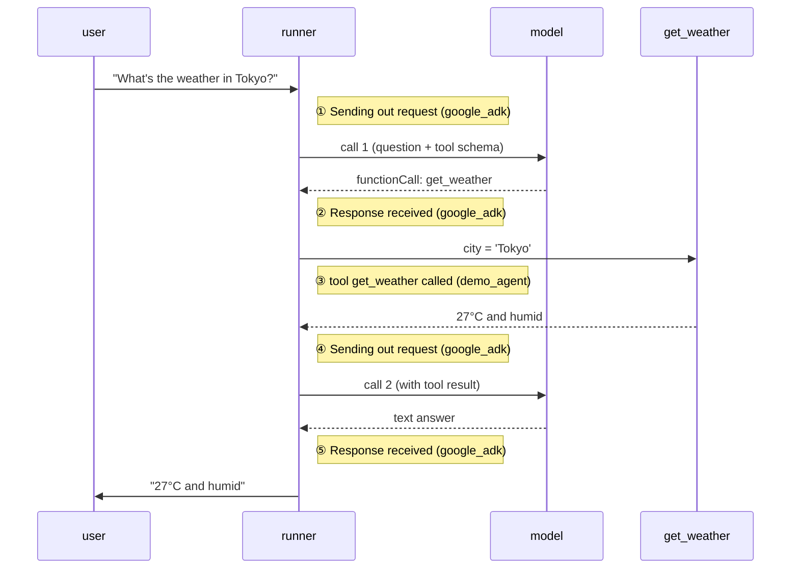

[→ 1.2 · The same dial on `adk web`](1.2-adk-web.md)<br>
[← Part 1 · The log level](index.md)<br>
[↑ Part 1 · The log level](index.md)<br>
[Tutorial index](../../TUTORIAL.md)

---

# 1.1 · The basic test harness

*Part 1 · The log level*

[examples/01_log_levels.py](../../examples/01_log_levels.py) runs the question at
whichever level you name, using only Python's standard `logging`: it sets the
root logger and the `google_adk` group to that level. No server, no HTTP, so you
see only streams 1 and 2.

---

#### 1.1.1 Start at INFO (the default)

**Command:**

```bash
.venv/bin/python examples/01_log_levels.py info
```

**Expected output:**

```console
INFO - google_adk.google.adk.models.google_llm - Sending out request, model: gemini-3.7-flash, backend: GoogleLLMVariant.VERTEX_AI, stream: False
INFO - google_adk.google.adk.models.google_llm - Response received from the model.
INFO - demo_agent.agent - tool get_weather called for city='Tokyo'
INFO - google_adk.google.adk.models.google_llm - Sending out request, model: gemini-3.7-flash, backend: GoogleLLMVariant.VERTEX_AI, stream: False
INFO - google_adk.google.adk.models.google_llm - Response received from the model.

>>> ANSWER: The weather in Tokyo is currently 27°C and humid.
```

> [!IMPORTANT]
> **What it means.** Those five lines are the agent loop, in order:
>
> | Line | Logger | What happened |
> |---|---|---|
> | 1 | `google_adk...google_llm` | Framework sends your question to the model |
> | 2 | `google_adk...google_llm` | Model answers: *call `get_weather`* |
> | 3 | `demo_agent.agent` | **Your tool** runs (stream 1, not `google_adk`) |
> | 4 | `google_adk...google_llm` | Framework sends the tool's result back |
> | 5 | `google_adk...google_llm` | Model answers again, this time with prose |
>
> A tool call costs two model round trips, and your log sits between the
> framework's, distinguishable only by logger name. INFO gives you the **shape**
> of the run (which steps, in what order, how many model calls) without the
> prompt or the answer. That is the right trade for "is it doing roughly the
> right thing."



*The agent loop with the five INFO lines. A tool call costs two model round trips; your log (③) sits between the framework's.*

---

#### 1.1.2 Turn it up to DEBUG

**Command:**

```bash
.venv/bin/python examples/01_log_levels.py debug
```

**Expected output** — the same run now dumps the full model conversation. The
important new block is `LLM Request`:

```console
LLM Request:
System Instruction:
You are a concise weather assistant. When the user asks about weather, call the
get_weather tool and report its result in one sentence...
Contents:
{"parts":[{"text":"What's the weather in Tokyo?"}],"role":"user"}
Functions:
get_weather: {'properties': {'city': {'title': 'City', 'type': 'string'}}, 'required': ['city'], ...}
LLM Response:
Function calls:
name: get_weather, args: {'city': 'Tokyo'}
```

> [!IMPORTANT]
> **What it means.** DEBUG keeps every INFO line and adds the *contents* of each
> model call:
>
> | Block | What it is | Where it came from |
> |---|---|---|
> | `System Instruction` | The agent's standing orders | your `instruction=` in `agent.py` |
> | `Contents` | Full message history sent this call | the user turn, plus prior turns |
> | `Functions` | Tool schema the model can choose from | generated from your Python signature and docstring |
> | `LLM Response` | What came back, here a `functionCall` | the model |
>
> `Functions` is the most useful block. DEBUG is the only place you can read the
> schema ADK generated from your function, and when a model refuses to call your
> tool or calls it with nonsense arguments, this block usually explains why.

INFO answers *what did the agent do*; DEBUG answers *what did the model see*.
DEBUG includes full response bodies, so use it while you are debugging and not
as a level you leave on. ADK omits auth headers from these dumps, so a DEBUG log
will not leak your bearer token.

---

#### 1.1.3 Turn it down to WARNING, then ERROR

**Command:**

```bash
.venv/bin/python examples/01_log_levels.py warning
```

**Expected output:**

```console
>>> ANSWER: The weather in Tokyo is currently 27°C and humid.
```

> [!IMPORTANT]
> **What it means.** Nothing from the framework, just your answer. At WARNING and
> ERROR a healthy run is silent. Ask about a city the tool does not know and you
> would see the one `WARNING` line the tool emits (`no weather data for ...`).
> This is why the guidance is **INFO or WARNING in production**: WARNING stays
> quiet until there is a problem, INFO gives you a lifecycle trail if you can
> afford the volume. Reserve DEBUG for active debugging.

---

[→ 1.2 · The same dial on `adk web`](1.2-adk-web.md)<br>
[← Part 1 · The log level](index.md)<br>
[↑ Part 1 · The log level](index.md)<br>
[Tutorial index](../../TUTORIAL.md)
