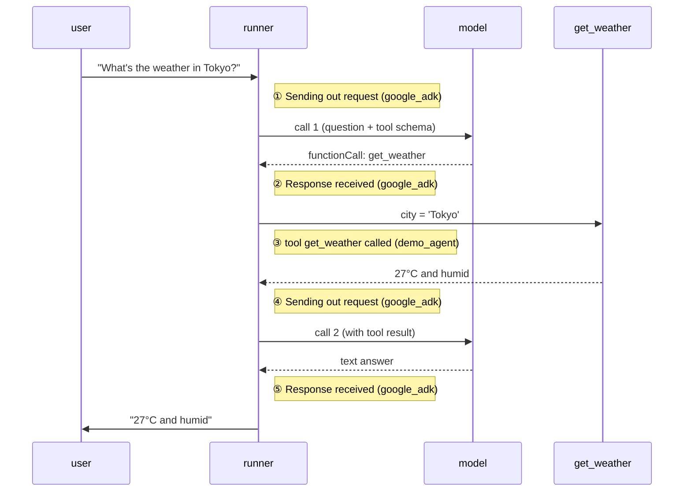

[← Part 1 · The log level](index.md)<br>
[→ 1.2 · The same dial on `adk web`](1.2-adk-web.md)<br>
[↑ Part 1 · The log level](index.md)<br>
[Tutorial index](../../TUTORIAL.md)

---

# 1.1 · The basic test harness

*Part 1 · The log level*

> [!NOTE]
> **Why you are here.** This page runs one question through a plain script at
> three log levels, so you see what each level reveals before any server is
> involved.

[examples/01_log_levels.py](../../examples/01_log_levels.py) runs the question at
whichever level you name, using only Python's standard `logging`: it sets the
root logger and the `google_adk` logger and its children to that level. No
server, no HTTP, so you see only streams 1 and 2.

**Step 1 — Run at INFO (the default).**

**Command:**

```bash
.venv/bin/python examples/01_log_levels.py info
```

**Expected output:**

```console
===== running at INFO =====

.venv/lib/python3.13/site-packages/google/adk/models/llm_request.py:298: UserWarning: [EXPERIMENTAL] feature FeatureName.JSON_SCHEMA_FOR_FUNC_DECL is enabled.
  declaration = tool._get_declaration()
INFO - google_adk.google.adk.models.google_llm - Sending out request, model: gemini-3.7-flash, backend: GoogleLLMVariant.VERTEX_AI, stream: False
INFO - google_adk.google.adk.models.google_llm - Response received from the model.
INFO - demo_agent.agent - tool get_weather called for city='Tokyo'
INFO - google_adk.google.adk.models.google_llm - Sending out request, model: gemini-3.7-flash, backend: GoogleLLMVariant.VERTEX_AI, stream: False
INFO - google_adk.google.adk.models.google_llm - Response received from the model.

>>> ANSWER: The weather in Tokyo is currently 27°C and humid.

INFO - google_adk.google.adk.runners - Closing runner...
INFO - google_adk.google.adk.runners - Runner closed.
```

> [!IMPORTANT]
> **What it means.** The five lines before the answer are the agent loop, in
> order:
>
> | Line | Logger | What happened |
> |---|---|---|
> | 1 | `google_adk...google_llm` | Framework sends your question to the model |
> | 2 | `google_adk...google_llm` | Model answers: *call `get_weather`* |
> | 3 | `demo_agent.agent` | Your tool runs (stream 1, not `google_adk`) |
> | 4 | `google_adk...google_llm` | Framework sends the tool's result back |
> | 5 | `google_adk...google_llm` | Model answers again, this time with prose |
>
> A tool call costs two model round trips, and your log sits between the
> framework's, distinguishable only by logger name. INFO gives you the shape of
> the run (which steps, in what order, how many model calls) without the prompt
> or the answer. The two `runners` lines after the answer are the script closing
> its runner. Step 3 explains the `UserWarning`.


```mermaid
sequenceDiagram
  participant U as user
  participant R as runner
  participant M as model
  participant T as get_weather
  U->>R: "What's the weather in Tokyo?"
  Note right of R: ① Sending out request (google_adk)
  R->>M: call 1 (question + tool schema)
  M-->>R: functionCall: get_weather
  Note right of R: ② Response received (google_adk)
  R->>T: city = 'Tokyo'
  Note right of R: ③ tool get_weather called (demo_agent)
  T-->>R: 27°C and humid
  Note right of R: ④ Sending out request (google_adk)
  R->>M: call 2 (with tool result)
  M-->>R: text answer
  Note right of R: ⑤ Response received (google_adk)
  R->>U: "27°C and humid"
```

*The agent loop with the five INFO lines. A tool call costs two model round trips; your log (③) sits between the framework's.*

**Step 2 — Turn it up to DEBUG.**

**Command:**

```bash
.venv/bin/python examples/01_log_levels.py debug
```

**Expected output** (trimmed to the first `LLM Request` and `LLM Response`):

```console
===== running at DEBUG =====

...
INFO - google_adk.google.adk.models.google_llm - Sending out request, model: gemini-3.7-flash, backend: GoogleLLMVariant.VERTEX_AI, stream: False
DEBUG - google_adk.google.adk.models.google_llm - 
LLM Request:
-----------------------------------------------------------
System Instruction:
You are a concise weather assistant. When the user asks about weather, call the get_weather tool and report its result in one sentence. If the tool returns an error, say you do not have data for that city.

You are an agent. Your internal name is "weather_agent". The description about you is "Answers questions about the weather in a few known cities.".
-----------------------------------------------------------
Config:
{'tools': [{}], 'labels': {'adk_agent_name': 'weather_agent'}}
-----------------------------------------------------------
Contents:
{"parts":[{"text":"What's the weather in Tokyo?"}],"role":"user"}
-----------------------------------------------------------
Functions:
get_weather: {'properties': {'city': {'title': 'City', 'type': 'string'}}, 'required': ['city'], 'title': 'get_weatherParams', 'type': 'object'} -> {'additionalProperties': True, 'type': 'object'}
-----------------------------------------------------------

DEBUG - google.auth._default - Checking Cloud SDK credentials as part of auth process...
DEBUG - urllib3.connectionpool - https://oauth2.googleapis.com:443 "POST /token HTTP/1.1" 200 None
INFO - google_adk.google.adk.models.google_llm - Response received from the model.
DEBUG - google_adk.google.adk.models.google_llm - 
LLM Response:
-----------------------------------------------------------
Text:

-----------------------------------------------------------
Function calls:
name: get_weather, args: {'city': 'Tokyo'}
-----------------------------------------------------------
Raw response:
{"sdk_http_response":{"headers":{"Content-Type":"application/json; charset=UTF-8", ...
-----------------------------------------------------------
```

> [!IMPORTANT]
> **What it means.** DEBUG keeps every INFO line and adds the *contents* of each
> model call:
>
> | Block | What it is | Where it came from |
> |---|---|---|
> | `System Instruction` | The agent's standing orders | your `instruction=` in `agent.py` |
> | `Config` | Generation settings and labels sent with the call | ADK |
> | `Contents` | Full message history sent this call | the user turn, plus prior turns |
> | `Functions` | Tool schema the model can choose from | generated from your Python signature and docstring |
> | `LLM Response` | What came back, here a function call, plus the raw response | the model |
>
> `Functions` is the most useful block. DEBUG is the only place you can read the
> schema ADK generated from your function, and when a model refuses to call your
> tool or calls it with nonsense arguments, this block usually explains why.

INFO answers *what did the agent do*; DEBUG answers *what did the model see*.
DEBUG includes full response bodies, so use it while you are debugging and not
as a level you leave on. ADK leaves request headers out of its own model dumps.
Other libraries' DEBUG output is not covered: the `google.auth` and `urllib3`
lines above come from setting the root logger to DEBUG.

**Step 3 — Turn it down to WARNING.**

**Command:**

```bash
.venv/bin/python examples/01_log_levels.py warning
```

**Expected output:**

```console
===== running at WARNING =====

.venv/lib/python3.13/site-packages/google/adk/models/llm_request.py:298: UserWarning: [EXPERIMENTAL] feature FeatureName.JSON_SCHEMA_FOR_FUNC_DECL is enabled.
  declaration = tool._get_declaration()

>>> ANSWER: The weather in Tokyo is 27°C and humid.
```

> [!IMPORTANT]
> **What it means.** At WARNING the framework logs nothing on a healthy run.
> Python still prints a `UserWarning` about an experimental ADK feature; that is
> a Python warning, not a log record, so no log level hides it. Ask about a city
> the tool does not know and the tool's one `WARNING` line appears
> (`demo_agent/agent.py:57`). This is why the guidance is INFO or WARNING in
> production: WARNING stays quiet until there is a problem, INFO gives you a
> lifecycle trail if you can afford the volume. Reserve DEBUG for active
> debugging.

1.2 runs the same agent under `adk web`.

---

[← Part 1 · The log level](index.md)<br>
[→ 1.2 · The same dial on `adk web`](1.2-adk-web.md)<br>
[↑ Part 1 · The log level](index.md)<br>
[Tutorial index](../../TUTORIAL.md)
