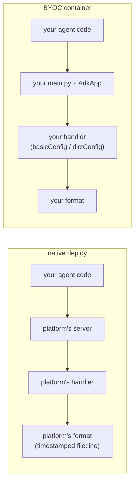

[→ Part 2 · Access logs](../part-2/index.md)<br>
[← 1.5 · The same logging behind a real HTTP server](1.5-http-server.md)<br>
[↑ Part 1 · The log level](index.md)<br>
[Tutorial index](../../TUTORIAL.md)

---

# 1.6 · The same agent on Agent Runtime, two ways

*Part 1 · The log level*

> [!NOTE]
> **Why you are here.** Agent Runtime (Vertex AI Agent Engine) is the other place
> you deploy, and it has two modes: **native**, where you hand over the agent
> object, and **BYOC**, where you hand over your own container. This section
> deploys both and shows who owns the log format in each.

Neither mode has a `--log_level` flag. Both read `LOG_LEVEL` from the
environment, and each deploy script sets it for you. See
[How the level reaches each deploy](#how-the-level-reaches-each-deploy).

**👉 Do this.** Deploy both, side by side in two terminals. Each deploy takes
several minutes and prints its engine id on a final `ENGINE_ID=` line, which the
commands below capture into a variable. Test each engine from the terminal that
deployed it.

**Terminal 1 — native.** Load your shell variables and start the deploy.

**Command:**

```bash
source env.sh
export ENGINE_NATIVE=$(./deploy/deploy_agent_engine.sh | sed -n 's/^ENGINE_ID=//p')
```

**Terminal 2 — BYOC.** Open a second terminal, activate the virtualenv, and start
the BYOC deploy while the first one is still running.

**Command:**

```bash
cd ai/adk/logging
source .venv/bin/activate
source env.sh
export ENGINE_BYOC=$(./agent_runtime_byoc/deploy_byoc.sh | sed -n 's/^ENGINE_ID=//p')
```

The BYOC script also handles two setup traps, an image-pull permission and a
reserved env var name. See [BYOC setup traps](#byoc-setup-traps).

**Test the native deploy (terminal 1).** Once it finishes, query through the SDK
(the query path is not a plain REST URL you can curl), then read the logs by
resource type. The agent and framework lines land on `reasoning_engine_stderr`
and the access lines on `reasoning_engine_stdout`; filtering on `resource.type`
catches both.

```bash
.venv/bin/python - <<PY
import vertexai
c = vertexai.Client(project="$PROJECT_ID", location="$REGION")
agent = c.agent_engines.get(
    name="projects/$PROJECT_ID/locations/$REGION/reasoningEngines/$ENGINE_NATIVE")
for ev in agent.stream_query(user_id="u1", message="What's the weather in Tokyo?"):
    for part in ((ev or {}).get("content") or {}).get("parts", []):
        if part.get("text"):
            print(part["text"])
PY
```

```bash
gcloud logging read \
  'resource.type="aiplatform.googleapis.com/ReasoningEngine"
   resource.labels.reasoning_engine_id="'"$ENGINE_NATIVE"'"' \
  --project="$PROJECT_ID" \
  --limit=30 \
  --format='table(severity,textPayload)' \
  --freshness=15m
```

**Expected output** — the familiar lifecycle, in the platform's format:

```console
SEVERITY  TEXT_PAYLOAD
          2026-09-03 21:51:43,236 - INFO - google_llm.py:255 - Sending out request, model: gemini-3.7-flash, backend: GoogleLLMVariant.VERTEX_AI, stream: False
          2026-09-03 21:51:45,037 - INFO - agent.py:53 - tool get_weather called for city='Tokyo'
          2026-09-03 21:51:46,995 - INFO - google_llm.py:327 - Response received from the model.
          INFO:     169.254.169.126:54632 - "POST /api/stream_reasoning_engine HTTP/1.1" 200 OK
```

> [!IMPORTANT]
> **What it means.** Your `basicConfig` format did not take. On Cloud Run (1.5)
> the tool line read `INFO - demo_agent.agent - tool get_weather...`. Here it is
> the ADK CLI's timestamped `file:line` format from 1.3. The platform installs its
> own logging handler before your module runs, so it decides the format and the
> destination (stderr). The level still applies.

**Test the BYOC deploy (terminal 2).** Once it finishes, run the same query and
the same read against `ENGINE_BYOC`.

```bash
.venv/bin/python - <<PY
import vertexai
c = vertexai.Client(project="$PROJECT_ID", location="$REGION")
agent = c.agent_engines.get(
    name="projects/$PROJECT_ID/locations/$REGION/reasoningEngines/$ENGINE_BYOC")
for ev in agent.stream_query(user_id="u1", message="What's the weather in Tokyo?"):
    for part in ((ev or {}).get("content") or {}).get("parts", []):
        if part.get("text"):
            print(part["text"])
PY
```

```bash
gcloud logging read \
  'resource.type="aiplatform.googleapis.com/ReasoningEngine"
   resource.labels.reasoning_engine_id="'"$ENGINE_BYOC"'"' \
  --project="$PROJECT_ID" \
  --limit=30 \
  --format='table(severity,textPayload)' \
  --freshness=15m
```

**Expected output** — your logs in **your** format:

```console
SEVERITY  TEXT_PAYLOAD
          INFO - google_adk.google.adk.models.google_llm - Sending out request, model: gemini-3.7-flash, backend: GoogleLLMVariant.VERTEX_AI, stream: False
          INFO - demo_agent.agent - tool get_weather called for city='Tokyo'
          INFO - google_adk.google.adk.models.google_llm - Response received from the model.
          INFO:     169.254.169.126:1392 - "POST /api/stream_reasoning_engine HTTP/1.1" 200 OK
```

> [!IMPORTANT]
> **What it means: who installs the handler decides the format.**
>
> | | Native | BYOC |
> |---|---|---|
> | **Level** | yours (via `LOG_LEVEL`) | yours (via `LOG_LEVEL`) |
> | **Format** | platform's (timestamped `file:line`) | yours (`basicConfig` / `dictConfig`) |
> | **Stream / destination** | platform's (stderr) | yours |
> | **Severity in Cloud Logging** | Default (same as Cloud Run) | Default (same as Cloud Run) |
>
> Native is simpler, with no server to write, but the platform takes your format.
> BYOC gives the format back, at the cost of implementing the two-endpoint
> contract. Both keep your level, and both leave severity at Default. That is
> Part 4's problem either way. See
> [What carries over from Part 4](#what-carries-over-from-part-4).



> [!WARNING]
> `adk deploy agent_engine` **creates a new reasoning engine on every deploy** and
> exits 0 even when the deploy failed. The query is the real success check.
> Delete old engines when you are done; both deploy scripts print teardown
> commands.

## Deep dives

### How the level reaches each deploy

**Native.** `adk deploy agent_engine` packages the agent directory and hands it
to the platform. There is no server of yours, so no `uvicorn.run` and no
`configure()` call at a `__main__`. The one hook for the log level is an
environment variable: `demo_agent/agent.py` reads `LOG_LEVEL` at import and
applies it. The deploy command has no env flag, but it carries the agent
directory's `.env` into the deployment, so
[deploy/deploy_agent_engine.sh](../../deploy/deploy_agent_engine.sh) writes
`LOG_LEVEL` into `.env` for the deploy and restores the original afterward. The
restore matters: ADK loads the agent's `.env` at startup, so a leftover
`LOG_LEVEL=warning` would override `--log_level INFO` on a later `adk web` run.

**BYOC.** A custom container on Agent Runtime must listen on **port 8080** and
implement two routes, `POST /api/reasoning_engine` (unary) and
`POST /api/stream_reasoning_engine` (streaming), each taking a
`{"class_method", "input"}` body.
[agent_runtime_byoc/main.py](../../agent_runtime_byoc/main.py) is the smallest
server that satisfies the contract, about ninety lines, with the same naive
Part 1 logging config as 1.5.

### BYOC setup traps

Both are handled by the deploy script.

- **The platform's service agent must be able to pull your image.** Registration
  fails with `FAILED_PRECONDITION` until the Reasoning Engine service agent has
  `roles/artifactregistry.reader`. The script grants it.
- **Some env var names are reserved, which breaks the model region.** Setting
  `GOOGLE_CLOUD_PROJECT` or `GOOGLE_CLOUD_LOCATION` in the deployment env is
  rejected. The platform injects them itself, and it sets `GOOGLE_CLOUD_LOCATION`
  to the deploy region (`us-central1`), while `gemini-3.7-flash` is served from
  `global`. The fix: pass the model's location in your own var (`MODEL_LOCATION`)
  and copy it over `GOOGLE_CLOUD_LOCATION` before the agent imports.

### What carries over from Part 4

The structured plugin you build in Part 4 works in both deploys. Its records go
through whatever handler is installed, and its `extra=` fields survive. Formatting
you impose from your own `dictConfig` works in BYOC and is ignored in native.

---

[→ Part 2 · Access logs](../part-2/index.md)<br>
[← 1.5 · The same logging behind a real HTTP server](1.5-http-server.md)<br>
[↑ Part 1 · The log level](index.md)<br>
[Tutorial index](../../TUTORIAL.md)
