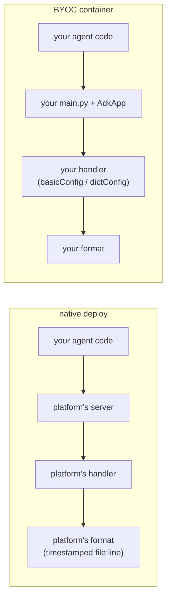

[→ Part 2 · Access logs](../part-2/index.md)<br>
[← 1.5 · The same logging behind a real HTTP server](1.5-http-server.md)<br>
[↑ Part 1 · The log level](index.md)<br>
[Tutorial index](../../TUTORIAL.md)

---

# 1.6 · The same agent on Agent Runtime, two ways

*Part 1 · The log level*

> [!NOTE]
> **Why you are here.** Cloud Run (1.4, 1.5) gave you a container and got out of
> the way: whatever you wrote to stdout/stderr is what you got. Agent Runtime
> (Vertex AI Agent Engine) is the other place you deploy, and it offers two modes:
> you deploy the **agent object** and the platform serves it (*native*), or you
> deploy your **own container** and the platform hosts it (*BYOC*). The key
> question for logging is who owns the format. This section deploys both and
> compares.

**Native deploy.** `adk deploy agent_engine` packages the agent directory and
hands it to the platform. There is no server of yours in the picture, so there is
no `uvicorn.run` and no `configure()` call at a `__main__`. The one hook you have
for the log level is an environment variable: `demo_agent/agent.py` reads
`LOG_LEVEL` at import and applies it (this tutorial added that). `adk deploy
agent_engine` has no env flag, but it carries the agent directory's `.env` into
the deployment, so [deploy/deploy_agent_engine.sh](../../deploy/deploy_agent_engine.sh)
temporarily writes `LOG_LEVEL` into `.env` for the deploy and restores the
original afterward. (Without the restore, a `LOG_LEVEL=warning` left behind by a
deploy would override `--log_level INFO` on a later `adk web` run, because ADK
loads the agent's `.env` at startup.)

**BYOC deploy.** A custom container on Agent Runtime must listen on **port 8080**
and implement two routes: `POST /api/reasoning_engine` (unary) and
`POST /api/stream_reasoning_engine` (streaming), each taking a
`{"class_method", "input"}` body.
[agent_runtime_byoc/main.py](../../agent_runtime_byoc/main.py) is the smallest
server that satisfies the contract, in about ninety lines. Its logging is the
same naive Part 1 config as 1.5.

**👉 Do this.** Deploy both. Each deploy takes several minutes, and the two are
independent (different resources, no shared files), so run them side by side in
two terminals: start the native deploy in this terminal, then open a second
terminal and start the BYOC deploy while the first is still running. Each deploy
script prints its reasoning engine id on a final `ENGINE_ID=` line, so we capture
it straight into a variable instead of reading the resource name off and pasting
it back — and because each engine id lives in the terminal that deployed it, the
testing below is naturally split the same way: native in terminal 1, BYOC in
terminal 2.

**Terminal 1 — native.** Load your shell variables.

**Command:**

```bash
source env.sh
```

Deploy the agent object natively (the platform serves it) and capture its id. The
deploy progress streams to stderr; the `ENGINE_ID=` marker is the one line we pull
off stdout. This runs for several minutes — leave it, and set up terminal 2 while
it works.

**Command:**

```bash
export ENGINE_NATIVE=$(./deploy/deploy_agent_engine.sh | sed -n 's/^ENGINE_ID=//p')
```

**Terminal 2 — BYOC.** Open a new terminal, change into the tutorial directory,
and activate the virtualenv (the BYOC test query below needs it).

**Command:**

```bash
cd ai/adk/logging
source .venv/bin/activate
source env.sh
```

Then deploy your own container (BYOC — the platform hosts it) and capture its id,
while the native deploy in terminal 1 is still running.

**Command:**

```bash
export ENGINE_BYOC=$(./agent_runtime_byoc/deploy_byoc.sh | sed -n 's/^ENGINE_ID=//p')
```

> [!WARNING]
> **Setup traps the BYOC deploy surfaces.** Both are handled by the script but
> worth knowing:
>
> - **The platform's service agent must be able to pull your image.** Registration
>   fails with `FAILED_PRECONDITION` until the Reasoning Engine service agent has
>   `roles/artifactregistry.reader`. The script grants it.
> - **Some env var names are reserved, which breaks the model region.** Setting
>   `GOOGLE_CLOUD_PROJECT` or `GOOGLE_CLOUD_LOCATION` in the deployment env is
>   rejected. The platform injects those itself, but it sets
>   `GOOGLE_CLOUD_LOCATION` to the deploy region (`us-central1`), while
>   `gemini-3.7-flash` is served from `global`. The fix: pass the model's location
>   in your own var (`MODEL_LOCATION`) and copy it over `GOOGLE_CLOUD_LOCATION`
>   before the agent imports.

**Test the native deploy (terminal 1).** Once the native deploy finishes, query
through the SDK (the platform's query path is
not a plain REST URL you can curl), then read the logs by resource type
(the agent and framework lines land on `reasoning_engine_stderr`, the access
lines on `reasoning_engine_stdout`; filtering on `resource.type` catches both):

```bash
.venv/bin/python - <<PY
import vertexai
c = vertexai.Client(project="$PROJECT_ID", location="$REGION")
agent = c.agent_engines.get(
    name="projects/$PROJECT_ID/locations/$REGION/reasoningEngines/$ENGINE_NATIVE")
for ev in agent.stream_query(user_id="u1", message="What's the weather in Tokyo?"):
    for part in ((ev or {}).get("content") or {}).get("parts", []):
        if part.get("text"):
            print(part["text"])
PY
```

```bash
gcloud logging read \
  'resource.type="aiplatform.googleapis.com/ReasoningEngine"
   resource.labels.reasoning_engine_id="'"$ENGINE_NATIVE"'"' \
  --project="$PROJECT_ID" \
  --limit=30 \
  --format='table(severity,textPayload)' \
  --freshness=15m
```

**Expected output** — the familiar lifecycle, but not in your format:

```console
SEVERITY  TEXT_PAYLOAD
          2026-09-03 21:51:43,236 - INFO - google_llm.py:255 - Sending out request, model: gemini-3.7-flash, backend: GoogleLLMVariant.VERTEX_AI, stream: False
          2026-09-03 21:51:45,037 - INFO - agent.py:53 - tool get_weather called for city='Tokyo'
          2026-09-03 21:51:46,995 - INFO - google_llm.py:327 - Response received from the model.
          INFO:     169.254.169.126:54632 - "POST /api/stream_reasoning_engine HTTP/1.1" 200 OK
```

Compare that tool line to 1.5. On Cloud Run it read
`INFO - demo_agent.agent - tool get_weather...`, your `basicConfig` format. Here
it reads `2026-09-03 ... - INFO - agent.py:53 - tool get_weather...`, the ADK
CLI's timestamped `file:line` format, the same one you saw from `adk api_server`
back in 1.3. Your `basicConfig(format=...)` did not take: the platform installs
its own logging handler before your module runs, so it decides the format and the
destination (stderr), and your handler config is ignored.

**Test the BYOC deploy (terminal 2).** Once the BYOC deploy finishes, query with
the same SDK call from terminal 2 (where `ENGINE_BYOC` is set — it is a reasoning
engine too), then read its logs:

```bash
.venv/bin/python - <<PY
import vertexai
c = vertexai.Client(project="$PROJECT_ID", location="$REGION")
agent = c.agent_engines.get(
    name="projects/$PROJECT_ID/locations/$REGION/reasoningEngines/$ENGINE_BYOC")
for ev in agent.stream_query(user_id="u1", message="What's the weather in Tokyo?"):
    for part in ((ev or {}).get("content") or {}).get("parts", []):
        if part.get("text"):
            print(part["text"])
PY
```

```bash
gcloud logging read \
  'resource.type="aiplatform.googleapis.com/ReasoningEngine"
   resource.labels.reasoning_engine_id="'"$ENGINE_BYOC"'"' \
  --project="$PROJECT_ID" \
  --limit=30 \
  --format='table(severity,textPayload)' \
  --freshness=15m
```

**Expected output** — your logs in **your** format, unlike the native deploy:

```console
SEVERITY  TEXT_PAYLOAD
          INFO - google_adk.google.adk.models.google_llm - Sending out request, model: gemini-3.7-flash, backend: GoogleLLMVariant.VERTEX_AI, stream: False
          INFO - demo_agent.agent - tool get_weather called for city='Tokyo'
          INFO - google_adk.google.adk.models.google_llm - Response received from the model.
          INFO:     169.254.169.126:1392 - "POST /api/stream_reasoning_engine HTTP/1.1" 200 OK
```

> [!IMPORTANT]
> **What it means: who installs the handler decides the format.**
>
> | | Native | BYOC |
> |---|---|---|
> | **Level** | yours (via `LOG_LEVEL`) | yours (via `LOG_LEVEL`) |
> | **Format** | platform's (timestamped `file:line`) | yours (`basicConfig` / `dictConfig`) |
> | **Stream / destination** | platform's (stderr) | yours |
> | **Severity in Cloud Logging** | Default (same as Cloud Run) | Default (same as Cloud Run) |
>
> The native deploy is simpler (no server to write), but the platform takes your
> format. The BYOC deploy gives you back control of the format, at the cost of
> implementing the two-endpoint contract and the `MODEL_LOCATION` workaround. In
> both cases you keep the level, and in both cases severity is still
> blank/Default. That is Part 4's problem regardless of which you pick.



This decides what carries over from Part 4. The structured plugin you build
there still works in both deploys: its records go through whatever handler is
installed, and its `extra=` fields survive. Any formatting you try to impose from
your own `dictConfig` works in BYOC and is ignored in native.

> [!WARNING]
> `adk deploy agent_engine` **creates a new reasoning engine on every deploy**; it
> does not update in place. Delete the old ones when you are done (both deploy
> scripts print teardown commands). And `adk deploy` exits 0 even when the deploy
> failed, so the query is the real success check, not the exit code.

---

[→ Part 2 · Access logs](../part-2/index.md)<br>
[← 1.5 · The same logging behind a real HTTP server](1.5-http-server.md)<br>
[↑ Part 1 · The log level](index.md)<br>
[Tutorial index](../../TUTORIAL.md)
