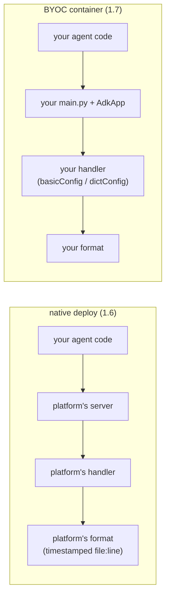

[← 1.6 · The same agent on Agent Runtime](1.6-agent-runtime.md)<br>
[→ Part 2 · Access logs](../part-2/index.md)<br>
[↑ Part 1 · The log level](index.md)<br>
[Tutorial index](../../TUTORIAL.md)

---

# 1.7 · The same agent in your own container on Agent Runtime

*Part 1 · The log level*

> [!NOTE]
> **Why you are here.** 1.6 handed Agent Runtime the agent, and the platform
> took over the log format. This page hands it your own container instead (bring
> your own container, BYOC), and your format comes back.

A custom container on Agent Runtime must listen on port 8080 and implement two
routes, `POST /api/reasoning_engine` (unary) and
`POST /api/stream_reasoning_engine` (streaming), each taking a
`{"class_method", "input"}` body.
[agent_runtime_byoc/main.py](../../agent_runtime_byoc/main.py) is the smallest
server that satisfies the contract, about a hundred lines, with the same naive
Part 1 logging config as 1.5. The deploy script passes `LOG_LEVEL` to it.

**Step 1 — Build and deploy the container.**

The deploy takes several minutes and prints the engine id on a final
`ENGINE_ID=` line. See
[What does the BYOC deploy script do?](#what-does-the-byoc-deploy-script-do) and
[What can go wrong in a BYOC deploy?](#what-can-go-wrong-in-a-byoc-deploy)

**Command:**

```bash
source env.sh
export ENGINE_BYOC=$(./agent_runtime_byoc/deploy_byoc.sh | sed -n 's/^ENGINE_ID=//p')
```

In a fresh shell, re-export the id with 1.6's `list_engine adk-logging-byoc`.

**Step 2 — Ask the question through the `/api` passthrough.**

This tutorial queries BYOC by calling your container's own route through the
platform's `/api` passthrough. See
[Why is BYOC queried differently?](#why-is-byoc-queried-differently)

**Command:**

```bash
: "${ENGINE_BYOC:?set ENGINE_BYOC first}"
ACCESS_TOKEN=$(gcloud auth print-access-token)
curl -s \
  -X POST "https://$REGION-aiplatform.googleapis.com/reasoningEngines/v1/projects/$PROJECT_ID/locations/$REGION/reasoningEngines/$ENGINE_BYOC/api/api/stream_reasoning_engine" \
  -H "Authorization: Bearer $ACCESS_TOKEN" \
  -H 'content-type: application/json' \
  -d '{"class_method":"async_stream_query","input":{"user_id":"u1","message":"What'\''s the weather in Tokyo?"}}'
```

**Step 3 — Read the logs.**

**Command:**

```bash
gcloud logging read \
  'resource.type="aiplatform.googleapis.com/ReasoningEngine"
   resource.labels.reasoning_engine_id="'"$ENGINE_BYOC"'"' \
  --project="$PROJECT_ID" \
  --limit=30 \
  --format='table(severity,textPayload)' \
  --freshness=15m
```

**Expected output** (most recent first, trimmed to the question's text lines):

```console
SEVERITY  TEXT_PAYLOAD
          INFO - google_adk.google.adk.models.google_llm - Response received from the model.
          INFO - google_adk.google.adk.models.google_llm - Sending out request, model: gemini-3.7-flash, backend: GoogleLLMVariant.VERTEX_AI, stream: False
          INFO - demo_agent.agent - tool get_weather called for city='Tokyo'
          INFO - google_adk.google.adk.models.google_llm - Response received from the model.
          INFO - google_adk.google.adk.models.google_llm - Sending out request, model: gemini-3.7-flash, backend: GoogleLLMVariant.VERTEX_AI, stream: False
          INFO:     169.254.169.126:53120 - "POST /api/stream_reasoning_engine HTTP/1.1" 200 OK
```

> [!IMPORTANT]
> **What it means: who installs the handler decides the format.**
>
> | | Native (1.6) | BYOC |
> |---|---|---|
> | **Level** | yours (via `LOG_LEVEL`) | yours (via `LOG_LEVEL`) |
> | **Format** | platform's (timestamped `file:line`) | yours (`basicConfig` / `dictConfig`) |
> | **Stream / destination** | platform's (stderr) | yours (`basicConfig` writes to stderr) |
> | **Severity in Cloud Logging** | Default (same as Cloud Run) | Default (same as Cloud Run) |
>
> Native is simpler, with no server to write, but the platform takes your format.
> BYOC gives the format back, at the cost of implementing the two-endpoint
> contract. Both keep your level, and both leave severity at Default. That is
> Part 4's problem either way. See
> [What carries over from Part 4?](#what-carries-over-from-part-4)



*Who installs the logging handler in each Agent Runtime deploy, and so who owns the format.*

**Step 4 — Tear down.**

**Command:**

```bash
.venv/bin/python - <<PY
import vertexai
vertexai.Client(project="$PROJECT_ID", location="$REGION").agent_engines.delete(
    name="projects/$PROJECT_ID/locations/$REGION/reasoningEngines/$ENGINE_BYOC",
    force=True)
PY
```

Part 2 turns to the one stream no log level reaches: uvicorn's access log.

## Deep dives

### What does the BYOC deploy script do?

There is no `adk deploy` and no gcloud CLI for a custom container, so
[agent_runtime_byoc/deploy_byoc.sh](../../agent_runtime_byoc/deploy_byoc.sh)
builds the image, grants pull access, and registers it through the Python SDK.

It builds and pushes your container with Cloud Build, from the
`agent_runtime_byoc/` directory that holds `main.py` and its `Dockerfile`
(the Artifact Registry repo is created first if missing):

```bash
gcloud builds submit \
  --project="$PROJECT_ID" \
  --region="$LOCATION" \
  --tag "$IMAGE_URI" \
  .
```

It grants the platform's service agents `roles/artifactregistry.reader` at the
project level, because a repo-scoped grant was not enough in testing:

```bash
for SA in "service-${PROJECT_NUMBER}@gcp-sa-aiplatform-re.iam.gserviceaccount.com" \
          "service-${PROJECT_NUMBER}@gcp-sa-aiplatform.iam.gserviceaccount.com"; do
  gcloud projects add-iam-policy-binding "$PROJECT_ID" \
    --member="serviceAccount:$SA" \
    --role="roles/artifactregistry.reader" \
    --condition=None \
    --quiet
done
```

It registers the container by running `deploy_byoc.py`, which passes
`LOG_LEVEL`, `GOOGLE_GENAI_USE_VERTEXAI`, and `MODEL_LOCATION` as deployment env
vars, then prints the engine id that Step 1 captures into `ENGINE_BYOC`.

### What can go wrong in a BYOC deploy?

The deploy script handles the first two.

- **The platform's service agent must be able to pull your image.** Registration
  fails with `FAILED_PRECONDITION` until the Reasoning Engine service agent has
  `roles/artifactregistry.reader`. The script grants it.
- **Some env var names are reserved, which breaks the model region.** Setting
  `GOOGLE_CLOUD_PROJECT` or `GOOGLE_CLOUD_LOCATION` in the deployment env is
  rejected. The platform injects them itself, and it sets `GOOGLE_CLOUD_LOCATION`
  to the deploy region (`us-central1`), while `gemini-3.7-flash` is served from
  `global`. The fix: pass the model's location in your own var (`MODEL_LOCATION`)
  and copy it over `GOOGLE_CLOUD_LOCATION` before the agent imports.
- **On a fresh project the first registration can fail while new IAM grants
  propagate,** with "failed to start and cannot serve traffic". Rerun the
  script.

### Why is BYOC queried differently?

A native deploy runs an agent the SDK knows how to drive. A BYOC deploy
registers your container, and the platform forwards a request to
`.../reasoningEngines/<id>/api/<your-route>` to it unchanged. The `curl` in
Step 2 hits your container's own `stream_reasoning_engine` route. Two things
about the URL:

- **The doubled `/api/api`.** The first `/api` is the platform's passthrough
  prefix; the second is the route `main.py` actually registers.
- **The `{"class_method", "input"}` body** is the contract your container's
  route parses.

### What carries over from Part 4?

The structured plugin you build in Part 4 works in both deploys. Its records go
through whatever handler is installed, and its `extra=` fields survive. Formatting
you impose from your own `dictConfig` works in BYOC and is ignored in native.

---

[← 1.6 · The same agent on Agent Runtime](1.6-agent-runtime.md)<br>
[→ Part 2 · Access logs](../part-2/index.md)<br>
[↑ Part 1 · The log level](index.md)<br>
[Tutorial index](../../TUTORIAL.md)
