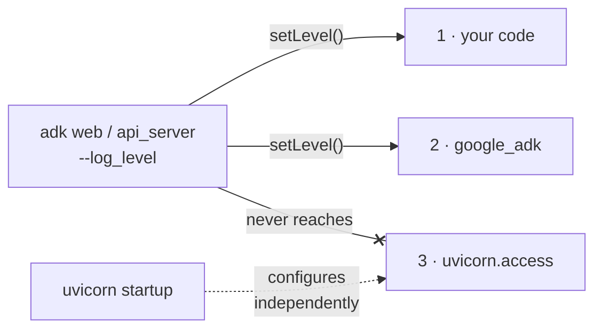

[→ Part 3 · Plugins](../part-3/index.md)<br>
[← 1.6 · The same agent on Agent Runtime, two ways](../part-1/1.6-agent-runtime.md)<br>
[Tutorial index](../../TUTORIAL.md)

---

# Part 2 · Access logs

*Why `--log_level` never silences uvicorn's access log, and how to filter it.*

> [!NOTE]
> **Why you are here.** In 1.3 and 1.5, `WARNING` silenced the framework and
> your tool, and the `INFO:` access lines kept printing. In production that is
> one line per request forever, including every load-balancer health check.



*What `--log_level` reaches. Streams 1 and 2 obey the flag; stream 3 is configured by uvicorn itself.*

**The flag worked. It does not reach this stream.** The access lines come from
`uvicorn.access`, and uvicorn configures that logger itself, with its own level
and handler, when it starts. ADK does not override it. This is how every
uvicorn/FastAPI app behaves, not an ADK quirk.

The fix, when you run your own server, is to hand uvicorn a logging config with a
filter on `uvicorn.access`. The key piece from
[examples/02_tame_uvicorn.py](../../examples/02_tame_uvicorn.py) drops
health-check paths:

```python
class DropHealthChecks(logging.Filter):
    NOISY_PATHS = ("/healthz", "/health", "/readyz", "/livez")

    def filter(self, record):
        # uvicorn.access record.args = (client, method, path, http_version, status)
        if record.args and len(record.args) >= 3:
            path = str(record.args[2])
            if any(path.startswith(p) for p in self.NOISY_PATHS):
                return False   # drop this record
        return True
```

**👉 Do this.** Start the demo server.

**Command:**

```bash
.venv/bin/python examples/02_tame_uvicorn.py
```

In another terminal, hit the health endpoint three times and the root once.

**Command:**

```bash
curl -s localhost:8081/healthz
curl -s localhost:8081/healthz
curl -s localhost:8081/healthz
curl -s localhost:8081/
```

**Expected output** — in the server terminal:

```console
2026-08-31 20:08:06 - ACCESS - 127.0.0.1:51868 "GET / HTTP/1.1" 200 OK
```

> [!IMPORTANT]
> **What it means.** Three health checks produced **zero** log lines; the one
> real request produced one. You did not lower a level, you filtered a specific
> stream. That is the move the rest of this tutorial builds on: stop relying on a
> global level and configure each stream deliberately.

---

[→ Part 3 · Plugins](../part-3/index.md)<br>
[← 1.6 · The same agent on Agent Runtime, two ways](../part-1/1.6-agent-runtime.md)<br>
[Tutorial index](../../TUTORIAL.md)
