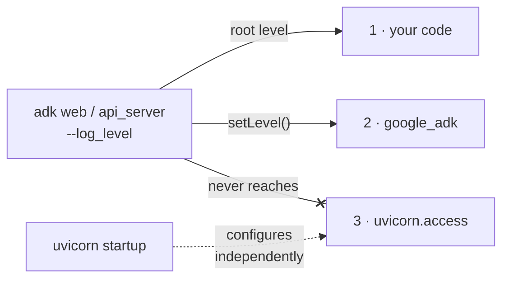

[← 1.7 · The same agent in your own container on Agent Runtime](../part-1/1.7-agent-runtime-byoc.md)<br>
[→ Part 3 · Plugins](../part-3/index.md)<br>
[Tutorial index](../../TUTORIAL.md)

---

# Part 2 · Access logs

*Why `--log_level` never silences uvicorn's access log, and how to filter it.*

> [!NOTE]
> **Why you are here.** In 1.3 and 1.5, `WARNING` silenced the framework and
> your tool, and the `INFO:` access lines kept printing. In production that is
> one line per request forever, including every load-balancer health check.


```mermaid
flowchart LR
  CLI["adk web / api_server<br/>--log_level"]
  CLI -->|"root level"| S1["1 · your code"]
  CLI -->|"setLevel()"| S2["2 · google_adk"]
  CLI --x|"never reaches"| S3["3 · uvicorn.access"]
  UV["uvicorn startup"] -.->|"configures<br/>independently"| S3
```

*What `--log_level` reaches. Streams 1 and 2 obey the flag; stream 3 is configured by uvicorn itself.*

The flag worked, but it does not reach this stream. The access lines come from
`uvicorn.access`, and uvicorn configures that logger itself, with its own level
and handler, when it starts. ADK does not override it. This is how every
uvicorn/FastAPI app behaves, not an ADK quirk.

`adk web` and `adk api_server` start uvicorn for you with its default config, so
they give you no place to add a filter. When you run your own server, hand
uvicorn a logging config with a filter on `uvicorn.access`; Part 4 builds such a
server. The key piece from
[examples/02_tame_uvicorn.py](../../examples/02_tame_uvicorn.py) drops
health-check paths:

```python
class DropHealthChecks(logging.Filter):
    NOISY_PATHS = ("/healthz", "/health", "/readyz", "/livez")

    def filter(self, record):
        # uvicorn.access record.args = (client, method, path, http_version, status)
        if record.args and len(record.args) >= 3:
            path = str(record.args[2])
            if any(path.startswith(p) for p in self.NOISY_PATHS):
                return False   # drop this record
        return True
```

**👉 Do this.** Start the demo server.

**Command:**

```bash
.venv/bin/python examples/02_tame_uvicorn.py
```

In another terminal, hit the health endpoint three times and the root once.

**Command:**

```bash
curl -s localhost:8081/healthz
curl -s localhost:8081/healthz
curl -s localhost:8081/healthz
curl -s localhost:8081/
```

The `curl` calls print each response; the server terminal shows the access log.

**Expected output** (the server terminal):

```console
2026-08-31 20:08:06 - ACCESS - 127.0.0.1:51868 "GET / HTTP/1.1" 200 OK
```

> [!IMPORTANT]
> **What it means.** Three health checks produced zero log lines; the one
> real request produced one. You did not lower a level, you filtered a specific
> stream.

Part 3 turns to stream 2 and the two ADK plugins that narrate each step.

---

[← 1.7 · The same agent in your own container on Agent Runtime](../part-1/1.7-agent-runtime-byoc.md)<br>
[→ Part 3 · Plugins](../part-3/index.md)<br>
[Tutorial index](../../TUTORIAL.md)
