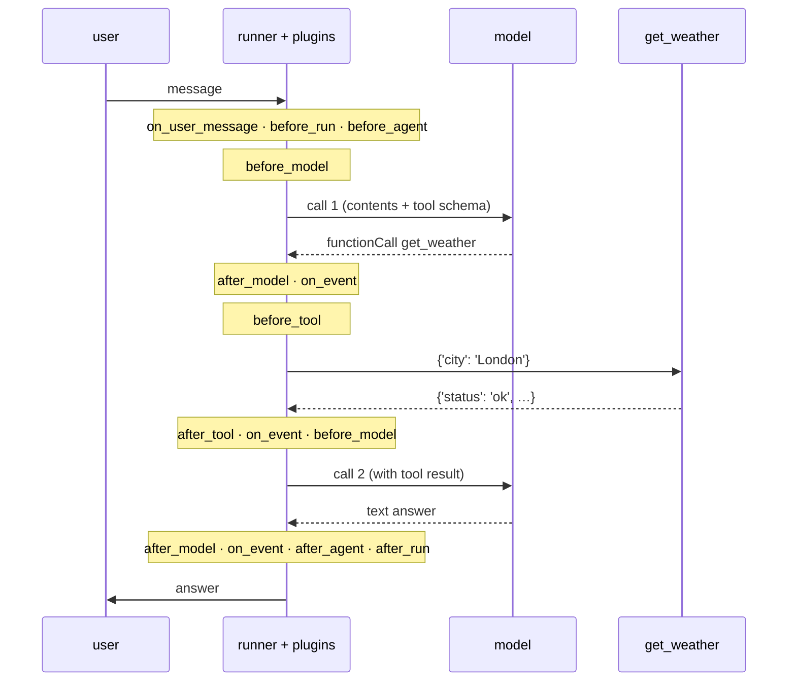

[→ 3.2 · LoggingPlugin on Cloud Run](3.2-loggingplugin-cloud-run.md)<br>
[← Part 3 · Plugins](index.md)<br>
[↑ Part 3 · Plugins](index.md)<br>
[Tutorial index](../../TUTORIAL.md)

---

# 3.1 · LoggingPlugin: one line to wire up

*Part 3 · Plugins*

A plugin attaches to the `App`. That is the whole setup, from
[examples/03_logging_plugin.py](../../examples/03_logging_plugin.py):

```python
from google.adk.apps.app import App
from google.adk.plugins import LoggingPlugin

app = App(name="demo", root_agent=root_agent, plugins=[LoggingPlugin()])
```

The plugin's docstring says it "helps terminal based debugging" and "is not a
replacement of existing logging in ADK." Read this section for how a plugin
works as much as for what this one prints. The Cloud Run sections (3.2, 3.4)
are optional; skip to Part 4 if you only want the production path.

Everything the plugin writes goes through `print()`, so neither `--log_level`
nor a `dictConfig` can reach it. See
[How plugin hooks fire](#how-plugin-hooks-fire) and
[What LoggingPlugin fixes in source](#what-loggingplugin-fixes-in-source).

**👉 Do this.** The example asks *"What's the weather in London?"*

**Command:**

```bash
.venv/bin/python examples/03_logging_plugin.py
```

**Expected output** — the whole invocation narrated, one hook at a time (lightly
trimmed, repeated field lines removed):

<details>
<summary><b>Output</b> — full agentic-loop narration (29 lines)</summary>

```console
[logging_plugin] 🚀 USER MESSAGE RECEIVED
[logging_plugin]    User Content: text: 'What's the weather in London?'
[logging_plugin] 🏃 INVOCATION STARTING
[logging_plugin] 🤖 AGENT STARTING
[logging_plugin]    Agent Name: weather_agent
[logging_plugin] 🧠 LLM REQUEST
[logging_plugin]    Model: gemini-3.7-flash
[logging_plugin]    System Instruction: 'You are a concise weather assistant. ...'
[logging_plugin]    Available Tools: ['get_weather']
[logging_plugin] 🧠 LLM RESPONSE
[logging_plugin]    Content: function_call: get_weather
[logging_plugin]    Token Usage - Input: 167, Output: 16
[logging_plugin] 📢 EVENT YIELDED
[logging_plugin]    Function Calls: ['get_weather']
[logging_plugin] 🔧 TOOL STARTING
[logging_plugin]    Tool Name: get_weather
[logging_plugin]    Arguments: {'city': 'London'}
[logging_plugin] 🔧 TOOL COMPLETED
[logging_plugin]    Result: {'status': 'ok', 'report': 'The weather in London is 15C and drizzling.'}
[logging_plugin] 📢 EVENT YIELDED
[logging_plugin]    Function Responses: ['get_weather']
[logging_plugin] 🧠 LLM REQUEST
[logging_plugin] 🧠 LLM RESPONSE
[logging_plugin]    Content: text: 'The weather in London is currently 15°C and drizzling.'
[logging_plugin]    Token Usage - Input: 228, Output: 15
[logging_plugin] 📢 EVENT YIELDED
[logging_plugin]    Final Response: True
[logging_plugin] 🤖 AGENT COMPLETED
[logging_plugin] ✅ INVOCATION COMPLETED
```

</details>

> [!IMPORTANT]
> **What it means.** The full agentic loop, in order: the model saw the tools and
> chose `get_weather`, the tool ran with `{'city': 'London'}` and returned its
> report, the model was called again with that result and produced the final
> text. Two model calls, one tool call, and their token costs (167 + 16 to
> decide the call, 228 + 15 to write the answer), without parsing DEBUG. This is
> the view you want when a tool is called with the wrong arguments, or not
> called at all.

**What you will not see.** `LLM REQUEST` prints the model, the first 200
characters of the system instruction, and the tool names, but not the
conversation contents. The source removed that on purpose:

```python
# Note: Content logging removed due to type compatibility issues
# Users can still see content in the LLM response
```

The exact prompt is still a DEBUG or `DebugLoggingPlugin` job (3.3).

> [!WARNING]
> **The catch that decides where you use it.** `LoggingPlugin` writes with
> `print()` and ANSI color codes, not through `logging`. That is right in a
> terminal and wrong for a deployed service: it ignores your handlers, levels,
> and formatters, and the color bytes corrupt a JSON log line. Use it locally.
> For the same information in production, use the structured plugin in Part 4.
> 3.2 shows what the catch looks like on Cloud Run.

## Deep dives

### How plugin hooks fire

A plugin is a set of lifecycle hooks. `BasePlugin` declares fourteen async
callbacks (`on_user_message_callback`, `before_run_callback`,
`before/after_agent_callback`, `before/after_model_callback`,
`before/after_tool_callback`, `on_event_callback`, `after_run_callback`, three
error hooks, and `close`), and every one returns `None` by default. A subclass
overrides only the hooks it cares about. `App(plugins=[...])` hands the list to a
`PluginManager`, and at each point in a run the runner calls the matching hook on
every plugin, in registration order, before any per-agent callback. The manager
has an early-exit rule:

> if any plugin callback returns a non-`None` value, the execution of subsequent
> plugins for that specific event is halted, and the returned value is
> propagated up the call stack.

`LoggingPlugin` returns `None` from every hook, so it never short-circuits
anything. It observes, prints, and gets out of the way.



*Where the lifecycle hooks fire. The 29-line narration above walks this sequence top to bottom.*

### What LoggingPlugin fixes in source

`LoggingPlugin()` takes only an optional `name`:

```python
def __init__(self, name: str = "logging_plugin"):
    super().__init__(name)
```

Everything else is fixed:

| Setting | Value | Where |
|---|---|---|
| Line prefix | `[logging_plugin]`, the `name` | `_log` |
| Sink | `print()` to stdout, wrapped in grey ANSI codes | `_log` |
| Level, handler, formatter | none; the `logging` module is never touched | whole file |
| Text and system-instruction length | truncated at 200 characters | `_format_content` |
| Tool arguments and results length | truncated at 300 characters | `_format_args` |

The sink is four lines:

```python
def _log(self, message: str) -> None:
    # ANSI color codes: \033[90m for grey, \033[0m to reset
    formatted_message: str = f"\033[90m[{self.name}] {message}\033[0m"
    print(formatted_message)
```

Each hook formats a few fields and calls `_log`. The `TOOL STARTING` block comes
from `before_tool_callback`:

```python
async def before_tool_callback(self, *, tool, tool_args, tool_context):
    self._log(f"🔧 TOOL STARTING")
    self._log(f"   Tool Name: {tool.name}")
    self._log(f"   Agent: {tool_context.agent_name}")
    self._log(f"   Function Call ID: {tool_context.function_call_id}")
    self._log(f"   Arguments: {self._format_args(tool_args)}")
    return None
```

---

[→ 3.2 · LoggingPlugin on Cloud Run](3.2-loggingplugin-cloud-run.md)<br>
[← Part 3 · Plugins](index.md)<br>
[↑ Part 3 · Plugins](index.md)<br>
[Tutorial index](../../TUTORIAL.md)
