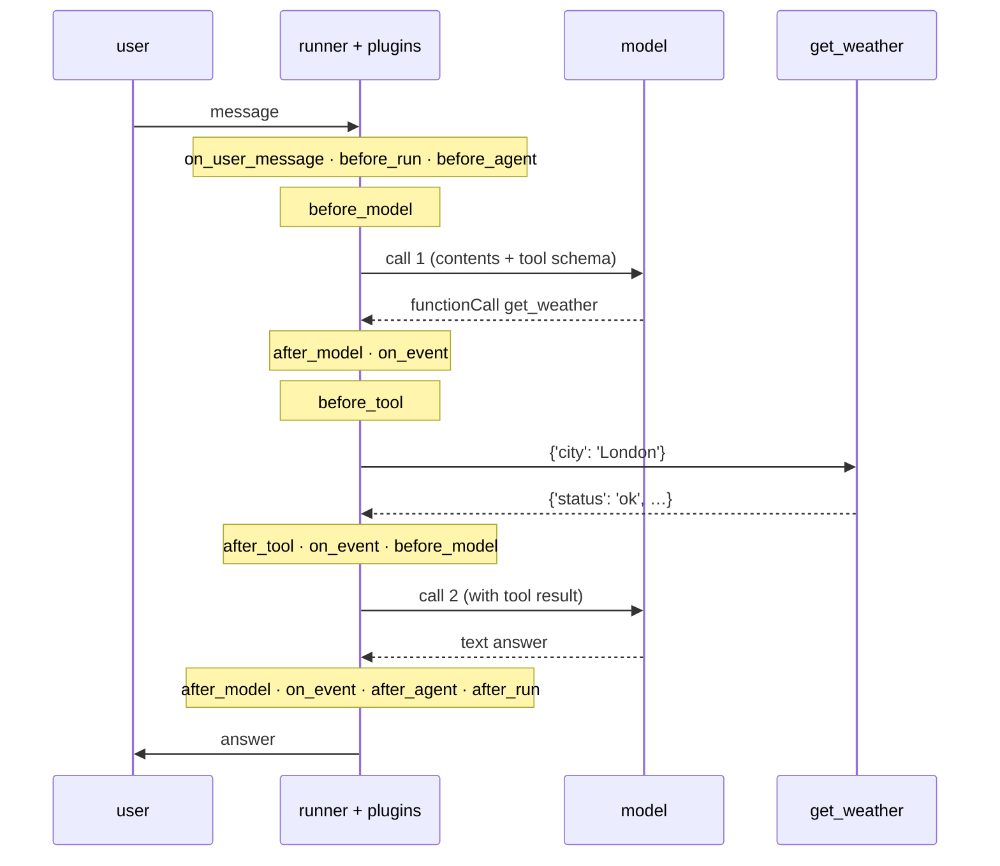

[← Part 3 · Plugins](index.md)<br>
[→ 3.2 · LoggingPlugin on Cloud Run](3.2-loggingplugin-cloud-run.md)<br>
[↑ Part 3 · Plugins](index.md)<br>
[Tutorial index](../../TUTORIAL.md)

---

# 3.1 · LoggingPlugin: one line to wire up

*Part 3 · Plugins*

> [!NOTE]
> **Why you are here.** INFO says little about tool calls. `LoggingPlugin`
> prints every step of one question to your terminal.

A plugin attaches to the `App`. That is the whole setup, from
[examples/03_logging_plugin.py](../../examples/03_logging_plugin.py):

```python
from google.adk.apps.app import App
from google.adk.plugins import LoggingPlugin

app = App(name="demo", root_agent=root_agent, plugins=[LoggingPlugin()])
```

The plugin's docstring says it "helps terminal based debugging" and "is not a
replacement of existing logging in ADK." The Cloud Run sections (3.2, 3.4)
are optional; skip to Part 4 if you only want the production path.

Everything the plugin writes goes through `print()`, so neither `--log_level`
nor your own logging config can reach it: these are plain stdout lines, outside
the four log streams. See [How do plugin hooks fire?](#how-do-plugin-hooks-fire)
and [What does LoggingPlugin fix in source?](#what-does-loggingplugin-fix-in-source)

**👉 Do this.** The example asks *"What's the weather in London?"*

**Command:**

```bash
.venv/bin/python examples/03_logging_plugin.py
```

**Expected output** (64 plugin lines for one question, one hook at a time):

<details>
<summary><b>Output</b>: the full agentic-loop narration</summary>

```console
[logging_plugin] 🚀 USER MESSAGE RECEIVED
[logging_plugin]    Invocation ID: e-e5049cfe-b4e1-43e5-a44d-80acb31bebff
[logging_plugin]    Session ID: c9f12d67-d754-442a-a721-e66ce74f2a55
[logging_plugin]    User ID: u1
[logging_plugin]    App Name: logging_plugin_demo
[logging_plugin]    Root Agent: weather_agent
[logging_plugin]    User Content: text: 'What's the weather in London?'
[logging_plugin] 🏃 INVOCATION STARTING
[logging_plugin]    Invocation ID: e-e5049cfe-b4e1-43e5-a44d-80acb31bebff
[logging_plugin]    Starting Agent: weather_agent
[logging_plugin] 🤖 AGENT STARTING
[logging_plugin]    Agent Name: weather_agent
[logging_plugin]    Invocation ID: e-e5049cfe-b4e1-43e5-a44d-80acb31bebff
[logging_plugin] 🧠 LLM REQUEST
[logging_plugin]    Model: gemini-3.7-flash
[logging_plugin]    Agent: weather_agent
[logging_plugin]    System Instruction: 'You are a concise weather assistant. When the user asks about weather, call the get_weather tool and report its result in one sentence. If the tool returns an error, say you do not have data for that ...'
[logging_plugin]    Available Tools: ['get_weather']
[logging_plugin] 🧠 LLM RESPONSE
[logging_plugin]    Agent: weather_agent
[logging_plugin]    Content: function_call: get_weather
[logging_plugin]    Token Usage - Input: 167, Output: 16
[logging_plugin] 📢 EVENT YIELDED
[logging_plugin]    Event ID: 46c5faf3-15ac-4fed-be75-434e72980811
[logging_plugin]    Author: weather_agent
[logging_plugin]    Content: function_call: get_weather
[logging_plugin]    Final Response: False
[logging_plugin]    Function Calls: ['get_weather']
[logging_plugin] 🔧 TOOL STARTING
[logging_plugin]    Tool Name: get_weather
[logging_plugin]    Agent: weather_agent
[logging_plugin]    Function Call ID: call_192052
[logging_plugin]    Arguments: {'city': 'London'}
[logging_plugin] 🔧 TOOL COMPLETED
[logging_plugin]    Tool Name: get_weather
[logging_plugin]    Agent: weather_agent
[logging_plugin]    Function Call ID: call_192052
[logging_plugin]    Result: {'status': 'ok', 'report': 'The weather in London is 15C and drizzling.'}
[logging_plugin] 📢 EVENT YIELDED
[logging_plugin]    Event ID: 1dff201a-e8a5-47bd-982d-aefe650bc97b
[logging_plugin]    Author: weather_agent
[logging_plugin]    Content: function_response: get_weather
[logging_plugin]    Final Response: False
[logging_plugin]    Function Responses: ['get_weather']
[logging_plugin] 🧠 LLM REQUEST
[logging_plugin]    Model: gemini-3.7-flash
[logging_plugin]    Agent: weather_agent
[logging_plugin]    System Instruction: 'You are a concise weather assistant. When the user asks about weather, call the get_weather tool and report its result in one sentence. If the tool returns an error, say you do not have data for that ...'
[logging_plugin]    Available Tools: ['get_weather']
[logging_plugin] 🧠 LLM RESPONSE
[logging_plugin]    Agent: weather_agent
[logging_plugin]    Content: text: 'The weather in London is currently 15°C and drizzling.'
[logging_plugin]    Token Usage - Input: 225, Output: 15
[logging_plugin] 📢 EVENT YIELDED
[logging_plugin]    Event ID: e9eaea4a-df5c-4f32-9455-0950a9e81856
[logging_plugin]    Author: weather_agent
[logging_plugin]    Content: text: 'The weather in London is currently 15°C and drizzling.'
[logging_plugin]    Final Response: True
[logging_plugin] 🤖 AGENT COMPLETED
[logging_plugin]    Agent Name: weather_agent
[logging_plugin]    Invocation ID: e-e5049cfe-b4e1-43e5-a44d-80acb31bebff
[logging_plugin] ✅ INVOCATION COMPLETED
[logging_plugin]    Invocation ID: e-e5049cfe-b4e1-43e5-a44d-80acb31bebff
[logging_plugin]    Final Agent: weather_agent

>>> FINAL ANSWER: The weather in London is currently 15°C and drizzling.
```

</details>

> [!IMPORTANT]
> **What it means.** The full agentic loop, in order: the model saw the tools and
> chose `get_weather`, the tool ran with `{'city': 'London'}` and returned its
> report, the model was called again with that result and produced the final
> text. Two model calls, one tool call, and their token costs (167 + 16 to
> decide the call, 225 + 15 to write the answer), without parsing DEBUG. This is
> the view you want when a tool is called with the wrong arguments, or not
> called at all.

**What you will not see.** `LLM REQUEST` prints the model, the first 200
characters of the system instruction, and the tool names, but not the
conversation contents; a source comment says content logging was removed on
purpose. The exact prompt is still a DEBUG or `DebugLoggingPlugin` job (3.3).

The plain `print()` is right in a terminal and wrong for a deployed service. For
the same information in production, use the structured plugin in Part 4.

> [!WARNING]
> **Use it locally only.** It writes with `print()` and terminal color codes, so
> it ignores your log levels and garbles Cloud Logging.

3.2 shows what that looks like on Cloud Run.

## Deep dives

### How do plugin hooks fire?

A plugin is a set of lifecycle hooks. `BasePlugin` declares fifteen async
callbacks (`on_user_message_callback`, `before_run_callback`,
`before/after_agent_callback`, `before/after_model_callback`,
`before/after_tool_callback`, `on_event_callback`, `after_run_callback`, four
error hooks for the model, tool, agent, and run, and `close`), and every one returns `None` by default. A subclass
overrides only the hooks it cares about. `App(plugins=[...])` hands the list to a
`PluginManager`, and at each point in a run the runner calls the matching hook on
every plugin, in registration order, before any per-agent callback. The manager
has an early-exit rule:

> if any plugin callback returns a non-`None` value, the execution of subsequent
> plugins for that specific event is halted, and the returned value is
> propagated up the call stack.

`LoggingPlugin` returns `None` from every hook, so it never short-circuits
anything. It observes, prints, and gets out of the way.


```mermaid
sequenceDiagram
  participant U as user
  participant R as runner + plugins
  participant M as model
  participant T as get_weather
  U->>R: message
  Note over R: on_user_message · before_run · before_agent
  Note over R: before_model
  R->>M: call 1 (contents + tool schema)
  M-->>R: functionCall get_weather
  Note over R: after_model · on_event
  Note over R: before_tool
  R->>T: {'city': 'London'}
  T-->>R: {'status': 'ok', …}
  Note over R: after_tool · on_event · before_model
  R->>M: call 2 (with tool result)
  M-->>R: text answer
  Note over R: after_model · on_event · after_agent · after_run
  R->>U: answer
```

*Where the lifecycle hooks fire. The narration above walks this sequence top to bottom.*

### What does LoggingPlugin fix in source?

`LoggingPlugin()` takes only an optional `name` (default `logging_plugin`).
Everything else is fixed:

| Setting | Value | Where |
|---|---|---|
| Line prefix | `[logging_plugin]`, the `name` | `_log` |
| Sink | `print()` to stdout, wrapped in grey ANSI codes | `_log` |
| Level, handler, formatter | none; the `logging` module is never touched | whole file |
| Message text length | truncated at 200 characters | `_format_content` |
| System-instruction length | truncated at 200 characters | `before_model_callback` |
| Tool arguments and results length | truncated at 300 characters | `_format_args` |

The sink is four lines:

```python
def _log(self, message: str) -> None:
    # ANSI color codes: \033[90m for grey, \033[0m to reset
    formatted_message: str = f"\033[90m[{self.name}] {message}\033[0m"
    print(formatted_message)
```

Each hook formats a few fields and calls `_log`.

---

[← Part 3 · Plugins](index.md)<br>
[→ 3.2 · LoggingPlugin on Cloud Run](3.2-loggingplugin-cloud-run.md)<br>
[↑ Part 3 · Plugins](index.md)<br>
[Tutorial index](../../TUTORIAL.md)
