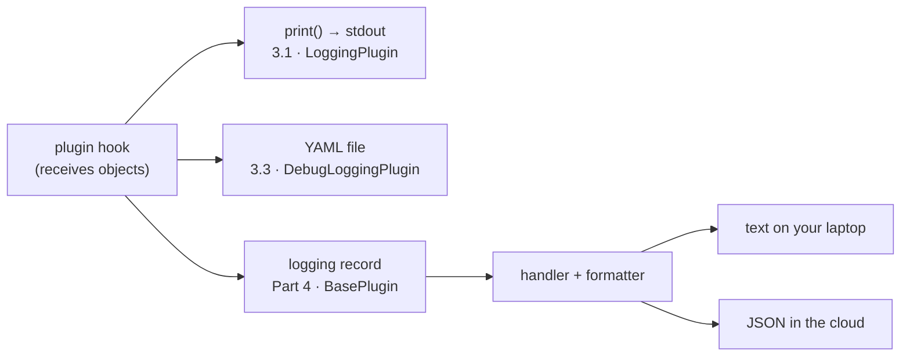

[← 3.4 · DebugLoggingPlugin on Cloud Run](3.4-debugloggingplugin-cloud-run.md) 
[→ Part 4 · Structured logging](../part-4/index.md) 
[↑ Part 3 · Plugins](index.md) 
[Tutorial index](../../TUTORIAL.md)

---

# 3.5 · Plugin or level dial?

*Part 3 · Plugins*

> [!NOTE]
> **Why you are here.** When should you reach for a plugin instead of turning
> the `google_adk` level up? When you want structured facts about the agent's
> steps rather than the framework's own log prose.

Built-in ADK logging is text lines under `google_adk`. A plugin hooks the same
lifecycle but receives objects, at named points, before those lines are
formatted. That buys four things:

| Benefit | What it means in practice |
|---|---|
| Objects, not strings | `after_model_callback` receives an `LlmResponse` with `usage_metadata`; you read token counts as numbers |
| Independent of the level | 3.2 proved it: WARNING silenced the framework and the narration kept going |
| One registration, app-wide | a plugin fires for every agent and tool in the `App`; a per-agent callback has to be wired onto each agent |
| You own the sink | the same hook data feeds `print()` (3.1), a YAML file (3.3), JSON `logging` records (Part 4), or BigQuery |

*Same hooks, three sinks. The Part 4 path is the one that works everywhere you deploy.*

The level dial still does one thing better: DEBUG shows the framework's own
internals (the wire-level request, HTTP retries, session-service work), none of
which have plugin hooks. The two are complementary.

Three cases where a plugin is the right call:

1. **A tool is getting the wrong arguments in development.** Run the framework at
   WARNING, attach `LoggingPlugin`, and watch the `Arguments:` lines.
2. **You need a reproducible bug report.** Attach `DebugLoggingPlugin`, reproduce
   the turn, and attach the YAML. Or capture one document before a prompt change
   and one after, and diff them. From a Cloud Run Job, use the mounted bucket
   from 3.4.
3. **You are watching token cost while tuning a prompt.** Read `Token Usage` per
   model call from `LoggingPlugin`, or `usage_metadata` from the YAML. When you
   want those numbers queryable in production, Part 4 turns the same hook into
   structured log fields.

---

[← 3.4 · DebugLoggingPlugin on Cloud Run](3.4-debugloggingplugin-cloud-run.md) 
[→ Part 4 · Structured logging](../part-4/index.md) 
[↑ Part 3 · Plugins](index.md) 
[Tutorial index](../../TUTORIAL.md)
