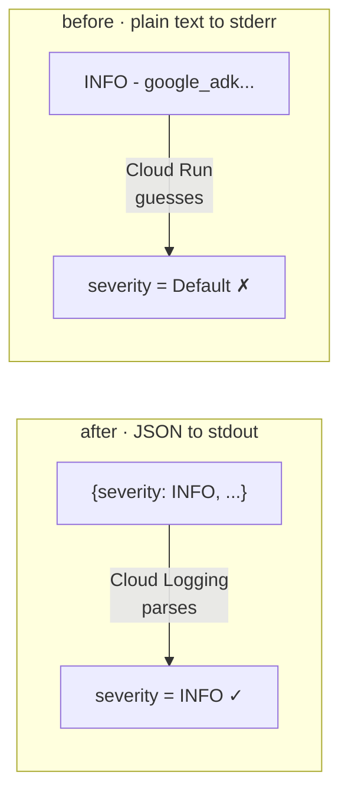
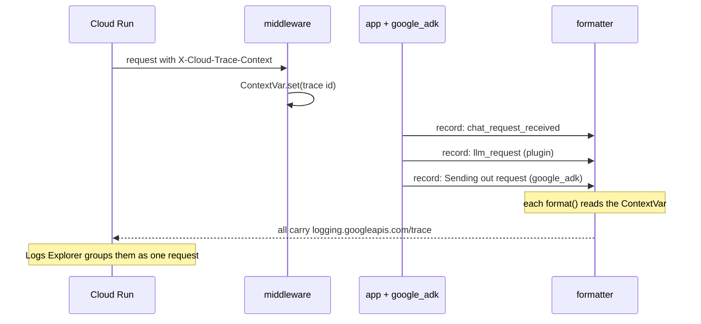

[← 4.1 · The structured plugin](4.1-structured-plugin.md)<br>
[→ 4.3 · The same server on Cloud Run](4.3-server-cloud-run.md)<br>
[↑ Part 4 · Structured logging](index.md)<br>
[Tutorial index](../../TUTORIAL.md)

---

# 4.2 · A custom server that owns all four streams

*Part 4 · Structured logging*

> [!NOTE]
> **Why you are here.** You have a hand-written FastAPI service, not `adk web`
> or `adk api_server`, and you want to configure all four streams in one place.
> `get_fast_api_app` has no `log_level` parameter either, so owning the logging
> config is the norm for any custom server.

[examples/06_custom_server.py](../../examples/06_custom_server.py) is a complete,
minimal server. One `dictConfig` at startup sets up every stream, and its
formatter writes two fields Cloud Logging understands: `severity` from the
record's level, and the request's trace id in `logging.googleapis.com/trace`.
See [The server shape](#the-server-shape) and
[The two fields the formatter writes](#the-two-fields-the-formatter-writes).

**👉 Do this.** Start the server, then send a turn with the trace header Cloud
Run would set.

**Command:**

```bash
source env.sh
.venv/bin/python examples/06_custom_server.py
```

In another terminal:

**Command:**

```bash
curl -s -X POST localhost:8080/chat \
  -H 'content-type: application/json' \
  -H 'X-Cloud-Trace-Context: 105445aa7843bc8bf206b12000100000/1;o=1' \
  -d '{"message":"weather in Tokyo?"}'
```

**Expected output** — your app log, your plugin telemetry, **and** ADK's own
framework log all carry the same trace value (trimmed):

```console
{"severity": "INFO", "message": "chat_request_received", "logging.googleapis.com/trace": "projects/jwd-gcp-demos/traces/105445aa...", "user_id": "web-user"}
{"severity": "INFO", "message": "llm_request", "logging.googleapis.com/trace": "projects/jwd-gcp-demos/traces/105445aa...", "event": "llm_request", "agent": "weather_agent"}
{"severity": "INFO", "message": "Sending out request, model: gemini-3.7-flash, ...", "logging.googleapis.com/trace": "projects/jwd-gcp-demos/traces/105445aa..."}
{"severity": "INFO", "message": "tool_start", "logging.googleapis.com/trace": "projects/jwd-gcp-demos/traces/105445aa...", "event": "tool_start", "tool": "get_weather", "tool_args": {"city": "Tokyo"}}
{"severity": "INFO", "message": "tool get_weather called for city='Tokyo'", "logging.googleapis.com/trace": "projects/jwd-gcp-demos/traces/105445aa..."}
{"severity": "INFO", "message": "tool_end", "logging.googleapis.com/trace": "projects/jwd-gcp-demos/traces/105445aa...", "event": "tool_end", "tool": "get_weather", "latency_ms": 0.3, "status": "ok"}
```

> [!IMPORTANT]
> **What it means.** All four streams under one config, and the 4.1 events
> flowing out of a real HTTP server. The `tool get_weather called` and `Sending
> out request` lines are logs you did **not** write, and they still carry the
> trace, because a `ContextVar` threads it through everything that runs during
> the request. See
> [How the trace reaches framework logs](#how-the-trace-reaches-framework-logs).
> 4.3 ships this server unchanged.

## Deep dives

### The server shape

Built on ADK 2.x idioms. Build an `App` with your plugins, hand it to a
`Runner`, and close it on shutdown:

```python
adk_app = App(name="custom_server", root_agent=root_agent,
              plugins=[StructuredTelemetryPlugin()])   # the 4.1 plugin

@asynccontextmanager
async def lifespan(app):
    app.state.runner = Runner(app=adk_app, session_service=InMemorySessionService())
    yield
    await app.state.runner.close()      # releases plugin/toolset resources
```

Passing `app=` to the `Runner` is the recommended form; `plugins=` on the
`Runner` still works but is deprecated.

The `dictConfig` at startup covers your telemetry logger, the `google_adk`
level, the root handler, and the `uvicorn.access` filter from Part 2. It is
also where a truncating filter keeps one runaway DEBUG line from blowing out
your log:

```python
class TruncateFilter(logging.Filter):
    def __init__(self, max_length=200):
        super().__init__(); self.max_length = max_length
    def filter(self, record):
        msg = record.getMessage()
        if len(msg) > self.max_length:
            record.msg = msg[: self.max_length] + " ...[truncated]"
            record.args = ()
        return True
```

### The two fields the formatter writes

Cloud Run ingests stdout into Cloud Logging, so the only job is to make each
line a good JSON object with two special fields:

- **`severity` lives in the JSON, not in the stream.** 1.4 and 1.5 showed Cloud
  Run filing plain `INFO -` lines as Default. `CloudRunJsonFormatter` writes the
  record's level as a field instead.
- **`logging.googleapis.com/trace` groups a request.** Cloud Run sets an
  `X-Cloud-Trace-Context` header on each request. Put it into that field as
  `projects/PROJECT_ID/traces/TRACE_ID` and Logs Explorer groups every line of
  one request, across all four streams.



*Plain text vs. JSON: the severity you get depends on whether you set it yourself or let Cloud Run guess.*

### How the trace reaches framework logs

A `contextvars.ContextVar` carries the trace. The server parses it once at the
start of each request, and the formatter reads it for **every** record emitted
while that request is handled, including the `google_adk` records you never
touch:

```python
current_trace: ContextVar[str | None] = ContextVar("current_trace", default=None)

class CloudRunJsonFormatter(logging.Formatter):
    def format(self, record):
        entry = {"severity": record.levelname, "message": record.getMessage()}
        trace_id = current_trace.get()
        if trace_id and PROJECT_ID:
            entry["logging.googleapis.com/trace"] = f"projects/{PROJECT_ID}/traces/{trace_id}"
        # ... plus any extra= fields from your plugin ...
        return json.dumps(entry, default=str)
```



*How the `ContextVar` threads the trace through every record, including framework logs you never touch.*

---

[← 4.1 · The structured plugin](4.1-structured-plugin.md)<br>
[→ 4.3 · The same server on Cloud Run](4.3-server-cloud-run.md)<br>
[↑ Part 4 · Structured logging](index.md)<br>
[Tutorial index](../../TUTORIAL.md)
