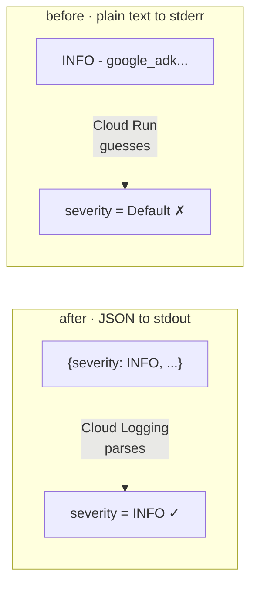
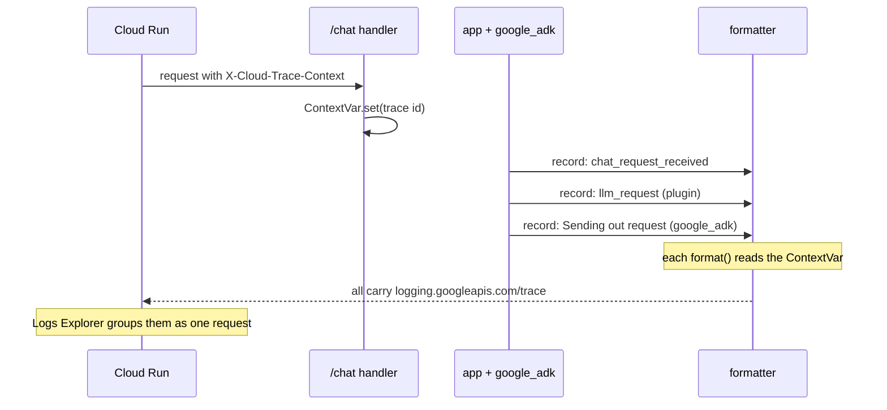

[← 4.1 · The structured plugin](4.1-structured-plugin.md)<br>
[→ 4.3 · The same server on Cloud Run](4.3-server-cloud-run.md)<br>
[↑ Part 4 · Structured logging](index.md)<br>
[Tutorial index](../../TUTORIAL.md)

---

# 4.2 · A custom server that owns streams 1–3

*Part 4 · Structured logging*

> [!NOTE]
> **Why you are here.** You have a hand-written FastAPI service, not `adk web`
> or `adk api_server`, and you want to configure your code, the framework, and
> uvicorn in one place. `get_fast_api_app` has no `log_level` parameter either,
> so owning the logging config is the norm for any custom server.

[examples/06_custom_server.py](../../examples/06_custom_server.py) is a complete,
minimal server. One `dictConfig` at startup sets up streams 1 to 3, and its
formatter writes three fields Cloud Logging understands: `severity` from the
record's level, the request's trace id in `logging.googleapis.com/trace`, and
the code location in `logging.googleapis.com/sourceLocation`.
See [What does the server look like?](#what-does-the-server-look-like) and
[Which fields does the formatter write?](#which-fields-does-the-formatter-write)

**👉 Do this.** Start the server, then send a turn with the trace header Cloud
Run would set.

**Command:**

```bash
source env.sh
.venv/bin/python examples/06_custom_server.py
```

In another terminal:

**Command:**

```bash
curl -s \
  -X POST localhost:8080/chat \
  -H 'content-type: application/json' \
  -H 'X-Cloud-Trace-Context: 105445aa7843bc8bf206b12000100000/1;o=1' \
  -d '{"message":"What'\''s the weather in Tokyo?"}'
```

**Expected output** (the server terminal, trimmed to one model call and the
access line): your app log, your plugin telemetry, and ADK's own framework log
all carry the same trace value.

```console
{"severity": "INFO", "message": "chat_request_received", "logging.googleapis.com/sourceLocation": {"file": "06_custom_server.py", "line": 228, "function": "chat"}, "logging.googleapis.com/trace": "projects/jwd-gcp-demos/traces/105445aa7843bc8bf206b12000100000", "user_id": "web-user"}
{"severity": "INFO", "message": "llm_request", "logging.googleapis.com/sourceLocation": {"file": "05_structured_plugin.py", "line": 70, "function": "before_model_callback"}, "logging.googleapis.com/trace": "projects/jwd-gcp-demos/traces/105445aa7843bc8bf206b12000100000", "event": "llm_request", "agent": "weather_agent"}
{"severity": "INFO", "message": "Sending out request, model: gemini-3.7-flash, backend: GoogleLLMVariant.VERTEX_AI, stream: False", "logging.googleapis.com/sourceLocation": {"file": "google_llm.py", "line": 255, "function": "generate_content_async"}, "logging.googleapis.com/trace": "projects/jwd-gcp-demos/traces/105445aa7843bc8bf206b12000100000"}
{"severity": "INFO", "message": "tool_start", "logging.googleapis.com/sourceLocation": {"file": "05_structured_plugin.py", "line": 101, "function": "before_tool_callback"}, "logging.googleapis.com/trace": "projects/jwd-gcp-demos/traces/105445aa7843bc8bf206b12000100000", "event": "tool_start", "tool": "get_weather", "tool_args": {"city": "Tokyo"}}
{"severity": "INFO", "message": "tool get_weather called for city='Tokyo'", "logging.googleapis.com/sourceLocation": {"file": "agent.py", "line": 54, "function": "get_weather"}, "logging.googleapis.com/trace": "projects/jwd-gcp-demos/traces/105445aa7843bc8bf206b12000100000"}
{"severity": "INFO", "message": "tool_end", "logging.googleapis.com/sourceLocation": {"file": "05_structured_plugin.py", "line": 117, "function": "after_tool_callback"}, "logging.googleapis.com/trace": "projects/jwd-gcp-demos/traces/105445aa7843bc8bf206b12000100000", "event": "tool_end", "tool": "get_weather", "latency_ms": 0.4, "status": "ok"}
{"severity": "INFO", "message": "127.0.0.1:63792 - \"POST /chat HTTP/1.1\" 200", "logging.googleapis.com/sourceLocation": {"file": "h11_impl.py", "line": 477, "function": "send"}}
```

> [!IMPORTANT]
> **What it means.** Your code, the framework, and uvicorn share one config
> (streams 1–3), and the 4.1 events flow out of a real HTTP server. Stream 4 is
> Part 5. The `tool get_weather called` and `Sending out request` lines are logs
> you did not write, and they still carry the trace, because a `ContextVar`
> threads it through everything that runs during the request. The access line
> has no trace: uvicorn writes it after the handler clears the trace id. See
> [How does the trace reach framework logs?](#how-does-the-trace-reach-framework-logs)

4.3 ships this server unchanged to Cloud Run.

## Deep dives

### What does the server look like?

The server builds an `App` with your plugin, hands it to a `Runner`, and closes
the runner on shutdown:

```python
adk_app = App(name="custom_server", root_agent=root_agent,
              plugins=[StructuredTelemetryPlugin()])   # the 4.1 plugin

@asynccontextmanager
async def lifespan(app):
    app.state.runner = Runner(app=adk_app, session_service=InMemorySessionService())
    yield
    await app.state.runner.close()      # releases plugin/toolset resources
```

Passing `app=` to the `Runner` is the recommended form; `plugins=` on the
`Runner` still works but is deprecated.

The `dictConfig` at startup covers your telemetry logger, the `google_adk`
level, and the root handler. With `log_config=None`, uvicorn's access lines
reach that root handler as JSON. The same config attaches a filter that
truncates long DEBUG lines.

### Which fields does the formatter write?

Cloud Run ingests stdout into Cloud Logging, so the only job is to make each
line a good JSON object with special fields. Two matter here; the third,
`logging.googleapis.com/sourceLocation`, records the file and line:

- **`severity` lives in the JSON, not in the stream.** 1.4 and 1.5 showed Cloud
  Run filing plain `INFO -` lines as Default. `CloudRunJsonFormatter` writes the
  record's level as a field instead.
- **`logging.googleapis.com/trace` groups a request.** Cloud Run sets an
  `X-Cloud-Trace-Context` header on each request. Put it into that field as
  `projects/PROJECT_ID/traces/TRACE_ID` and Logs Explorer groups every line
  written while the request runs: your code, the plugin, and `google_adk`.


```mermaid
flowchart LR
  subgraph after["after · JSON to stdout"]
    B1["{severity: INFO, ...}"] -->|"Cloud Logging<br/>parses"| B2["severity = INFO ✓"]
  end
  subgraph before["before · plain text to stderr"]
    A1["INFO - google_adk..."] -->|"Cloud Run<br/>guesses"| A2["severity = Default ✗"]
  end
```

*Plain text vs. JSON: the severity you get depends on whether you set it yourself or let Cloud Run guess.*

### How does the trace reach framework logs?

A `contextvars.ContextVar` carries the trace. The `/chat` handler parses it
once at the start of each request, and the formatter reads it for every record
emitted while that request is handled, including the `google_adk` records you
never touch:

```python
current_trace: ContextVar[str | None] = ContextVar("current_trace", default=None)

class CloudRunJsonFormatter(logging.Formatter):
    def format(self, record):
        entry = {"severity": record.levelname, "message": record.getMessage()}
        trace_id = current_trace.get()
        if trace_id and PROJECT_ID:
            entry["logging.googleapis.com/trace"] = f"projects/{PROJECT_ID}/traces/{trace_id}"
        # ... plus any extra= fields from your plugin ...
        return json.dumps(entry, default=str)
```


```mermaid
sequenceDiagram
  participant CR as Cloud Run
  participant MW as /chat handler
  participant Code as app + google_adk
  participant F as formatter
  CR->>MW: request with X-Cloud-Trace-Context
  MW->>MW: ContextVar.set(trace id)
  Code->>F: record: chat_request_received
  Code->>F: record: llm_request (plugin)
  Code->>F: record: Sending out request (google_adk)
  Note over F: each format() reads the ContextVar
  F-->>CR: all carry logging.googleapis.com/trace
  Note over CR: Logs Explorer groups them as one request
```

*How the `ContextVar` threads the trace through every record, including framework logs you never touch.*

---

[← 4.1 · The structured plugin](4.1-structured-plugin.md)<br>
[→ 4.3 · The same server on Cloud Run](4.3-server-cloud-run.md)<br>
[↑ Part 4 · Structured logging](index.md)<br>
[Tutorial index](../../TUTORIAL.md)
