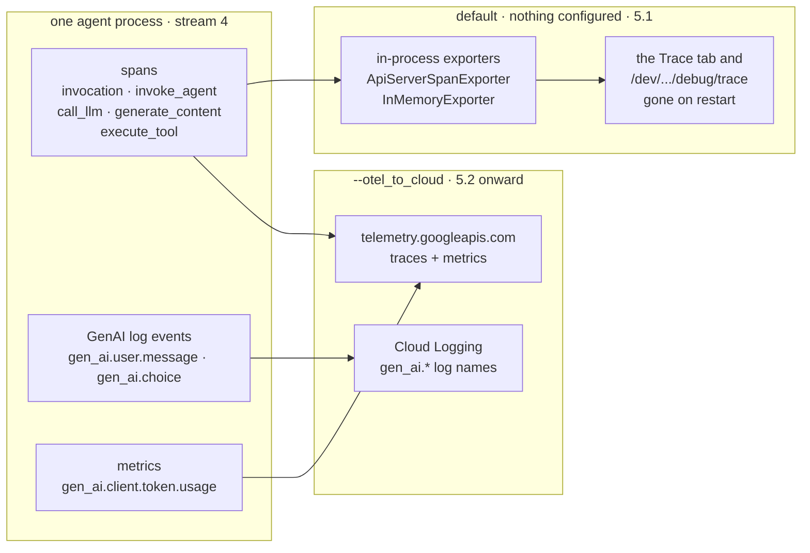

[→ 5.1 · With nothing configured, `adk web` is already tracing](5.1-adk-web-already-tracing.md) 
[← Part 5 · OpenTelemetry](index.md) 
[↑ Part 5 · OpenTelemetry](index.md) 
[Tutorial index](../../TUTORIAL.md)

---

# 5.0 · What stream 4 is

*Part 5 · OpenTelemetry*

Streams 1-3 are Python `logging`: a record, a level, a handler, a line of text.
Stream 4 shares none of that. It is a separate SDK with its own three signals, all
produced by ADK itself with no extra packages and no instrumentation on your part:

| Signal | What ADK produces | Shape |
|---|---|---|
| **Traces** | one span per invocation, agent, model call and tool call | a nested tree with durations and attributes |
| **Log events** | `gen_ai.system.message`, `gen_ai.user.message`, `gen_ai.choice` | structured events, stamped with the current trace and span id |
| **Metrics** | `gen_ai.client.token.usage`, `gen_ai.execute_tool.duration`, and friends | counters and histograms |

The whole part turns on one question: **where does that go?** There are two
answers, and 5.1 and 5.2 are exactly those two.

*Stream 4's two destinations. The spans are produced either way; the flag only decides whether anything leaves the process.*

**The five span names.** Learn these once and every trace in this part reads
itself. Each one is created by ADK itself, at a line you can go read: source
paths below are relative to the installed `google/adk/` package, so
`telemetry/_instrumentation.py` is
`.venv/lib/python3.13/site-packages/google/adk/telemetry/_instrumentation.py`.

| Span name | Opened once per | Source |
|---|---|---|
| `invocation` | turn (the root span) | `telemetry/_instrumentation.py:133` |
| `invoke_agent {name}` | agent that runs | `telemetry/_instrumentation.py:470-476` |
| `call_llm` | model round trip | `flows/llm_flows/base_llm_flow.py:1732` |
| `generate_content {model}` | GenAI SDK call, inside `call_llm` | `telemetry/tracing.py:1068`, `:1122` |
| `execute_tool {tool}` | tool call | `telemetry/_instrumentation.py:507-509` |

Two more names show up in situations this tutorial does not exercise:
`send_data` on a live/streaming connection (`flows/llm_flows/base_llm_flow.py:717`)
and `execute_tool (merged)` when the model requests several tools in parallel
(`flows/llm_flows/functions.py:526`, `:774`).

---

[→ 5.1 · With nothing configured, `adk web` is already tracing](5.1-adk-web-already-tracing.md) 
[← Part 5 · OpenTelemetry](index.md) 
[↑ Part 5 · OpenTelemetry](index.md) 
[Tutorial index](../../TUTORIAL.md)
