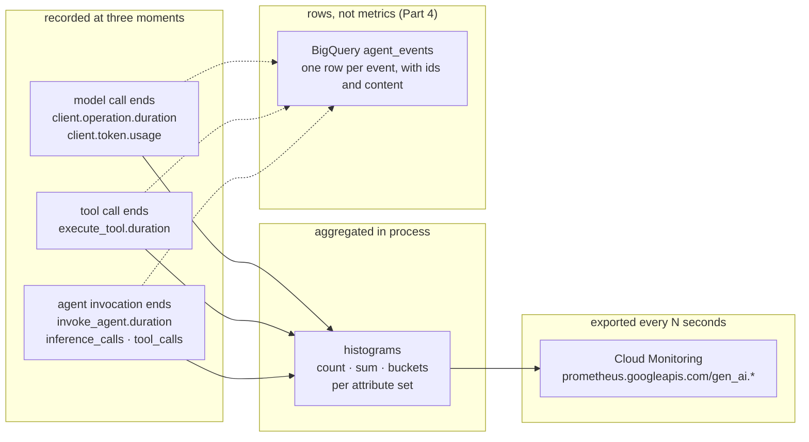

# Metrics for ADK agents on Cloud Monitoring and BigQuery

This is a hands-on tutorial. You run a small agent over and over, each time
changing one condition, and read the metrics it records to answer one operational
question. By the end you will know what ADK measures, how to ship it to Cloud
Monitoring, how to turn it into dashboards and alerts, and when to reach past
metrics to per-event rows in BigQuery.

A metric in ADK is one idea repeated: **a number recorded into a histogram at one
of three moments, tagged with a handful of attributes, and aggregated in the
process before you ever see it.** Nothing prints on its own. The three moments
are a model call ending, a tool call ending, and an agent invocation ending. Keep
that picture in mind and the rest follows.

*The three moments, the histograms they feed, and the two places you read them.*

> Verified against **google-adk 2.8.0** on Python 3.13, serving Gemini 3.7 Flash
> through Vertex AI, project `jwd-gcp-demos`. Part 1 is captured from real local
> runs (2026-09-06). Parts 2 to 4 are drafted; their cloud read-back blocks are
> marked `NEEDS-RUN` until captured against live Cloud Monitoring and BigQuery.
> See the tutorial plan for status.

## Contents

Read them in order (each page has a **Next →** link), or jump to the one you
need. Start with Setup, then Scenarios, the spine of the tutorial.

| Part | What it covers |
|---|---|
| [0. Setup](tutorial/00-setup.md) | Do this once: environment, model, shell variables, and the APIs the later parts need. |
| [Scenarios](tutorial/scenarios.md) | The controlled experiments each page runs, and the one agent behind them. |
| [1. What a metric is](tutorial/part-1/index.md) | The three moments, the six names a single agent emits, one datapoint's fields, attributes and cardinality, the experimental family, and workflow-grain metrics (1.1–1.5). Local, no cloud. |
| [2. Collect](tutorial/part-2/index.md) | Ship metrics to Cloud Monitoring: `adk web --otel_to_cloud`, what arrives, Cloud Run, your own server, Agent Runtime, and other backends (2.1–2.6). *Cloud captures pending.* |
| [3. Consume: signals from histograms](tutorial/part-3/index.md) | Latency, volume, errors, tokens, a dashboard, an alert, and one application-outcome metric (3.1–3.7). *Cloud captures pending.* |
| [4. Consume: rows in BigQuery](tutorial/part-4/index.md) | Per-event analytics for the questions histograms cannot answer (4.1–4.6). *Cloud captures pending.* |
| [How to choose & reference](tutorial/how-to-choose.md) | The signal catalog, decision table, verification status, and references. |

Ready? **[Start with Setup →](tutorial/00-setup.md)**
