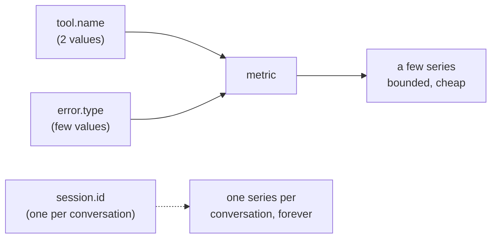

[← 1.2 · Reading a histogram](1.2-reading-a-histogram.md)<br>
[→ 1.4 · The experimental family](1.4-the-experimental-family.md)<br>
[↑ Part 1 · What a metric is](index.md)<br>
[Tutorial index](../../TUTORIAL.md)

---

# 1.3 · Attributes and cardinality

*Part 1 · What a metric is*

> [!NOTE]
> **Why you are here.** An attribute is a label on a datapoint, and every
> distinct label value splits one metric into a separate series. That is how you
> count failures by reason, and it is also why an identifier like a session id
> must never be an attribute.

In the `unknown-city` scenario the agent answers about two cities in one process:
London, which `get_weather` knows, and Atlantis, which it does not. The failed
Atlantis lookup splits the tool's metric into two series.
[examples/02_two_attribute_sets.py](../../examples/02_two_attribute_sets.py) asks
both questions, then prints one line per series of `gen_ai.execute_tool.duration`
instead of the full JSON, so the split is all you see.

**👉 Do this.**

**Command:**

```bash
.venv/bin/python examples/02_two_attribute_sets.py
```

**Expected output:** the two answers, then the tool-duration metric as one line
per series:

```console
AGENT (London): The current weather in London is 15°C and drizzling.
AGENT (Atlantis): I do not have weather data for Atlantis.

gen_ai.execute_tool.duration
  {gen_ai.agent.name=weather_agent, gen_ai.tool.name=get_weather, gen_ai.tool.type=StatusAwareTool}  count=1
  {gen_ai.agent.name=weather_agent, gen_ai.tool.name=get_weather, gen_ai.tool.type=StatusAwareTool, error.type=lookup_failed}  count=1
```

> [!NOTE]
> The script prints one summary line per series (`summarize_series` in
> `examples/_common.py`), not the reader's full JSON. See the deep dive for the
> raw datapoints.

> [!IMPORTANT]
> **What it means.** One metric, two series. Both calls were `get_weather`, but
> the Atlantis call carries `error.type=lookup_failed` and the London call does
> not, so the two land in separate series with their own counts. A datapoint's
> full set of attribute values is its identity: change one value and you are
> writing to a different series.

A dashboard reads that split as two panels: the same
`gen_ai.execute_tool.duration`, filtered by `error.type`. Under real traffic the
two distributions differ, because a failed lookup returns before the tool does
its work. Illustrative shape (the `unknown-city` scenario under volume fills
panels like these):

```console
gen_ai.execute_tool.duration                gen_ai.execute_tool.duration
error.type = (none)  ·  healthy             error.type = lookup_failed  ·  failures

  0.02–0.04 | ████ 4                          ≤ 0.01 | ██████████████ 41
  0.04–0.08 | ███████████ 12                0.01–0.02 | ██ 6
  0.08–0.16 | ██████████████ 15             0.02–0.04 | █ 3
  0.16–0.32 | ████████ 9
  0.32–0.64 | ██ 2
```

*Two panels from one metric. Averaged into a single series, the failures would hide inside the healthy numbers.*

## Why split a metric at all

Without `error.type`, both calls share one series and you cannot tell a *slow*
tool from a *failing* one. The attribute counts failures on their own, so the
metric answers "how many failed, and why" with no trace-digging. The value
`lookup_failed` names the reason; another failure would take another value (say
`timeout`), each its own countable series.

The split stopped at the tool. `gen_ai.invoke_agent.duration` kept one series:
the tool failed, but the agent recovered and answered, so the invocation
succeeded. That gap, a failed tool inside a successful turn, is what
[Part 3](../part-3/index.md) is built around.

## Why a session id can never be an attribute

Every distinct combination of attribute values is a series the backend stores,
counts, and bills for. That count is the metric's **cardinality**, the price of
splitting.



*A bounded attribute makes a handful of series; an unbounded one makes a new series on every conversation.*

Bounded attributes are safe: two tools times two outcomes is four series, no
matter how much traffic you drive. A session id is unbounded, a new value on
every conversation, so a new series forever. That is **high cardinality**, the
classic way to blow up a metrics bill and slow the backend to a crawl. The rule:
put an attribute on a metric only if its values are few and fixed. Tool name,
error type, model name qualify; session, user, and invocation ids do not, and ADK
never records them (`telemetry/_metrics.py:585-590`). To find one user's slow
turn, you use the rows in [Part 4](../part-4/index.md), where a row is one turn
and an unbounded id belongs.

## Deep dives

### What does the full datapoint look like?

`summarize_series` prints only each series' attributes and count, but each series
is a full histogram datapoint underneath, the same shape 1.2 walked through
(`bucket_counts`, `explicit_bounds`, `sum`, `min`, `max`). To see the raw JSON,
swap the reader for `install_console_reader()` and `flush_metrics()`, as in
[examples/01_console_metrics.py](../../examples/01_console_metrics.py). The failing
series carries the same fields as the healthy one, plus `error.type`.

### Why does the failing tool need a hook?

A plain function that returns `{"status": "error"}` does not stamp `error.type`.
ADK reads a tool's response for an error only through the optional
`_detect_error_in_response` hook, which `FunctionTool` leaves returning `None`
(`flows/llm_flows/functions.py:88`; `telemetry/_instrumentation.py:525`). The
demo wraps its tools in a small subclass that overrides it:

```python
class StatusAwareTool(FunctionTool):
    def _detect_error_in_response(self, response):
        if isinstance(response, dict) and response.get("status") == "error":
            return "lookup_failed"
        return None
```

Raising an exception from the tool would also stamp `error.type` (the exception
class name), but it crashes the invocation, so the turn fails instead of
answering. The hook is the path that fails the tool while keeping the turn
successful.

[1.4](1.4-the-experimental-family.md) turns on a family of metrics that stays off
by default.

---

[← 1.2 · Reading a histogram](1.2-reading-a-histogram.md)<br>
[→ 1.4 · The experimental family](1.4-the-experimental-family.md)<br>
[↑ Part 1 · What a metric is](index.md)<br>
[Tutorial index](../../TUTORIAL.md)
