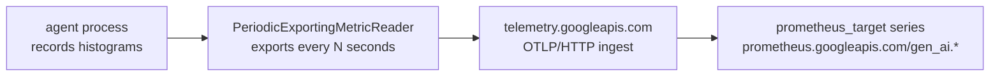

[← 1.5 · Workflow-grain metrics](../part-1/1.5-workflow-grain-metrics.md) 
[→ 2.1 · adk web --otel_to_cloud](2.1-adk-web-otel-to-cloud.md) 
[Tutorial index](../../TUTORIAL.md)

---

# Part 2 · Collect

*Ship the same six metrics off the laptop and into Cloud Monitoring, one route at a time.*

> [!NOTE]
> **Why you are here.** Part 1 read the datapoints in your own process. To alert
> on them, chart them, or share them, they have to leave the process and land in
> a backend. This part sends them to Cloud Monitoring and confirms they arrived.

Nothing about what a metric *is* changes here. The histograms, the six names, the
attributes are the same as Part 1; only the reader changes, from a console reader
to one that exports over the network. The path is always the same four hops.

*The four hops from a recorded histogram to a Cloud Monitoring series. Each page changes only how the reader is installed.*

Each page runs the [`baseline` scenario](../scenarios.md) under load and reads the
series back. The last two pages are reference: your own server, then non-Google
backends.

## In this part

| Section | Scenario | Question it answers |
|---|---|---|
| [2.1 · `adk web --otel_to_cloud`](2.1-adk-web-otel-to-cloud.md) | `baseline`; `export-outage` | Did the metrics land? |
| [2.2 · The metric catalog](2.2-the-metric-catalog.md) | `baseline` | Which of the six made it, and what are they called here? |
| [2.3 · `adk api_server` and Cloud Run](2.3-api-server-and-cloud-run.md) | `baseline` | Do deployed instances identify themselves without my help? |
| [2.4 · Your own server](2.4-your-own-server.md) | `baseline` | Does my own server export the same series? |
| [2.5 · Agent Runtime](2.5-agent-runtime.md) | `baseline` | Does a request-driven runtime export at all? |
| [2.6 · Other backends](2.6-other-backends.md) | — | Can the same series go somewhere other than Google? |

---

[← 1.5 · Workflow-grain metrics](../part-1/1.5-workflow-grain-metrics.md) 
[→ 2.1 · adk web --otel_to_cloud](2.1-adk-web-otel-to-cloud.md) 
[Tutorial index](../../TUTORIAL.md)
