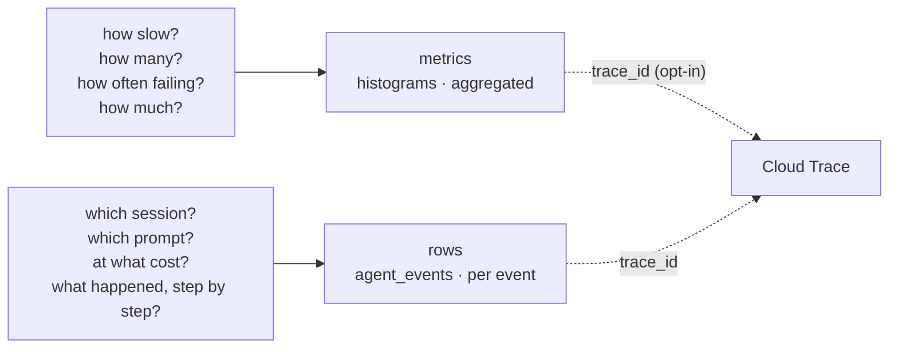

[← 4.5 · The Looker Studio template](4.5-looker-studio-template.md)<br>
[→ How to choose](../how-to-choose.md)<br>
[↑ Part 4 · Consume — rows in BigQuery](index.md)<br>
[Tutorial index](../../TUTORIAL.md)

---

# 4.6 · Metrics or rows

*Part 4 · Consume — rows in BigQuery*

> [!NOTE]
> **Why you are here.** You now have both stores. This page sets them side by side
> so the choice is a lookup, not a judgment call, and shows the one id that joins
> them.

Metrics and rows are not rivals; they answer different questions. A metric folds
many turns into a cheap, near-real-time aggregate at fixed cardinality. A row
keeps one event whole, minutes later, at any cardinality, with the content
attached. Pick by the question.

| Dimension | Metrics (Cloud Monitoring) | Rows (BigQuery) |
|---|---|---|
| Latency to visibility | Seconds (5 s export) | About a minute (batched write) |
| Cardinality | Bounded; no ids | Unbounded; every id is a column |
| Cost model | Per series stored | Per ingestion volume and per query scanned |
| Retention | Weeks, then downsampled | As long as you keep the table |
| Content | None | Full prompt and response |
| Alerting | Native, on any series | Not built in; query on a schedule |
| Join key | `otel_scope_*`, attribute labels | `session_id`, `invocation_id`, `trace_id`, `span_id` |



*The two stores answer different questions. They meet at Cloud Trace, not at each other.*

## Why the join is rows to Cloud Trace, not rows to metrics

A metric carries no id, by design ([1.3](../part-1/1.3-attributes-and-cardinality.md)),
so there is nothing on the metric side to join a row to. The bridge is Cloud
Trace: a row can carry the same `trace_id` and `span_id` as the span for that
turn. The plugin leaves this off by default; set `enable_otel_correlation=True` in
`BigQueryLoggerConfig` and each row is stamped with the ambient trace and span
ids, so a slow session found in the rows opens directly to its trace. The path is
row to trace, never row to metric.

**Step 1 — Tear down the dataset.**

Part 4 is done, so delete the dataset and everything the plugin created in it. This
removes the table, the views, and the stored content.

**Command:**

```bash
bq rm \
  --recursive \
  --dataset \
  "${GOOGLE_CLOUD_PROJECT}:${BQ_ANALYTICS_DATASET_ID}"
```

**Expected output:**

```console
NEEDS-RUN: bq rm confirmation that dataset agent_analytics and its contents were removed
```

The [reference page](../how-to-choose.md) collects the full signal catalog, the
store-choice decision table, and the verification status for the whole tutorial.

---

[← 4.5 · The Looker Studio template](4.5-looker-studio-template.md)<br>
[→ How to choose](../how-to-choose.md)<br>
[↑ Part 4 · Consume — rows in BigQuery](index.md)<br>
[Tutorial index](../../TUTORIAL.md)
