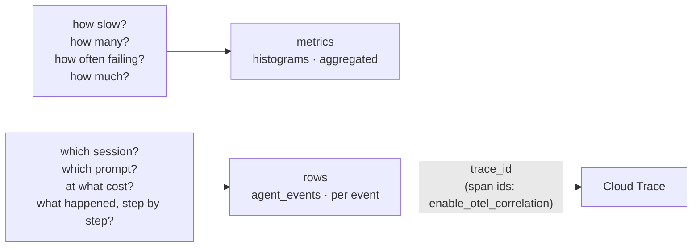

[← 4.5 · The Looker Studio template](4.5-looker-studio-template.md)<br>
[→ How to choose](../how-to-choose.md)<br>
[↑ Part 4 · Consume: rows in BigQuery](index.md)<br>
[Tutorial index](../../TUTORIAL.md)

---

# 4.6 · Metrics or rows

*Part 4 · Consume: rows in BigQuery*

> [!NOTE]
> **Why you are here.** Which turn was slow, and where did its time go? This page
> follows the slowest turn's row into Cloud Trace by its `trace_id`, the one join
> either store has, then tears down the dataset.

Metrics and rows are not rivals; they answer different questions. A metric folds
many turns into a near-real-time aggregate at fixed cardinality. A row keeps one
event whole, at any cardinality, with the content attached. Pick by the question;
[How to choose](../how-to-choose.md#which-store) compares the two stores
dimension by dimension.


```mermaid
flowchart LR
  q1["how slow?<br/>how many?<br/>how often failing?<br/>how much?"] --> M["metrics<br/>histograms · aggregated"]
  q2["which session?<br/>which prompt?<br/>at what cost?<br/>what happened, step by step?"] --> R["rows<br/>agent_events · per event"]
  R -- "trace_id<br/>(span ids: enable_otel_correlation)" --> T["Cloud Trace"]
```

*The two stores answer different questions. Rows join Cloud Trace on `trace_id`; metrics carry no id, so they join nothing.*

A metric carries no id, by design ([1.3](../part-1/1.3-attributes-and-cardinality.md)),
so there is nothing on the metric side to join a row to. The bridge is Cloud
Trace. `04_bq_plugin.py` exports spans as well as metrics, and with a tracer
provider in the process each row's `trace_id` holds the active OTel trace id, no
flag needed (`google/adk/plugins/bigquery_agent_analytics_plugin.py:5943`). A slow
session found in the rows opens directly to its trace. Without span export the
plugin makes up a random `trace_id` that matches nothing.

The typed `span_id` column is the plugin's own id for the agent, model, and tool
tree, not an OTel span id (`:3648`). For a span-level join, set
`enable_otel_correlation=True` in `BigQueryLoggerConfig`; each row then also
carries the active span's ids as `attributes.otel.trace_id` and
`attributes.otel.span_id` (`:6208`). This part leaves it off, because the trace id
alone opens the whole turn. The path is row to trace, never row to metric.

**Step 1 — Open the slowest turn's trace.**

The `INVOCATION_COMPLETED` row carries each turn's total latency. Rank the turns
by it and take the slowest one's `trace_id`.

**Command:**

```bash
bq query \
  --use_legacy_sql=false \
  "SELECT session_id, trace_id, CAST(JSON_VALUE(latency_ms, '\$.total_ms') AS INT64) AS total_ms FROM \`${GOOGLE_CLOUD_PROJECT}.${BQ_ANALYTICS_DATASET_ID}.agent_events\` WHERE event_type = 'INVOCATION_COMPLETED' ORDER BY total_ms DESC LIMIT 3"
```

**Expected output:**

```console
+--------------------------------------+----------------------------------+----------+
|              session_id              |             trace_id             | total_ms |
+--------------------------------------+----------------------------------+----------+
| 6f74f661-4189-4657-8215-a7944f441ef7 | 20820f643553c4a0c008047abba1ca1b |    32366 |
| 58353732-1694-474e-b048-0689253cf967 | 9b0dd767650a241aceac67b6dc125f35 |     5641 |
| 02fc44d6-3571-4507-bc84-c091df38126f | ee465fa851fb5ae2e95b98b1477b1075 |     4917 |
+--------------------------------------+----------------------------------+----------+
```

Set `TRACE_ID` to the top row's `trace_id` from your own output, then read that
trace back from the Cloud Trace API, printing each span's duration.

**Command:**

```bash
export TRACE_ID=20820f643553c4a0c008047abba1ca1b
curl -s \
  -H "Authorization: Bearer $(gcloud auth application-default print-access-token)" \
  "https://cloudtrace.googleapis.com/v1/projects/${GOOGLE_CLOUD_PROJECT}/traces/${TRACE_ID}" \
  | .venv/bin/python -c 'import json, sys; from datetime import datetime as dt; spans = sorted(json.load(sys.stdin)["spans"], key=lambda s: s["startTime"]); [print(f"{(dt.fromisoformat(s["endTime"]) - dt.fromisoformat(s["startTime"])).total_seconds():8.2f}s  {s["name"]}") for s in spans]'
```

**Expected output:**

```console
   33.04s  invocation
    6.18s  invoke_agent weather_agent
    2.59s  call_llm
    2.57s  generate_content gemini-3.7-flash
    0.01s  execute_tool get_weather
    3.56s  call_llm
    3.56s  generate_content gemini-3.7-flash
```

> [!IMPORTANT]
> **What it means.** The row said which turn was slow, 32 s against a usual 4 to
> 6 s; the trace says where the time went. The agent itself ran for 6.2 s: two
> model calls of 2.6 s and 3.6 s and a 0.01 s tool call. The other 26 s passed
> inside `invocation` before `invoke_agent` started, on the first turn of a fresh
> server, while the plugin created its table and views (4.1). A latency metric
> would show the spike in its p95 but could never name the turn; the row names
> it, and its `trace_id` opens it.

> [!NOTE]
> Cloud Trace indexes a trace a minute or two after export. A `404` reading
> `Trace bucket not found` means wait and retry.

**Step 2 — Tear down the dataset.**

Part 4 is done. Stop the server with `Ctrl+C` in its shell, then delete the dataset
and everything the plugin created in it: the table, the views, and the stored
content. `-f` skips the confirmation prompt.

**Command:**

```bash
bq rm \
  -f \
  --recursive \
  --dataset \
  "${GOOGLE_CLOUD_PROJECT}:${BQ_ANALYTICS_DATASET_ID}"
bq ls "${GOOGLE_CLOUD_PROJECT}:${BQ_ANALYTICS_DATASET_ID}"
```

**Expected output** (`bq rm -f` prints nothing on success; the `bq ls` after it
confirms the dataset is gone):

```console
BigQuery error in ls operation: Not found: Dataset jwd-gcp-demos:agent_analytics
```

The [reference page](../how-to-choose.md) collects the full signal catalog, the
store-choice decision table, and the verification status for the whole tutorial.

---

[← 4.5 · The Looker Studio template](4.5-looker-studio-template.md)<br>
[→ How to choose](../how-to-choose.md)<br>
[↑ Part 4 · Consume: rows in BigQuery](index.md)<br>
[Tutorial index](../../TUTORIAL.md)
