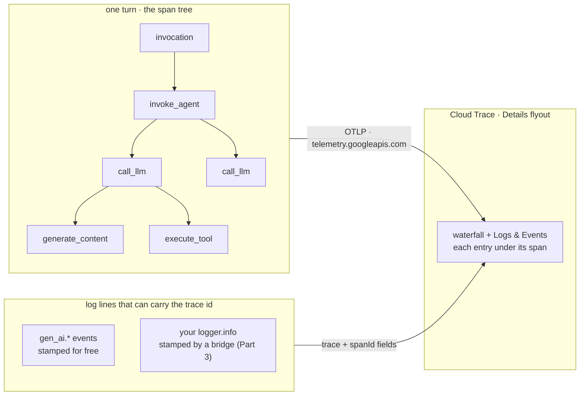

# Tracing for ADK agents on Cloud Trace

This is a hands-on tutorial. You run a small agent over and over, each time
changing one condition, and read the spans it opens to answer one operational
question. By the end you will know what ADK traces, how to ship the tree to Cloud
Trace, how to get every log line of a request to show up inside the right span,
and how to use traces to find the slow step, the failed step, and one user's
request.

A trace in ADK is one idea repeated: **a trace is the tree of spans ADK opens
around one turn; its trace id is the key every log line can carry; and Cloud
Trace draws the logs inside the spans when both carry the same id in the same
project.** Nothing leaves the process until you install an exporter. Keep that
picture in mind and the rest follows.

*The join is one field. Spans arrive over OTLP; logs arrive through Cloud
Logging; the Trace Explorer matches them on trace id and span id.*

> Verified against **google-adk 2.8.0** on Python 3.13, serving Gemini 3.7 Flash
> through Vertex AI, project `jwd-gcp-demos`. Part 1 is captured from real local
> runs (2026-09-07). Parts 2 to 4 are drafted; their cloud read-back blocks are
> captured against live Cloud Trace and Cloud Logging as each stage runs. See the
> tutorial plan for status.

## Contents

Read them in order (each page has a **Next →** link), or jump to the one you
need. Start with Setup, then Scenarios, the spine of the tutorial.

| Part | What it covers |
|---|---|
| [0. Setup](tutorial/00-setup.md) | Do this once: environment, model, shell variables, and the APIs the later parts need. |
| [Scenarios](tutorial/scenarios.md) | The controlled experiments each page runs, and the one agent behind them. |
| [1. What a trace is](tutorial/part-1/index.md) | The span tree, the raw span, the content on it, an error turn three ways, a trace per turn, and your own span inside a tool (1.1–1.6). Local, no cloud. |
| [2. Collect](tutorial/part-2/index.md) | Ship the tree to Cloud Trace: `adk web --otel_to_cloud`, Cloud Run, your own server, Agent Runtime, sampling, and other backends (2.1–2.6). *Cloud captures in progress.* |
| [3. Correlate](tutorial/part-3/index.md) | Get every log line inside its span: the free join, the missing tool line, framework and server logs, one trace per request, and three ways to stamp (3.1–3.5). *Cloud captures in progress.* |
| [4. Consume](tutorial/part-4/index.md) | Answer the on-call questions: the slow step, one user's request, the failed step, read-back without the console, and how traces, logs, and metrics compare (4.1–4.6). *Cloud captures in progress.* |
| [How to choose & reference](tutorial/how-to-choose.md) | The span and attribute catalog, correlation decision table, verification status, and references. |

Ready? **[Start with Setup →](tutorial/00-setup.md)**
