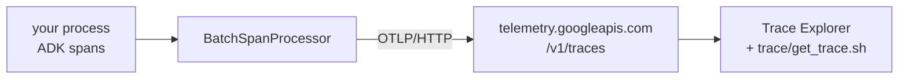

[← 1.6 · Your own span inside a tool](../part-1/1.6-your-own-span-inside-a-tool.md) 
[→ 2.1 · adk web --otel_to_cloud](2.1-adk-web-otel-to-cloud.md) 
[Tutorial index](../../TUTORIAL.md)

---

# Part 2 · Collect

*Ship the span tree from the process to Cloud Trace, and prove it landed.*

> [!NOTE]
> **Why you are here.** Part 1's tree lived and died in one process. This part
> installs a cloud exporter so the same tree reaches Cloud Trace, then reads it
> back so you know it arrived.

The tree from Part 1 does not change. What changes is where it goes: a
`BatchSpanProcessor` ships each batch over OTLP to `telemetry.googleapis.com`,
and the Trace Explorer draws it. Each page here turns on export by a different
route — the built-in flag, Cloud Run, your own server, Agent Runtime — and reads
the tree back with the same `trace/get_trace.sh` script.

*The one pipeline every route in this part shares.*

## In this part

| Section | Scenario | Question it answers |
|---|---|---|
| [2.1 · adk web --otel_to_cloud](2.1-adk-web-otel-to-cloud.md) | `slow-tool` | Did the tree land in Cloud Trace? |
| [2.2 · Cloud Run](2.2-cloud-run.md) | `baseline` | Does a deployed service trace without my help? |
| [2.3 · Your own server](2.3-your-own-server.md) | `baseline`, `export-outage` | Does my server export the same tree, and which rung failed when it does not? |
| [2.4 · Agent Runtime](2.4-agent-runtime.md) | `baseline` | What does the same agent's trace look like on Agent Runtime? |
| [2.5 · Sampling](2.5-sampling.md) | `baseline` | Can I keep fewer traces? |
| [2.6 · Other backends](2.6-other-backends.md) | — | Can the same tree go somewhere other than Google? |

---

[← 1.6 · Your own span inside a tool](../part-1/1.6-your-own-span-inside-a-tool.md) 
[→ 2.1 · adk web --otel_to_cloud](2.1-adk-web-otel-to-cloud.md) 
[Tutorial index](../../TUTORIAL.md)
