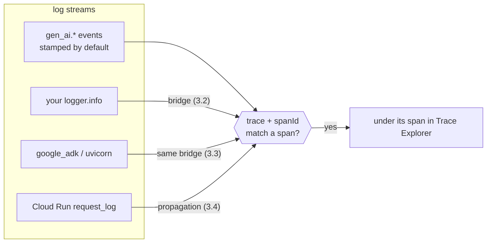

[← 2.6 · Other backends](../part-2/2.6-other-backends.md) 
[→ 3.1 · The free join](3.1-the-free-join.md) 
[Tutorial index](../../TUTORIAL.md)

---

# Part 3 · Correlate

*Get every log line of a request to show up inside the right span.*

> [!NOTE]
> **Why you are here.** The tree is in Cloud Trace, but most of your logs are
> not in it. This part joins them: one field on a log entry puts it under its
> span, and this part stamps that field on every stream.

The mechanism is one field. A log entry that carries a `trace` and a `spanId`
matching a stored span shows up under that span in the Trace Explorer. ADK's own
`gen_ai.*` events carry it for free; your logs, the framework's logs, and the
request log do not, until you stamp them.

*Four streams, one join. Each page below stamps the field on one more of them.*

## In this part

| Section | Scenario | Question it answers |
|---|---|---|
| [3.1 · The free join](3.1-the-free-join.md) | `baseline` | Where are the model's messages in the trace? |
| [3.2 · Your tool's log line is missing](3.2-your-tools-log-line.md) | `classified-error` | Why is the tool's warning not in the trace? |
| [3.3 · Framework and server logs](3.3-framework-and-server-logs.md) | `slow-tool`, `concurrent` | Do the logs I did not write land in the right spans? |
| [3.4 · One trace per request](3.4-one-trace-per-request.md) | `tagged-request`, `unsampled-parent` | Is this trace the one my user's request produced? |
| [3.5 · Three ways to stamp](3.5-three-ways-to-stamp.md) | — | Which bridge do I use where? |

---

[← 2.6 · Other backends](../part-2/2.6-other-backends.md) 
[→ 3.1 · The free join](3.1-the-free-join.md) 
[Tutorial index](../../TUTORIAL.md)
