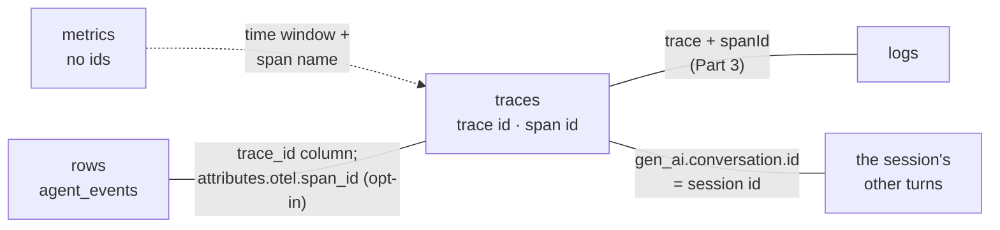

[← 4.3 · The failed step](4.3-the-failed-step.md) 
[→ 4.5 · Cost, retention, and content policy](4.5-cost-retention-content.md) 
[↑ Part 4 · Consume](index.md) 
[Tutorial index](../../TUTORIAL.md)

---

# 4.4 · Traces, logs, metrics, rows

*Part 4 · Consume*

> [!NOTE]
> **Why you are here.** Traces are one of four stores an ADK agent can write
> to. This reference page sets them side by side, across the
> [logging](../../../logging/TUTORIAL.md),
> [metrics](../../../metrics/TUTORIAL.md), and tracing tutorials, and names the
> id that joins each pair.

Each store answers a different question. Pick by the question, then follow the
join key to the next store when one answer raises another question.

## Which store answers which question

| Store | Answers | Grain | Ids it carries |
|---|---|---|---|
| Traces (Cloud Trace) | Which step was slow or failed, and in what order? | One span per operation | trace id, span id; `gen_ai.conversation.id` as a span attribute |
| Logs (Cloud Logging) | What did the model, tool, or server say? | One entry per event | `trace` and `spanId`, when stamped (Part 3) |
| Metrics (Cloud Monitoring) | How slow, how many, how often failing, across all turns? | One aggregate per series | none |
| Rows (BigQuery) | Which session cost the most, and which prompt drove it? | One row per agent event | `session_id`, `invocation_id`, `trace_id` |

## What joins them

*Cloud Trace is the hub. Logs and rows join it by id; metrics reach it only by
time and name.*

| Pair | Join key | Who writes it |
|---|---|---|
| Span ↔ log entry | `trace` + `spanId` | ADK's `gen_ai.*` events by default; your logs and the framework's through a bridge ([3.5](../part-3/3.5-three-ways-to-stamp.md)) |
| Turn ↔ turn | `gen_ai.conversation.id` on `invoke_agent` and `generate_content` | ADK, always. It equals the session id ([4.2](4.2-one-users-request.md)) |
| Row ↔ trace | `trace_id` column | The BigQuery plugin, from the current span |
| Row ↔ span | `attributes.otel.span_id` | The plugin, only with `enable_otel_correlation=True` |
| Metric ↔ anything | none | Nobody. Find the time window on the chart, then filter traces by span name and duration in that window ([4.1](4.1-the-slow-step.md)). |

## Why metrics carry no ids

A metric attribute multiplies the number of series. A trace id or session id
per turn would make every turn its own series, which is the cardinality cost the
[metrics tutorial](../../../metrics/tutorial/part-1/1.3-attributes-and-cardinality.md)
warns against. So a metric tells you when and how often, and the trace tells
you which one. The hop between them is by time and by the shared attribute
values, such as the tool name, that both carry.

## What the BigQuery plugin stamps

This section comes from source inspection of
`google/adk/plugins/bigquery_agent_analytics_plugin.py` in google-adk 2.8.0. The
tutorial did not run the plugin; the
[metrics tutorial's Part 4](../../../metrics/tutorial/part-4/index.md) does.

| Column | Value | Needs the flag? |
|---|---|---|
| `trace_id` | The current OTel trace id, as 32 hex characters, whenever a valid span is current (`google/adk/plugins/bigquery_agent_analytics_plugin.py:5943`) | No |
| `span_id`, `parent_span_id` | The plugin's own execution-tree ids, not OTel span ids. Only a root row may reuse the OTel span id (schema description, `google/adk/plugins/bigquery_agent_analytics_plugin.py:3648-3656`). | No |
| `attributes.otel.trace_id`, `attributes.otel.span_id` | The current OTel span context at row emission (`google/adk/plugins/bigquery_agent_analytics_plugin.py:6206`) | Yes: `enable_otel_correlation=True`, default `False` (`google/adk/plugins/bigquery_agent_analytics_plugin.py:1848`) |

> [!WARNING]
> The typed `span_id` column does not match a Cloud Trace span; join on
> `attributes.otel.span_id` instead.

The plugin's own docstring calls the OTel ids "a best-effort Cloud Trace join
key, not a foreign key". A row whose span was not sampled has a valid id and no
span behind it ([2.5](../part-2/2.5-sampling.md)).

## A worked path

A latency alert fires on the tool-duration metric. The chart gives the window.
In the Trace Explorer, filter that window on **Span name**
`execute_tool get_forecast` and open a slow trace. Its **Logs & Events** shows
the tool's WARNING, and `gen_ai.conversation.id` on `invoke_agent` gives the
session. In BigQuery, `WHERE session_id = …` returns the rows with token counts
and content, and `trace_id` on each row leads back to the same trace.

[4.5](4.5-cost-retention-content.md) covers what keeping all of this costs.

---

[← 4.3 · The failed step](4.3-the-failed-step.md) 
[→ 4.5 · Cost, retention, and content policy](4.5-cost-retention-content.md) 
[↑ Part 4 · Consume](index.md) 
[Tutorial index](../../TUTORIAL.md)
