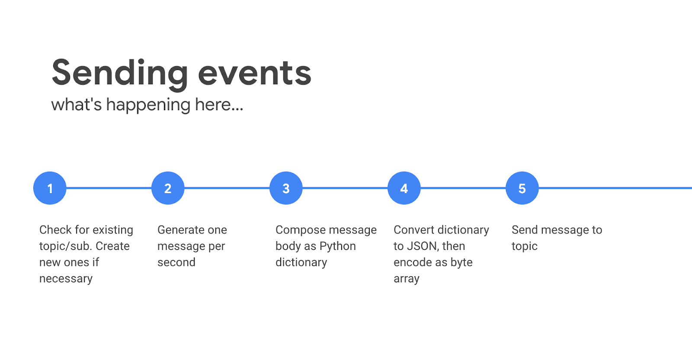

# Dataflow Python Streaming Demo

## Purpose

On the surface, this is a very simple demo intended to show Dataflow streaming
using the Python SDK.

There are a few fun little tricks and techniques involved, including:

* Checking for topic/sub existence
* Encoding objects into messages
* Reading the end time of Beam windows
* Checking for dataset/table existence in BQ
* Streaming nested/repeated data into BQ

## Setup

Setup will do the following:

* Create and activate a python virtual environment
* Install dependencies for both pieces of the demo code
* Create a service account and make it an editor
* Create and download a key file for the service account
* Set an environment variable that will point the code to the service account keyfile
* Create a bucket that is used by the dataflow job
* Enable the BQ, PubSub, and Dataflow services

1. Clone the repo, and change directories to `dflow-bq-stream-python`:

    ```bash
    git clone https://github.com/roitraining/gcp-demos.git
    cd gcp-demos/dataflow/dflow-bq-stream-python
    ```

2. Make sure that **gcloud** is configured to point to the project you want to work in.

3. Make sure you are running Python 3.12.x or earlier (there's a conflict between Beam and 3.13)
   ```bash
   pyenv local 3.12
   ```

4. Run the `setup.sh` script providing the name of the service account you want the demo code to use:

    ```bash
    . ./setup.sh df-demo-sa
    ```

## Sending events

This part of this demo sends a stream of events to a Pub/Sub topic,
one per second.

5. If the pipeline is running in Dataflow, run the `send_events` script:

    ```bash
    python send_events.py \
        --project_id=$PROJECT_ID
    ```

    You may optionally change the topic and sucscription names if you like by
    specifying additional arguments: `topic_id` and `sub_id`.

    

## Starting the pipeline

This section creates a Dataflow job which reads the messages from a PubSub
subscription, writes all messages into a `messages` table, and also windows the
messages and writes nested/repeated rows for each window into a
`messages_nested` table.


6. Open a 2nd terminal window.
7. Submit the job to the Dataflow service:
   ```bash
   export PROJECT_ID=$(gcloud config get-value project)
   cd gcp-demos/dataflow/dflow-bq-stream-python
   source .venv/bin/activate
   python process_events.py \
   --runner DataflowRunner \
   --region us-central1 \
   --project $PROJECT_ID \
   --staging_location gs://$PROJECT_ID-dflow-demo/ \
   --temp_location gs://$PROJECT_ID-dflow-demo/
   ```

    
    

> [!NOTE] 
> If you want to adjust the fixed window size from 10 seconds, you can provide
> an optional command-line argument `--window-size` (defined in seconds).
> 
> If you want to run the pipeline locally, the command looks like this:
> ```bash
> python3 process_events.py \
>   -- project $PROJECT_ID
> ```

## Checking out results

1. It can take 5+ minutes until messages start flowing through the pipeline
1. Check out the pipeline in Dataflow (if running there)
   1. Note the branch and two different sinks
   2. Note that windowing happens after several transforms
   3. Note the aggregation

1. Check out the **messages** table in BQ and see all the individual messages
1. Check out the **messages_nested** table in BQ and see the nested data

## Cleaning up

1. Stop the Dataflow job
2. Stop the process sending events
3. Delete the Pub/Sub assets
4. Delete the BigQuery assets
5. Delete your service account
6. Delete your bucket