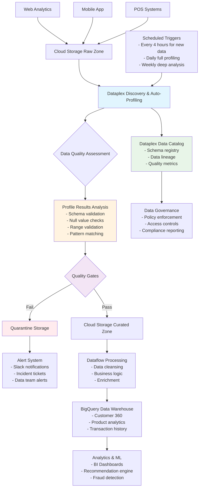

# E-commerce Data Pipeline with Dataplex Profiling

## Overview

This document details a realistic data engineering pipeline that leverages Google Cloud Dataplex for data profiling, showing how profiling integrates into the data flow and drives automated decision-making.

## Example: E-commerce Customer Analytics Pipeline

**Context**: An e-commerce company ingests customer transaction data from multiple sources (web, mobile app, point-of-sale systems) and needs to maintain data quality while building analytics datasets.

## The Pipeline Flow

### 1. Data Ingestion
- Raw transaction data lands in Cloud Storage buckets (JSON, CSV, Parquet files)
- Data comes from web analytics, mobile apps, and POS systems
- Files arrive throughout the day with varying schemas and quality

### 2. Dataplex Discovery & Profiling
- Dataplex automatically discovers new datasets in the storage buckets
- Profiling jobs run on a schedule (e.g., every 4 hours for new data, daily for full datasets)
- Profiles capture:
  - Schema drift detection
  - Null value percentages
  - Data type distributions
  - Value ranges and outliers
  - Duplicate records
  - Pattern matching for emails, phone numbers, etc.

### 3. Data Quality Assessment
- Cloud Functions triggered by Dataplex profiling completion
- Custom logic evaluates profiling results against business rules:
  - Email fields must be >95% valid format
  - Transaction amounts must be within expected ranges
  - Customer IDs must have <1% null values
  - Schema changes trigger alerts

### 4. Automated Responses
- **Pass Quality Gates**: Data flows to BigQuery staging tables
- **Fail Quality Gates**: 
  - Quarantine bad data to separate storage
  - Send alerts to data engineering team
  - Create incident tickets automatically
  - Block downstream processing

### 5. Data Processing & Enrichment
- Dataflow/Dataproc jobs process qualified data
- Join with reference data, apply business logic
- Create customer 360 views, product analytics

### 6. Consumption
- Clean data lands in BigQuery data warehouse
- Powers BI dashboards, ML models, and operational reports
- Data lineage tracked through Dataplex

## How Profiling Results Drive Actions

### Schema Evolution
When profiling detects new fields in mobile app data, the pipeline automatically updates BigQuery schemas and notifies analysts of new available data.

### Data Quality Monitoring
If profiling shows transaction amounts with unusual spikes, the system quarantines that batch and alerts the team to investigate potential data corruption.

### Performance Optimization
Profiling results showing high cardinality fields inform partitioning strategies in BigQuery.

## Pipeline Architecture Diagram

## Key Benefits

### Proactive Quality Management
Rather than discovering data issues during analysis, profiling catches problems at ingestion time, preventing downstream corruption.

### Automated Decision Making
Profile results directly trigger pipeline branching logic, reducing manual intervention and improving response time.

### Continuous Monitoring
Regular profiling provides trend analysis on data quality metrics, helping teams identify degrading data sources before they become critical issues.

### Operational Efficiency
By automatically quarantining bad data and alerting teams with specific profiling insights, the pipeline reduces time-to-resolution for data quality incidents.

## Conclusion

The profiling essentially acts as a "data firewall" - ensuring only quality data flows through to expensive processing and storage systems while providing rich metadata for governance and optimization decisions.

Demo

gcloud storage cp web_events_20240806_14.json gs://jwd-gcp-demos-ecommerce-raw-dev/web-analytics/
gcloud storage cp store_transactions_20240806.csv gs://jwd-gcp-demos-ecommerce-raw-dev/pos-systems/
gcloud storage cp app_events_20240806_1400.jsonl gs://jwd-gcp-demos-ecommerce-raw-dev/mobile-app/
