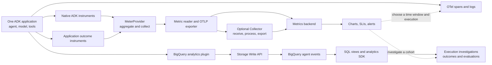

# Plan: Metrics and operational insights for ADK agents

Status: planning complete; implementation and runtime verification not started.
Research date: September 6, 2026.
Proposed tutorial folder: `ai/adk/metrics/`.

Build a hands-on tutorial that takes a new developer from running a small ADK
agent to answering operational questions with evidence: Is the agent slow? Which
operation is responsible? Is it failing? Is it doing unnecessary work? Does a
technically successful run accomplish the user's task? Did a change improve the
result without increasing token consumption or failure rates?

The reader repeatedly runs one weather agent, changes one condition, and examines
the resulting measurements. Native OpenTelemetry (OTel) metrics provide aggregate
latency, usage, and execution signals. Application metrics add task outcomes.
BigQuery Agent Analytics preserves event detail for investigation and evaluation.
Every exercise ends with an observation, its limits, and a concrete next action.

This deliverable plans the tutorial. It does not create agents, provision cloud
resources, run model calls, or claim that proposed examples have been verified.

## Reader, outcomes, and scope

Assume basic Python, a terminal, and familiarity with calling an API. Explain
ADK's agent, tool, runner, and session through the shared example. Introduce
histograms, OpenTelemetry Protocol (OTLP), time series, percentiles, and service
level indicators (SLIs) when the reader first uses them. Prior OTel, Prometheus,
SQL, or production monitoring experience is unnecessary.

By the end, the reader can:

1. Find the metrics ADK emits and explain what one observation measures.
2. Configure collection for a script, ADK CLI server, and deployed service.
3. Add a bounded application metric when framework telemetry cannot answer a
   business question.
4. Calculate rates, token totals, latency distributions, and outcome ratios with
   the correct units, time windows, and denominators.
5. Diagnose a regression by moving from a chart to a representative execution.
6. Query agent events in BigQuery and investigate them with the analytics SDK.
7. Verify that a telemetry pipeline remains useful during failures, restarts,
   concurrency, and low traffic.

Python is the implementation language. Use Gemini through Vertex AI to match the
logging tutorial, with the model name configurable and verified during setup.
The local path needs model credentials but no monitoring backend account. The
Google Cloud and BigQuery parts need a project and appropriate permissions.
SigNoz is an optional backend exercise. Agent Engine is an advanced deployment
exercise with its own verification gate.

Keep agent evaluation scoped to operational investigations and a small regression
set. Full evaluation methodology, RAG, context graphs, memory extraction,
multimodal payload storage, multiple model providers, and production platform
engineering belong in linked follow-up material.

## Decisions and alternatives

These recommendations are sufficient to start implementation; they are not
requests for another architecture approval.

| Decision | Options and trade-offs | Recommendation |
|---|---|---|
| Tutorial home | Extending logging preserves one index but overloads its four-stream model. A sibling gives metrics room for its own model and runnable assets. | Create `ai/adk/metrics/`; link to logging for log configuration, content controls, and trace correlation. |
| Teaching order | A metric catalog front-loads terminology. Backend-first teaching can obscure what the numbers measure. | Run and observe first, then generate, collect, consume, and operate. Introduce the catalog progressively. |
| First destination | Console JSON exposes histogram structure but is verbose. A Collector plus Prometheus and Grafana introduces several services. Aspire provides a local metrics UI in one container. | Start with ADK Web exporting to a pinned Aspire Dashboard container. Use a focused console-metric example on the next page to explain the data structure. |
| Primary production backend | Teaching several products equally repeats setup and query syntax. Google Cloud Monitoring fits this repository and the existing deployment examples. | Use Cloud Monitoring for the complete operational dashboard and alert exercises. Give SigNoz a bounded portability exercise. |
| Collector | Direct export has fewer moving parts. A Collector makes routing, batching, filtering, and pipeline health visible. | Demonstrate direct local export first, then insert a Collector without changing the agent. Keep one canonical Collector configuration. |
| BigQuery | Treating BigQuery as another metrics exporter blurs two distinct collection paths. Omitting it loses event-level analysis and SDK consumption. | Give event analytics two dedicated parts, using the same agent and scenario set. |
| Application example | The BigQuery sample adds SQL tools and data permissions unrelated to telemetry. The logging weather agent is small and familiar. | Adapt the weather example into a self-contained sibling; reuse plugin registration from the BigQuery sample. |
| Supported ADK | A floating release makes evidence drift. A development checkout exposes useful features that may not be released. | Establish a clean, pinned release baseline first. Document checkout-only features in an explicitly versioned extension. |
| Page pattern | Writing every page before review multiplies style corrections. | Implement and review two exemplar pages, 1.1 and 5.2, before expanding the pattern. |

## Governing model

The central idea is: a useful operational signal combines a measurement, a scope,
an aggregation window, and a decision.

For example, one tool call taking three seconds is a measurement. The proportion
of weather requests exceeding the application's response-time objective over a
defined window is an operational signal. A trace or event sequence can then
identify which operation to investigate.

*Solid arrows show telemetry delivery; dotted arrows show investigation steps.*

Teach the distinction between a resource, an instrumentation scope, and a metric
attribute. A resource identifies the emitting service and instance. An
instrumentation scope identifies the producer library. Attributes split a metric
into separate series, such as one series per tool or model.

Keep a separate diagram for execution boundaries: one user request can contain
multiple agent invocations, model calls, tool calls, and nested workflows. A
session can contain several requests. Counts and durations at these boundaries
answer different questions. A metric point aggregates observations; it does not
contain the original execution history.

## Findings that constrain the implementation

### Establish the source and package baseline before writing commands

The local ADK repository is clean at commit
`b0180620f4c2f4f4467a89c37a30f75bf849700b`; its version file reports 2.8.0.
The supplied logging plan records earlier runs against a package also labeled
2.8.0. Source inspected today contains additional experimental instruments and
different Google Cloud exporter behavior. Even the logging environment's files
have evolved beyond some recorded line references. A version string alone does
not establish that these environments are equivalent.

Record the installed module path, package source, full dependency lock, Python
version, ADK commit when applicable, OTel semantic-conventions package version,
container digests, model identifier, and execution date. Use an isolated metrics
environment and never silently reuse or upgrade the logging environment.

Source citations below use `adk/` for
`/Users/jeff/Desktop/Dev/adk-python/src/google/adk/` at the commit above. These
are source observations, not results from running this tutorial.

### Native instruments and their measurement boundaries

The [ADK metrics page](https://adk.dev/observability/metrics/) documents seven
core instruments. The local implementations are in `adk/telemetry/_metrics.py`.
Build the reference catalog from instrument definitions and recording sites,
then verify the catalog against exported data.

| Instrument | Type and unit | One observation | Useful attributes to verify |
|---|---|---|---|
| `gen_ai.invoke_agent.duration` | Histogram, seconds | An agent invocation | Agent name; error type on a recorded failure |
| `gen_ai.invoke_workflow.duration` | Histogram, seconds | A workflow invocation | Operation, workflow name, nested marker, error type |
| `gen_ai.execute_tool.duration` | Histogram, seconds | A tool execution | Agent, tool name, tool type, error type |
| `gen_ai.invoke_agent.inference_calls` | Histogram, dimensionless count | Model-call count accumulated for an agent invocation | Agent name |
| `gen_ai.invoke_agent.tool_calls` | Histogram, dimensionless count | Tool-call count accumulated for an agent invocation | Agent name |
| `gen_ai.client.operation.duration` | Histogram, seconds | A model operation | Agent, operation, provider, requested model, response model, error type |
| `gen_ai.client.token.usage` | Histogram, tokens | Input or output usage for a model operation | Model-operation attributes and token type |

The call-count instruments are histograms, not counters. Their observation count
counts measured agent invocations; their sum counts calls. Likewise, the token
histogram sum counts tokens, while its observation count counts recorded usage
observations. Token observations cannot serve as a reliable request denominator.

The inspected implementation uses the last model response's usage metadata,
skips missing metadata, and records positive input and output amounts separately.
It combines prompt and tool-use input tokens, and candidate and reasoning output
tokens; cached input is already included in prompt usage. Streaming chunks must
not be summed as if each carried independent usage.
Evidence: `adk/telemetry/_metrics.py:557` and
`adk/telemetry/_instrumentation.py:645`.

The local checkout also defines experimental per-agent and per-workflow token,
call, and skill measurements. Workflow totals include enclosed work, whereas
agent totals are attributed to the individual agent. Summing root and nested
workflow totals double-counts work. Their recording gates need separate tests;
defining an instrument does not prove it emits in a given configuration.
Evidence: `adk/telemetry/_metrics.py:221`,
`adk/telemetry/_instrumentation.py:316`, and
`adk/telemetry/_instrumentation.py:395`.

Do not advertise first-token latency, cost, business success, or quality scores
as automatically available from these seven instruments. Add an explicitly
named application measurement or derive the value from an appropriate event
source. Client first-chunk time and server first-token time also have different
boundaries.

### Configuration is owned by the process entry point

The inspected setup helper installs providers only when readers or processors
are supplied. It constructs HTTP/protobuf OTLP exporters from general or
signal-specific endpoint variables, and cannot replace an already registered
global provider. The helper disables automatic metric collection on process exit.
Evidence: `adk/telemetry/setup.py:45`.

ADK's CLI server configures telemetry. A bare runner does not gain an exporter
because an endpoint variable exists. A custom script or server must initialize
its provider before running the agent. Use fresh processes for configuration
comparisons, including changes to exporters, resource attributes, and Views.
Evidence: `adk/cli/api_server.py:681`; the logging plan's Q1 and Q3.

Teach the metrics-specific endpoint first so the exercise's intended signal is
clear. The general endpoint also enables other signal exporters. Do not assume
setting a protocol variable makes ADK's HTTP helper use gRPC. Keep endpoint
paths, scheme, port, credentials, and export interval visible in the exercise.

The Google helper uses the Telemetry API metrics endpoint. Outside Agent Engine,
the inspected source selects a periodic reader; Agent Engine has a specialized
request-driven path. Resource construction now supplies a service instance ID.
This differs from the older logging plan's laptop diagnosis, so retain that
failure as a regression test rather than a timeless setup requirement.
Evidence: `adk/telemetry/google_cloud.py:194`,
`adk/telemetry/google_cloud.py:260`, and
`adk/telemetry/google_cloud.py:434`.

### Resolve disagreements among the references

| Reference issue | Teaching consequence |
|---|---|
| The OpenObserve article describes some core GenAI attributes as Stable or Release Candidate. The maintained GenAI metrics document labels the relevant instruments and attributes Development. | Cite the normative definition for each stability claim. Keep the article as practical background. |
| The old OTel GenAI documentation URL now points readers to a separate repository. | Link to the maintained GenAI repository and record its revision when locking the tutorial. |
| SigNoz's setup combines OpenInference tracing with system and HTTP client instrumentation. Its dashboard uses several kinds of telemetry. | Inspect dashboard JSON and identify each panel's data source. Do not promise that native ADK metrics alone populate every panel. |
| The logging plan contains historical paths, superseded claims, and unresolved Agent Engine read-back. | Use its September 5 session notes when interpreting history; re-test deployment behavior on the chosen baseline. |
| The BigQuery sample README uses inconsistent dataset names and makes inconsistent claims about automatic creation. | Explicitly create a tutorial-owned dataset, use one dataset variable, and verify table creation in the chosen plugin version. |
| BigQuery analytics captures events; the separate analytics SDK consumes them. | Show both components in the architecture and install/configure them in different lessons. |

The maintained [GenAI metrics definition](https://github.com/open-telemetry/semantic-conventions-genai/blob/main/docs/gen-ai/gen-ai-metrics.md)
is the authority for convention status. ADK source and runtime captures determine
what the selected ADK build actually emits. The
[SigNoz integration](https://signoz.io/docs/google-adk-observability/) is the
authority for its setup, and the
[BigQuery architecture](https://docs.cloud.google.com/bigquery/docs/bigquery-agent-analytics)
describes the plugin-to-warehouse path.

## Shared example and controlled experiments

Start with one weather tool and the prompt, “What's the weather in London?”
Use synthetic tool data so changes in a public weather API do not obscure the
lesson. The model still makes real calls in the live exercises. Keep the prompt
once per page and refer to it by name afterward.

Add a small workload driver that uses the same runner/server as the reader.
Expose named scenarios and bounded request counts. The driver saves request
start/end times, outcome, invocation identity, and scenario configuration as a
local manifest for reconciliation. Scenario labels are a fixed enumeration;
unique run IDs remain in the manifest or event records, not metric labels.

| Scenario | Controlled change | Observation to capture | Operational question |
|---|---|---|---|
| Baseline | One normal lookup in a fresh session | Actual agent/model/tool counts and latency distribution | What does one successful request cost in time and tokens? |
| Slow tool | Add a fixed tool delay | Tool latency rises; inspect model and request latency separately | Is the dependency responsible for the slowdown? |
| Tool exception | Raise a named synthetic exception | Tool error series and actual request outcome | Did a dependency failure become a user-visible failure? |
| Unavailable answer | Return a domain-level unavailable result without raising | Application outcome changes; inspect native error attributes | Did execution complete without accomplishing the task? |
| Extra work | Introduce a bounded extra lookup or explicit retry policy | Calls and tokens per request increase | Is repeated work driving latency and consumption? |
| Growing context | Repeat a bounded conversation versus fresh sessions | Input usage per model call changes | Does accumulated context explain token growth? |
| Missing usage | Use a clearly labeled fixture response with no usage metadata | No token observation for the affected operation | Is missing telemetry being mistaken for zero consumption? |
| Concurrent requests | Run several slow and normal requests together | Independent durations and outcomes | Does the instrumentation mix request state? |
| Export outage | Stop the local receiver temporarily | Pipeline failure evidence and possible delivery gaps | Is the agent healthy while observability is incomplete? |
| Recovery | Restore the changed condition and rerun the same workload | Before/after comparison with sample sizes | Did the intervention change the intended signal? |

Introduce only one scenario per lesson. Add a tiny nested workflow later to
demonstrate measurement boundaries, using the selected ADK workflow API. Do not
start the tutorial with a multi-agent topology.

For live model runs, assert structural facts and observed relationships rather
than exact response wording or a promised number of calls. Inspect the actual
trajectory if the model skips the intended tool. Deterministic model fixtures
cover counting edge cases separately and must be labeled as fixtures.

## Proposed page sequence

Use `README.md`, `TUTORIAL.md`, `tutorial/00-setup.md`, multi-page part indexes,
and numbered subtask pages. All paths in this section are proposed paths beneath
`ai/adk/metrics/`; they are not links to files already created.

Target 350–600 words for most subtask pages, with an absolute 200–750-word range
including deep dives and excluding captured output. Part indexes target about
200 words. The final reference page may be longer. Split any lesson that cannot
fit without hiding prerequisites or skipping interpretation.

### Setup and Part 1: See what ADK measures

| Page | Reader action and single lesson | Evidence required |
|---|---|---|
| `tutorial/00-setup.md` | Create the isolated environment, configure credentials and model, and run the shared agent. Give cloud prerequisites only where needed later. | Version/module-path report and a successful model/tool run. |
| `part-1/1.1-see-your-first-metric.md` | Start the local viewer, export metrics from `adk web`, and ask the London question. | A named duration instrument with the expected service resource and fresh timestamp. |
| `part-1/1.2-read-a-histogram.md` | Run a small programmatic example with a console metric exporter and a focused output selector. | One histogram's count, sum, bounds, bucket counts, attributes, and temporality, explained field by field. |
| `part-1/1.3-count-the-work.md` | Compare agent invocations, model calls, and tool calls for one request. | A captured execution diagram alongside histogram counts and sums. |
| `part-1/1.4-follow-token-usage.md` | Compare fresh-session and growing-context runs. | Input/output usage, missing-usage behavior, and measured sample sizes. |
| `part-1/1.5-separate-workflow-and-agent.md` | Run the small nested-workflow variant. | Root and nested workflow boundaries; explain which totals overlap. |

The viewer is an early observation tool, not a dashboard-building detour. Its
container binds to loopback, uses a pinned version, and has a stop/remove step.
Part 1.2 adds code because it teaches the provider and histogram structure;
Part 1.1 keeps agent instrumentation code unchanged.

### Part 2: Generate signals the application owns

| Page | Reader action and single lesson | Evidence required |
|---|---|---|
| `part-2/2.1-measure-task-outcomes.md` | Record one bounded outcome per request: answered, unavailable, or failed. | A domain-level failure that differs from the native execution result. |
| `part-2/2.2-measure-request-latency.md` | Measure the runner boundary and compare it with agent/model/tool durations. | Monotonic wall-clock measurements and explained boundary differences. |
| `part-2/2.3-control-metric-dimensions.md` | Compare bounded outcome/tool labels with a synthetic high-cardinality label, then remove it with an SDK View. | Before/after series counts and confirmation that sensitive/unbounded attributes do not reach the exporter. |
| `part-2/2.4-protect-concurrent-measurements.md` | Run overlapping slow and normal requests. | Independent request durations and exactly one terminal outcome per handled request. |

Create custom instruments in a tutorial/application namespace, for example
`tutorial.weather.requests` and `tutorial.weather.request.duration`, with explicit
units and attribute allowlists. Reuse native metrics for native boundaries.
Record the application result from authoritative tool/workflow state, not by
searching the model's prose for success words.

Use local request state or context-local state for timers. Handle exceptions and
cancellation explicitly, and test callback short-circuit paths before relying on
a plugin's before/after pair. A process killed before recording its terminal
event cannot be made visible by a completion counter alone; discuss ingress
request telemetry or started/completed reconciliation when defining availability.

### Part 3: Collect and export reliably

| Page | Reader action and single lesson | Evidence required |
|---|---|---|
| `part-3/3.1-insert-a-collector.md` | Route the same OTLP metrics through a Collector into the local viewer. | Receiver/debug evidence and the same instrument in the destination. |
| `part-3/3.2-configure-cli-and-code.md` | Compare `adk api_server` with an explicitly initialized custom runner/server. | Equivalent resources and instruments; a documented no-provider control case. |
| `part-3/3.3-export-to-cloud-monitoring.md` | Enable the required APIs, configure a writer identity, and send a small workload. | Actual metric descriptor, resource type, labels, and time series read back from Cloud Monitoring. |
| `part-3/3.4-flush-and-recover.md` | Observe a short process and a temporarily unavailable receiver. | What arrived, what was delayed or lost, flush behavior, and exporter/Collector diagnostics. |

Explain API versus SDK, MeterProvider, reader, aggregation, exporter, and Collector
at the point each becomes visible. Include batch/export intervals, timeout,
retry, bounded queues, temporality, and process shutdown. Do not claim that
batching makes telemetry free or that retries guarantee delivery.

For Google Cloud, verify the Telemetry and Monitoring API requirements,
credential project, quota project, resource attributes, and minimum IAM in a
dedicated writer setup. Record the accepted collection cadence before using
force-flush commands; rapid flushes can violate a destination's interval rules.
Discover metric names after ingestion rather than inventing a Prometheus name or
Cloud Monitoring metric-type prefix from the OTel instrument spelling.

### Part 4: Consume metrics as operational signals

| Page | Reader action and single lesson | Evidence required |
|---|---|---|
| `part-4/4.1-chart-demand-and-errors.md` | Build request volume and outcome/error ratio panels. | Correct request denominator, matching windows, empty-window behavior. |
| `part-4/4.2-find-the-slow-operation.md` | Run the slow-tool scenario and compare request, model, and tool distributions. | Histogram-based p50/p95 with sample counts and a trace-based investigation. |
| `part-4/4.3-find-excess-work.md` | Run the extra-work scenario and chart calls and tokens per request. | Correct histogram sums, consistent request cohorts, and a bounded diagnosis. |
| `part-4/4.4-test-an-alert.md` | Evaluate a latency or failure condition, induce the problem, and recover. | Condition becomes active and clears; show low-traffic and no-data handling. |
| `part-4/4.5-compare-a-change.md` | Compare baseline and revised behavior under the same scenario distribution. | Volume, outcomes, latency, and tokens together, with uncertainty stated. |

Ship a small importable Cloud Monitoring dashboard and the queries backing each
panel. Every panel records metric provenance, units, filters, aggregation, window,
and the action it supports. Separate user-impact panels from dependency detail.
Use traces for the execution timeline; summing component p95 values cannot
reconstruct a request p95 or its critical path.

The alert exercise uses a tutorial condition without external notification
channels. Thresholds are explicitly educational, selected after measuring the
baseline. Explain how an SLI becomes an objective and, in a deep dive, how an
error budget and burn rate guide production alerting.

### Part 5: Collect event detail and derive BigQuery insights

| Page | Reader action and single lesson | Evidence required |
|---|---|---|
| `part-5/5.1-capture-agent-events.md` | Create the tutorial dataset and attach the analytics plugin to the same app. | A focused event-type listing for one invocation and successful flush/close. |
| `part-5/5.2-read-one-invocation.md` | Query one execution's event sequence and inspect its identity, timing, and usage fields. | Actual schema and representative rows, including one failure. |
| `part-5/5.3-build-operational-views.md` | Build typed views for invocation outcomes and model/tool operations. | Reconciled counts and correct millisecond-to-second and token conversions. |
| `part-5/5.4-explain-a-regression.md` | Find expensive or slow executions by release/scenario cohort. | A query result linked to a specific execution and a hypothesis supported by its events. |
| `part-5/5.5-join-task-outcomes.md` | Join synthetic application outcomes to invocation telemetry. | Task success, token use, and latency for a common cohort; missing outcomes reported separately. |

Start with direct SQL, then reusable typed views. Parameterize time windows and
identifiers safely. Require partition filters, dry runs, and a maximum bytes
billed setting for larger queries. Keep raw SQL in `queries/bigquery/` and show
only the part each lesson explains.

Define the event-grain contract before writing aggregate SQL: one invocation,
one model operation, one tool attempt, or one session. Inventory completion and
error events on the pinned plugin. Reconcile starts with terminal events, handle
duplicates using supported event identities, avoid fan-out joins, and select the
appropriate terminal usage record for streaming. Never treat all event rows as
requests or sum usage from requests, responses, chunks, and parent summaries.

The plugin has its own content and metadata settings. OTel content switches do
not establish a BigQuery privacy policy. Use synthetic data and configure the
minimum fields needed for the lesson. In the inspected source, configuration
includes content formatting, session metadata, tags, column projection, and
optional OTel correlation; availability on the released baseline remains to be
verified. Evidence: `adk/plugins/bigquery_agent_analytics_plugin.py:1731`.

Trace IDs can support correlation, but plugin span IDs may describe a different
tree from OTel spans. Inspect the actual identity relationship before generating
links. Evidence: `adk/plugins/bigquery_agent_analytics_plugin.py:5898`.
Explain event ingestion delay and incomplete delivery before interpreting a
dashboard discrepancy as an agent defect.

### Part 6: Investigate and evaluate with the analytics SDK

| Page | Reader action and single lesson | Evidence required |
|---|---|---|
| `part-6/6.1-reconstruct-an-execution.md` | Install the separately pinned SDK, select a known trace, and render its execution tree. | SDK result reconciled with Part 5's rows and actual schema. |
| `part-6/6.2-score-an-operational-cohort.md` | Run deterministic latency/error/token-budget checks over a bounded cohort. | Individual scores and aggregate results with their measurement boundary explained. |
| `part-6/6.3-check-answer-quality.md` | Optionally evaluate a small synthetic failure set with a documented rubric. | Evaluator/model version, criteria, sample size, and manually reviewed disagreements. |
| `part-6/6.4-turn-a-failure-into-a-regression-case.md` | Preserve one observed failure as a small evaluation case and compare an intervention. | A reproducible case linking the operational symptom, diagnosis, change, and result. |

The [SDK reference](https://github.com/GoogleCloudPlatform/BigQuery-Agent-Analytics-SDK/blob/main/SDK.md)
provides trace reconstruction and deterministic evaluators. These produce
analysis results over stored data; they do not configure the ADK MeterProvider.
Teach one producer trace before introducing multi-turn session resolution.
Preserve user, root-agent, and experiment/scope identity when resolving sessions.

Use the SDK's schema verification and pin the compatible plugin/SDK pair.
An LLM judge is a separate measurement with a rubric and uncertainty; a low error
rate cannot substitute for answer quality. Make model-based evaluation optional
and record its additional permissions, content requirements, and cost controls.
Apply the ADK evaluation skill before implementing or running ADK evaluations.

### Part 7: Carry the pipeline into a deployed service

| Page | Reader action and single lesson | Evidence required |
|---|---|---|
| `part-7/7.1-measure-on-cloud-run.md` | Deploy the minimal custom server with explicit runtime telemetry configuration. | Successful request, fresh backend metrics, correct revision/instance identity, teardown. |
| `part-7/7.2-test-idle-and-restart.md` | Send sparse traffic and restart the service. | Export behavior under the selected CPU allocation model, distinct instance series, and valid reset handling. |
| `part-7/7.3-measure-on-agent-engine.md` | Advanced: explicitly enable telemetry in Agent Engine and read it back. | Deployed configuration, actual native metric destination/resource, fresh points, and cleanup. |
| `part-7/7.4-check-pipeline-health.md` | Compare workload activity with exporter/Collector and BigQuery delivery health. | Distinguish zero traffic, no data, failed delivery, and agent failure. |

Use inline deploy commands and small supporting Dockerfiles/configuration files,
following the logging plan's established preference. Show which environment
variables belong to the invoking shell, app startup, and deployed container.
Document Cloud Run background CPU implications and choose an explicit collection
strategy supported by the deployment, then verify it under sparse traffic.

Do not inherit the logging tutorial's unresolved Agent Engine telemetry claims
as proof of either success or failure here. Compare enabled/disabled cases and
inspect runtime configuration plus backend data. If it remains unverified,
publish the exact gap in the reference table and keep this exercise optional.

### Optional backend exercise and final reference

Add `tutorial/optional/signoz.md` after the main dashboard pattern is verified.
Route the same native metrics to SigNoz, adapt a small number of panels from the
[Google ADK dashboard](https://signoz.io/docs/dashboards/dashboard-templates/google-adk-dashboard/),
and label panels sourced from spans, logs, native metrics, or custom metrics.
Inspect and pin the template JSON. Verify query names and dimensions instead of
installing another instrumentor by default. Document duplicate instrumentation
if a panel requires an additional producer.

End with `tutorial/how-to-choose.md`: backend selection, instrument catalog,
query recipes, measurement boundaries, version compatibility, troubleshooting,
verification status, and links. Reference pages contain no procedural steps.
Link context graphs, memory extraction, multimodal analytics, and larger
evaluation workflows here rather than extending the core sequence.

## Operational signal contracts

These are the proposed tutorial calculations. Translate them into verified
backend query syntax only after metric descriptors and labels are observed.
For cumulative series, use reset-aware interval increases/rates; for delta
series, aggregate the deltas over the selected window.

| Signal | Calculation and boundary | Decision it supports | Interpretation limit |
|---|---|---|---|
| Request demand | Application request count per interval | Separate more traffic from more work per request | A completion count omits requests still running or killed before completion. |
| Request failure ratio | Failed terminal requests / all terminal requests in the same cohort | Investigate user-visible technical failure | Domain unavailability and missing terminal data need separate categories. |
| Task success ratio | Answered outcomes / eligible terminal requests, with unknown outcomes shown | Determine whether the task was accomplished | The domain success rule must be defined and verified. |
| Tool error ratio | Failed tool-duration observations / all tool-duration observations | Identify an unreliable dependency | A handled error can coexist with a successful request; error payload recognition is version/tool dependent. |
| Request p95 | Quantile of the merged request-latency histogram buckets | Identify slow user experiences | Approximate within bucket resolution; display sample size and avoid averaging instance percentiles. |
| Model/tool latency | Separate distributions for model operations and tool executions | Select an operation to investigate | Overlap, orchestration, and streaming prevent naive addition. |
| Calls per agent invocation | Call-count histogram sum / its observation count | Detect repeated model or tool work | A workflow or request may contain more than one agent invocation. |
| Token throughput | Token histogram sum per interval, split by input/output and model | Detect usage growth | Missing usage is unknown; summing input/output observation counts double-counts many operations. |
| Tokens per request | Token total / request count for matched, completed workload windows | Distinguish demand from increased per-request work | Different export windows and in-flight requests skew short intervals; validate exact cohorts in BigQuery. |
| Estimated model cost | Usage by model and billable category × a dated rate table | Compare a proposed change's estimated spend | Native input/output totals may lack cache/tier detail; reconcile against billing before claiming accuracy. |
| Work per successful task | Cohort tokens or calls / answered outcomes | Balance efficiency against task completion | Zero successful tasks yields undefined, not zero; cohort comparisons are observational. |
| Telemetry completeness | Expected workload operations versus collected terminal records, plus pipeline diagnostics | Detect observability failure | SDK metrics and event rows have different buffering, filtering, and aggregation behavior. |

Teach histogram mathematics with a small, explicitly illustrative fixture whose
expected totals can be calculated by hand. Then compare real workloads. Never
present fixture output as captured model output or a handful of requests as a
production performance benchmark.

Keep identity out of metric dimensions: prompts, responses, tool arguments,
session/user/trace IDs, arbitrary URLs, and exception messages belong outside
metric labels. Use stable agent/tool names, fixed outcome categories, deployment
environment, and a bounded release label where it answers a real query. Preserve
unique service-instance identity as a resource concern to avoid writer conflicts;
aggregate instances when presenting service-level signals.

## Runnable assets and documentation layout

Create assets only as their lessons are implemented:

| Proposed path | Purpose |
|---|---|
| `README.md` | Central idea, index link, files table, quick start, precise status. |
| `TUTORIAL.md` | Two-paragraph purpose, governing diagram, Verified against block, parts table, setup link. |
| `CLAUDE.md` | Metrics-specific measurement boundaries, shared prompt, backend policy, evidence conventions. |
| `pyproject.toml`, `uv.lock` | Isolated, pinned environment and optional dependency groups. |
| `.env.example`, `env.sh.example` | App/model settings and separately explained shell/cloud settings. |
| `demo_agent/` | Shared weather agent and synthetic tool behavior. |
| `examples/01_histogram.py` | Minimal programmatic metric provider and focused histogram output. |
| `examples/02_outcomes.py` | Request outcome and duration instrumentation. |
| `examples/03_workload.py` | Bounded scenarios, concurrency, and a local reconciliation manifest. |
| `examples/04_server.py` | Minimal server with startup and shutdown ownership. |
| `examples/05_bigquery.py` | Plugin setup and lifecycle, using the same agent. |
| `examples/06_analyze.py` | SDK-based bounded investigation and deterministic checks. |
| `otel/` | Pinned local viewer/Collector configuration and cleanup commands. |
| `queries/monitoring/`, `queries/bigquery/` | Query files with units, grain, provenance, and version notes. |
| `dashboards/`, `alerts/` | Importable, verified backend artifacts and a tutorial alert condition. |
| `deploy/` | Minimal Dockerfiles and runtime configuration for selected deployments. |
| `verification/` | Run manifest, sanitized evidence, compatibility matrix, fixture data, query expectations. |
| `tests/` | Focused instrumentation, lifecycle, counting, and query correctness tests. |
| `evals/` | Small cases for actual agent behavior and the operational regression exercise. |

Keep helpers small. Do not build a telemetry abstraction library or hide setup
behind a universal launcher. Each example should make the configuration change
being taught visible. Publish relative links to runnable source, and preserve
upstream attribution when adapting sample code.

## Apply the tutorial house style

The attached tutorial-style skill governs structure and teaching. Its companion
templates were found in the desktop checkout's
`.claude/skills/tutorial-style/references/`. Apply the writing audit from
`nbj-write-clearly` when drafting and before delivery.

Every subtask page must:

1. Repeat the same hand-authored navigation at top and bottom: Prev, Next, Part,
   Tutorial index, one link per line with ` ` and a separating rule.
2. Use the numbered H1, italic part label, and a two-sentence maximum
   **Why you are here.** note.
3. Reach the first command within a few sentences and teach one lesson.
4. Pair each action with **Command:**, **Expected output**, and an IMPORTANT
   interpretation callout. Introduce unfamiliar fields with a field/value/meaning
   table.
5. Show focused output captured from a real run. Mark illustrative or unverified
   output explicitly, including the fixture used to teach histogram arithmetic.
6. Include teardown when resources are created. Prefer independent cloud
   exercises; if an exercise reuses a dataset, state its ownership and cleanup
   boundary clearly.
7. Put deeper explanations and encountered gotchas under question-shaped deep-dive
   headings. Link an existing explanation before adding another.
8. Introduce the next numbered page in one sentence.

Use bash for runnable shell commands, console for output, Python for illustrative
code, and untagged query strings per the supplied style. Keep flags on separate
continuation lines where appropriate. Use bold for observed UI labels and
required callout labels, code for typed strings and source identifiers, and
neither for emphasis. Reserve em dashes for the required step label. This is a
GitHub Markdown tutorial, not a Qwiklabs `instructions/en.md` lab.

Budget roughly one diagram per four pages: pipeline, execution boundaries,
histogram aggregation, outcome classification, event-to-view transformation,
and investigation flow. Each Mermaid diagram has one mental model and a short
caption. Do not substitute diagrams for captured numeric evidence.

## Implementation stages and exit criteria

| Stage | Work | Exit criterion |
|---|---|---|
| 0. Research and plan | Review all supplied sources, inspect ADK recording/setup paths, settle scope and alternatives. | This plan identifies source conflicts and separates evidence from proposed behavior. |
| 1. Baseline spike | Create a fresh pinned environment; inspect CLI help, module paths, dependencies, local metrics, and one BigQuery capture. | Core instruments and the plugin/SDK schema are demonstrably available on one reproducible baseline. |
| 2. Exemplar pages | Implement 1.1 and 5.2 with their minimal assets and actual output. | Review confirms early action, bounded scope, correct field interpretation, and navigation. |
| 3. Generation | Implement Parts 1–2 and the scenario driver. | Native and custom metrics reconcile on baseline, error, missing-usage, workflow, and concurrency cases. |
| 4. Collection | Implement Part 3 and the Cloud Monitoring path. | Destination read-back, provider lifecycle, resource identity, and outage behavior verified. |
| 5. Operational consumption | Implement Part 4, queries, dashboard, and alert condition. | Every panel changes for its intended scenario; the alert activates and clears. |
| 6. Event analytics | Implement Parts 5–6, typed views, SDK investigation, and regression case. | SQL and SDK results reconcile with captured executions and explain any differences from OTel metrics. |
| 7. Deployment and portability | Implement Part 7 and the optional SigNoz exercise. | Cloud Run verified; Agent Engine and SigNoz either verified or explicitly recorded as optional gaps. |
| 8. Editorial verification | Finish indexes/reference, check links/anchors/nav, audit prose, and run from a clean environment. | Reader can follow the complete supported path; status accurately distinguishes runs, source checks, and gaps. |

Maintain this checklist as implementation proceeds:

- [x] Review the attached house style and companion templates.
- [x] Review the supplied logging tutorial and its rewrite plan.
- [x] Inspect all supplied web references, the local BigQuery sample, and ADK source.
- [x] Document alternatives, recommended sequence, assets, and acceptance criteria.
- [ ] Establish and record the reproducible package/source baseline.
- [ ] Implement and review the two exemplar pages.
- [ ] Complete generation and collection examples.
- [ ] Complete dashboards, queries, and alert exercise.
- [ ] Complete BigQuery and SDK analysis.
- [ ] Verify deployed paths and optional backend coverage.
- [ ] Complete navigation, source, output, and clean-environment audits.

## Verification requirements

Verification has three levels: source inspection, deterministic instrumentation
tests, and live integration runs. Record each level separately. Tests of metric
arithmetic do not validate model behavior; a successful response does not prove
that telemetry reached the backend.

| Area | Required check |
|---|---|
| Native contract | Confirm names, units, attributes, bucket bounds, recording gates, and instrumentation scope on the pinned build. |
| Arithmetic | Known observations produce the expected count/sum; interval aggregation handles reset, zero traffic, absent series, and multiple instances. |
| Lifecycle | Short scripts, explicit flush/shutdown, failed export, cancellation, and duplicate provider setup behave as documented. |
| Failures | Raised exceptions, handled failures, domain unavailability, and missing terminal events are classified separately. |
| Tokens | Nonstreaming and streaming use the correct final usage; missing data is unknown; cached/reasoning/tool-use tokens are not double-counted. |
| Concurrency | Request timers and outcome counts remain isolated; nested workflow totals do not inflate request totals. |
| Dimensions | No prompt, user/session identity, raw URL, or error-message labels; release and resource labels survive the selected backend mapping. |
| Cloud | Verify API/IAM with a dedicated writer, real time-series read-back, ingestion delay, sparse traffic, restart behavior, and cleanup. |
| BigQuery | Inspect the actual schema, event identities, streaming rows, duplicate handling, partition pruning, bounded query cost, and plugin close behavior. |
| SDK | Verify producer/schema compatibility; reconcile one execution and a bounded cohort against SQL before using evaluator summaries. |
| Signals | Baseline, induced defect, and recovery move the intended panel and condition; show the interpretation's limits. |
| Documentation | Resolve every relative link and local anchor, compare top/bottom navigation, check word budgets, and preserve sanitized captured evidence. |

For each live run, save the date, versions/source hashes, command, scenario,
sample count, configuration, resource identity, expected invariant, observed
result, and evidence location. Keep raw evidence outside the prose and show a
small relevant projection in the page. Use retry-with-deadline read-back rather
than assuming data arrives after an arbitrary sleep.

### Not verified

| Item | Status at plan delivery | Resolution gate |
|---|---|---|
| Fresh release behavior versus the inspected development checkout | Source inspection only | Stage 1 |
| Local viewer and Collector with the chosen ADK package | Proposed | Stages 1–4 |
| Cloud Monitoring metric names, resource mapping, cadence, and minimum IAM | Proposed; historical logging evidence exists | Stage 4 |
| Dashboard queries and alert lifecycle | Proposed | Stage 5 |
| BigQuery event schema, derived views, and SDK compatibility | Source/documentation inspection only | Stages 1 and 6 |
| Live task-outcome and quality evaluation | Proposed | Stage 6 |
| Cloud Run sparse-traffic export | Proposed | Stage 7 |
| Native Agent Engine metric read-back | Open; prior logging work does not establish it | Stage 7 |
| SigNoz template compatibility and duplicate-instrumentation behavior | Documentation inspection only | Stage 7 |

## Source map

All requested inputs were reviewed. Local sources were read from the paths the
user supplied, even when this worktree has an older tutorial layout. Links in
this planning source map intentionally identify those original local files;
published tutorial citations should use repository-relative links or pinned
upstream links as appropriate.

| Input | How it informs this plan |
|---|---|
| [Attached tutorial-style skill](/Users/jeff/.codex/attachments/9183a8fe-f2c1-4745-a992-c9300b720410/pasted-text.txt) | Page anatomy, word budgets, early action, output interpretation, navigation, exemplar-first implementation, evidence. |
| [Existing logging README](/Users/jeff/Desktop/Dev/gcp-demos/ai/adk/logging/README.md) and [tutorial index](/Users/jeff/Desktop/Dev/gcp-demos/ai/adk/logging/TUTORIAL.md) | Small shared agent, runnable examples, optional cloud paths, precise verification status. |
| [Logging rewrite plan](/Users/jeff/Desktop/Dev/gcp-demos/docs/adk-otel-rewrite.md) | Source/run separation, CLI versus custom server, environment precedence, inline deployment, historical telemetry failures. |
| [ADK metrics documentation](https://adk.dev/observability/metrics/) | Initial seven-instrument inventory and CLI/programmatic export entry points. |
| [OpenObserve practical guide](https://openobserve.ai/blog/opentelemetry-genai-semantic-conventions/) | Shared vocabulary and dashboard questions; stability claims checked against the maintained specification. |
| [OTel GenAI observability walkthrough](https://opentelemetry.io/blog/2026/genai-observability/) | Local viewer approach and the progression from export to inspection across telemetry signals. |
| [SigNoz ADK observability](https://signoz.io/docs/google-adk-observability/#google-adk-dashboard) | Backend portability, mixed instrumentation, dashboard/query provenance. |
| [BigQuery Agent Analytics documentation](https://docs.cloud.google.com/bigquery/docs/bigquery-agent-analytics) | Capture, stream, and consume architecture; SQL and SDK analysis paths. |
| [BigQuery Agent Analytics SDK](https://github.com/GoogleCloudPlatform/BigQuery-Agent-Analytics-SDK) and [feature reference](https://github.com/GoogleCloudPlatform/BigQuery-Agent-Analytics-SDK/blob/main/SDK.md) | Separate consumption layer, trace reconstruction, identity-safe session selection, deterministic evaluation. |
| [Local BigQuery sample README](/Users/jeff/Desktop/Dev/adk-samples/python/agents/agent-observability-bq/README.md) and [agent implementation](/Users/jeff/Desktop/Dev/adk-samples/python/agents/agent-observability-bq/agent_observability_bq/agent.py) | App/plugin registration and configuration; dataset inconsistencies to avoid. |
| [Local ADK README](/Users/jeff/Desktop/Dev/adk-python/README.md), [metrics implementation](/Users/jeff/Desktop/Dev/adk-python/src/google/adk/telemetry/_metrics.py), [instrumentation](/Users/jeff/Desktop/Dev/adk-python/src/google/adk/telemetry/_instrumentation.py), [setup](/Users/jeff/Desktop/Dev/adk-python/src/google/adk/telemetry/setup.py), [Google exporters](/Users/jeff/Desktop/Dev/adk-python/src/google/adk/telemetry/google_cloud.py), and [BigQuery plugin](/Users/jeff/Desktop/Dev/adk-python/src/google/adk/plugins/bigquery_agent_analytics_plugin.py) | Actual instruments, measurement boundaries, provider ownership, export lifecycle, event schema and correlation. |
| [Maintained GenAI metrics specification](https://github.com/open-telemetry/semantic-conventions-genai/blob/main/docs/gen-ai/gen-ai-metrics.md) | Additional primary-source check for stability, metric definitions, and the distinction between specified and implemented instruments. |

The next implementation step is Stage 1: produce one reproducible native metric
capture and one compatible BigQuery event capture before drafting the two
exemplar pages.
