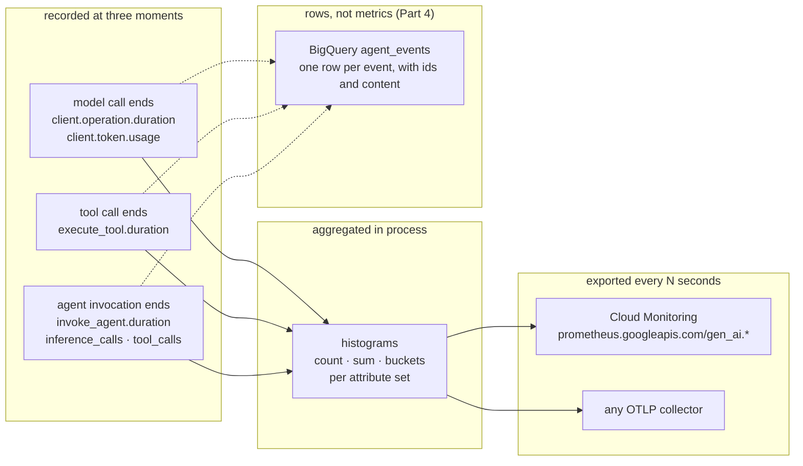

# Plan: ADK agent metrics tutorial

Folder: `ai/adk/metrics/` (new). Status: **plan complete, all six decisions settled, nothing built** (2026-09-06). Next: Stage 0. Sibling of `ai/adk/logging/`, same house style (`tutorial-style` skill), same project (`jwd-gcp-demos`), same model (Gemini 3.7 Flash via Vertex AI).

Goal: a new developer runs a small agent, watches ADK's built-in metrics appear, ships them to Cloud Monitoring, turns them into dashboards and alerts, then adds per-event analytics in BigQuery for the questions histograms cannot answer. Generate → collect → consume, in that order.

Audience: Google Cloud-first (decision 2). The primary path is `--otel_to_cloud` into Cloud Monitoring and BigQuery. Non-Google OTLP backends get one reference page, not a runnable stack.

## Reading this plan

**Citations.** `adk/<path>:<line>` means `ai/adk/logging/.venv/lib/python3.13/site-packages/google/adk/<path>` (google-adk 2.8.0, the version on PyPI today). `head/<path>` means the `adk-python` checkout at `b0180620` (2026-09-06), which is ahead of 2.8.0; used only to see where the API is going.

**Verified so far.** Only what the logging tutorial already ran (5.2, 2026-09-04) plus one read-only Monitoring API call today. Everything else is from source and docs and is marked NEEDS-RUN.

## Research findings

### Q1. What metrics does ADK emit, and when?

One meter, `gcp.vertex.agent` (`adk/telemetry/_metrics.py:56`). Every instrument is a histogram except two experimental skill counters. Nothing prints; with no `MeterProvider` installed the OTel API discards every `record()` call.

| Metric | Unit | Recorded when | Attributes | Source |
|---|---|---|---|---|
| `gen_ai.invoke_agent.duration` | s | each agent invocation ends | `gen_ai.agent.name`, `error.type` | `_metrics.py:61`, `_instrumentation.py:301` |
| `gen_ai.invoke_agent.inference_calls` | 1 | same | `gen_ai.agent.name` | `:135` |
| `gen_ai.invoke_agent.tool_calls` | 1 | same | `gen_ai.agent.name` | `:141` |
| `gen_ai.invoke_workflow.duration` | s | each workflow invocation ends | `gen_ai.operation.name=invoke_workflow`, `gen_ai.workflow.name`, `gen_ai.workflow.nested`, `error.type` | `:81`, `node_tracing.py:254` |
| `gen_ai.execute_tool.duration` | s | each tool call ends | `gen_ai.agent.name`, `gen_ai.tool.name`, `gen_ai.tool.type`, `error.type` | `:86` |
| `gen_ai.client.operation.duration` | s | each model call ends | `gen_ai.agent.name`, `gen_ai.operation.name=generate_content`, `gen_ai.provider.name`, `gen_ai.request.model`, `gen_ai.response.model`, `error.type` | semconv helper, `:119` |
| `gen_ai.client.token.usage` | {token} | each model call ends, twice | same plus `gen_ai.token.type` = `input` / `output` | `:120`, `record_client_token_usage` |
| `adk.experimental.invoke_agent.{input,output,total,cache_read.input,reasoning.output,tool.input}_tokens` | {token} | each agent invocation ends | `gen_ai.agent.name` | `:216-241` |
| `adk.experimental.invoke_workflow.*` (tokens, `inference_calls`, `tool_calls`, `skill.loads`) | mixed | workflow ends, **only under `ADK_EXPERIMENTAL_TELEMETRY`** | `adk.experimental.root_agent.name`, `gen_ai.workflow.name` | `:248-292`, `_instrumentation.py:289` |
| `adk.experimental.skill.{loads,script.executions}` | 1 (counter) | experimental only | skill attributes | `:293-305` |

Facts worth teaching:

- **The two stable-semconv metrics** are `gen_ai.client.token.usage` and `gen_ai.client.operation.duration` (OTel GenAI semconv; the openobserve and opentelemetry.io posts cover only these two). The agent- and tool-level ones follow ADK's reading of unmerged drafts. The `adk.experimental.*` names say so in the name.
- **Token usage is two datapoints per model call**, split by `gen_ai.token.type`. Input sums prompt and server-side tool tokens; output sums candidates and thoughts. Cached tokens are inside input, not separate (`_metrics.py:459-466`, `_token_usage.py:47-70`). Streaming takes the last chunk's usage, not a sum (`:451-455`).
- **`error.type` appears on tool duration even when the tool does not raise.** A tool that returns a failure status is detected and stamped (`_instrumentation.py:470-489`, `:505-525`). The demo agent's unknown-city branch exercises this for free.
- **Cardinality is bounded by design.** Skill exit codes collapse to a boolean (`:585-590`). No session, user, or invocation id is ever a metric attribute. That is the reason Part 4 exists.
- **Semconv opt-in does not rename metrics.** `_metrics.py` never reads `OTEL_SEMCONV_STABILITY_OPT_IN`; it governs spans and events only.

Head differences (`head/telemetry/_metrics.py`, `_instrumentation.py:320-375`): per-invocation totals move into an `_AgentInvocationScope`, and skill-load histograms join the flush. Names above are unchanged. Verify against 2.8.0; note head in the reference page only.

### Q2. How do they leave the process?

Same three routes as the logging tutorial, with metric-specific details:

| Route | Reader | Interval | Source |
|---|---|---|---|
| `--otel_to_cloud` (CLI) | `PeriodicExportingMetricReader` → OTLP/HTTP `telemetry.googleapis.com/v1/metrics` | **5 s** (`MIN_EXPORT_INTERVAL_MS`) | `google_cloud.py:262-280`, `_agent_engine_metric_exporter.py:162`; `api_server.py:707-709` passes all three `enable_cloud_*=True` |
| `OTEL_EXPORTER_OTLP_METRICS_ENDPOINT` (or the base var), CLI or `maybe_set_otel_providers()` | `PeriodicExportingMetricReader` over the generic OTLP/HTTP exporter | 60 s default, `OTEL_METRIC_EXPORT_INTERVAL` | `setup.py:124-147` |
| Your own server | `get_gcp_exporters(enable_cloud_metrics=True)` + `maybe_set_otel_providers([hooks])` | 5 s | adk.dev metrics page; same as logging 5.5 with one flag changed |
| Agent Runtime (`GOOGLE_CLOUD_AGENT_ENGINE_ID` set) | `_RequestDrivenMetricReader`: collects on the request lifecycle, no daemon thread | request-driven | `_agent_engine.py:230-273`, `_agent_engine_metric_exporter.py:192-221` |

Carry-overs from the logging plan that bite harder here:

- **Metrics need a real resource locally.** The Telemetry API stores OTLP metrics on `prometheus_target`, which needs `instance` and `location`. On a laptop set `OTEL_RESOURCE_ATTRIBUTES="service.instance.id=laptop-1,cloud.region=us-central1"` or every 5 s batch is a 400 (logging 5.2 deep dive, verified). Cloud Run and Agent Runtime supply these through the resource detector.
- **Shell exports, not `.env`, for CLI servers.** Same timing reason (`agent_loader.py:331-332` vs `api_server.py:1173`).
- **`shutdown_on_exit=False`** on the `MeterProvider` (`setup.py:96-103`): a script that exits within 5 s of its last turn exports nothing. Example scripts must `force_flush()` or sleep. Teach this in 1.1; it is the first thing a new developer hits.
- **Possible doubling.** The metric descriptors in `jwd-gcp-demos` carry `otel_scope_gcp.client.*` and `gen_ai.system` labels on the two client metrics, which ADK's meter does not set. The `[otel-gcp]` GenAI instrumentor appears to emit its own `gen_ai.client.token.usage` under a second scope. If so, "total tokens" doubles unless you filter on `otel_scope_name`. NEEDS-RUN (open question 2); either way it is a page.

### Q3. What do they look like in Cloud Monitoring?

Read-only Monitoring API call today (`metricDescriptors.list`, project `jwd-gcp-demos`, filter `prometheus.googleapis.com/gen_ai`): seven descriptors, all `CUMULATIVE DISTRIBUTION`.

| Descriptor | Labels beyond `otel_scope_*` |
|---|---|
| `prometheus.googleapis.com/gen_ai.client.operation.duration/histogram` | `gen_ai.agent.name`, `gen_ai.operation.name`, `gen_ai.provider.name`, `gen_ai.system`, `gen_ai.request.model`, `gen_ai.response.model`, `error.type` |
| `prometheus.googleapis.com/gen_ai.client.token.usage/histogram` | same plus `gen_ai.token.type` |
| `prometheus.googleapis.com/gen_ai.execute_tool.duration/histogram` | `gen_ai.agent.name`, `gen_ai.tool.name`, `gen_ai.tool.type` |
| `prometheus.googleapis.com/gen_ai.invoke_agent.duration/histogram` | `gen_ai.agent.name`, `error.type` |
| `prometheus.googleapis.com/gen_ai.invoke_agent.inference_calls/histogram` | `gen_ai.agent.name` |
| `prometheus.googleapis.com/gen_ai.invoke_agent.tool_calls/histogram` | `gen_ai.agent.name` |
| `prometheus.googleapis.com/gen_ai.invoke_workflow.duration/histogram` | `gen_ai.operation.name`, `gen_ai.workflow.name` |

Not present: any `adk.experimental.*` series, although 2.8.0's `_flush_invoke_agent_metrics` records them ungated (`_instrumentation.py:275-280`). Either the 5.2 runs never accumulated totals or the descriptor list is filtered. NEEDS-RUN (open question 3).

Naming rule (docs.cloud.google.com OTLP metric ingestion overview): `prometheus.googleapis.com/<otlp name>/<point kind>`; dots survive; PromQL needs the UTF-8 form `{"gen_ai.client.token.usage"}` for dotted names. Whether the histogram is addressed as `..._bucket`/`_sum`/`_count` or as a native histogram in Cloud Monitoring's PromQL is not documented for dotted names. NEEDS-RUN (open question 1). Fallback for reproducible console captures: the Monitoring API `timeSeries.list` with `ALIGN_DELTA` / `ALIGN_PERCENTILE_95`, or the PromQL HTTP endpoint `monitoring.googleapis.com/v1/projects/{p}/location/global/prometheus/api/v1/query`.

IAM and API: `telemetry.googleapis.com` enabled; `roles/telemetry.metricsWriter` or `roles/telemetry.writer` (logging 5.2 deep dive). Reading: `roles/monitoring.viewer`.

### Q4. What does BigQuery Agent Analytics add?

`BigQueryAgentAnalyticsPlugin(project_id, dataset_id, table_id="agent_events", config=BigQueryLoggerConfig(...), location="US", credentials=None)` (`adk/plugins/bigquery_agent_analytics_plugin.py:4183-4192`). One row per lifecycle event, written through the Storage Write API in batches (`batch_size=1`, `batch_flush_interval=1.0` s, `flush_on_run_end=True` by default; `:1814-1872`). The dataset must exist; the plugin creates the table and, with `create_views=True`, one view per event type named `v_<event_type>` (`:5103-5113`).

| What | Detail |
|---|---|
| Columns | `timestamp`, `event_id`, `event_type`, `agent`, `session_id`, `invocation_id`, `user_id`, `trace_id`, `span_id`, `parent_span_id`, `content` (JSON), `attributes` (JSON), `latency_ms` (JSON), `status`, `error_message`, `content_parts`, `is_truncated` (`:3570-3830`) |
| Event types | `USER_MESSAGE_RECEIVED`, `INVOCATION_STARTING/COMPLETED`, `AGENT_STARTING/COMPLETED/RESPONSE/TRANSFER`, `LLM_REQUEST/RESPONSE/ERROR`, `TOOL_STARTING/COMPLETED/ERROR/PAUSED`, `STATE_DELTA`, `EVENT_COMPACTION`, HITL and A2A types (adk.dev plugin page; `:3968-4109`) |
| Token and latency columns in `v_llm_response` | `usage_prompt_tokens`, `usage_completion_tokens`, `usage_total_tokens`, `usage_cached_tokens`, `usage_thinking_tokens`, `usage_tool_use_tokens`, `context_cache_hit_rate`, `total_ms`, `ttft_ms`, `model_version` (`:3918-3965`) |
| OTel join | `enable_otel_correlation=False` by default; `True` stamps the ambient trace and span ids (`:1848`). Metrics carry no ids, so the join is rows ↔ Cloud Trace, never rows ↔ metrics. |
| IAM | `roles/bigquery.jobUser` (project), `roles/bigquery.dataEditor` (dataset or table); Storage Write API is billed ingestion |
| SDK | `bigquery-agent-analytics` 0.5.2 on PyPI: `Client(project_id, dataset_id).get_trace(id).render()`, system evaluator (latency, turn count, tool error rate, token efficiency, TTFT, cost), `bq-agent-sdk` CLI, and a 37-chart Looker Studio template that needs only the base table (`dashboard/looker_studio/README.md`) |
| Sample | `adk-samples/python/agents/agent-observability-bq`: plugin in an `App(plugins=[...])`, dataset id from `BQ_ANALYTICS_DATASET_ID`, `bq mk --location=us-east1 --dataset` first |

The contrast that organizes Part 4: metrics answer "how much, how fast, how often, by which dimension" in near real time and at fixed cardinality. Rows answer "which session, which prompt, which tool call, at what cost", minutes later, at any cardinality.

### Q5. Third-party backends

- adk.dev metrics page: the env-var route, `OTEL_EXPORTER_OTLP_METRICS_ENDPOINT` then `adk web`; backends listed: Prometheus, Datadog, SigNoz, Cloud Monitoring, any OTLP.
- SigNoz: the guide instruments through `openinference-instrumentation-google-adk` plus an explicit `MeterProvider`, not ADK's native meter. Its dashboard (JSON at `github.com/SigNoz/dashboards/.../google-adk/google-adk-dashboard.json`) has token usage split and over time, error rate, p95 latency, request duration, model and agent distribution, requests over time. That panel list is a good target list for the Cloud Monitoring dashboard in Part 3, built from ADK's own metrics.
- ADK exports http/protobuf only (logging 5.7).

## Governing model

One idea for the whole tutorial: **a metric is a number recorded into a histogram at one of three moments, tagged with a handful of attributes, and aggregated before you ever see it.**

Misconceptions to name and correct with output:

| Misconception | Corrected on |
|---|---|
| "Metrics print somewhere by default." | 1.1: nothing until a reader is installed; the console reader shows the first datapoint. |
| "A token metric is a counter I can sum." | 1.2: it is a histogram; `sum` is the tokens, `count` is the calls, buckets give the distribution. |
| "I can find one user's slow request in metrics." | 1.3 and 4.6: attributes are bounded; ids live in rows. |
| "It exported; I just cannot find it." | 2.1: the 400 from a missing resource, the 5 s interval, and the `/histogram` suffix. |
| "Total tokens on the dashboard is right." | 2.1 or 2.6: two scopes may emit the client metrics; filter on `otel_scope_name`. |
| "BigQuery replaces Cloud Monitoring." | 4.6: the comparison table. |

## Scope

**In scope**

| File | Role |
|---|---|
| `ai/adk/metrics/README.md`, `TUTORIAL.md`, `CLAUDE.md` | Index, model diagram, *Verified against*, files table, quick start, tutorial-specific conventions |
| `tutorial/00-setup.md` | venv, `.env`, `env.sh`, APIs (`telemetry`, `monitoring`, `bigquery`, `bigquerystorage`), the demo agent |
| `tutorial/part-1..4/` | Pages below |
| `tutorial/how-to-choose.md` | Signal catalog, decision table, verification status, references |
| `demo_agent/` | The logging tutorial's weather agent, copied (not shared) and given a second tool. `get_weather(city)` stays instant with the success/error branch; `get_forecast(city, days)` sleeps 0.3–1.5 s and returns more text. Two tools of different latency is the whole reason the tool and token distributions have shape. Decision 1: chosen for simple-but-realistic; a single agent, no workflow. |
| `examples/01_console_metrics.py` | Script runner with a console metric reader and a `force_flush()`; the first datapoint |
| `examples/02_two_attribute_sets.py` | Same, one good city and one unknown city; `error.type` appears |
| `examples/03_metrics_server.py` | Minimal server, `get_gcp_exporters(enable_cloud_metrics=True)`; the logging 5.5 shape with one flag flipped |
| `examples/04_bq_plugin.py` | The 03 server plus `BigQueryAgentAnalyticsPlugin` |
| `queries/` | PromQL and SQL files the pages paste, one per recipe; `dashboard.json`, `alert-policy.json` |
| `load/turns.sh` | Fires N turns with a mix of cities so histograms have shape; used by 2.1 onward |
| `deploy/Dockerfile.metrics_server`, `deploy/env/` | Cloud Run and Agent Runtime, same pattern as logging |
| `requirements.txt` | `google-adk[otel-gcp]>=2.8.0`, `opentelemetry-exporter-otlp-proto-http`, `google-cloud-bigquery`, `google-cloud-bigquery-storage`, `bigquery-agent-analytics` |

**Out of scope.** Logs and traces beyond one cross-reference page each (the logging tutorial owns them). Custom metrics from your own code (one deep dive: `metrics.get_meter(...)` shares the provider ADK installs). Evaluation and LLM-judge features of the BigQuery SDK. Kotlin, Java, Go. Datadog and Prometheus-native setups beyond the OTLP env-var route. Modifying the logging tutorial.

## Target shape

Budgets: 200–750 words per subtask page, about 200 per landing page, one Mermaid diagram per roughly four pages (index, 1.0, 2.0, 4.6). Prompt: "What's the weather in London?" for single turns; `load/turns.sh` for volume.

**Part 1 · What a metric is (local, no cloud)**

| § | Content | Verify |
|---|---|---|
| index | The three moments, seven names, and "nothing prints" | words |
| 1.1 Your first datapoint | `01_console_metrics.py`: `maybe_set_otel_providers([OTelHooks(metric_readers=[PeriodicExportingMetricReader(ConsoleMetricExporter(), 1000)])])`, one London turn, `force_flush()`. Output: the seven histograms. **What you are looking at**: `count`, `sum`, `bucket_counts`, `explicit_bounds`, `attributes`. Deep dive: why the script needs `force_flush()` (`shutdown_on_exit=False`). | console shows 7 names, token usage twice |
| 1.2 Reading a histogram | Same output, two findings: `token.usage` `sum` is the tokens and `count` the calls; `inference_calls` records 2 for one turn (call, tool, call). Table: metric → question it answers. | matches 1.1 capture |
| 1.3 Attributes and cardinality | `02_two_attribute_sets.py`: London then Atlantis. `execute_tool.duration` now has two series, one with `error.type`. Deep dive: why no session id is an attribute; what a cardinality explosion costs. | two attribute sets in output |
| 1.4 The experimental family | `ADK_EXPERIMENTAL_TELEMETRY=true` and the `adk.experimental.*` names; per-invocation token totals; stability warning. Short page. | names appear, or the page states what 2.8.0 emits (Q3 open) |
| 1.5 Workflow-grain metrics (reference) | The one page with a second sub-agent. A tiny `SequentialAgent` (planner → weather) so `gen_ai.invoke_workflow.duration` and, under opt-in, `adk.experimental.invoke_workflow.*` fire. Shows the family once, explains `gen_ai.workflow.name` and the root-agent attribute, and returns to the single agent for the rest. Reference page, may exceed the word budget. | workflow series appear on the console reader |

**Part 2 · Collect**

| § | Content | Verify |
|---|---|---|
| index | Pipeline diagram: process → reader → `telemetry.googleapis.com` → `prometheus_target` series | words |
| 2.1 `adk web --otel_to_cloud` | Three exports (`OTEL_RESOURCE_ATTRIBUTES`, service name), `load/turns.sh` for 20 turns, wait 10 s, confirm the series exists with one Monitoring API read: `gen_ai.client.token.usage` by `gen_ai.token.type`. Just "did it land?"; how to read metrics well is Part 3. Deep dive: the 400 (link to logging 5.2), the 5 s interval, the `/histogram` suffix, `otel_scope_name` if doubling is real. | series present, sums match the console totals from 1.1 within one turn |
| 2.2 What arrived | The descriptor list for `prometheus.googleapis.com/gen_ai.*` (a real capture, as read today), one per metric with its labels. Confirms the seven metrics from Part 1 all made it and names their Cloud Monitoring labels. No query language yet. | descriptor list matches the seven names |
| 2.3 `adk api_server` and Cloud Run | `adk deploy cloud_run --otel_to_cloud`, curl turns, read back; no `OTEL_RESOURCE_ATTRIBUTES`; resource labels come from the detector. Teardown. | series with `cloud.region` from the detector |
| 2.4 Your own server | `03_metrics_server.py`, `.env` works here; `enable_cloud_metrics=True`. Local run, read back. | series with `job` = `OTEL_SERVICE_NAME` |
| 2.5 Agent Runtime | One deploy with `--otel_to_cloud`, query, read back. The request-driven reader explained in one paragraph. If nothing surfaces (as for logs and traces in the logging tutorial), state the negative. | series or a documented negative |
| 2.6 Other backends | Env-var route, `OTEL_METRIC_EXPORT_INTERVAL`, http/protobuf only, SigNoz as a documented example. Reference only unless decision 2 says otherwise. | words; links |

**Part 3 · Consume: signals from histograms**

| § | Content | Verify |
|---|---|---|
| index | The four questions an operator asks: how slow, how many, how often failing, how much | words |
| 3.1 Latency, three ways | p50/p95 of `invoke_agent.duration` and `client.operation.duration` by model; tool latency by tool. The first read-back page: shows the same percentile signal three ways (Metrics Explorer Console for orientation, the Monitoring API `timeSeries.list` for programmatic access, the PromQL endpoint via `curl`), then declares PromQL the path the rest of Part 3 uses. Decision 4. PromQL in `queries/`. | API and PromQL read-backs agree on the percentile |
| 3.2 Volume and shape | Turns per minute from `invoke_agent.duration` count; `inference_calls` and `tool_calls` distributions; "a turn that used 6 model calls" as a signal. PromQL only. | read-back |
| 3.3 Errors | Tool error ratio from `error.type` series over all series; model error ratio. Make Atlantis 30% of `turns.sh`. | ratio matches the mix |
| 3.4 Tokens and cost | Tokens per minute by type; cost as `sum × price` in the query; why the average is misleading; caching visible only in rows (4.2). | read-back |
| 3.5 A dashboard | `gcloud monitoring dashboards create --config-from-file=queries/dashboard.json`, PromQL widgets for 3.1–3.4, mirroring the SigNoz panel list. Teardown. | dashboard exists; widgets render |
| 3.6 An alert | PromQL alert policy: tool error ratio > 20% for 5 min. Trigger it with `turns.sh` at 50% Atlantis, capture the opened incident, teardown. | incident opens and is captured |

**Part 4 · Consume: rows in BigQuery**

| § | Content | Verify |
|---|---|---|
| index | Why histograms stop answering questions; the plugin in one line | words |
| 4.1 One line, one table | `bq mk` the dataset, `04_bq_plugin.py`, ten turns, `bq query` count by `event_type`. **What you are looking at**: the columns. Deep dive: Storage Write API, batching, `flush_on_run_end`, IAM. | rows appear; the view list |
| 4.2 Tokens, latency, cache per call | `v_llm_response`: tokens per session, `ttft_ms`, `context_cache_hit_rate`; per-tool latency and errors from `v_tool_completed` / `v_tool_error`. Compare one number with the Part 3 histogram sum. | numbers match within the run |
| 4.3 Cost per session and per user | The SQL that metrics cannot do: group by `session_id`, `user_id`; find the most expensive turn and its prompt. Privacy note: content is in the table. | query output |
| 4.4 The SDK | `pip install bigquery-agent-analytics`, `Client().get_trace().render()` for one invocation, the system evaluator summary (latency, token efficiency, cost, TTFT), and one or two `bq-agent-sdk` CLI commands. Captured where the command prints. | render and CLI output |
| 4.5 The Looker Studio template | The 37-chart template configured against `agent_events`: the three setup steps, what the chart groups show. Browser step, no captured console output. | template opens on real data |
| 4.6 Metrics or rows | Comparison table: latency to visibility, cardinality, cost, retention, content, alerting, join keys. `enable_otel_correlation` and the trace join. Diagram. | words |

**How to choose & reference.** Signal catalog (metric → question → PromQL file), decision table (Cloud Monitoring vs BigQuery vs OTLP backend), 2.8.0 vs head notes, verification status, **Not verified** table, references (adk.dev metrics, OTel GenAI semconv, Cloud OTLP metrics overview, BigQuery Agent Analytics docs and SDK, SigNoz dashboard).

## Decisions needed (Jeff)

| # | Question | Options | Recommendation |
|---|---|---|---|
| 1 | Demo agent shape | (a) copy the weather agent, add `get_forecast` with a sleep; (b) share across folders; (c) a multi-tool research agent; (d) a two-agent workflow | **Decided: (a).** Simple but realistic: one new tool on a known agent, two latency profiles, the error branch for free. Single agent, so workflow-grain metrics get one reference page (see below), not core coverage. |
| 2 | Run a non-Google backend? | (a) reference only, like logging 5.7; (b) local Collector + Prometheus, captured; (c) local SigNoz, captured | **Decided: (a).** Reader is Google Cloud-first, so the non-Google path is a documented footnote, not a runnable stack. 2.6 stays reference-only; effort goes to Cloud Monitoring (Part 3) and BigQuery (Part 4). |
| 3 | Agent Runtime metrics (2.5) | (a) deploy and test; (b) reference only, citing the logging verified negative | **Decided: (a).** One deploy with `--otel_to_cloud`, fire turns, query Cloud Monitoring for `gen_ai.*` series. The request-driven reader (`_RequestDrivenMetricReader`) is metrics-specific and untested; the logging tutorial's negative was for logs and traces, so metrics could differ. Page 2.5 reports whatever surfaces, positive or negative, from a real run. |
| 4 | Part 3 read-back mechanism | (a) Monitoring API `timeSeries.list`; (b) PromQL HTTP endpoint via `curl`; (c) Metrics Explorer Console | **Decided: all three once, then (b) for the rest.** 3.1 (or 3.2, the first read-back page) shows the same signal three ways: the Console for orientation, the Monitoring API for programmatic access, the PromQL endpoint for the query language. Later pages (3.3, 3.4) use PromQL only, captured via `curl`. Console appears as a labeled screenshot-free description, not captured output. Falls back to (a) as the captured path if PromQL cannot address the dotted names (open question 1). |
| 5 | BigQuery SDK depth (4.4) | (a) `get_trace().render()` plus the evaluator; (b) also the CLI and Looker template; (c) drop the SDK, keep SQL | **Decided: (a) + (b).** Full SDK coverage: `Client().get_trace().render()`, the system evaluator (latency, token efficiency, cost, TTFT), the `bq-agent-sdk` CLI, and the 37-chart Looker Studio template. Likely splits into two pages, 4.4 SDK and 4.5 template + dashboard, pushing "metrics or rows" to 4.6. Template and dashboard are browser steps, not captured console output. |
| 6 | Alert trigger (3.6) | (a) fire it for real and capture the incident; (b) create the policy, do not trigger | **Decided: (a).** Create the PromQL alert policy, run `turns.sh` at ~50% Atlantis to push the tool error ratio over threshold, capture the opened incident, then delete the policy. A real incident block is the payoff. |

## Stages

Each stage leaves the folder coherent if work stops after it. M = mechanical, J = judgment.

### Stage 0 · Settle open questions with three runs (J)

- [ ] Q-open 1: PromQL name form for dotted histograms. Run `curl` against the PromQL endpoint with `{"gen_ai.client.token.usage"}` variants; record what works.
- [ ] Q-open 2: doubling. Run `01_console_metrics.py` with and without `[otel-gcp]`; count `gen_ai.client.token.usage` scopes.
- [ ] Q-open 3: does 2.8.0 emit `adk.experimental.invoke_agent.*_tokens` by default? Same script; grep the console output.
- [ ] Q-open 4: `force_flush()` vs `shutdown()` for the script examples.

Verify: findings written into Research findings here before any page is drafted.

### Stage 1 · Scaffold and Part 1 (J)

- [ ] `README.md`, `TUTORIAL.md`, `CLAUDE.md`, `00-setup.md`, `demo_agent/`, `requirements.txt`, `env.sh.example`, `.env.example`.
- [ ] `01_console_metrics.py`, `02_two_attribute_sets.py`.
- [ ] Pages 1.0–1.4 with captured console output.
- [ ] Rewrite and review 1.1 and 1.3 as exemplars before drafting the rest.

Verify: both scripts print seven metric names; 1.3 shows two attribute sets on `execute_tool.duration`; word budgets met.

### Stage 2 · Part 2 collect (J; cloud writes)

- [ ] `load/turns.sh`; 2.1 local `--otel_to_cloud` with read-back; 2.2 PromQL page.
- [ ] 2.3 Cloud Run deploy, read-back, teardown.
- [ ] `03_metrics_server.py`; 2.4 local run.
- [ ] 2.5 Agent Runtime: deploy with `--otel_to_cloud`, fire turns, query Cloud Monitoring; report series or a documented negative; teardown.
- [ ] 2.6 reference page per decision 2.

Verify: each page's read-back block is a real capture; series counts reconcile with the number of turns fired.

### Stage 3 · Part 3 consume (J; cloud writes)

- [ ] `queries/*.promql`, `dashboard.json`, `alert-policy.json`.
- [ ] 3.1–3.4 with read-back captures; 3.5 dashboard create and teardown; 3.6 alert: create, fire with `turns.sh` at ~50% Atlantis, capture the incident, teardown.

Verify: every query file is pasted verbatim on exactly one page; dashboard and policy deleted after capture.

### Stage 4 · Part 4 BigQuery (J; cloud writes)

- [ ] `bq mk` dataset; `04_bq_plugin.py`; 4.1–4.3 with `bq query` captures.
- [ ] 4.4 SDK (`render`, evaluator, CLI); 4.5 Looker Studio template; 4.6 comparison page.
- [ ] Dataset teardown step on 4.1 or the reference page.

Verify: 4.2's per-run token total equals the Part 3 histogram `sum` for the same run window (state the tolerance).

### Stage 5 · Reference page, cross-links, link check (M)

- [ ] `how-to-choose.md` with the signal catalog and verification status.
- [ ] Nav blocks, part TOCs, index table, README files table.
- [ ] `lychee --offline 'ai/adk/metrics/**/*.md'` or equivalent; grep for NEEDS-RUN and "illustrative" labels.

Verify: link check passes; every console block is either captured or labeled.

## Verification

Common harness: fresh `python3.13 -m venv .venv`, `pip install -r requirements.txt`, `.env` from `.env.example`, `source env.sh`, APIs enabled, ADC as owner. Prompt "What's the weather in London?"; Atlantis for the error branch; `load/turns.sh N [error_ratio]` for volume.

| Stage | Runs | Pass condition | Status |
|---|---|---|---|
| 0 | three local scripts, one `curl` | open questions 1–4 answered in this file | not started |
| 1 | `01`, `02` locally | seven names; two attribute sets; `force_flush` behavior documented | not started |
| 2 | `adk web --otel_to_cloud`; Cloud Run deploy; `03` locally; Agent Runtime deploy | series readable for each route; resources torn down | not started |
| 3 | PromQL reads; dashboard create; alert create and trigger | captures match the fired mix; dashboard and policy deleted | not started |
| 4 | `04` locally; `bq query`; SDK render | row counts match turns; token totals reconcile with Part 3 | not started |
| 5 | none | links resolve; labels present | not started |

## Open questions

1. **PromQL addressing of dotted histogram names** in Cloud Monitoring (`_bucket` suffix or native). Stage 0.
2. **Does `[otel-gcp]` emit a second `gen_ai.client.*` scope?** The descriptor labels (`otel_scope_gcp.client.*`, `gen_ai.system`) suggest yes. Stage 0.
3. **Does 2.8.0 emit `adk.experimental.invoke_agent.*_tokens` without opt-in?** Source says yes (`_instrumentation.py:275-280`); the project's descriptor list says no. Stage 0.
4. **Script flush.** `MeterProvider(shutdown_on_exit=False)`; confirm `metrics.get_meter_provider().force_flush()` is enough for `01`/`02`. Stage 0.
5. **Agent Runtime metrics** via `_RequestDrivenMetricReader`: does anything land, given the verified negative for logs and traces? Stage 2, decision 3.
6. **Cost figures.** Prices change; use a placeholder variable in the PromQL and say so, or drop dollars and show tokens only. Recommendation: tokens, with one sentence on multiplying by a price.
