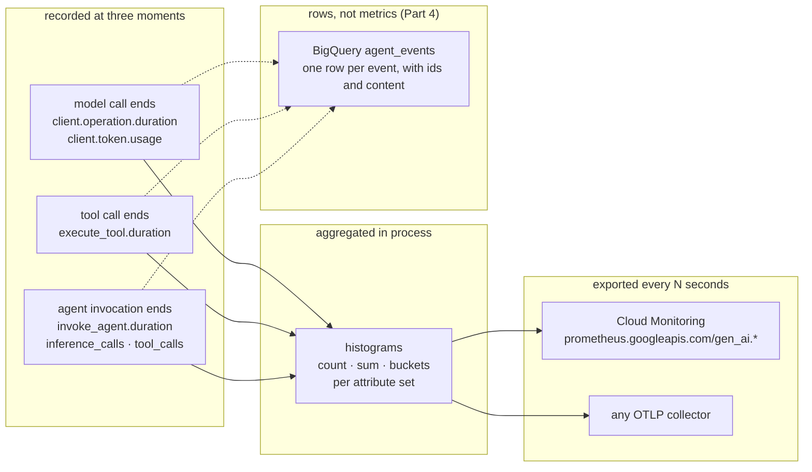

# Plan: ADK agent metrics tutorial

Folder: `ai/adk/metrics/` (new). Status: **Stage 0 done, Stage 1 in progress** (2026-09-06; plan revised the same day: scenario spine, task-outcome page, verification tables; Stage 0 ran the four probes and settled open questions 1–4). Next: finish Stage 1 (scaffold and Part 1 pages). Sibling of `ai/adk/logging/`, same house style (`tutorial-style` skill), same project (`jwd-gcp-demos`), same model (Gemini 3.7 Flash via Vertex AI).

Goal: a new developer runs a small agent, watches ADK's built-in metrics appear, ships them to Cloud Monitoring, turns them into dashboards and alerts, then adds per-event analytics in BigQuery for the questions histograms cannot answer. Generate → collect → consume, in that order. The reader adds code to the agent exactly once, for the one custom instrument in 3.7.

Audience: Google Cloud-first (decision 2). The primary path is `--otel_to_cloud` into Cloud Monitoring and BigQuery. Non-Google OTLP backends get one reference page, not a runnable stack.

## Reading this plan

**Citations.** `adk/<path>:<line>` means `ai/adk/logging/.venv/lib/python3.13/site-packages/google/adk/<path>` (google-adk 2.8.0, the version on PyPI today). `head/<path>` means the `adk-python` checkout at `b0180620` (2026-09-06), which is ahead of 2.8.0; used only to see where the API is going.

**Verified so far.** The logging tutorial's 5.2 run (2026-09-04), one read-only Monitoring API call, and Stage 0's four probes (2026-09-06): two local console runs plus one bounded cloud write of five turns into `jwd-gcp-demos`, read back through the PromQL endpoint. Open questions 1–4 are resolved below. Everything past Stage 0 is still from source and docs. The **Not verified** table under Verification is the single status board; each inline NEEDS-RUN marker names the row that resolves it.

**Stage 0 findings (2026-09-06).** Recorded here before any page is drafted, per the stage's exit rule.

- **Q1 (PromQL name form) — resolved.** Cloud Monitoring exposes a dotted histogram as classic suffixed series inside the UTF-8 brace form: `{"gen_ai.client.token.usage_sum"}`, `..._count`, `..._bucket`. The bare native form `{"gen_ai.client.token.usage"}` and `histogram_sum(...)` both return zero series. Part 3 queries use the `_sum`/`_count`/`_bucket` suffixes. (Not verified row 4 → verified.)
- **Q2 (scope doubling) — resolved, no doubling.** Across five turns, `{"gen_ai.client.token.usage_count"}` read 10 input and 10 output, and `count by (otel_scope_name)` returned exactly one scope, `gcp.vertex.agent`. The `[otel-gcp]` second-scope suspicion does not reproduce on this project; token sums are not doubled. The 3.4 deep dive keeps the `otel_scope_name` filter as defensive hygiene but drops the "doubling is likely" framing. (Not verified row 5 → verified negative.)
- **Q3 (experimental by default) — resolved, gated.** With no `ADK_EXPERIMENTAL_TELEMETRY`, the console reader showed six names and zero `adk.experimental.*`; with the flag, six experimental token names appeared. `_flush_invoke_agent_metrics` is gated on `should_emit_experimental_telemetry` (`_instrumentation.py:289`), so the plan's earlier "records them ungated" reading was wrong. The Cloud Monitoring descriptor list showing no experimental series is consistent: the 5.2 runs simply never set the flag. (Not verified row 6 → verified.)
- **Q4 (script flush) — resolved.** `metrics.get_meter_provider().force_flush()` returns `True` and drains the periodic reader before the script exits; the six names and their datapoints are present in the captured output. `force_flush()` is enough for the example scripts; no `sleep` needed. (Not verified row 3 → verified.)
- **Bonus finding (Part 1 catalog).** A **single agent emits six** metric names, not seven. `gen_ai.invoke_workflow.duration` fires only when a workflow (e.g. `SequentialAgent`) runs, which is 1.5's job. Every single-agent page in Part 1 says six; the seventh is introduced in 1.5. The Q1 table below keeps all seven for the full catalog and marks the workflow row workflow-only.
- **Bonus finding (script resource).** The raw `get_gcp_exporters` path (examples 03/04, not `adk web`) needs **`gcp.project_id` in `OTEL_RESOURCE_ATTRIBUTES`** or every batch is a 400 whose body reads `Resource is missing required attribute "gcp.project_id"`. `adk web --otel_to_cloud` injects it; a standalone script does not. Distinct from the logging 5.2 `prometheus_target` region/instance 400. Page 2.4 (own server) must set `gcp.project_id`; 2.1 (`adk web`) still sets only `service.instance.id` and `cloud.region`.

**Scenarios.** Every page runs one named scenario from `tutorial/scenarios.md` (the matrix under Target shape) and answers one operational question. The page tables carry both.

## Research findings

### Q1. What metrics does ADK emit, and when?

One meter, `gcp.vertex.agent` (`adk/telemetry/_metrics.py:56`). Every instrument is a histogram except two experimental skill counters. Nothing prints; with no `MeterProvider` installed the OTel API discards every `record()` call.

| Metric | Unit | Recorded when | Attributes | Source |
|---|---|---|---|---|
| `gen_ai.invoke_agent.duration` | s | each agent invocation ends | `gen_ai.agent.name`, `error.type` | `_metrics.py:61`, `_instrumentation.py:301` |
| `gen_ai.invoke_agent.inference_calls` | 1 | same | `gen_ai.agent.name` | `:135` |
| `gen_ai.invoke_agent.tool_calls` | 1 | same | `gen_ai.agent.name` | `:141` |
| `gen_ai.invoke_workflow.duration` | s | each workflow invocation ends | `gen_ai.operation.name=invoke_workflow`, `gen_ai.workflow.name`, `gen_ai.workflow.nested`, `error.type` | `:81`, `node_tracing.py:254` |
| `gen_ai.execute_tool.duration` | s | each tool call ends | `gen_ai.agent.name`, `gen_ai.tool.name`, `gen_ai.tool.type`, `error.type` | `:86` |
| `gen_ai.client.operation.duration` | s | each model call ends | `gen_ai.agent.name`, `gen_ai.operation.name=generate_content`, `gen_ai.provider.name`, `gen_ai.request.model`, `gen_ai.response.model`, `error.type` | semconv helper, `:119` |
| `gen_ai.client.token.usage` | {token} | each model call ends, twice | same plus `gen_ai.token.type` = `input` / `output` | `:120`, `record_client_token_usage` |
| `adk.experimental.invoke_agent.{input,output,total,cache_read.input,reasoning.output,tool.input}_tokens` | {token} | each agent invocation ends | `gen_ai.agent.name` | `:216-241` |
| `adk.experimental.invoke_workflow.*` (tokens, `inference_calls`, `tool_calls`, `skill.loads`) | mixed | workflow ends, **only under `ADK_EXPERIMENTAL_TELEMETRY`** | `adk.experimental.root_agent.name`, `gen_ai.workflow.name` | `:248-292`, `_instrumentation.py:289` |
| `adk.experimental.skill.{loads,script.executions}` | 1 (counter) | experimental only | skill attributes | `:293-305` |

Facts worth teaching:

- **The two stable-semconv metrics** are `gen_ai.client.token.usage` and `gen_ai.client.operation.duration` (OTel GenAI semconv; the openobserve and opentelemetry.io posts cover only these two). The agent- and tool-level ones follow ADK's reading of unmerged drafts. The `adk.experimental.*` names say so in the name.
- **Token usage is two datapoints per model call**, split by `gen_ai.token.type`. Input sums prompt and server-side tool tokens; output sums candidates and thoughts. Cached tokens are inside input, not separate (`_metrics.py:459-466`, `_token_usage.py:47-70`). Streaming takes the last chunk's usage, not a sum (`:451-455`).
- **`error.type` on tool duration is NOT free (Stage 1, corrected).** A plain function returning `{"status": "error"}` does not stamp `error.type`. ADK reads the response only through `FunctionTool._detect_error_in_response`, which the base class leaves returning `None` (`flows/llm_flows/functions.py:88,695`; `_instrumentation.py:525`). The demo agent wraps its tools in a `StatusAwareTool(FunctionTool)` that overrides the hook to map a failure status to `error.type="lookup_failed"` (renamed from `no_data`, which read as "no metric data"; `lookup_failed` names the failure category so a future `timeout` sits beside it). A raising tool also stamps `error.type` (the exception class name) but crashes the invocation, so the hook is the path that keeps the invocation successful while the tool series splits. This is 1.3's lesson, verified 2026-09-06.
- **Cardinality is bounded by design.** Skill exit codes collapse to a boolean (`:585-590`). No session, user, or invocation id is ever a metric attribute. That is the reason Part 4 exists.
- **Semconv opt-in does not rename metrics.** `_metrics.py` never reads `OTEL_SEMCONV_STABILITY_OPT_IN`; it governs spans and events only.

Head differences (`head/telemetry/_metrics.py`, `_instrumentation.py:320-375`): per-invocation totals move into an `_AgentInvocationScope`, and skill-load histograms join the flush. Names above are unchanged. Verify against 2.8.0; note head in the reference page only.

### Q2. How do they leave the process?

Same three routes as the logging tutorial, with metric-specific details:

| Route | Reader | Interval | Source |
|---|---|---|---|
| `--otel_to_cloud` (CLI) | `PeriodicExportingMetricReader` → OTLP/HTTP `telemetry.googleapis.com/v1/metrics` | **5 s** (`MIN_EXPORT_INTERVAL_MS`) | `google_cloud.py:262-280`, `_agent_engine_metric_exporter.py:162`; `api_server.py:707-709` passes all three `enable_cloud_*=True` |
| `OTEL_EXPORTER_OTLP_METRICS_ENDPOINT` (or the base var), CLI or `maybe_set_otel_providers()` | `PeriodicExportingMetricReader` over the generic OTLP/HTTP exporter | 60 s default, `OTEL_METRIC_EXPORT_INTERVAL` | `setup.py:124-147` |
| Your own server | `get_gcp_exporters(enable_cloud_metrics=True)` + `maybe_set_otel_providers([hooks])` | 5 s | adk.dev metrics page; same as logging 5.5 with one flag changed |
| Agent Runtime (`GOOGLE_CLOUD_AGENT_ENGINE_ID` set) | `_RequestDrivenMetricReader`: collects on the request lifecycle, no daemon thread | request-driven | `_agent_engine.py:230-273`, `_agent_engine_metric_exporter.py:192-221` |

Carry-overs from the logging plan that bite harder here:

- **Metrics need a real resource locally.** The Telemetry API stores OTLP metrics on `prometheus_target`, which needs `instance` and `location`. On a laptop set `OTEL_RESOURCE_ATTRIBUTES="service.instance.id=laptop-1,cloud.region=us-central1"` or every 5 s batch is a 400 (logging 5.2 deep dive, verified). Cloud Run and Agent Runtime supply these through the resource detector.
- **Shell exports, not `.env`, for CLI servers.** Same timing reason (`agent_loader.py:331-332` vs `api_server.py:1173`).
- **`shutdown_on_exit=False`** on the `MeterProvider` (`setup.py:96-103`): a script that exits within 5 s of its last turn exports nothing. Example scripts must `force_flush()` or sleep. Teach this in 1.1; it is the first thing a new developer hits.
- **No doubling (Stage 0, resolved).** The descriptors in `jwd-gcp-demos` carry `otel_scope_gcp.client.*` and `gen_ai.system` labels, which suggested a second `[otel-gcp]` scope. Stage 0's cloud write disproved it: `count by (otel_scope_name)` on `gen_ai.client.token.usage_count` returned one scope, `gcp.vertex.agent`, and the counts (10 input, 10 output over 5 turns = 2 model calls/turn) are single, not doubled. The 3.4 deep dive still shows `otel_scope_name` as a filter to reach for, but frames it as hygiene, not a live bug. (Not verified row 5.)

### Q3. What do they look like in Cloud Monitoring?

Read-only Monitoring API call today (`metricDescriptors.list`, project `jwd-gcp-demos`, filter `prometheus.googleapis.com/gen_ai`): seven descriptors, all `CUMULATIVE DISTRIBUTION`.

| Descriptor | Labels beyond `otel_scope_*` |
|---|---|
| `prometheus.googleapis.com/gen_ai.client.operation.duration/histogram` | `gen_ai.agent.name`, `gen_ai.operation.name`, `gen_ai.provider.name`, `gen_ai.system`, `gen_ai.request.model`, `gen_ai.response.model`, `error.type` |
| `prometheus.googleapis.com/gen_ai.client.token.usage/histogram` | same plus `gen_ai.token.type` |
| `prometheus.googleapis.com/gen_ai.execute_tool.duration/histogram` | `gen_ai.agent.name`, `gen_ai.tool.name`, `gen_ai.tool.type` |
| `prometheus.googleapis.com/gen_ai.invoke_agent.duration/histogram` | `gen_ai.agent.name`, `error.type` |
| `prometheus.googleapis.com/gen_ai.invoke_agent.inference_calls/histogram` | `gen_ai.agent.name` |
| `prometheus.googleapis.com/gen_ai.invoke_agent.tool_calls/histogram` | `gen_ai.agent.name` |
| `prometheus.googleapis.com/gen_ai.invoke_workflow.duration/histogram` | `gen_ai.operation.name`, `gen_ai.workflow.name` |

Not present: any `adk.experimental.*` series. Stage 0 resolved why: `_flush_invoke_agent_metrics` is gated on `should_emit_experimental_telemetry` (`_instrumentation.py:289`), so 2.8.0 emits nothing experimental without `ADK_EXPERIMENTAL_TELEMETRY`. A local console run confirmed six names without the flag and six `adk.experimental.*` token names with it. The 5.2 runs simply never set the flag; the descriptor list is not filtered. (Not verified row 6, resolved.)

Naming rule (docs.cloud.google.com OTLP metric ingestion overview): `prometheus.googleapis.com/<otlp name>/<point kind>`; dots survive; PromQL needs the UTF-8 form for dotted names. Stage 0 resolved the point-kind question: the histogram is addressed as classic suffixed series, `{"gen_ai.client.token.usage_sum"}`, `..._count`, `..._bucket` (32 bucket series on the token metric), inside the brace form. The bare native form `{"gen_ai.client.token.usage"}` and `histogram_sum(...)` both return zero series on this project. Part 3 uses the suffixed forms. (Not verified row 4, resolved.) The PromQL endpoint is `monitoring.googleapis.com/v1/projects/{p}/location/global/prometheus/api/v1/query` (POST, `query=` urlencoded, ADC bearer token); the `/series` and `/label/.../values` sub-paths are not implemented by this proxy, so discover names from the Monitoring API `metricDescriptors.list` instead. Fallback capture path: `timeSeries.list` with `ALIGN_DELTA` / `ALIGN_PERCENTILE_95`.

IAM and API: `telemetry.googleapis.com` enabled; `roles/telemetry.metricsWriter` or `roles/telemetry.writer` (logging 5.2 deep dive). Reading: `roles/monitoring.viewer`.

### Q4. What does BigQuery Agent Analytics add?

`BigQueryAgentAnalyticsPlugin(project_id, dataset_id, table_id="agent_events", config=BigQueryLoggerConfig(...), location="US", credentials=None)` (`adk/plugins/bigquery_agent_analytics_plugin.py:4183-4192`). One row per lifecycle event, written through the Storage Write API in batches (`batch_size=1`, `batch_flush_interval=1.0` s, `flush_on_run_end=True` by default; `:1814-1872`). The dataset must exist; the plugin creates the table and, with `create_views=True`, one view per event type named `v_<event_type>` (`:5103-5113`).

| What | Detail |
|---|---|
| Columns | `timestamp`, `event_id`, `event_type`, `agent`, `session_id`, `invocation_id`, `user_id`, `trace_id`, `span_id`, `parent_span_id`, `content` (JSON), `attributes` (JSON), `latency_ms` (JSON), `status`, `error_message`, `content_parts`, `is_truncated` (`:3570-3830`) |
| Event types | `USER_MESSAGE_RECEIVED`, `INVOCATION_STARTING/COMPLETED`, `AGENT_STARTING/COMPLETED/RESPONSE/TRANSFER`, `LLM_REQUEST/RESPONSE/ERROR`, `TOOL_STARTING/COMPLETED/ERROR/PAUSED`, `STATE_DELTA`, `EVENT_COMPACTION`, HITL and A2A types (adk.dev plugin page; `:3968-4109`) |
| Token and latency columns in `v_llm_response` | `usage_prompt_tokens`, `usage_completion_tokens`, `usage_total_tokens`, `usage_cached_tokens`, `usage_thinking_tokens`, `usage_tool_use_tokens`, `context_cache_hit_rate`, `total_ms`, `ttft_ms`, `model_version` (`:3918-3965`) |
| OTel join | `enable_otel_correlation=False` by default; `True` stamps the ambient trace and span ids (`:1848`). Metrics carry no ids, so the join is rows ↔ Cloud Trace, never rows ↔ metrics. |
| IAM | `roles/bigquery.jobUser` (project), `roles/bigquery.dataEditor` (dataset or table); Storage Write API is billed ingestion |
| SDK | `bigquery-agent-analytics` 0.5.2 on PyPI: `Client(project_id, dataset_id).get_trace(id).render()`, system evaluator (latency, turn count, tool error rate, token efficiency, TTFT, cost), `bq-agent-sdk` CLI, and a 37-chart Looker Studio template that needs only the base table (`dashboard/looker_studio/README.md`) |
| Sample | `adk-samples/python/agents/agent-observability-bq`: plugin in an `App(plugins=[...])`, dataset id from `BQ_ANALYTICS_DATASET_ID`, `bq mk --location=us-east1 --dataset` first |

The contrast that organizes Part 4: metrics answer "how much, how fast, how often, by which dimension" in near real time and at fixed cardinality. Rows answer "which session, which prompt, which tool call, at what cost", minutes later, at any cardinality.

### Q5. Third-party backends

- adk.dev metrics page: the env-var route, `OTEL_EXPORTER_OTLP_METRICS_ENDPOINT` then `adk web`; backends listed: Prometheus, Datadog, SigNoz, Cloud Monitoring, any OTLP.
- SigNoz: the guide instruments through `openinference-instrumentation-google-adk` plus an explicit `MeterProvider`, not ADK's native meter. Its dashboard (JSON at `github.com/SigNoz/dashboards/.../google-adk/google-adk-dashboard.json`) has token usage split and over time, error rate, p95 latency, request duration, model and agent distribution, requests over time. That panel list is a good target list for the Cloud Monitoring dashboard in Part 3, built from ADK's own metrics.
- ADK exports http/protobuf only (logging 5.7).

## Governing model

One idea for the whole tutorial: **a metric is a number recorded into a histogram at one of three moments, tagged with a handful of attributes, and aggregated before you ever see it.**

Misconceptions to name and correct with output:

| Misconception | Corrected on |
|---|---|
| "Metrics print somewhere by default." | 1.1: nothing until a reader is installed; the reader writes the first datapoint to `out/metrics.json`. |
| "A token metric is a counter I can sum." | 1.2: it is a histogram; `sum` is the tokens, `count` is the calls, buckets give the distribution. |
| "I can find one user's slow request in metrics." | 1.3 and 4.6: attributes are bounded; ids live in rows. |
| "It exported; I just cannot find it." | 2.1: the 400 from a missing resource. 2.2: the `/histogram` suffix. 2.4: the 5 s interval. |
| "Total tokens on the dashboard is right." | 3.4 deep dive: two scopes may emit the client metrics; filter on `otel_scope_name`. |
| "The invocation succeeded, so the user got an answer." | 3.7: zero invocation errors and half the turns with no weather, on the same run. |
| "BigQuery replaces Cloud Monitoring." | 4.6: the comparison table. |

## Scope

**In scope**

| File | Role |
|---|---|
| `ai/adk/metrics/README.md`, `TUTORIAL.md`, `CLAUDE.md` | Index, model diagram, *Verified against*, files table, quick start, tutorial-specific conventions |
| `tutorial/00-setup.md` | venv, `.env`, `env.sh`, APIs (`telemetry`, `monitoring`, `bigquery`, `bigquerystorage`), the demo agent |
| `tutorial/scenarios.md` | **The scenario matrix** (under Target shape): eight named scenarios, each with its controlled change, the observation to capture, and the operational question it answers. The spine of the tutorial: the index and every part landing page link to it, every page table names one scenario from it, and `load/turns.sh` accepts its names. |
| `tutorial/part-1..4/` | Pages below |
| `tutorial/how-to-choose.md` | Signal catalog, decision table, verification status, references |
| `demo_agent/` | The logging tutorial's weather agent, copied (not shared) and given a second tool. `get_weather(city)` stays instant with the success/error branch; `get_forecast(city, days)` sleeps 0.3–1.5 s and returns more text. Two tools of different latency is the whole reason the tool and token distributions have shape. Decision 1: chosen for simple-but-realistic; a single agent, no workflow. `outcome.py` holds the one custom instrument (3.7): an `after_tool_callback` recording `tutorial.weather.requests{outcome}` from the tool's returned status, attached only when `TUTORIAL_OUTCOME_METRIC=1` is set, so every earlier page still shows exactly seven names. |
| `examples/01_console_metrics.py` | Script runner with a metric reader and a `force_flush()`; the first datapoint. The reader writes JSON to `out/metrics.json` (default in `install_console_reader`), which the page opens in an editor |
| `examples/02_two_attribute_sets.py` | Same agent, one good city and one unknown city; uses the in-memory reader + `summarize_series` to print one compact line per series; `error.type=lookup_failed` appears |
| `examples/03_metrics_server.py` | Minimal server, `get_gcp_exporters(enable_cloud_metrics=True)`; the logging 5.5 shape with one flag flipped |
| `examples/04_bq_plugin.py` | The 03 server plus `BigQueryAgentAnalyticsPlugin` |
| `queries/` | PromQL and SQL files the pages paste, one per recipe, `outcome.promql` among them; `dashboard.json`, `alert-policy.json` |
| `load/turns.sh` | `load/turns.sh <scenario> [N]`: fires N turns of one named scenario from `scenarios.md` against the running server, whatever the scenario defines: the city mix, forecast prompts, one session reused across turns, or parallel fan-out. Prints one line per turn (scenario, HTTP status, elapsed) so answered turns can be counted against exported points. No ratio flag; the mix belongs to the scenario. Used by 2.1 onward. |
| `deploy/Dockerfile.metrics_server`, `deploy/env/` | Cloud Run and Agent Runtime, same pattern as logging |
| `verification/` | One text file per recorded run (the run record, under Verification). Not linked from the tutorial. |
| `requirements.txt` | `google-adk[otel-gcp]>=2.8.0`, `opentelemetry-exporter-otlp-proto-http`, `google-cloud-bigquery`, `google-cloud-bigquery-storage`, `bigquery-agent-analytics` |

**Out of scope.** Logs and traces beyond one cross-reference page each (the logging tutorial owns them). Custom metrics beyond the one counter in 3.7: no second instrument, no attribute beyond `outcome`, no Views. Evaluation and LLM-judge features of the BigQuery SDK. Kotlin, Java, Go. Datadog and Prometheus-native setups beyond the OTLP env-var route. A Collector or any local receiver. Modifying the logging tutorial.

## Target shape

Budgets: 200–750 words per subtask page, about 200 per landing page, one Mermaid diagram per roughly four pages (index, 1.0, 2.0, 4.6). Prompt: "What's the weather in London?" for single turns; `load/turns.sh <scenario> [N]` for volume.

**Drafting rules**

- **One scenario per lesson.** The page's main thread runs exactly one scenario from `scenarios.md`. A deep dive may run one more; the table names it.
- **One idea plus one deep dive per page.** A second idea is a second page. A page that cannot name its operational question is cut or merged.
- **The tables are the contract.** The scenario and question below become the page's *Why you are here* note; the *Verify* column is its pass condition.

**Scenario matrix (`tutorial/scenarios.md`)**

Part 1 runs a scenario as a one- or two-turn script; Part 2 onward runs it as `load/turns.sh <scenario> [N]`. Scenario names are a fixed set. Nothing per run (session id, timestamp, run id) ever becomes a metric attribute. There is no raising-tool scenario: the demo tool returns a failure status and never raises, and its `StatusAwareTool` wrapper maps that status to `error.type="lookup_failed"` through the `_detect_error_in_response` hook (Stage 1 finding). A raising tool would stamp `error.type` too but would crash the invocation, which is the opposite of what `unknown-city` teaches.

| Scenario | Controlled change | Observation to capture | Operational question |
|---|---|---|---|
| `baseline` | One London turn per fresh session; N of them under load | The seven histograms; per turn, two model calls, one tool call, and the token split by type | What does one successful turn cost in time, calls, and tokens? |
| `unknown-city` | Half the turns ask for Atlantis; `get_weather` returns an error status and does not raise | `execute_tool.duration` gains a second series carrying `error.type`; `invoke_agent.duration` gains none. Under 3.7, `outcome=unavailable` counts the turns that got no weather | Did a dependency failure become a user-visible failure? |
| `slow-tool` | Turns ask for a three-day forecast, so `get_forecast` (0.3–1.5 s sleep) runs, mixed with London weather turns | Two tool-latency distributions; `invoke_agent.duration` rises with the tool, `client.operation.duration` does not | Is the dependency responsible for the slowdown? |
| `multi-city` | One turn in four names three cities in a single prompt | `tool_calls` and `inference_calls` per invocation split into two populations; the three-city turns carry the tokens and the duration | Is repeated work driving latency and consumption? |
| `growing-context` | N turns in one session instead of N fresh sessions | Input tokens per model call climb across the session; output tokens stay flat | Does accumulated context explain token growth? |
| `concurrent` | `slow-tool` and `baseline` turns fired in parallel instead of in sequence | Per-tool and per-turn durations match the sequential runs | Do overlapping turns contaminate each other's timers? |
| `export-outage` | The `adk web --otel_to_cloud` process started without `OTEL_RESOURCE_ATTRIBUTES`, so Cloud Monitoring rejects every batch; `baseline` turns against it | Every turn answers; one 400 per batch in the log; no new points in the window; the restart discards the process totals | Is the agent healthy while telemetry is incomplete? |
| `workflow` | The two-agent `SequentialAgent` variant (planner → weather), one London turn | `invoke_workflow.duration` appears with `gen_ai.workflow.name`; agent series carry the root-agent attribute under opt-in | Which numbers belong to the workflow and which to the agent inside it? |

**Part 1 · What a metric is (local, no cloud)**

| § | Scenario | Question | Content | Verify |
|---|---|---|---|---|
| index | — | What does ADK measure, and when? | The three moments, seven names, and "nothing prints" | words |
| 1.1 Your first datapoint | `baseline` | Is the agent recording anything, and where does it go? | `01_console_metrics.py`: `maybe_set_otel_providers([OTelHooks(metric_readers=[PeriodicExportingMetricReader(ConsoleMetricExporter(), 1000)])])`, one London turn, `force_flush()`. The reader writes the JSON to `out/metrics.json` (too long for a terminal); the page tells the reader to open it (`code out/metrics.json` in VS Code). **What you are looking at**: `count`, `sum`, `bucket_counts`, `explicit_bounds`, `attributes`. Deep dive: why the script needs `force_flush()` (`shutdown_on_exit=False`). | `out/metrics.json` holds 6 names, token usage twice |
| 1.2 Reading a histogram | `baseline` (the 1.1 capture) | What did one successful turn cost in time, calls, and tokens? | Same output, two findings: `token.usage` `sum` is the tokens and `count` the calls; `inference_calls` records 2 for one turn (call, tool, call). Table: metric → question it answers. | matches 1.1 capture |
| 1.3 Attributes and cardinality | `unknown-city` | Why does a split matter, and why can't a session id be an attribute? | `02_two_attribute_sets.py`: London then Atlantis, using the in-memory reader plus `summarize_series` (`_common.py`) to print one compact line per series instead of full JSON. `execute_tool.duration` has two series, one with `error.type=lookup_failed`. Page teaches the chain: split → countable failures by reason → cardinality → why session/user/invocation ids are barred. Illustrative side-by-side dashboard panels (labeled) plus one cardinality diagram. Deep dives: the raw datapoint (swap to the console reader); why the failing tool needs the hook. | two series on `execute_tool.duration`, second carries `error.type` |
| 1.4 The experimental family | `baseline`, with `ADK_EXPERIMENTAL_TELEMETRY=true` | How many tokens did the whole turn use, not just each model call? | The `adk.experimental.*` names; per-invocation token totals; stability warning. Short page. | names appear, or the page states what 2.8.0 emits (Q3 open) |
| 1.5 Workflow-grain metrics (reference) | `workflow` | Which numbers belong to the workflow and which to the agent inside it? | The one page with a second sub-agent. A tiny `SequentialAgent` (planner → weather) so `gen_ai.invoke_workflow.duration` and, under opt-in, `adk.experimental.invoke_workflow.*` fire. Shows the family once, explains `gen_ai.workflow.name` and the root-agent attribute, and returns to the single agent for the rest. Reference page, may exceed the word budget. | workflow series appear on the console reader |

**Part 2 · Collect**

| § | Scenario | Question | Content | Verify |
|---|---|---|---|---|
| index | — | How do the numbers get from the process to a series in Cloud Monitoring? | Pipeline diagram: process → reader → `telemetry.googleapis.com` → `prometheus_target` series | words |
| 2.1 `adk web --otel_to_cloud` | `baseline`; deep dive `export-outage` | Did the metrics land? | Three exports (`OTEL_RESOURCE_ATTRIBUTES`, service name), `load/turns.sh baseline 20`, wait 10 s (two export intervals; 2.4 explains the interval), confirm the series exists with one Monitoring API read: `gen_ai.client.token.usage` by `gen_ai.token.type`. Just "did it land?"; how to read metrics well is Part 3. Deep dive, **What does an export outage look like?**: restart without `OTEL_RESOURCE_ATTRIBUTES`, `turns.sh baseline 5`. Every turn answers, the log shows one 400 per batch (link to logging 5.2 for the resource explanation), the read-back shows no new points, and the restart that fixes it discards the process totals. A healthy agent and complete telemetry are two different facts; count answered turns against exported points before blaming either. | series present, sums match the console totals from 1.1 within one turn; the outage window shows five answers and zero points |
| 2.2 What arrived | `baseline` (the 2.1 run) | Which of the seven made it, and what are they called here? | The descriptor list for `prometheus.googleapis.com/gen_ai.*` (a real capture, as read today), one per metric with its labels. Confirms the seven metrics from Part 1 all made it and names their Cloud Monitoring labels. No query language yet. Deep dive: the naming rule, `prometheus.googleapis.com/<otlp name>/<point kind>`, hence the `/histogram` suffix here and `/counter` in 3.7. The `otel_scope_*` labels are pointed at, and explained in 3.4. | descriptor list matches the seven names |
| 2.3 `adk api_server` and Cloud Run | `baseline` (curl) | Do deployed instances identify themselves without my help? | `adk deploy cloud_run --otel_to_cloud`, curl turns, read back; no `OTEL_RESOURCE_ATTRIBUTES`; resource labels come from the detector. Teardown. | series with `cloud.region` from the detector |
| 2.4 Your own server | `baseline` | Does my server export the same series as `adk web`? | `03_metrics_server.py`, `.env` works here; `enable_cloud_metrics=True`. Local run, read back. Deep dive: the export interval. 5 s from `MIN_EXPORT_INTERVAL_MS` here and under `--otel_to_cloud`; 60 s and `OTEL_METRIC_EXPORT_INTERVAL` on the env-var route; and why a process that exits inside the interval exports nothing (`shutdown_on_exit=False`, back to 1.1). | series with `job` = `OTEL_SERVICE_NAME` |
| 2.5 Agent Runtime | `baseline` (curl) | Does a request-driven runtime export at all? | One deploy with `--otel_to_cloud`, query, read back. The request-driven reader explained in one paragraph. If nothing surfaces (as for logs and traces in the logging tutorial), state the negative. | series or a documented negative |
| 2.6 Other backends | — | Can the same series go somewhere other than Google? | Env-var route, `OTEL_METRIC_EXPORT_INTERVAL`, http/protobuf only, SigNoz as a documented example. Reference only unless decision 2 says otherwise. | words; links |

**Part 3 · Consume: signals from histograms**

| § | Scenario | Question | Content | Verify |
|---|---|---|---|---|
| index | — | How slow, how many, how often failing, how much, and did it work? | The four questions an operator asks, and the one the framework cannot answer (3.7) | words |
| 3.1 Latency, three ways | `slow-tool`; deep dive `concurrent` | Is the dependency responsible for the slowdown? | p50/p95 of `invoke_agent.duration` and `client.operation.duration` by model; tool latency by tool. The first read-back page: shows the same percentile signal three ways (Metrics Explorer Console for orientation, the Monitoring API `timeSeries.list` for programmatic access, the PromQL endpoint via `curl`), then declares PromQL the path the rest of Part 3 uses. Decision 4. PromQL in `queries/`. Deep dive, **Do overlapping turns contaminate each other's timers?**: `turns.sh concurrent 20`; per-tool p95 and per-turn p95 match the sequential run because the timers are per invocation, not per process. The tightest page against the budget; the deep dive stays short. | API and PromQL read-backs agree on the percentile; concurrent per-tool p95 within tolerance of the sequential run |
| 3.2 Volume and shape | `multi-city` | Is repeated work driving latency and consumption? | Turns per minute from `invoke_agent.duration` count as the denominator; `inference_calls` and `tool_calls` `sum` ÷ `count` as work per turn; the three-city turns show up as a second bucket population, and their duration and tokens follow. PromQL only. | read-back: two populations matching the mix |
| 3.3 Errors | `unknown-city` | Did a dependency failure become a user-visible failure? | Tool error ratio from `error.type` series over all series; invocation error ratio from `invoke_agent.duration`. The first reads about 0.5, the second reads 0: the tool failed, the invocation did not, and no native metric can say whether the user got weather (3.7 can). | ratio matches the mix |
| 3.4 Tokens and cost | `growing-context` | Does accumulated context explain token growth? | Tokens per minute by type; input per model call climbing across the session while output stays flat; why the average misleads (`sum` ÷ `count` hides the climb); tokens, not dollars, with one sentence on multiplying by a price (open question 6); caching visible only in rows (4.2). Deep dive, **Is total tokens counted once?**: `otel_scope_name` on the two client metrics. If Not verified row 5 confirms a second scope, the query filters on ADK's meter and the page shows the doubled and the correct sum side by side. | read-back; input per call rises monotonically across the session |
| 3.5 A dashboard | `baseline` | Can I answer the four questions without writing a query? | `gcloud monitoring dashboards create --config-from-file=queries/dashboard.json`, PromQL widgets for 3.1–3.4, mirroring the SigNoz panel list. Teardown. | dashboard exists; widgets render |
| 3.6 An alert | `unknown-city` | Would this have paged me? | PromQL alert policy: tool error ratio > 20% for 5 min. Trigger it with `turns.sh unknown-city`, capture the opened incident, teardown. | incident opens and is captured |
| 3.7 Task outcome | `unknown-city`, with `TUTORIAL_OUTCOME_METRIC=1` exported before `adk web` | Did execution complete without accomplishing the task? | `demo_agent/outcome.py`: one `Counter`, `tutorial.weather.requests`, from `metrics.get_meter("tutorial.weather")` (the provider `--otel_to_cloud` installs), recorded in an `after_tool_callback` with one attribute, `outcome`, taken from the tool's returned `status`: `answered` or `unavailable`. Nothing is parsed from model text; the allowlist is printed on the page. Restart `adk web` with the flag, `turns.sh unknown-city 20`, read back `.../tutorial.weather.requests/counter` by `outcome` beside 3.3's two ratios: invocation errors 0, tool errors about 0.5, tasks accomplished about 0.5. A turn whose model never called the tool records nothing, so the counter's total is compared with the `invoke_agent.duration` count; missing is not zero. The page is the gap between a run that succeeded and a task that got done. | counter lands as `/counter`; `unavailable` share matches the mix and 3.3's tool error ratio |

**Part 4 · Consume: rows in BigQuery**

| § | Scenario | Question | Content | Verify |
|---|---|---|---|---|
| index | — | Which session, which prompt, at what cost? | Why histograms stop answering questions; the plugin in one line | words |
| 4.1 One line, one table | `baseline` | What does one turn look like as rows? | `bq mk` the dataset, `04_bq_plugin.py`, ten turns, `bq query` count by `event_type`. **What you are looking at**: the columns. Deep dive: Storage Write API, batching, `flush_on_run_end`, IAM. | rows appear; the view list |
| 4.2 Tokens, latency, cache per call | `growing-context` | Which call in the session was the expensive one, and was any of it cached? | `v_llm_response`: tokens per session, `ttft_ms`, `context_cache_hit_rate`; per-tool latency and errors from `v_tool_completed` / `v_tool_error`. Compare one number with the Part 3 histogram sum. | numbers match within the run |
| 4.3 Cost per session and per user | `multi-city` | Which session and which prompt cost the most? | The SQL that metrics cannot do: group by `session_id`, `user_id`; find the most expensive turn and its prompt (a three-city one). Privacy note: content is in the table. | query output |
| 4.4 The SDK | `unknown-city` | What happened inside one invocation, step by step? | `pip install bigquery-agent-analytics`, `Client().get_trace().render()` for one failing invocation, the system evaluator summary (latency, token efficiency, cost, TTFT), and one or two `bq-agent-sdk` CLI commands. Captured where the command prints. | render and CLI output |
| 4.5 The Looker Studio template | — (the rows from 4.1–4.4) | Can a reader without SQL see the same answers? | The 37-chart template configured against `agent_events`: the three setup steps, what the chart groups show. Browser step, no captured console output. | template opens on real data |
| 4.6 Metrics or rows | — | Which store answers which question? | Comparison table: latency to visibility, cardinality, cost, retention, content, alerting, join keys. `enable_otel_correlation` and the trace join. Diagram. | words |

**How to choose & reference.** Signal catalog (metric → question → PromQL file), decision table (Cloud Monitoring vs BigQuery vs OTLP backend), 2.8.0 vs head notes, verification status, **Not verified** table, references (adk.dev metrics, OTel GenAI semconv, Cloud OTLP metrics overview, BigQuery Agent Analytics docs and SDK, SigNoz dashboard).

## Decisions needed (Jeff)

| # | Question | Options | Recommendation |
|---|---|---|---|
| 1 | Demo agent shape | (a) copy the weather agent, add `get_forecast` with a sleep; (b) share across folders; (c) a multi-tool research agent; (d) a two-agent workflow | **Decided: (a).** Simple but realistic: one new tool on a known agent, two latency profiles, the error branch for free. Single agent, so workflow-grain metrics get one reference page (see below), not core coverage. |
| 2 | Run a non-Google backend? | (a) reference only, like logging 5.7; (b) local Collector + Prometheus, captured; (c) local SigNoz, captured | **Decided: (a).** Reader is Google Cloud-first, so the non-Google path is a documented footnote, not a runnable stack. 2.6 stays reference-only; effort goes to Cloud Monitoring (Part 3) and BigQuery (Part 4). |
| 3 | Agent Runtime metrics (2.5) | (a) deploy and test; (b) reference only, citing the logging verified negative | **Decided: (a).** One deploy with `--otel_to_cloud`, fire turns, query Cloud Monitoring for `gen_ai.*` series. The request-driven reader (`_RequestDrivenMetricReader`) is metrics-specific and untested; the logging tutorial's negative was for logs and traces, so metrics could differ. Page 2.5 reports whatever surfaces, positive or negative, from a real run. |
| 4 | Part 3 read-back mechanism | (a) Monitoring API `timeSeries.list`; (b) PromQL HTTP endpoint via `curl`; (c) Metrics Explorer Console | **Decided: all three once, then (b) for the rest.** 3.1 (or 3.2, the first read-back page) shows the same signal three ways: the Console for orientation, the Monitoring API for programmatic access, the PromQL endpoint for the query language. Later pages (3.3, 3.4) use PromQL only, captured via `curl`. Console appears as a labeled screenshot-free description, not captured output. Falls back to (a) as the captured path if PromQL cannot address the dotted names (open question 1). |
| 5 | BigQuery SDK depth (4.4) | (a) `get_trace().render()` plus the evaluator; (b) also the CLI and Looker template; (c) drop the SDK, keep SQL | **Decided: (a) + (b).** Full SDK coverage: `Client().get_trace().render()`, the system evaluator (latency, token efficiency, cost, TTFT), the `bq-agent-sdk` CLI, and the 37-chart Looker Studio template. Likely splits into two pages, 4.4 SDK and 4.5 template + dashboard, pushing "metrics or rows" to 4.6. Template and dashboard are browser steps, not captured console output. |
| 6 | Alert trigger (3.6) | (a) fire it for real and capture the incident; (b) create the policy, do not trigger | **Decided: (a).** Create the PromQL alert policy, run `turns.sh` at ~50% Atlantis to push the tool error ratio over threshold, capture the opened incident, then delete the policy. A real incident block is the payoff. |

## Stages

Each stage leaves the folder coherent if work stops after it. M = mechanical, J = judgment.

### Stage 0 · Settle open questions with three runs (J) — DONE (2026-09-06)

- [x] Q-open 1: PromQL name form for dotted histograms. **Suffixed series in the UTF-8 brace form** (`{"...usage_sum"}` / `_count` / `_bucket`); native form returns nothing. Resolved against a fresh cloud write.
- [x] Q-open 2: doubling. **No doubling**; one scope, `gcp.vertex.agent`; counts single. Console run showed one scope; cloud read-back confirmed `count by (otel_scope_name)` = 1.
- [x] Q-open 3: does 2.8.0 emit `adk.experimental.invoke_agent.*_tokens` by default? **No**; gated on `ADK_EXPERIMENTAL_TELEMETRY` (`_instrumentation.py:289`). Console showed 0 without the flag, 6 with it.
- [x] Q-open 4: `force_flush()` vs `shutdown()`. **`force_flush()` is enough**; returns `True` and drains the reader.

Findings written into Research findings and the Stage 0 findings block above. Two bonus findings recorded there: a single agent emits six names not seven, and the raw script export path needs `gcp.project_id` in `OTEL_RESOURCE_ATTRIBUTES`.

### Stage 1 · Scaffold and Part 1 (J) — DONE (2026-09-06)

- [x] `README.md`, `TUTORIAL.md`, `CLAUDE.md`, `00-setup.md`, `scenarios.md`, `demo_agent/`, `requirements.txt`, `env.sh.example`, `.env.example`, `.gitignore`.
- [x] `01_console_metrics.py`, `02_two_attribute_sets.py`, `05_workflow_metrics.py`, `_common.py`.
- [x] Pages 1.0–1.5 with captured console output; placeholder landing pages for Parts 2–4 so nav resolves.
- [x] 1.1 and 1.3 drafted as the exemplars; 1.2, 1.4, 1.5 follow the pattern.

Verify (met): all three scripts record **six** metric names (single agent; seven needs a `Workflow`, not `SequentialAgent`); 1.3 shows two attribute sets on `execute_tool.duration` via `StatusAwareTool`; word budgets met (subtask pages 299–491 words); every page names its scenario and question; link/anchor check passes (0 problems).

**Stage 1 refinements (2026-09-06, interactive).** After the first draft, five changes:

- **`error.type` value renamed** `no_data` → `lookup_failed` in `demo_agent/agent.py` and everywhere it appears (00-setup, 1.3, CLAUDE.md, verification). `no_data` read as "no metric data"; `lookup_failed` names the failure category, so a later `timeout` reads as a sibling.
- **1.3 rebuilt around cardinality.** The page had buried its point under the `error.type` mechanism. It now teaches split → countable failures → cardinality → the session-id rule, with the `StatusAwareTool` hook demoted to a deep dive. Added a labeled two-panel dashboard illustration and one cardinality diagram; dropped the abstract split diagram to stay in budget and to one Mermaid diagram.
- **`02` output is now readable.** Switched from the console JSON dump to the in-memory reader plus `summarize_series` (`_common.py`), which prints one line per series (attributes + count). ~450 lines of JSON → 3 lines.
- **Full JSON dumps go to a file.** `install_console_reader` writes `out/metrics.json` (default arg) instead of the console, since a full dump is unreadable in a terminal. Pages 1.1, 1.4, 1.5 tell the reader to open it (`code out/metrics.json`). `out/` is gitignored.
- **tutorial-style skill updated.** Env vars go on their own `export` line before the command, not as an inline `VAR=value command` prefix; the old "preserve environment-prefixed invocations" exception was removed. 1.4 was brought into compliance (and given the same file-output guidance).

### Stage 2 · Part 2 collect (J; cloud writes) — DRAFTED 2026-09-06, captures pending

- [x] `load/turns.sh` with the scenario names (`baseline`, `unknown-city`, `slow-tool`, `multi-city`, `growing-context`, `concurrent`) — drives the CLI server `/run` + `/sessions` API; base URL from `HOST` env var. 2.1–2.6 pages drafted.
- [x] `examples/03_metrics_server.py` (exposes `/chat`, sets `gcp.project_id` on the resource); 2.4 uses a curl loop against it, not `turns.sh`.
- [x] Pages 2.1–2.6 written with `NEEDS-RUN` markers on every cloud read-back; `deploy/` Dockerfile + env files for 2.3/2.5.
- [ ] **Cloud captures (this stage's real work):** 2.1 local `--otel_to_cloud` + read-back + export-outage; 2.2 descriptor list; 2.3 Cloud Run deploy/read-back/teardown; 2.4 own-server run; 2.5 Agent Runtime (report series or documented negative); teardowns.

Verify: each page's read-back block replaces its `NEEDS-RUN` with a real capture; series counts reconcile with turns answered.

### Stage 3 · Part 3 consume (J; cloud writes) — DRAFTED 2026-09-06, captures pending

- [x] `queries/*.promql` (`latency`, `volume`, `errors`, `tokens`, `outcome`), `dashboard.json`, `alert-policy.json`. All dotted names use `_sum`/`_count`/`_bucket` in the UTF-8 brace form; percentiles via `histogram_quantile` over `_bucket`.
- [x] `demo_agent/outcome.py` behind `TUTORIAL_OUTCOME_METRIC`; wired to `root_agent.after_tool_callback` (returns `[]` when the flag is unset — Part 1's six-name output confirmed unchanged).
- [x] Pages 3.1–3.7 drafted with `NEEDS-RUN` on every read-back; concurrency deep dive on 3.1, scope deep dive on 3.4.
- [ ] **Cloud captures:** 3.1–3.4 read-backs; 3.5 dashboard create + teardown; 3.6 alert create, fire, capture incident, teardown; 3.7 counter read-back beside 3.3's ratios.
- [ ] **Verify against a live run:** the `le` bucket label name (breaks every percentile if wrong); the counter's PromQL suffix (`_total` assumed); dashboard/alert JSON schema field names against `gcloud`.

Verify: every query file is pasted verbatim on exactly one page; dashboard and policy deleted after capture; Part 1 scripts still emit exactly six names with the flag unset.

### Stage 4 · Part 4 BigQuery (J; cloud writes) — DRAFTED 2026-09-06, captures pending

- [x] `04_bq_plugin.py` (server + `BigQueryAgentAnalyticsPlugin`, dataset id from `BQ_ANALYTICS_DATASET_ID`); `google-cloud-storage` added to `requirements.txt` (the plugin needs it and the extras did not pull it).
- [x] Pages 4.1–4.6 drafted with `NEEDS-RUN` on every `bq query`/SDK result; SQL and column names written out as deterministic text.
- [ ] **Cloud captures:** `bq mk` dataset; 4.1–4.3 `bq query`; 4.4 SDK (`render`, evaluator, CLI); dataset teardown on 4.6.
- [ ] **Verify against a live run:** the `content` JSON accessor path (4.3); the `bq-agent-sdk` CLI subcommand names (4.4); the `v_*` view set the plugin creates (4.1).

Verify: 4.2's per-run token total equals the Part 3 histogram `sum` for the same run window (state the tolerance).

### Stage 5 · Reference page, cross-links, link check (M) — DRAFTED 2026-09-06

- [x] `how-to-choose.md` with the signal catalog, decision table, and verification status.
- [x] Nav blocks, part TOCs, index table (TUTORIAL.md), README files table wired; nav chain resolves Setup → … → how-to-choose.
- [x] Link/anchor check passes (33 files, 0 broken relative links); all subtask pages within the 200–750 budget.
- [ ] Final pass AFTER cloud captures land: reconcile the Not-verified table and run log; confirm no `NEEDS-RUN` marker remains.

Verify: link check passes (done); every console block is either captured or labeled `NEEDS-RUN` (done — 50 labeled, to be replaced by captures).

## Verification

Common harness: fresh `python3.13 -m venv .venv`, `pip install -r requirements.txt`, `.env` from `.env.example`, `source env.sh`, APIs enabled, ADC as owner. Prompt "What's the weather in London?"; Atlantis for the error branch; `load/turns.sh <scenario> [N]` for volume, scenarios as named in `scenarios.md`.

**Run record.** Every captured block traces to one recorded run. Before capturing, write `verification/<run-id>.txt` in the tutorial folder with: the date; the page and scenario; the Python version; the google-adk version, its module path (`python -c "import google.adk; print(google.adk.__file__)"`), and the package source (PyPI wheel or checkout); the `pip freeze` output as the dependency lock; the ADK commit when the run uses `head/`; the container image digest for 2.3 and 2.5; and the model identifier as the response reports it (`gen_ai.response.model`). The run log gets one row per file. A capture without a run record is relabeled illustrative.

| Stage | Runs | Pass condition | Status |
|---|---|---|---|
| 0 | two local console runs, one cloud write of 5 turns, PromQL read-back | open questions 1–4 answered in this file | **done 2026-09-06** |
| 1 | `01`, `02`, `05` locally | six names single-agent; two attribute sets; `force_flush` returns True; `SequentialAgent` splits agent series but emits no workflow metric | **done 2026-09-06** |
| 2 | `adk web --otel_to_cloud` with and without the resource; Cloud Run deploy; `03` locally; Agent Runtime deploy | series readable for each route; outage window shows answers and no points; resources torn down | not started |
| 3 | PromQL reads per scenario; `concurrent`; dashboard create; alert create and trigger; the outcome counter | captures match the fired mix; concurrent percentiles within tolerance; dashboard and policy deleted; counter lands as `/counter` | not started |
| 4 | `04` locally; `bq query`; SDK render | row counts match turns; token totals reconcile with Part 3 | not started |
| 5 | none | links resolve; labels present; tables reconciled | not started |

**Not verified.** Evidence levels: source inspection, doc inspection, proposed, verified. The gate is the stage whose run resolves the row; inline NEEDS-RUN markers in this plan cite rows here.

| # | Item | Evidence | Gate |
|---|---|---|---|
| 1 | Six `gen_ai.*` names on the console reader for a single agent (seventh, `invoke_workflow.duration`, needs 1.5); units and attributes per Q1 | **verified** (Stage 1, 2026-09-06) | resolved |
| 2 | `error.type` on `execute_tool.duration` needs a `_detect_error_in_response` hook, not just a failure status; demo uses `StatusAwareTool` | **verified** (Stage 1: two sets, one `error.type=lookup_failed`, invocation clean) | resolved |
| 3 | `force_flush()` is enough for the scripts under `shutdown_on_exit=False` | **verified** (Stage 0, returns True and drains) | resolved |
| 4 | PromQL form for dotted histogram names: suffixed `_sum`/`_count`/`_bucket` in the brace form, not native | **verified** (Stage 0 read-back) | resolved |
| 5 | A second `gen_ai.client.*` scope from `[otel-gcp]`, doubling token sums | **verified negative** (Stage 0: one scope, single counts) | resolved |
| 6 | `adk.experimental.invoke_agent.*_tokens` emitted without opt-in on 2.8.0 | **verified: no**, gated on the flag (Stage 0) | resolved |
| 7 | Cloud Monitoring descriptor list for `prometheus.googleapis.com/gen_ai.*` (seven descriptors) | verified (API read, 2026-09-06; re-confirmed Stage 0) | none; 2.2 recaptures |
| 7a | A single agent emits six metric names; `invoke_workflow.duration` needs a workflow | **verified** (Stage 0: six on the console reader, all six landed in cloud) | resolved; 1.5 adds the seventh |
| 7b | Raw script export needs `gcp.project_id` in `OTEL_RESOURCE_ATTRIBUTES`; `adk web` injects it | **verified** (Stage 0: 400 without, 200 with) | resolved; 2.4 recipe carries it |
| 8 | `prometheus_target` 400 without `OTEL_RESOURCE_ATTRIBUTES` on a laptop | verified (logging 5.2, 2026-09-04) | Stage 2 recaptures as the 2.1 deep dive |
| 9 | 5 s export interval under `--otel_to_cloud` and `get_gcp_exporters` | source inspection | Stage 2 (2.4) |
| 10 | Export outage: turns answered, batches rejected, no points; restart discards the process totals | proposed | Stage 2 (2.1 deep dive) |
| 11 | Cloud Run resource labels (`cloud.region`, instance) from the detector, no `OTEL_RESOURCE_ATTRIBUTES` | doc inspection | Stage 2 (2.3) |
| 12 | Agent Runtime metrics through `_RequestDrivenMetricReader` | source inspection; logging negative for logs and traces | Stage 2 (2.5, open question 5) |
| 13 | Session reuse through the `adk web` run API for `growing-context` | proposed | Stage 2 (`turns.sh`) |
| 14 | Workflow series for a `SequentialAgent` on the console reader | source inspection | Stage 1 (1.5) |
| 15 | Overlapping turns do not cross timers: per-tool and per-turn percentiles match the sequential run | proposed | Stage 3 (3.1 deep dive) |
| 16 | `tutorial.weather.requests` reaches Cloud Monitoring as `/counter` through the provider `--otel_to_cloud` installs | proposed | Stage 3 (3.7) |
| 17 | PromQL alert policy opens an incident on `unknown-city` | proposed | Stage 3 (3.6) |
| 18 | Plugin creates `agent_events` and the `v_*` views on 2.8.0 with the cited columns | source inspection | Stage 4 (4.1) |
| 19 | 4.2's per-run token total equals the Part 3 histogram `sum` within tolerance | proposed | Stage 4 |
| 20 | SDK 0.5.2 render, evaluator, and CLI against the plugin's table | doc inspection | Stage 4 (4.4) |
| 21 | Looker Studio template opens on `agent_events` | doc inspection | Stage 4 (4.5) |

**Run log.** One row per `verification/<run-id>.txt`, filled as stages run.

| Run | Date | Pages | Scenario | Notes |
|---|---|---|---|---|
| stage0-console | 2026-09-06 | Stage 0 (Q2/Q3/Q4) | `baseline` ×1, plus `EXP=1` repeat | google-adk 2.8.0, `ai/adk/logging/.venv`, Python 3.13, Gemini 3.7 Flash on Vertex. Six names, 0/6 experimental by flag, force_flush True. Raw dumps in scratchpad `stage0_dump_exp{0,1}.jsonl`. |
| stage0-cloud | 2026-09-06 | Stage 0 (Q1/Q2) | 5 turns: London×3, Tokyo, Atlantis | Same env; `get_gcp_exporters(enable_cloud_metrics=True)` into `jwd-gcp-demos`; `OTEL_RESOURCE_ATTRIBUTES` incl. `gcp.project_id`. Read back via PromQL: `_sum`/`_count`/`_bucket` suffixed, one scope, counts reconcile (5 inv, 5 tool, 10 model, 20 token pts). |
| stage1-console | 2026-09-06 | 1.1–1.5 | `baseline`, `unknown-city`, `workflow` | `verification/stage1-console-runs.txt`. Six names; token twice; `inference_calls` sum=2/turn; 1.3 two tool sets incl. `error.type=lookup_failed` with a clean invocation; 1.4 six experimental names with the flag; 1.5 three agent-name series, no workflow metric. |
| stage1-13 | 2026-09-06 | 1.3 | `unknown-city` | `verification/stage1-13-attributes-cardinality.txt`. `02` via in-memory reader + `summarize_series`; two `execute_tool.duration` series, second `error.type=lookup_failed`; `invoke_agent.duration` single series (invocation succeeded). |

## Open questions

1. ~~**PromQL addressing of dotted histogram names.**~~ **Resolved (Stage 0):** suffixed `_sum`/`_count`/`_bucket` inside the UTF-8 brace form; native form returns nothing.
2. ~~**Does `[otel-gcp]` emit a second `gen_ai.client.*` scope?**~~ **Resolved (Stage 0): no.** One scope, `gcp.vertex.agent`; counts single.
3. ~~**Does 2.8.0 emit `adk.experimental.invoke_agent.*_tokens` without opt-in?**~~ **Resolved (Stage 0): no**, gated on `ADK_EXPERIMENTAL_TELEMETRY` (`_instrumentation.py:289`). The earlier `:275-280` reading was wrong.
4. ~~**Script flush.**~~ **Resolved (Stage 0):** `force_flush()` returns True and drains; enough for `01`/`02`.
5. **Agent Runtime metrics** via `_RequestDrivenMetricReader`: does anything land, given the verified negative for logs and traces? Stage 2, decision 3. Still open.
6. **Cost figures.** Prices change; use a placeholder variable in the PromQL and say so, or drop dollars and show tokens only. Recommendation: tokens, with one sentence on multiplying by a price. Still open (an authoring choice, not a run).
