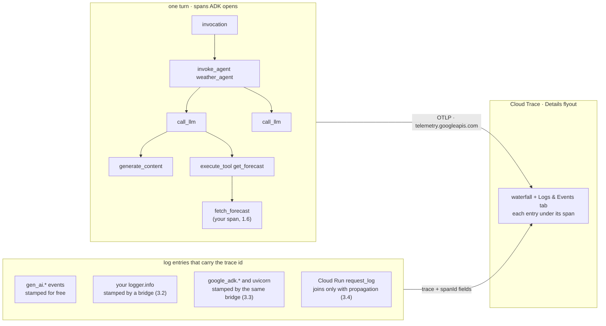

# Plan: ADK agent tracing tutorial

Folder: `ai/adk/tracing/` (new). Status: **Stage 0 done, scaffold + Part 1 in progress** (2026-09-07). Plan drafted and revised, all six decisions settled (2026-09-06). Stage 0 ran the local probes and the two cloud probes (`jwd-dev-1`, `jwd-dev-2`, both torn down) and settled rows 2/3/5/10/11/12 plus row 19's local half; captures in `ai/adk/tracing/verification/stage0-*.txt`. Corrections applied: `execute_tool` parents `call_llm` (not `invoke_agent`), the baseline tree is seven spans, the raised tool span carries two exception events, and the W3C propagator alone suffices on Cloud Run. Next: finish Stage 1 pages. Sibling of `ai/adk/logging/` and the planned `ai/adk/metrics/`, same house style (`tutorial-style` skill), same project (`jwd-gcp-demos`), same model (Gemini 3.7 Flash via Vertex AI).

Goal: a new developer runs a small agent, sees the span tree ADK already builds for every turn, ships it to Cloud Trace, gets every log line of a request to show up inside the right span in the Trace Explorer, and then uses traces to answer the questions an on-call engineer asks: which step was slow, which step failed, what did this user's request do. Generate → collect → correlate → consume, in that order.

Audience: Google Cloud-first, same as the metrics plan. The primary path is `--otel_to_cloud` into Cloud Trace and Cloud Logging. Non-Google OTLP backends and third-party agent-observability vendors get one reference page.

## Reading this plan

**Citations.** `adk/<path>:<line>` means `ai/adk/logging/.venv/lib/python3.13/site-packages/google/adk/<path>` (google-adk 2.8.0). `head/<path>` means the `adk-python` checkout at `b0180620` (2026-09-06). `otel/<path>` means a sibling package in the same site-packages (`opentelemetry/…`, `google/cloud/logging_v2/…`). Line numbers were read today and go stale; re-check before pasting into a page.

**Verified so far.** Only what the logging tutorial already ran: the dev UI span tree (5.1, 2026-09-04), export to Cloud Trace and Cloud Logging under `--otel_to_cloud` (5.2), the `trace` and `spanId` fields on `gen_ai.*` log entries (5.2 captures), header-based log correlation on a custom server (4.2), and the Agent Runtime negative (Part 6). Plus one borrowed result from the metrics tutorial's Stage 1 run (2026-09-06): a plain tool returning `{"status": "error"}` stamps no `error.type` on the tool-duration metric, and its `StatusAwareTool` hook does. That run observed the metric, not the span; the span side is row 5. Everything else is from source and docs. The **Not verified** table under Verification is the single status board; each inline NEEDS-RUN marker names the row that resolves it.

**Scenarios.** As in the metrics plan, every page runs one named scenario from `tutorial/scenarios.md` and answers one operational question.

**Sources, ranked as Jeff ranked them.** The `tutorial-style` skill; `ai/adk/logging/` (Parts 4, 5, 6); `docs/adk-metrics-tutorial.md`; the ADK source; adk.dev [cloud-trace](https://adk.dev/integrations/cloud-trace/) and [traces](https://adk.dev/observability/traces/); the Cloud Run [codelab](https://codelabs.developers.google.com/deploy-manage-observe-adk-cloud-run); the Agent Platform [tracing](https://docs.cloud.google.com/gemini-enterprise-agent-platform/scale/runtime/tracing) doc; the M3 companion page and the M3 deck (lowest). Plus the Cloud Trace [log integration](https://docs.cloud.google.com/trace/docs/trace-log-integration), [Trace Explorer](https://docs.cloud.google.com/trace/docs/finding-traces), and Cloud Logging [correlate logs](https://docs.cloud.google.com/logging/docs/view/correlate-logs) docs, which the correlation part rests on. Three more pages the imported material needs: Cloud Trace [troubleshooting](https://docs.cloud.google.com/trace/docs/troubleshooting) (2.3's ladder, the viewer gate), the Python logging client's [automatic trace/span extraction](https://docs.cloud.google.com/python/docs/reference/logging/latest/auto-trace-span-extraction) (3.3's controls, 3.5's way B), and the [Telemetry IAM roles](https://docs.cloud.google.com/iam/docs/roles-permissions/telemetry) page (00-setup, the viewer gate).

## Research findings

### Q1. What spans does ADK emit, and what is on them?

One tracer, scope `gcp.vertex.agent` (`adk/telemetry/tracing.py:162-166`). No sampler, no propagator registration, no HTTP server instrumentation anywhere in either tree. ADK only calls `start_as_current_span`; the OTel SDK's implicit context does the nesting.

The tree for one turn of the weather agent, as captured in logging 5.1:

| Span | Opened at | Parent | Attributes worth teaching |
|---|---|---|---|
| `invocation` | `adk/telemetry/_instrumentation.py:133` | none (root) | **none at all**. Schema v1 only. |
| `invoke_agent {name}` | `_instrumentation.py:476`, from `agents/base_agent.py:318` | `invocation` | `gen_ai.operation.name`, `gen_ai.agent.name`, `gen_ai.agent.description`, `gen_ai.conversation.id` (the session id; `tracing.py:195-229`) |
| `call_llm` | `flows/llm_flows/base_llm_flow.py:1732` | `invoke_agent` | `gen_ai.system="gcp.vertex.agent"` (a literal), `gen_ai.request.model`, `gen_ai.usage.*` tokens, `gen_ai.response.finish_reasons`, `gcp.vertex.agent.{invocation_id,session_id,event_id,llm_request,llm_response}` (`tracing.py:591-690`) |
| `generate_content {model}` | `tracing.py:1067` (stable) or `:1121` (experimental) | `call_llm` | `gen_ai.operation.name`, `gen_ai.request.model`; `gen_ai.system` only under the stable convention. Emitted by the `[otel-gcp]` instrumentor when installed, else by ADK (`:993-1041`; logging 5.2 verified no duplicate) |
| `execute_tool {name}` | `_instrumentation.py:509`, from `functions.py:709` | `call_llm` (**Stage 0 correction**, see below) | `gen_ai.tool.name`, `gen_ai.tool.type` (`FunctionTool`), `gen_ai.tool.call_id`, `gen_ai.agent.name`; on a raise, or when the tool's `_detect_error_in_response` hook classifies the response, `error.type` and `Status(ERROR, type)`, never the message (`tracing.py:232-341`; conditional, see below); `gcp.vertex.agent.{event_id,tool_call_args,tool_response}` |
| `execute_tool (merged)` | `functions.py:526`, `:774` | `invoke_agent` | Parallel tool calls only; exists so the dev UI's event lookup resolves |

Two more families the tutorial mentions once: `invoke_workflow` and `invoke_node` (schema v2, `node_tracing.py:235`, `:147`), and the plugin-created spans from `auto_tracing_helpers.py:501-544`. No skill spans: skill data lands as attributes on `execute_tool`.

**Error status on `execute_tool` is conditional.** Astra's reading is the correct one on 2.8.0, with one correction. `trace_tool_call` sets `error.type` and `Status(ERROR, type)` only when it is handed an exception or a detected error type (`tracing.py:277-290`); a raise also gets `span.record_exception` (`:281`). The detected type comes from `_detect_error_type_for_telemetry` (`flows/llm_flows/functions.py:88-127`), which looks up an optional `_detect_error_in_response` hook on the tool by `getattr` (`:117`), is called once with the raw return value (`:695`), and reaches the span through `tel_ctx.error_type` (`:713`, `_instrumentation.py:525-535`). The correction: `FunctionTool` does not leave the hook returning `None`, as the metrics plan's Stage 1 note says; it returns `TOOL_ERROR` when the response is a dict with a truthy `error` key (`tools/function_tool.py:355-359`, unchanged at head `:313`). So a plain function returning `{"error": "..."}` gets an error span for free, and the demo tool's `{"status": "error", "error_message": ...}` shape gets nothing, which is what the metrics Stage 1 run saw on the metric side. Three cases, all NEEDS-RUN on the span side (row 5):

| Tool behavior on the Atlantis turn | `execute_tool` status | `error.type` | Exception event | `invoke_agent` and `invocation` |
|---|---|---|---|---|
| returns `{"status": "error", ...}` (plain `FunctionTool`) | UNSET, renders OK | none | none | OK; the model answers "no data" |
| same return through a `_detect_error_in_response` override (`StatusAwareTool`, copied from `ai/adk/metrics/demo_agent/agent.py`) | ERROR, description `lookup_failed` | `lookup_failed` | none | OK; same answer |
| raises `LookupError` | ERROR | `LookupError` (`resolve_error_type`, `tracing.py:177-192`: an `error_type` attribute, then a genai `APIError` code, then the class name) | one, with the traceback | the exception re-raises through `base_agent.py:333-336` and the runner (`runners.py:774-800`), so both parents get ERROR and their own exception event from the SDK's `start_as_current_span` defaults, and the request fails with no answer |

**Schema version.** `resolve_schema_version()` (`_schema_version.py:72-91`) returns 2 when `GOOGLE_CLOUD_AGENT_ENGINE_ID` is set or `ADK_TELEMETRY_SCHEMA_VERSION_OPT_IN=2`, else 1. Under v2 the root is `invoke_workflow`, not `invocation`. So the same agent has a different root span on Agent Runtime than on a laptop or Cloud Run. One deep dive in 2.4.

**Content on spans is on by default.** `ADK_CAPTURE_MESSAGE_CONTENT_IN_SPANS` defaults on (`adk/telemetry/context.py:46`, `:107-112`); off, the five `gcp.vertex.agent.*` payload attributes become the literal `"{}"`. `OTEL_INSTRUMENTATION_GENAI_CAPTURE_MESSAGE_CONTENT` defaults `NO_CONTENT` and governs the log events, not these attributes (`:93-104`, `:242-273`). Opposite defaults; the M3 deck gets this wrong (its slide 25) and the M3 page corrects it. `adk deploy agent_engine --otel_to_cloud` sets the span knob to `false` for you (`cli/cli_deploy.py:1273-1282`); `adk deploy cloud_run` does not. Always-on redaction: `http_options` credentials, `response_schema`, `inline_data` (`tracing.py:834-862`).

**Head differences** (`head/telemetry/`): no new span names, `node_tracing.py` identical. `generate_content` span name gets `.strip()`, `thought_signature` bytes stripped from request and response attributes, `gen_ai.choice` log records get an explicit span context (`head/tracing.py` ~1205, ~1261). The last one matters for Part 3: on 2.8.0 that event's correlation depends on the ambient context at emit time, which is inside the span, so it works, but head makes it explicit. Note in the reference page only.

### Q2. How do spans leave the process?

| Route | What is installed | Exporter | Source |
|---|---|---|---|
| Nothing configured (`adk web`, `adk api_server`) | `TracerProvider` with two in-process `SimpleSpanProcessor`s | `ApiServerSpanExporter` (event id → attributes; keeps only `call_llm`, `send_data`, `execute_tool*`), `InMemoryExporter` (session id → spans, unbounded) | `adk/cli/api_server.py:649-666`, `:458-518`, `:1173-1178` |
| `--otel_to_cloud` (CLI and `get_fast_api_app(otel_to_cloud=True)`) | `get_gcp_exporters(enable_cloud_tracing=True, enable_cloud_metrics=True, enable_cloud_logging=True)`, all three hardcoded | `OTLPSpanExporter` (proto/http) to `https://telemetry.googleapis.com/v1/traces`, `BatchSpanProcessor` with SDK defaults, ADC via `AuthorizedSession` | `api_server.py:679-719`, `adk/telemetry/google_cloud.py:60`, `:151-171` |
| `--trace_to_cloud` (deprecated) | `BatchSpanProcessor(CloudTraceSpanExporter(project_id=GOOGLE_CLOUD_PROJECT))`, project read from the agent's `.env` | the Cloud Trace API v2, the only place `CloudTraceSpanExporter` appears | `adk/cli/fast_api.py:113`, `:312-331`; deprecation callback `cli_tools_click.py:1821-1832` |
| `OTEL_EXPORTER_OTLP_TRACES_ENDPOINT` (or the base var) | generic `OTLPSpanExporter` from standard env vars; additive to the GCP route, so both set means dual export | any OTLP/HTTP collector | `adk/telemetry/setup.py:124-153` |
| Your own server | `get_gcp_exporters(enable_cloud_tracing=True)` + `maybe_set_otel_providers([hooks], otel_resource=get_gcp_resource(project_id))`; a provider is installed only if the hooks carry a span processor; without `otel_resource` the provider gets `OTELResourceDetector().detect()` alone, so no `gcp.project_id` | same OTLP exporter | `setup.py:45-115`, `:71`, `:87`, `:118-121`; `google_cloud.py:298-352`; `api_server.py:697-716` |
| Agent Runtime | same exporters, resource fixed to `cloud.platform=gcp.agent_engine`, project number resolved to id | same, plus `Google-Agent-Engine-Traceparent` handling | `google_cloud.py:98-112`, `:298-333`; `_agent_engine.py:59-101` |

Facts worth teaching:

- **`--otel_to_cloud` silently wins over `--trace_to_cloud`** (`fast_api.py:312`, guarded `if trace_to_cloud and not otel_to_cloud`). The codelab uses `trace_to_cloud`; the M3 page says it is deprecated and it is. One correction page, not a page of its own.
- **Resource.** Off Agent Engine: `gcp.project_id` merged with `OTELResourceDetector` and `GoogleCloudResourceDetector` (`google_cloud.py:335-352`). Spans do not need `OTEL_RESOURCE_ATTRIBUTES` locally (metrics do; logging 5.2). `OTEL_SERVICE_NAME` becomes the **OpenTelemetry service** filter and the **Service/workload** column in Trace Explorer, so set it on every route or every laptop run files under an unknown service.
- **A programmatic server passes the resource itself.** `get_gcp_exporters` builds exporters only; the CLI separately calls `get_gcp_resource(project_id)` and hands it to `maybe_set_otel_providers(..., otel_resource=...)` (`api_server.py:697-716`). Left out, `maybe_set_otel_providers` falls back to `OTELResourceDetector().detect()` (`setup.py:71`, `:118-121`), which carries no `gcp.project_id` and runs no Cloud Run detector. The "spans do not need `OTEL_RESOURCE_ATTRIBUTES` locally" finding above was observed on the CLI route, where the resource is supplied; whether the Telemetry API accepts a span batch without `gcp.project_id` is NEEDS-RUN (row 19). `02_trace_server.py` passes it either way, and 2.3 says why.
- **Shell exports, not `.env`, for CLI servers.** Same timing reason as logging 5.2 (`agent_loader.py:331-332` vs `api_server.py:1173`).
- **Batching.** `BatchSpanProcessor` defaults: a script that exits right after its turn must `force_flush()` the tracer provider or the last batch is lost. Same lesson as the metrics plan's 1.1, on the span side.
- **Sampling is 100 percent.** No `Sampler` in either tree, so the SDK default `ParentBased(ALWAYS_ON)` applies and the standard `OTEL_TRACES_SAMPLER` / `OTEL_TRACES_SAMPLER_ARG` env vars work unchanged. The `ParentBased` half is a trap once inbound propagation is on (Q4).
- **The `[otel-gcp]` extra** supplies the GenAI SDK instrumentor and is a hard requirement once the flag is on (logging 5.2, 5.4 deep dives). Requirements pin it.

### Q3. How do logs and traces correlate in Google Cloud?

The mechanism is one field. A `LogEntry` carries `trace` (`projects/PROJECT_ID/traces/TRACE_ID`, or the bare id), `spanId` (16 hex chars), and `traceSampled`. When a log entry's `trace` and `spanId` match a stored span in the same project, the Trace Explorer shows it under that span. Cloud Trace [log integration](https://docs.cloud.google.com/trace/docs/trace-log-integration) and [Trace Explorer](https://docs.cloud.google.com/trace/docs/finding-traces) name the UI:

| Where | What the reader sees |
|---|---|
| Trace Explorer, **Details** flyout, waterfall | a circle on a span's latency bar marks associated log entries or events; **Show logs** displays them alongside the waterfall |
| **Details** flyout, **Logs & Events** tab | log entries and span events matching the selected span's `trace_id` and `span_id`; a **View logs** link opens Logs Explorer with the query prefilled |
| **Details** flyout, **Inputs/Outputs** tab | GenAI content from `gen_ai.*` attributes and events, marked with the **GenAI** icon; toggle **GenAI attributes only** |
| **Details** flyout, **Metadata & Links** | span id, parent span id, project, timestamps |
| Logs Explorer | `trace="projects/P/traces/ID"` returns every entry of the request across all log names; **Correlate by** a parent log name (Cloud Run's `request_log`) nests the others under it |

Who stamps the field, on each of the four log streams from the logging tutorial:

| Stream | Stamped by default? | How it gets stamped | Source |
|---|---|---|---|
| 4 · ADK's `gen_ai.*` events | **yes** | `otel_logger.emit()` captures the ambient span; `CloudLoggingExporter` writes `trace` and `spanId` from the record | `adk/telemetry/tracing.py:168-172`; `otel/opentelemetry/exporter/cloud_logging/__init__.py:360-367`; verified in logging 5.2 (four traces captured) |
| 1 · your code | no | ADK installs no `LoggingHandler` bridge and never touches stdlib `logging` (grep of both trees). Three ways below. | — |
| 2 · `google_adk.*` | no | same | — |
| 3 · `uvicorn.access` | no | same, and the access log is emitted outside any ADK span, so even a bridge gives it no trace unless Q4 propagation is on | — |

The three ways to stamp streams 1 to 3, each already installed in the logging venv:

| Way | Code | Trace source | Where logs go | Works on a laptop? |
|---|---|---|---|---|
| A · OTel `LoggingHandler` on the root logger | `logging.getLogger().addHandler(LoggingHandler(logger_provider=get_logger_provider()))` | the record's ambient span, captured by the SDK | the same `CloudLoggingExporter` the `gen_ai.*` events use, log name `adk-otel` by default (`google_cloud.py:57-58`) | **yes**, via the Logging API |
| B · `google-cloud-logging` handler | `CloudLoggingHandler` or `StructuredLogHandler` | reads the current OTel span first, then `traceparent`, then `X-Cloud-Trace-Context` (`otel/google/cloud/logging_v2/handlers/_helpers.py:226-260`; the client's automatic-extraction page documents the order, and that fields passed by hand override it) | Logging API, or stdout JSON with the `logging.googleapis.com/*` keys (`__init__.py:417-421`) | yes for the API handler |
| C · a JSON formatter to stdout | logging 4.2's `CloudRunJsonFormatter`, reading `trace.get_current_span()` instead of the header | the current OTel span | Cloud Run's stdout ingestion; the special keys `logging.googleapis.com/trace` and `logging.googleapis.com/spanId` | **no**, stdout does not reach Cloud Logging from a laptop |

The trap that motivates Part 3: logging 4.2 stamps the trace id from the `X-Cloud-Trace-Context` **header**. ADK's spans start a **new** trace (Q4). So on Cloud Run today a request has two trace ids: the request log and the 4.2 lines carry Cloud Run's, the spans and the `gen_ai.*` events carry ADK's. The Trace Explorer shows the spans with the framework events and none of your lines. Part 3 closes that gap in two moves: stamp from the span (3.2, 3.3), then make the span a child of the request (3.4).

### Q4. Trace context propagation

**Inbound: none.** No `FastAPIInstrumentor`, no `set_global_textmap`, nothing in `fast_api.py` or `adk_web_server.py` reads `traceparent` or `X-Cloud-Trace-Context`. Every `/run` starts a fresh root trace. The one exception is Agent Runtime's own header, `Google-Agent-Engine-Traceparent`, extracted by `get_propagated_context` (`_agent_engine.py:59-84`) and wired as a middleware only in the `/api/reasoning_engine` app (`fast_api.py:544-553`). A plain `traceparent` there becomes the `supportID` attribute on the top span, never a parent (`:87-101`).

**Outbound: MCP only.** `mcp_tool.py:490` injects the global textmap into the MCP `_meta` field.

**Inside a tool: the context is there.** `record_tool_execution` uses `start_as_current_span` (`_instrumentation.py:509`) and the tool body runs inside the `with`. So `trace.get_current_span()` in a tool is the `execute_tool` span, `tracer.start_as_current_span("fetch_forecast")` is a proper child, and a `logging` record emitted there carries the span if a bridge (Q3, way A or B) is installed. Caveat: an `asyncio.create_task` inside a tool loses the context unless captured.

**To get one trace per request you add it yourself.** Two shapes, decision 3: `opentelemetry-instrumentation-fastapi`'s `FastAPIInstrumentor.instrument_app(app)` (adds a server span and extracts the W3C header), or a 15-line middleware that calls `propagate.extract(request.headers)` and attaches the context. Either way `set_global_textmap(CompositePropagator([TraceContextTextMapPropagator(), CloudTraceFormatPropagator()]))` is needed for the `X-Cloud-Trace-Context` format (`opentelemetry-propagator-gcp`). Whether Cloud Run also sends `traceparent` today is NEEDS-RUN (Not verified row 10).

**The sampling trap.** Cloud Run samples its own request traces at a low rate and sets `;o=0` or `traceparent` flags `00` on the rest. With `ParentBased(ALWAYS_ON)`, a propagated unsampled parent means ADK **records no spans for that request**. A tutorial that turns propagation on without changing the sampler loses almost every trace. Fix: `OTEL_TRACES_SAMPLER=always_on`, or a `ParentBased(root=ALWAYS_ON, remote_parent_not_sampled=ALWAYS_ON)` installed before ADK's provider. Reproducible locally with a `traceparent` header ending in `-00`. NEEDS-RUN (row 11); this is 3.4's deep dive and the best gotcha in the tutorial.

### Q5. Reading traces back for captures

Console views cannot be pasted into a page. Two programmatic paths, decision 5:

- **Trace API v1** `GET https://cloudtrace.googleapis.com/v1/projects/{p}/traces?filter=…&startTime=…` and `GET …/traces/{traceId}`, with a `curl` and an ADC token. Returns spans with `spanId`, `parentSpanId`, `name`, `startTime`, `endTime`, `labels`. Whether spans ingested through `telemetry.googleapis.com` are readable through v1 is NEEDS-RUN (row 12). The metrics plan's equivalent is its open question 1.
- **Logs Explorer via `gcloud logging read 'trace="projects/P/traces/ID"'`** for the log side of a trace. This one is certain.

A tiny `trace/get_trace.sh` that prints the v1 response as an indented tree gives every Part 2 to 4 page a captured console block in the same shape as logging 5.1's.

### Q6. Agent Runtime

The Agent Platform tracing doc: set `GOOGLE_CLOUD_AGENT_ENGINE_ENABLE_TELEMETRY=true`, `OTEL_SEMCONV_STABILITY_OPT_IN=gen_ai_latest_experimental`, `OTEL_INSTRUMENTATION_GENAI_CAPTURE_MESSAGE_CONTENT=EVENT_ONLY`; view in **Agent Platform → Deployments → instance → Traces** with **Session view** and **Span view**, or in Trace Explorer. Telemetry API for spans, Logging API for logs. Attribute values truncate at Cloud Trace quota limits. `AdkApp(enable_tracing=True)` is the older route.

The logging tutorial's verified negative (2026-09-05): two engines deployed with the flag and with the `.env` variable, no spans in Trace Explorer over 40 minutes. The Traces tab in the Agent Platform console was not checked. Decision 4.

### Q7. What the lower-ranked sources get wrong, and what they get right

| Source | Keep | Correct |
|---|---|---|
| Codelab | the Trace Explorer walk-through, the load test as a way to get a heatmap with shape, the feedback endpoint that logs with `log_struct` | uses deprecated `trace_to_cloud`; span name `agent_run [weather_agent]` is pre-2.x; its logs are not correlated to its spans |
| M3 page | the span-name corrections, the two-knob table, the "read the span tree before touching the model" story, the custom span inside a tool (its slide 31), the propagation note (slide 24) | slide 24 overstates: ADK does **not** propagate inbound; "within the process is handled" is true only for code running inside ADK's spans |
| M3 deck | "logs explain events, traces explain performance"; the support-ticket and slow-agent walk-throughs as scenario framing | lifecycle event names that do not exist; `OTEL_INSTRUMENTATION_GENAI_CAPTURE_MESSAGE_CONTENT` as the span knob; thought/action span names |
| adk.dev cloud-trace | the four setup snippets per language, the privacy note about `adk deploy agent_engine` | says "spans include `call_llm`" without the schema caveat |
| adk.dev traces | the semconv attribute list per span | omits `gcp.vertex.agent.*`, the dev UI, custom spans, correlation |

## Governing model

One idea for the whole tutorial: **a trace is the tree of spans ADK opens around one turn, its trace id is the key every log line can carry, and Cloud Trace draws the logs inside the spans when both carry the same id in the same project.**

*The join is one field. Spans arrive over OTLP; logs arrive through Cloud Logging; the Trace Explorer matches them on trace id and span id.*

**Four rungs between "the agent answered" and "I can see the trace."** A span is *instrumented* (ADK opened it), *recorded* (a real `TracerProvider` with a span processor was installed before the turn; without one, `trace.get_current_span()` is a no-op span and nothing is kept), *exported* (the batch left the process and the endpoint accepted it), and *visible* (the viewer's project, service filter, and time range include it). A model response proves only the first rung. Each rung has its own failure and its own check, and 2.3's deep dive walks the ladder with the `export-outage` scenario.

Distinctions to teach with output, each on the page that first shows it:

| Distinction | What the reader establishes | Page |
|---|---|---|
| Trace vs span | one trace id groups a turn's operations; each span has its own id, timing, and status; `parent_id` builds the tree | 1.2 |
| ADK event vs span event vs log record | ADK events are the session's content model; a span event (the `exception` on a raised tool) belongs to one span; a `gen_ai.*` log record travels the logs pipeline and is joined back by id | 1.4, 3.1 |
| Resource vs span attribute | `service.name` and `gcp.project_id` describe the process and decide where the trace files; `gen_ai.tool.name` describes one operation | 2.1, 2.3 |
| Instrumented vs recorded vs exported vs visible | the ladder above; the agent answers on every rung | 2.3 |
| Duration vs total work | a parent's duration contains its children; overlapping spans do not add up to the request's elapsed time | 4.1 |
| Trace evidence vs task quality | an OK `execute_tool` under an OK `invoke_agent` on the `returned-error` turn, and the user still got no weather | 1.4, 4.3 |

Session vs invocation vs trace is the "a trace is a session" row below and stays there.

Misconceptions to name and correct with output:

| Misconception | Corrected on |
|---|---|
| "I have to add tracing." | 1.1: the tree is there with nothing configured; 1.2: the raw span JSON from a console exporter. |
| "Spans hold timings, not content." | 1.3: `gcp.vertex.agent.llm_request` holds the prompt by default; the knob and its opposite-default sibling. |
| "A trace is a session." | 1.5: one trace per turn; the session is `gen_ai.conversation.id`, an attribute filter. |
| "`--trace_to_cloud` and `--otel_to_cloud` are the same flag." | 2.1 deep dive: different exporter, different project source, one deprecated and silently overridden. |
| "Logs and traces correlate automatically." | 3.1: only ADK's own events do; 3.2: your tool's log line is missing from the span. |
| "I stamped the trace id from the request header, so I am correlated." | 3.4: two trace ids per request until the span is a child of the request. |
| "Propagation on, done." | 3.4 deep dive: the unsampled parent drops every ADK span. |
| "The agent is slow." | 4.1: the tool owns the time, with the p95 heatmap and the waterfall. |
| "Agent Runtime traces look like Cloud Run traces." | 2.4: schema v2, `invoke_workflow` root, no `call_llm`. |

## Scope

**In scope**

| File | Role |
|---|---|
| `ai/adk/tracing/README.md`, `TUTORIAL.md`, `CLAUDE.md` | Index, model diagram, *Verified against*, files table, quick start, tutorial-specific conventions |
| `tutorial/00-setup.md` | venv, `.env`, `env.sh`, APIs (`telemetry`, `cloudtrace`, `logging`), roles (`roles/telemetry.writer` to write, or `roles/telemetry.tracesWriter` for traces alone; `roles/cloudtrace.user` and `roles/logging.viewer` to read, and the second is what makes **Logs & Events** fill), checked against the Telemetry IAM roles page, the demo agent |
| `tutorial/scenarios.md` | The scenario matrix under Target shape |
| `tutorial/part-1..4/` | Pages below |
| `tutorial/how-to-choose.md` | Span and attribute catalog, correlation decision table, 2.8.0 vs head notes, verification status, references |
| `demo_agent/` | The logging tutorial's weather agent, copied (not shared), with `get_forecast(city, days)` added: it calls a helper `_fetch_forecast()` that sleeps 0.3–1.5 s and logs one INFO line. When `TUTORIAL_CUSTOM_SPAN=1` is set, the helper runs inside `tracer.start_as_current_span("fetch_forecast")`; unset, the tree is pure ADK. Two more gates of the same shape, for 1.4: `TUTORIAL_CLASSIFY_ERRORS=1` wraps both tools in the metrics tutorial's `StatusAwareTool` (copied; `_detect_error_in_response` maps a failure status to `lookup_failed`), and `TUTORIAL_RAISE_ON_UNKNOWN=1` makes `get_weather` raise `LookupError` for an unknown city instead of returning the status. Unset, an unknown city returns `{"status": "error", "error_message": ...}` and logs one WARNING. Same shape as the metrics plan's `outcome.py` gate. Decision 1. |
| `examples/01_console_spans.py` | Script runner, `maybe_set_otel_providers([OTelHooks(span_processors=[SimpleSpanProcessor(ConsoleSpanExporter())])])`, one London turn, `force_flush()`. The raw span JSON. |
| `examples/02_trace_server.py` | Minimal own server, `get_gcp_exporters(enable_cloud_tracing=True, enable_cloud_logging=True)`; returns the invocation's trace id in the `/chat` response body. The logging 5.5 shape with one flag flipped. Passes `otel_resource=get_gcp_resource(project_id)` as the CLI does. Honors `TUTORIAL_TRACE_ENDPOINT`: when set, the span exporter targets that URL instead of `telemetry.googleapis.com` (2.3's `export-outage`); unset, the GCP exporter. |
| `examples/03_correlated_server.py` | 02 plus the bridge from decision 2 on the root logger. All four streams stamped. Logs one INFO line at startup, outside any span: 3.3's first negative control. |
| `examples/04_propagated_server.py` | 03 plus inbound propagation and an always-on sampler (decision 3). One trace per request. |
| `trace/get_trace.sh`, `trace/list_traces.sh` | Trace API v1 read-back as an indented tree; used for every cloud capture. Decision 5. |
| `load/turns.sh <scenario> [N]` | Same contract as the metrics plan, including its `concurrent` mode (turns fired in parallel, each from its own session); prints one line per turn with the session id and the trace id when the server returns one |
| `deploy/Dockerfile.trace_server`, `deploy/env/` | Cloud Run and Agent Runtime, same pattern as logging |
| `verification/` | One run record per captured run, plus the regression record 4.3's deep dive saves (`<scenario>-<trace-id>.txt`: the `turns.sh` line, the trace id, the `gcloud logging read` filter, the expected span status) |
| `requirements.txt` | `google-adk[otel-gcp]>=2.8.0`, `opentelemetry-exporter-otlp-proto-http`, `opentelemetry-exporter-gcp-logging`, `opentelemetry-instrumentation-fastapi`, `opentelemetry-propagator-gcp`. Decision 2 chose way A, so `google-cloud-logging` is not pinned; 3.5 names it as the way-B reference. |

**Out of scope.** Metrics beyond one cross-reference page (the metrics tutorial owns them). Log levels, plugins, and structured logging as subjects (the logging tutorial owns them; Part 3 reuses its 4.2 server shape). BigQuery Agent Analytics beyond the `enable_otel_correlation` cross-reference in 4.5. Third-party vendors beyond one reference page. Live/bidi (`send_data`), MCP outbound propagation, A2A. Kotlin, Java, Go. Modifying the logging tutorial.

## Target shape

Budgets: 200–750 words per subtask page, about 200 per landing page, one Mermaid diagram per roughly four pages (index, 1.0, 3.0, 3.4, 4.5). Prompt: "What's the weather in London?" for single turns; "What's the three-day forecast for London?" for the slow tool; "What's the weather in Atlantis?" for the three error turns; `load/turns.sh <scenario> [N]` for volume.

**Drafting rules** (from the metrics plan): one scenario per lesson; one idea plus one deep dive per page; the tables are the contract.

**Scenario matrix (`tutorial/scenarios.md`)**

| Scenario | Controlled change | Observation to capture | Operational question |
|---|---|---|---|
| `baseline` | One London turn per fresh session | Five span names in one tree; two `call_llm`, one `execute_tool`, tool 1 ms | What does one turn look like as a tree? |
| `slow-tool` | Forecast turns, so `get_forecast` sleeps 0.3–1.5 s | `execute_tool get_forecast` owns most of `invoke_agent`; model spans unchanged | Is the dependency responsible for the slowdown? |
| `custom-span` | `slow-tool` with `TUTORIAL_CUSTOM_SPAN=1` | a `fetch_forecast` child under `execute_tool`; the gap inside the tool span now has a name | Where inside my tool did the time go? |
| `returned-error` | Atlantis; plain `FunctionTool`, `get_weather` returns `{"status": "error", "error_message": ...}` and logs a WARNING | `execute_tool get_weather` status UNSET, no `error.type`, no exception event; `invoke_agent` OK; the model tells the user there is no data. The WARNING is the only failure evidence, and it is outside the trace until 3.2 | Did execution finish without satisfying the request? |
| `classified-error` | Same turn with `TUTORIAL_CLASSIFY_ERRORS=1`: `StatusAwareTool`'s `_detect_error_in_response` maps the status to `lookup_failed` | `execute_tool` status ERROR, `error.type=lookup_failed`, no exception event; `invoke_agent` and `invocation` OK; same answer to the user; the WARNING sits under the red span once 3.2 is done | Which step failed, and what did it say? |
| `raised-error` | Same turn with `TUTORIAL_RAISE_ON_UNKNOWN=1`: `get_weather` raises `LookupError` | `execute_tool` status ERROR, `error.type=LookupError`, one `exception` event; `invoke_agent` and `invocation` ERROR with their own exception events; no answer, the request fails | Where did execution stop, and what evidence survived? |
| `multi-turn` | Five turns in one session | five traces sharing one `gen_ai.conversation.id`; input tokens climb per `call_llm` | How do I see a whole conversation? |
| `tagged-request` | `curl` with a `traceparent` (sampled) or `X-Cloud-Trace-Context` header | before 3.4: two trace ids for one request; after: one | Is this trace the one my user's request produced? |
| `unsampled-parent` | `curl` with `traceparent` flags `00` against 04 | with the default sampler: no spans; with always-on: the full tree | Why did propagation make my traces disappear? |
| `content-off` | `ADK_CAPTURE_MESSAGE_CONTENT_IN_SPANS=false` | `llm_request`, `llm_response`, `tool_call_args` read `{}`; the **Inputs/Outputs** tab empties | Can I trace without storing prompts? |
| `export-outage` | `TUTORIAL_TRACE_ENDPOINT=http://127.0.0.1:4318/v1/traces` with nothing listening, one London turn against `02`; then unset, restart, one more turn | the outage turn answers; the exporter logs a failed export; the read-back finds nothing for it; the restored turn's tree lands | Can the agent answer while traces are missing, and which rung failed? |
| `concurrent` | `turns.sh concurrent 4`: forecast and London turns fired in parallel, each from its own session, against `03` | disjoint trace ids; every bridged log line carries the span of its own request; no line under another request's span | Do logs stay attached to the right request under overlap? |

**Part 1 · What a trace is (local, no cloud)**

| § | Scenario | Question | Content | Verify |
|---|---|---|---|---|
| index | — | What does ADK trace, and when? | The five names, the tree, "nothing leaves the process"; links to logging 5.0 and 5.1 rather than repeating them | words |
| 1.1 The tree you already have | `baseline`, then `slow-tool` | What does one turn look like as a tree? | `adk web`, the Trace tab, the London turn (tree as in logging 5.1), then the forecast turn: the tool now owns the time. Deep dive: the two in-process exporters and why the tree vanishes on restart (`api_server.py:458-518`). | both trees captured from `/dev/…/debug/trace/session/{id}` |
| 1.2 The raw span | `baseline` | What is a span made of? | `01_console_spans.py`. **What you are looking at**: `name`, `context.trace_id`, `context.span_id`, `parent_id`, `start_time`, `end_time`, `status`, `attributes`, `events`, `resource`. Deep dive: why the script needs `force_flush()` on the provider. | console shows five names with matching `parent_id` chain |
| 1.3 Attributes and content | `content-off` | What is on a span, and who can read it? | The `gen_ai.*` semconv attributes next to the `gcp.vertex.agent.*` ADK ones on `call_llm` and `execute_tool`; the prompt is in `llm_request` by default. Rerun with the knob: `{}`. Deep dive: the two knobs, opposite defaults, the per-request `RunConfig.telemetry` override, always-on redaction. Link to logging 5.6. | `llm_request` full then `{}` in the console capture |
| 1.4 An error turn, three ways | `returned-error`, then `classified-error` (one controlled change: the hook off, then on); deep dive runs `raised-error` | Which step failed, and how would I know? | `01_console_spans.py` with the Atlantis prompt. Plain first: `execute_tool get_weather` reads `status.status_code=UNSET`, no `error.type`, and the tool's WARNING on the terminal is the only sign; the model answered "no data" under an all-OK tree. Then `TUTORIAL_CLASSIFY_ERRORS=1`: the same span carries `error.type=lookup_failed` and `status.status_code=ERROR`; `invoke_agent` still OK. **What you are looking at** is the same span twice. Deep dive, **The tool that raises**: `TUTORIAL_RAISE_ON_UNKNOWN=1`, the `exception` event with the traceback, `error.type=LookupError`, ERROR on both parents, no answer, and the script's `try/finally` so `force_flush()` still runs; how `error.type` is chosen (`tracing.py:177-192`), why the message never lands on the span, and the `error`-key shortcut `FunctionTool` gives for free (`function_tool.py:355-359`). | plain: no `error.type` anywhere; classified: `error.type` on one span only; raised: exception event on the tool span, ERROR on three |
| 1.5 A trace per turn, a session across traces | `multi-turn` | How do I see a whole conversation? | Five turns; five `trace_id`s; one `gen_ai.conversation.id`. The dev UI keys by session; Cloud Trace will need the attribute filter (4.2). Deep dive: `invocation_id`, `event_id`, `session_id` and where each appears (`tracing.py:622-627`). | five distinct trace ids, one conversation id |
| 1.6 Your own span inside a tool | `custom-span` | Where inside my tool did the time go? | `TUTORIAL_CUSTOM_SPAN=1`, the helper's `with tracer.start_as_current_span("fetch_forecast")`, one attribute (`forecast.days`). The child appears under `execute_tool`. Deep dive: `trace.get_tracer(__name__)` shares ADK's provider; `asyncio.create_task` loses the context; `set_attribute` on the current span for an existing span. The M3 slide-31 idea, done. | `fetch_forecast` child in the tree |

**Part 2 · Collect: ship the tree to Cloud Trace**

| § | Scenario | Question | Content | Verify |
|---|---|---|---|---|
| index | — | How does the tree get from the process to Trace Explorer? | Pipeline diagram: process → `BatchSpanProcessor` → OTLP → `telemetry.googleapis.com/v1/traces` → Trace Explorer; the four routes table from Q2 | words |
| 2.1 `adk web --otel_to_cloud` | `slow-tool` | Did the tree land? | Three exports (`OTEL_SERVICE_NAME`, `OTEL_RESOURCE_ATTRIBUTES` to keep metrics quiet, link to logging 5.2), the forecast turn, then **Trace Explorer**: filter **Span name** `invoke_agent weather_agent`, open the **Details** flyout, the waterfall. Console described; the capture is `trace/get_trace.sh` output. Deep dive: `--trace_to_cloud` vs `--otel_to_cloud` (the codelab correction). | v1 read-back shows the same five names and parent chain as 1.1 |
| 2.2 Cloud Run | `baseline` (curl) | Does a deployed service trace without my help? | `adk deploy cloud_run --otel_to_cloud`, the **Service/workload** column shows the service, resource from the detector. Note the request log's trace id differs from the spans' (sets up 3.4). Teardown. | read-back; two trace ids noted |
| 2.3 Your own server | `baseline`; deep dive `export-outage` | Does my server export the same tree as `adk web`, and which rung failed when it does not? | `02_trace_server.py`: `get_gcp_exporters(enable_cloud_tracing=True, enable_cloud_logging=True)` plus `maybe_set_otel_providers(hooks, otel_resource=get_gcp_resource(project_id))`, the line `adk web` runs for you and a script must write itself (`api_server.py:697-716`); `.env` works here; the `/chat` response returns `trace_id`. Deep dive, **Instrumented, recorded, exported, visible**: one check per rung. Recorded: with the span processor commented out, `maybe_set_otel_providers` installs no provider (`setup.py:87`) and the returned trace id is all zeros. Exported: `TUTORIAL_TRACE_ENDPOINT` at a closed port, the turn answers, the `BatchSpanProcessor` logs the export failure, `get_trace.sh` finds nothing. Visible: the trace is in the project but the **OpenTelemetry service** filter or the time range excludes it, per the Cloud Trace troubleshooting page. Restore: unset the endpoint, restart, one more turn, read it back. `force_flush` on shutdown. | read-back by the returned trace id; the outage turn answers and is absent from the read-back; the restored turn is present |
| 2.4 Agent Runtime | `baseline` (query) | What does the same agent's trace look like on Agent Runtime? | Deploy with the flag; look in **Agent Platform → Traces** (Session view, Span view) and Trace Explorer. Schema v2: `invoke_workflow` root, no `call_llm`. Report what surfaces, positive or negative (decision 4). Teardown. | a tree, or a documented negative with both views checked |
| 2.5 Sampling | `baseline` under load | Can I keep fewer traces? | `OTEL_TRACES_SAMPLER=parentbased_traceidratio`, `OTEL_TRACES_SAMPLER_ARG=0.5`, `turns.sh baseline 20`, count traces in the window. Deep dive: `ParentBased` and what it means for 3.4; logs of unsampled turns still carry a trace id that leads nowhere. Decision 6. | trace count within tolerance of half of 20 |
| 2.6 Other backends | — | Can the same tree go somewhere other than Google? | `OTEL_EXPORTER_OTLP_TRACES_ENDPOINT`, http/protobuf only, dual export when both are set, the adk.dev integrations list (Phoenix, AgentOps, MLflow, Honeycomb) as a table. Reference only. | words; links |

**Part 3 · Correlate: every log line inside its span**

| § | Scenario | Question | Content | Verify |
|---|---|---|---|---|
| index | — | Which log lines already show up in the trace, and which do not? | The one-field mechanism; the four-streams table from Q3 with a "stamped by default" column; diagram | words |
| 3.1 The free join | `baseline` on 2.3's server | Where are the model's messages in the trace? | Select `call_llm` in the flyout; **Logs & Events** shows the `gen_ai.*` entries; **View logs** opens Logs Explorer prefilled; the reverse trip from a log entry back to the trace. `gcloud logging read 'trace="projects/P/traces/ID"'` for the capture. Deep dive: `trace` and `spanId` formats, the 16-hex span id, the same-project rule. | log entries listed under the two `call_llm` spans; the query returns the eight (stable) or two (experimental) events |
| 3.2 Your tool's log line is missing | `classified-error` | Why is the tool's warning not in the trace? | Same server with `TUTORIAL_CLASSIFY_ERRORS=1`, so the failing span is red: select `execute_tool get_weather`, `error.type` in **Attributes**, **Logs & Events** empty. Then `03_correlated_server.py`: the bridge on the root logger (decision 2), rerun: the WARNING sits under the failing span with `error.type` beside it. Deep dive: what the bridge captures from the record (`trace_id`, `span_id`, `trace_flags`) and what the exporter writes (`cloud_logging/__init__.py:360-367`). | the tool's log entry carries the `execute_tool` span id |
| 3.3 Framework and server logs, and four lines that only look correlated | `slow-tool`; deep dive `concurrent` | Do the logs I did not write land in the right spans, and what does a false join look like? | Same server, `google_adk` at INFO: "Sending out request" lands under `call_llm`, the tool's helper INFO under `execute_tool` (or under `fetch_forecast` with the custom span). `uvicorn.access` has **no** trace: it runs outside any span, and that is 3.4's problem. Deep dive, **Negative controls**: a bridge stamps whatever span is current when the record is created, so four entries that resemble correlation are tabled with what the flyout shows for each. (1) `03`'s startup line, logged outside any span: no `trace` field; found by nothing. (2) An entry with only `jsonPayload.trace_id`, written with `curl` to `entries:write`: a text search finds it, `trace=` does not, no span lists it. (3) An entry with `trace` and no `spanId`, same `curl`: `trace=` returns it and the trace-level **View logs** lists it, no span's **Logs & Events** shows it. (4) `turns.sh concurrent 4`: each bridged line under the span of its own request, none crossed. Pass: none of the four appears under a selected span. The Python client's automatic-extraction page names the rule behind (2) and (3): fields set by hand override the active span. | three log names under their spans; access log without `trace`; the four controls tabled with the observed viewer result, none under a span; no crossed lines |
| 3.4 One trace per request | `tagged-request`, deep dive `unsampled-parent` | Is this trace the one my user's request produced? | `04_propagated_server.py`: `FastAPIInstrumentor` (or the middleware), the composite propagator, the always-on sampler. `curl` with `traceparent`: the returned `trace_id` equals the header's; ADK's root is now a child of the server span; the access log and the request-level `chat_request_received` line are inside the trace. Deploy to Cloud Run once: the `request_log` entry joins, and Logs Explorer **Correlate by** `request_log` nests everything. Deep dive, **Why did propagation make my traces disappear?**: the `-00` header against the default sampler, no spans; the fix; why Cloud Run's own sampling rate makes this the common case, not the edge case. Diagram. | header id = returned id = span trace id; `unsampled-parent` yields zero spans then a full tree |
| 3.5 Three ways to stamp, and when each fits | — | Which bridge do I use where? | Reference: way A (OTel handler), B (`google-cloud-logging`), C (stdout JSON, Cloud Run only; logging 4.2's formatter reading the span instead of the header). Table: works locally, works on Cloud Run, double emission, log name, what it costs. The `ContextVar` trick from 4.2 is retired because the span **is** the context. | words |

**Part 4 · Consume: answer the on-call questions**

| § | Scenario | Question | Content | Verify |
|---|---|---|---|---|
| index | — | Which step was slow, which failed, what did this user's request do? | The three questions and the Trace Explorer surface for each | words |
| 4.1 The slow step | `slow-tool` under load, `turns.sh slow-tool 20` mixed with baseline | Is the dependency responsible for the slowdown? | Trace Explorer: filter **OpenTelemetry service**, **Span name** `execute_tool get_forecast`; heatmap and **Span duration (percentile)**; the **Grouped table** by span name; open a p95 trace, the waterfall, the `fetch_forecast` child. The M3 slide-12 story with real numbers. Capture: `list_traces.sh` by span name and the tree of the slowest. | grouped table shows the tool above the model spans |
| 4.2 One user's request | `multi-turn` | Where is this session, and this turn? | **Add attribute filter** `gen_ai.conversation.id`; **Search for trace** by the id the server returned; **Find in Trace**; the **Inputs/Outputs** tab with content on and its emptiness with content off. Deep dive: put the trace id in the response and in the support ticket; the session id is the other key. | five traces listed for one conversation id |
| 4.3 The failed step | `classified-error`; the deep dive saves the record | Which step failed, and what did it say? | Filter **Span status** error; the red bar; `error.type` in **Attributes**; the tool's WARNING in **Logs & Events** beside it (the 3.2 payoff); the `gen_ai.choice` that told the user "no data". One line of contrast: the same turn under `returned-error` matches no status filter, which is why 1.4 taught the hook. Deep dive, **Keep the reproduction**: save `verification/classified-error-<trace-id>.txt` holding the `turns.sh classified-error 1` line, the trace id, the `gcloud logging read` filter that returns the WARNING, and the expected span status, so the next change to the tool is checked against a known trace. No harness, no framework: a run record with an expectation. | error span found by filter; log under it; the record file exists and its filter returns the entry |
| 4.4 Read-back without the console | `baseline` | Can I get the tree from a script? | `trace/get_trace.sh` and `list_traces.sh` explained: the v1 API, the filter syntax, the ADC token. The tool every earlier capture used, now taught. Deep dive: v1 vs OTLP ingestion (row 12), 30-day retention. | script output matches the console tree |
| 4.5 Traces, logs, metrics, rows | — | Which store answers which question, and what joins them? | Comparison table across the three tutorials: trace id joins spans and logs; `gen_ai.conversation.id` joins turns; metrics carry no ids; the BigQuery plugin's `enable_otel_correlation` stamps `trace_id` and `span_id` on rows (`plugins/bigquery_agent_analytics_plugin.py:1848`). Diagram. | words |
| 4.6 Cost, retention, and content policy | — | What does tracing everything cost, and what should never be in a span? | Free tier and span ingestion pricing (link, no figures), 30-day retention, attribute truncation at quota, the content knobs as a policy, sampling as a cost lever (2.5), the M3 PII example. Reference. | words |

**How to choose & reference.** Span and attribute catalog (name → parent → attributes → schema), correlation decision table (route × bridge × propagation), 2.8.0 vs head notes, verification status, **Not verified** table, references (adk.dev cloud-trace and traces, OTel GenAI semconv, Cloud Trace log integration, Trace Explorer, correlate logs, Cloud Run structured logging, Agent Platform tracing, `opentelemetry-propagator-gcp`, Cloud Trace troubleshooting, the Python client's automatic trace/span extraction, Telemetry IAM roles).

## Decisions (settled by Jeff, 2026-09-06)

All six went to the recommended option. The recommendations are kept in full below as the rationale of record; the **Decision** column states what was chosen.

| # | Question | Options | Recommendation | Decision |
|---|---|---|---|---|
| 1 | Demo agent shape | (a) copy the weather agent, add `get_forecast` with a sleeping helper and a gated custom span; (b) share the metrics tutorial's agent; (c) a workflow agent so `invoke_workflow` shows locally | **(a).** Same reasoning as the metrics plan: one known agent, two latency profiles, the error branch for free. The custom span needs a helper *inside* a tool, which the metrics agent does not have, so copy rather than share. Workflow spans get one paragraph in 2.4 where schema v2 forces them anyway. | **(a).** Copy, with the `TUTORIAL_CUSTOM_SPAN`, `TUTORIAL_CLASSIFY_ERRORS`, and `TUTORIAL_RAISE_ON_UNKNOWN` gates in the Scope table. |
| 2 | The bridge for streams 1 to 3 (3.2, 3.5) | (A) OTel `LoggingHandler` on the root logger; (B) `google-cloud-logging`'s handler; (C) logging 4.2's stdout formatter reading the current span | **(A).** It reuses the `CloudLoggingExporter` `get_gcp_exporters` already installed, works on a laptop so Part 3 needs no deploy per page, and the correlation is written by the same exporter that stamps the `gen_ai.*` events, which is the lesson. (B) adds a second client library for the same result. (C) is Cloud Run-only and is kept as the reference alternative in 3.5. | **(A).** `google-cloud-logging` drops off `requirements.txt`; B and C are 3.5 references. |
| 3 | Inbound propagation (3.4) | (a) `FastAPIInstrumentor.instrument_app(app)` plus the composite propagator; (b) a hand-written middleware calling `propagate.extract` | **(a).** Three lines and one pip; it also gives the server span that makes the access log and request-level lines part of the trace. (b) is shown in a deep dive as what (a) does, using `_agent_engine.py:59-84` as the shape ADK itself uses. | **(a).** `opentelemetry-instrumentation-fastapi` stays pinned; (b) is 3.4's deep dive. |
| 4 | Agent Runtime (2.4) | (a) deploy, check the Agent Platform Traces tab and Trace Explorer, report; (b) reference only, citing the logging negative | **(a).** The logging run checked Trace Explorer only. The Agent Platform console has its own Traces tab, and the schema v2 tree is the one thing this tutorial cannot show any other way. One deploy, both views, teardown. | **(a).** One deploy, both views, teardown; a reproducible negative is written up, not the viewer gate. |
| 5 | Capture mechanism for cloud pages | (a) Trace API v1 via `curl`, wrapped in `trace/get_trace.sh`; (b) console descriptions only; (c) screenshots | **(a), with the console described once per page.** Matches the metrics plan's decision 4 and the house rule that console blocks are real captures. Falls back to `gcloud logging read` for the log side and a described console for the span side if row 12 fails. | **(a).** Row 12 is the Stage 0 gate that keeps or triggers the fallback. |
| 6 | Run the sampling page (2.5) and the unsampled-parent deep dive (3.4) for real? | (a) both captured; (b) reference only | **(a).** Both are local, cheap, and the unsampled-parent case is the one trap a reader will hit in production the week after finishing the tutorial. | **(a).** Both captured. |

## Stages

Each stage leaves the folder coherent if work stops after it. M = mechanical, J = judgment.

### Stage 0 · Settle open questions with local runs (J)

Findings recorded in `ai/adk/tracing/verification/stage0-*.txt` (2026-09-07).

- [x] Row 12: **yes** — the v1 API reads OTLP-ingested spans; all 7 returned with the full parent chain (`execute_tool` under `call_llm`). `get_trace.sh` uses v1, no `gcloud` fallback; 4.4 stays a read-back page. Gotchas: v1 returns `spanId` as a **decimal uint64** (not hex), and there is a **~90–120 s** ingestion delay whose 404 says "_Trace bucket not found_" (retry, don't fail). (`stage0-row12-trace-api-v1.txt`, `jwd-dev-1`, torn down.)
- [x] Row 10: **Cloud Run sends BOTH** `traceparent` and `X-Cloud-Trace-Context` (same trace id, agreeing sampling); an inbound `traceparent` is preserved. So the W3C propagator alone suffices for the external-HTTPS path; the composite is only for GCP-only callers. Refines decision 3. (`stage0-row10-cloudrun-traceparent.txt`, `jwd-dev-2`, torn down.)
- [x] Row 11: default `ParentBased(ALWAYS_ON)` records **0** spans under an unsampled remote parent; `OTEL_TRACES_SAMPLER=always_on` records the full **7**. Reproduces locally with a hand-built parent context, no cloud.
- [x] Row 3: an OTel `LoggingHandler` record emitted inside a tool carries `trace_id`/`span_id` that **match the `execute_tool` span**; `CloudLoggingExporter` writes them (`cloud_logging/__init__.py:364-367`). The Part 3 mechanism, confirmed in-process.
- [x] Row 2: `force_flush()` on the tracer provider is enough for `01_console_spans.py` — all 7 spans, clean parent chain.
- [x] Row 5: taxonomy confirmed. plain → `execute_tool` UNSET, no `error.type`, parents UNSET, model answers. classified → `execute_tool` ERROR, `error.type=lookup_failed`, parents UNSET. raised → `execute_tool` ERROR, `error.type=LookupError`, **two** `exception` events (LookupError + a `DynamicNodeFailError` wrapper), both parents ERROR, request fails. Throwaway `{"error": "x"}` → `TOOL_ERROR` for free, confirming the base-hook correction.
- [~] Row 19: local half done — `get_gcp_resource(project_id)` puts `gcp.project_id` on the resource; the fallback (`OTELResourceDetector` only) leaves it `None`. Whether the Telemetry API accepts a batch without it is the cloud half, folded into Stage 2 (2.3).

**Stage 0 corrections applied here:** the Q1 span table and the governing-model
diagram now show `execute_tool` under **`call_llm`** (its real parent on 2.8.0),
not `invoke_agent`. The single-tool baseline tree is **seven** spans:
`invocation → invoke_agent → {call_llm → [generate_content, execute_tool],
call_llm → generate_content}`. 1.4's raised-error deep dive says **two**
exception events on the tool span.

Verify: findings written into Research findings here before any page is drafted; the Q1 taxonomy table and the scenario matrix corrected if a case differs. **Done** except the two cloud-gated rows (12 in flight, 19's cloud half in Stage 2).

### Stage 1 · Scaffold and Part 1 (J) — **done (2026-09-07)**

- [x] `README.md`, `TUTORIAL.md`, `CLAUDE.md`, `00-setup.md`, `scenarios.md`, `demo_agent/`, `requirements.txt`, `env.sh.example`, `.env.example`, `.gitignore`, `examples/_common.py`.
- [x] `01_console_spans.py` (drives the London/Atlantis/forecast turns; honors all three gates).
- [x] Pages 1.0–1.6 with captured dev UI trees (adk web debug endpoint) and console spans. All within the word budget; Part 1's own links resolve (forward refs to Parts 2–4 land with those stages).
- [x] 1.2 and 1.6 written as the exemplars first. Captures in `verification/stage1-console-spans.txt`.

Verify: 1.1 shows the tool owning the time on the forecast turn; 1.3 shows `llm_request` full then `{}`; 1.4 shows no `error.type` plain, one span with it classified, and an exception event raised; 1.6 shows the child span; every page names its scenario and question.

### Stage 2 · Part 2 collect (J; cloud writes)

- [ ] `trace/get_trace.sh`, `trace/list_traces.sh`, `load/turns.sh`.
- [ ] 2.1 local `--otel_to_cloud` with read-back; 2.2 Cloud Run deploy, read-back, teardown; `02_trace_server.py` and 2.3, including the `export-outage` turn and its restore.
- [ ] 2.4 Agent Runtime: deploy, both views, report, teardown.
- [ ] 2.5 sampling run; 2.6 reference page.

Verify: each page's read-back block is a real capture; the 2.2 page records the two trace ids per request that 3.4 will merge; 2.3's outage turn answers and is absent from the read-back, the restored turn present.

### Stage 3 · Part 3 correlate (J; cloud writes)

- [ ] `03_correlated_server.py`, `04_propagated_server.py`.
- [ ] 3.1 with the `gcloud logging read` capture; 3.2 before-and-after, and the viewer gate below captured on it; 3.3 three log names and the four controls, with `turns.sh concurrent 4`; 3.4 local `tagged-request` and `unsampled-parent`, then one Cloud Run deploy for the `request_log` join, teardown; 3.5 reference.

Verify: every log entry cited on a page carries the `spanId` of the span the page says it sits under; the unsampled-parent capture shows zero spans then a full tree; none of 3.3's controls appears under a selected span; the viewer gate's four steps are in one run record.

### Stage 4 · Part 4 consume (J; cloud writes)

- [ ] 4.1 load run and the grouped-table description with a captured slowest tree; 4.2 attribute filter and search; 4.3 the error span with its log and the saved regression record; 4.4 the scripts explained; 4.5 and 4.6 reference pages.

Verify: 4.3's captured entry is the same WARNING 3.2 captured, under the same span name; the regression record's filter returns that entry.

### Stage 5 · Reference page, cross-links, link check (M)

- [ ] `how-to-choose.md` with the catalog and verification status.
- [ ] Nav blocks, part TOCs, index table, README files table; `scenarios.md` linked from the index and each landing page.
- [ ] `lychee --offline 'ai/adk/tracing/**/*.md'` or equivalent; grep for NEEDS-RUN and "illustrative".
- [ ] The Not verified table below reconciled with the reference page; the run log complete.

Verify: link check passes; every console block is either captured or labeled.

## Verification

Common harness: fresh `python3.13 -m venv .venv`, `pip install -r requirements.txt`, `.env` from `.env.example`, `source env.sh`, APIs enabled, ADC as owner. Prompts as under Target shape; `load/turns.sh <scenario> [N]` for volume.

**Run record.** As in the metrics plan: `verification/<run-id>.txt` with date, page and scenario, Python and google-adk versions and module path, `pip freeze`, the ADK commit when `head/` is used, the image digest for 2.2, 2.4, and 3.4, and the model id as `gen_ai.response.model` reports it. A capture without a run record is relabeled illustrative.

**Viewer gate.** Part 3 is not done, and the tutorial is not publishable, until this sequence has run once on the core path (`03_correlated_server.py`, laptop or Cloud Run) and its capture is in `verification/`:

1. Send one fresh `classified-error` turn that logs the tool's WARNING inside the `execute_tool` span.
2. Read the entry back with `gcloud logging read`, showing `timestamp`, `severity`, `trace`, `spanId`, `traceSampled`, and the message; the ids match the span `get_trace.sh` returns.
3. In Trace Explorer, open that trace, select `execute_tool get_weather`, open **Logs & Events**, and see the WARNING with its severity.
4. **View logs** opens Logs Explorer with the query prefilled and returns the same entry; the entry's trace link leads back to the trace details.

A reproducible negative on Agent Runtime (2.4, decision 4) closes that page; it does not satisfy this gate. If the ids match and the tab is empty, the checks are the Cloud Trace troubleshooting page's list: the stored top-level fields, project and scope, time range, log view access (the Telemetry IAM page; a span can be visible while its logs are not), sampling, ingestion delay, and whether the selected span is the parent or the child. Rows 3, 13, and 20 are the claims this sequence resolves.

| Stage | Runs | Pass condition | Status |
|---|---|---|---|
| 0 | one `curl`, one header dump, four local scripts | rows 2, 3, 5, 10, 11, 12, 19 resolved in this file | **done** (2026-09-07; rows 2/3/5/10/11/12 verified, row 19 local half done, cloud half → 2.3; captures in `verification/stage0-*.txt`) |
| 1 | `adk web` trees; `01` locally | tool owns the forecast turn; `{}` after the knob; three error shapes as the matrix states; child span present | **done** (2026-09-07; all captured in `verification/stage1-console-spans.txt`) |
| 2 | `adk web --otel_to_cloud`; Cloud Run; `02`; Agent Runtime; sampled load | read-back per route; two ids per Cloud Run request recorded; outage turn absent then restored turn present; sampling count within tolerance | not started |
| 3 | `02`, `03`, `04` locally; one Cloud Run deploy | entries under the right spans; the viewer gate captured; controls tabled, none under a span; unsampled parent reproduced and fixed; `request_log` joins | not started |
| 4 | load run; filters; scripts | slowest tree captured; error span with its log; regression record saved and its filter checked | not started |
| 5 | none | links resolve; labels present; tables reconciled | not started |

**Not verified.** Evidence levels: source inspection, doc inspection, proposed, verified.

| # | Item | Evidence | Gate |
|---|---|---|---|
| 1 | Five span names and parent chain on the dev UI and console exporter | verified (logging 5.1) for the tree; source inspection for the console form | Stage 1 (1.1, 1.2) |
| 2 | `force_flush()` on the tracer provider is enough for `01` | **verified** (Stage 0, 7 spans) | Stage 0 ✓ |
| 3 | OTel `LoggingHandler` records carry `trace` and `spanId` through `CloudLoggingExporter` | **verified** in-process (Stage 0: record ids match the `execute_tool` span); the live UI half is row 20 | Stage 0 ✓ |
| 4 | `gcp.vertex.agent.llm_request` holds the prompt by default and reads `{}` under the knob | source inspection; logging's own Not verified table lists the Trace Explorer half | Stage 1 (1.3) |
| 5 | Three-way taxonomy on `execute_tool`: `returned-error` UNSET with no `error.type`; `classified-error` ERROR with `error.type=lookup_failed`, parents OK; `raised-error` ERROR with an exception event (**two** on 2.8.0: `LookupError` + a `DynamicNodeFailError` wrapper), parents ERROR, request fails; a plain `{"error": ...}` dict gets `TOOL_ERROR` with no wrapper | **verified** (Stage 0, all four cases) | Stage 0 ✓, recaptured 1.4 |
| 6 | Custom span from inside a tool is a child of `execute_tool` | source inspection | Stage 1 (1.6) |
| 7 | `--otel_to_cloud` spans visible in Trace Explorer with `OTEL_SERVICE_NAME` as the service | verified (logging 5.2) for arrival; proposed for the service column | Stage 2 (2.1) |
| 8 | Cloud Run: request log trace id differs from the spans' trace id | source inspection (no inbound propagation) | Stage 2 (2.2) |
| 9 | Agent Runtime: schema v2 tree in the Agent Platform Traces tab or Trace Explorer | doc inspection; logging negative for Trace Explorer | Stage 2 (2.4) |
| 10 | Cloud Run sends `traceparent` in addition to `X-Cloud-Trace-Context` | **verified** (Stage 0: both, same trace id; inbound `traceparent` preserved; W3C alone suffices for the external path) | Stage 0 ✓ |
| 11 | Unsampled propagated parent drops ADK spans; `always_on` restores them | source inspection (SDK default sampler) | Stage 0, recaptured 3.4 |
| 12 | Trace API v1 reads OTLP-ingested spans | **verified** (Stage 0: 7 spans, full chain; `spanId` is decimal uint64; ~90–120 s ingest delay, 404 = "bucket not found", retry) | Stage 0 ✓ |
| 13 | `gen_ai.*` events appear in the **Logs & Events** tab under `call_llm` | verified fields (logging 5.2); UI not yet observed | Stage 3 (3.1) |
| 14 | `google_adk` INFO lines land under `call_llm`; `uvicorn.access` gets no trace | source inspection | Stage 3 (3.3) |
| 15 | With `FastAPIInstrumentor`, the header id equals the returned id equals the span trace id; `request_log` nests under **Correlate by** | doc inspection | Stage 3 (3.4) |
| 16 | `parentbased_traceidratio` at 0.5 keeps about half of 20 turns | doc inspection | Stage 2 (2.5) |
| 17 | Attribute filter on `gen_ai.conversation.id` lists the five `multi-turn` traces | doc inspection | Stage 4 (4.2) |
| 18 | The BigQuery plugin's `enable_otel_correlation` stamps the same trace id the spans carry | source inspection | none; cross-reference only, the metrics tutorial owns the run |
| 19 | `02` with `otel_resource=get_gcp_resource(project_id)` lands a readable trace; without it, the Telemetry API's response is recorded either way | source inspection (`api_server.py:697-716`, `setup.py:71`); the metrics plan's raw-script 400 is the metric side only | Stage 0, recaptured 2.3 |
| 20 | The bridged tool WARNING shows in **Logs & Events** for the selected `execute_tool` span, and **View logs** round-trips to the same entry and back | doc inspection (Trace Explorer, log integration pages) | Stage 3 (3.2), the viewer gate |
| 21 | `export-outage`: the turn answers, the export failure is logged, the turn is absent from the read-back, the restored turn is present; with no span processor the returned trace id is all zeros | source inspection (`setup.py:87`; SDK `BatchSpanProcessor`) | Stage 2 (2.3) |
| 22 | 3.3's four negative controls each fail to appear under a selected span; `concurrent` lines never cross requests | doc inspection (log integration page, Python client extraction page) | Stage 3 (3.3) |

**Run log.** One row per `verification/<run-id>.txt`, filled as stages run.

| Run | Date | Pages | Scenario | Notes |
|---|---|---|---|---|
| — | — | — | — | none yet |

## Open questions

1. **v1 Trace API read-back of OTLP spans** (row 12). If it fails, the fallback for captures is `gcloud logging read` on the log side plus a described console on the span side, and 4.4 becomes a reference page.
2. **`traceparent` on Cloud Run** (row 10). Decides whether the composite propagator is needed or the W3C one alone suffices.
3. **Log name for the bridged records.** Way A lands under `adk-otel` (`google_cloud.py:57-58`) unless `GOOGLE_CLOUD_DEFAULT_LOG_NAME` is set. Recommendation: set it to the service name in `env.sh` so 3.3's three log names are visibly different.
4. **Double emission locally.** Way A on the root logger plus the existing `StreamHandler` prints every line to the terminal and ships it; fine locally, but Cloud Run would then ingest each line twice (stdout and API). Recommendation: in `03` and `04`, replace the stream handler when `K_SERVICE` is set; one deep dive on 3.5.
5. **Custom span name and attribute.** `fetch_forecast` with `forecast.days`; no `gen_ai.*` prefix on a span ADK did not open. Confirm the naming rule for the reference page.
6. **Agent Runtime schema and the Traces tab.** If 2.4 is a negative again, whether to keep the page as a documented negative or fold it into 2.6 as a paragraph. Recommendation: keep the page; a verified negative with both views checked is useful to the reader.
7. **Which failure shape does the reader's own tool have?** The demo returns `status` dicts because the sibling agents do, so the hook is the lesson; a reader whose tools return `{"error": ...}` gets `TOOL_ERROR` from `FunctionTool` with no wrapper. 1.4's deep dive says so in one line. Confirm whether the reference catalog should list both shapes, and whether the metrics tutorial's Stage 1 note ("the base class leaves returning `None`") should be corrected there.
