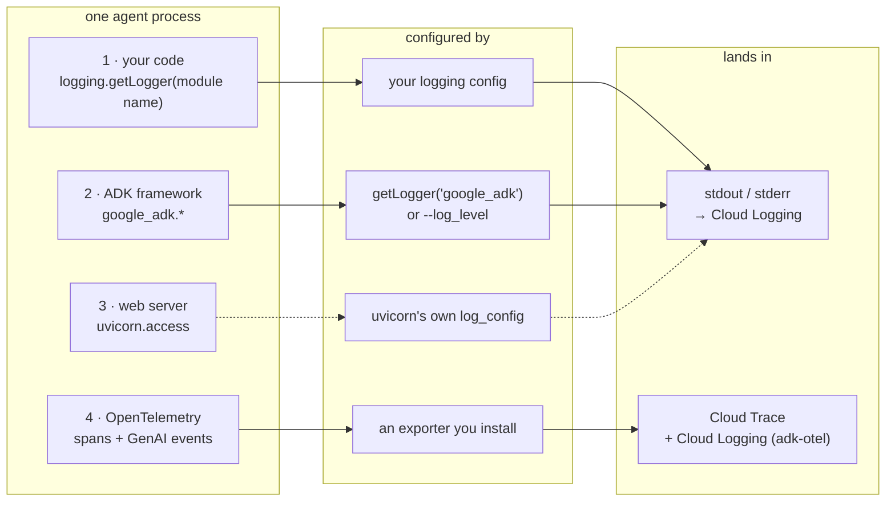
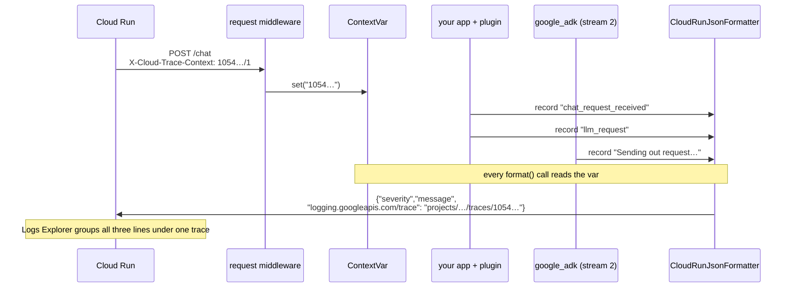
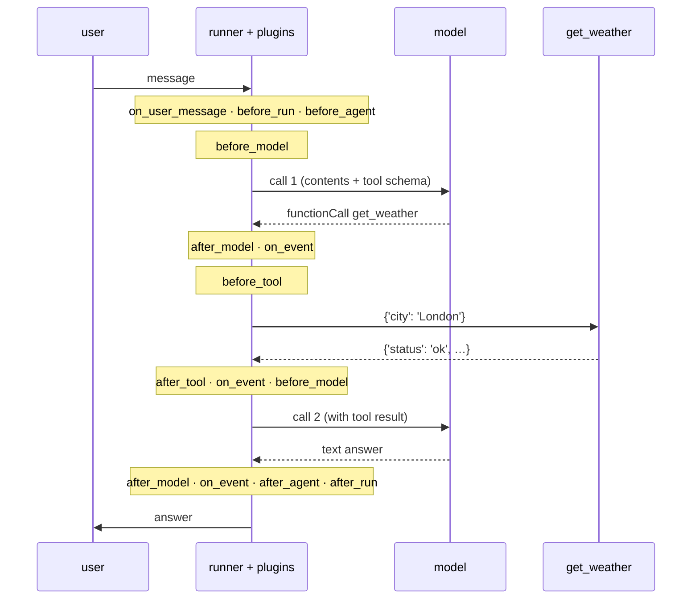

# Plan: add diagrams to the ADK logging tutorial

Files: `ai/adk/logging/TUTORIAL.md` and `ai/adk/logging/tutorial/*.md`. Same
ground rules as [tutorial-formatting.md](tutorial-formatting.md): consumed on
GitHub only, **no prose rewrites**. A diagram is inserted with a one-line
italic caption; the surrounding text is left verbatim.

## Where a diagram earns its place

The tutorial's hard ideas are all *structural*: which stream a line belongs
to, which code configures it, and what path it takes to a destination. Those
are the things prose handles worst and a box-and-arrow picture handles best.
Everything else (the level dial, deploy traps, the decision table) is already
well served by tables and console output, and gets no diagram.

### Tier 1 — significant difference (do these)

| # | Diagram | Type | Goes in | Why it matters |
|---|---|---|---|---|
| D1 | **The four streams.** One agent process; four sources → the thing that configures each → where it lands (stdout/stderr vs. exporter). | flowchart LR, 3 columns | `TUTORIAL.md`, right after the numbered list of the four streams | The tutorial's whole mental model. Currently a prose list the reader has to hold in their head for nine parts. |
| D2 | **The logger tree.** `root` → `google_adk` → `...google_llm`; `demo_agent.agent`; `agent.telemetry`; `uvicorn` → `uvicorn.access` with its own handler. | flowchart TD (tree) | `TUTORIAL.md`, under "Meet the agent", next to *all ADK loggers are children of `google_adk`* | Explains, in one picture, why `getLogger("google_adk")` controls the framework as a group (Part 1), why the access log is separate (Part 2), and why Part 4 picks its own namespace. Referenced from 02, 04.1, 05. |
| D3a | **The agent loop, annotated with log lines.** User → runner → model (call 1) → tool → model (call 2) → answer, with the five INFO lines placed on the arrows they come from. | sequenceDiagram | `01a` §1.1.1, after the "What it means" callout | Makes *one round trip per model call, a tool call costs two* visible, and shows your line sitting between the framework's. |
| D3b | **The same loop with plugin hook points.** D3a plus the `before_*/after_*/on_*` hooks marked where they fire. | sequenceDiagram | `03` §3.1, replacing nothing, placed after the sentence listing the fourteen hooks | The hook list is a 60-word sentence today. The 29-line narration then reads as a walk down this picture. |
| D4 | **What `--log_level` reaches.** `adk web/api_server` CLI → `setLevel` on `root` and `google_adk` → uvicorn starts and configures `uvicorn.access` itself; the flag's arrow stops short of it. | flowchart LR | `02`, after the "Why you are here" NOTE | This is the entire point of Part 2, and the most common confusion the intro names. |
| D5 | **Trace correlation via `ContextVar`.** Request with `X-Cloud-Trace-Context` → middleware sets the var → app log, plugin record, and deep `google_adk` record all pass through the formatter, which reads the var → JSON with the trace field → Logs Explorer groups them. | sequenceDiagram | `06`, after the `CloudRunJsonFormatter` code block | The "clever part" is invisible in the code; the picture shows why a framework line you never touched carries the trace. |
| D6 | **Ingestion and severity, plain vs. JSON.** Two lanes: plain text on stderr → `textPayload`, severity **Default**; JSON on stdout with `severity` → `jsonPayload`, severity **INFO**. Cloud Run's own request log shown as the third writer. | flowchart LR | `06`, after "Fact one" | Part 6 exists to fix this. 1.4/1.5 discovered it with console output; the before/after picture is the fix in one glance. |
| D7 | **Same hooks, three sinks.** Hook data → `print()` (3.1) / YAML file (3.3) / `logging` record → handler + formatter → text locally, JSON in the cloud (Part 4). | flowchart LR | `03` §3.5, next to the "You own the sink" table row, and referenced from the Part 4 intro | The bridge from Part 3 to Part 4. It is why the structured plugin is "write once, deploy anywhere". |
| D8 | **Native vs. BYOC on Agent Runtime: whose code installs the handler.** Left: platform server wraps your agent, platform handler, platform format. Right: your `main.py` + `AdkApp`, your handler, your format. | flowchart LR, two subgraphs | `01b` §1.7, after the final "What it means" callout; referenced from `08` | The surprising 1.6 finding (your `basicConfig` is ignored) only clicks when you see whose process owns the handler. |

### Tier 2 — nice to have (hold unless review asks)

| # | Diagram | Where | Why it is only tier 2 |
|---|---|---|---|
| D9 | One `dictConfig` owning streams 1-3, exporter for stream 4 | `05` | Mostly D1 + D2 again with a config box around them. |
| D10 | `PluginManager` early-exit chain (first non-`None` return halts) | `03` §3.1 | The quoted rule is short and clear already. |
| D11 | Plugin-on-`App` fires everywhere vs. callback-on-one-agent | `04` §4.1 | The two-column table already carries it. |
| D12 | Decision tree for "how to choose" | `09` | The table *is* the decision; a tree would duplicate it. |

### Deliberately no diagram

- **07 span tree.** The console block already shows the nesting; a diagram would
  restate it. D1 covers where stream 4 goes.
- **01b ownership scorecard** (level / format / stream / severity across four
  targets). That is a table, and it should probably become one, but that is a
  prose change and out of scope here.

## Mermaid inline vs. SVG in the repo

| | Inline mermaid | Generated SVG |
|---|---|---|
| Renders on GitHub | yes, natively | yes |
| Follows the reader's light/dark theme | yes, automatically | only via `<picture>` with two SVGs, or a neutral palette |
| Reviewable in a PR diff | yes, it is text | no (binary-ish blob); needs the `.mmd` source beside it |
| Edit cost | edit the markdown | edit source, re-run `mmdc`, commit two files |
| Layout control | limited (subgraph placement is heuristic) | full |
| Renders in VS Code preview | only with an extension | yes |
| Build step | none | `mmdc` (installed, v11.9.0) |

**Recommendation: inline mermaid for all of D1-D8.** The formatting doc already
committed these files to GitHub-only rendering (alerts and `<details>` do not
render in plain preview either), so SVG's one real advantage, portability, buys
nothing here. Mermaid keeps the diagram in the same file as the prose it
explains, diffs as text, and adapts to dark mode for free. Every diagram above
is a flowchart or a sequence diagram, both of which GitHub renders well.

**SVG fallback, per diagram, only if needed.** If GitHub's layout of a specific
flowchart is ugly (D1 and D8 are the candidates, because both want aligned
columns), render that one to SVG:

```
ai/adk/logging/tutorial/img/
  d1-four-streams.mmd          # source of truth, committed
  d1-four-streams.svg          # mmdc output, committed
  d1-four-streams-dark.svg     # mmdc -t dark, committed
```

Referenced with GitHub's theme switch so it still follows the reader's mode:

```html
<picture>
  <source media="(prefers-color-scheme: dark)" srcset="img/d1-four-streams-dark.svg">
  
</picture>
```

Expect zero or one diagram to need this. Do not build the pipeline up front.
A local `mmdc` render of the D1 sketch already produced three aligned columns,
so D1 does not need it; D8 is the only remaining candidate.

## Authoring rules

- **One caption line**, italic, under each diagram. No other prose changes.
- **Stream numbers are the primary encoding**, not color. Label nodes
  `1 · your code`, `2 · google_adk`, `3 · uvicorn`, `4 · OTel` consistently in
  every diagram so a reader can carry the numbers from D1 into D4, D6, D7.
- **No `classDef` fills.** Hard-coded fills fight GitHub's dark theme. Use
  node shape and `-->` vs `-.->` (solid = configured by you, dotted = configured
  by someone else) instead.
- **Quote labels** containing `--`, `(`, `:` or backticks: `A["--log_level"]`.
  Use `<br/>` for line breaks in labels (GitHub supports it; `\n` does not).
  Avoid `__name__`-style double underscores in labels: mermaid treats them as
  markdown bold (caught in the D1 test render). Write `module name` instead.
- **Placement** never breaks the beat rhythm: a diagram sits in body text,
  after a NOTE or after an IMPORTANT callout, never between **👉 Do this** and
  its **Expected output**.
- **Syntax-check before pushing** with the installed CLI:
  `mmdc -i <file>.mmd -o /dev/null` on each block (extract blocks to the
  scratchpad; do not commit the extracts).

## Sketches for the two pilots

The point of a sketch is to judge shape and density, not final wording.

### D1 — the four streams (`TUTORIAL.md`)



### D5 — trace correlation (`06`)



### D3b — loop with hook points (`03`), shape only



D3a is this diagram with the `Note` lines replaced by the five INFO log lines.

## Rollout

1. [ ] Pilot **D1** (flowchart, `TUTORIAL.md`) and **D5** (sequence, `06`); push;
   review on GitHub in light and dark mode
2. [ ] Adjust conventions from review (label density, stream numbering, dotted
   vs. solid), record the decisions below
3. [ ] Add **D2, D3a, D4** (the Part 1-2 cluster)
4. [ ] Add **D3b, D7** (the Part 3-4 cluster)
5. [ ] Add **D6, D8**
6. [ ] Verify: every block passes `mmdc`; every file renders on GitHub with no
   "Unable to render" box; word sequence of prose unchanged versus current HEAD
   after stripping the mermaid blocks and captions
7. [ ] Decide on tier 2 only after reading the finished tier 1 set end to end

## Decisions to confirm

- **X1: inline mermaid, SVG only as a per-diagram fallback.** Recommended above.
- **X2: D3 as two variants** (D3a log lines in 01a, D3b hooks in 03) versus one
  combined diagram in 03 only. Two is recommended: 01a readers have not met
  plugins yet, and a combined diagram would be too dense for both audiences.
- **X3: D2 lives in `TUTORIAL.md`, not `01a`.** It is introduced where the
  "children of `google_adk`" fact is stated; 01a, 02, 04, 05 link to it.
- **X4: caption style.** One italic line below the diagram, e.g.
  *Figure: the four streams and where each is configured.* No "Figure N"
  numbering across files, since parts are read independently.
